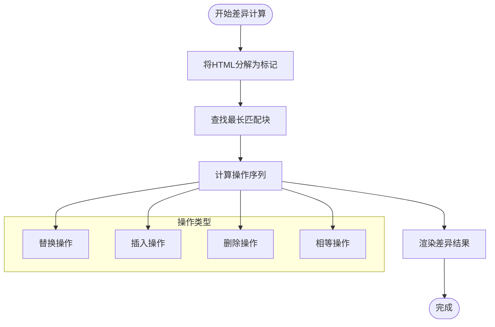
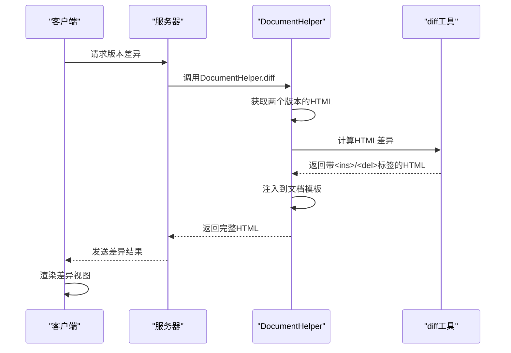
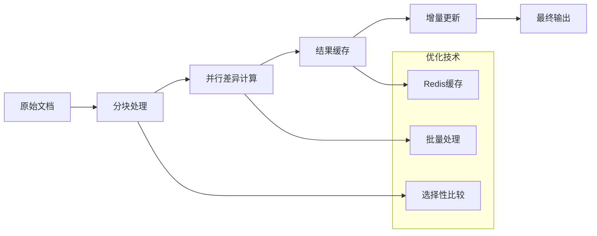

# 版本比较

<cite>
**本文档引用的文件**
- [Revision.ts](file://server/models/Revision.ts)
- [DocumentHelper.tsx](file://server/models/helpers/DocumentHelper.tsx)
- [diff.ts](file://server/utils/diff.ts)
- [revisions.ts](file://server/routes/api/revisions/revisions.ts)
- [recreateTransform.ts](file://shared/editor/lib/prosemirror-recreate-transform/recreateTransform.ts)
- [RevisionViewer.tsx](file://app/scenes/Document/components/RevisionViewer.tsx)
- [revision.ts](file://server/presenters/revision.ts)
- [ProsemirrorHelper.tsx](file://server/models/helpers/ProsemirrorHelper.tsx)
- [revisionCreator.ts](file://server/commands/revisionCreator.ts)
</cite>

## 目录
1. [简介](#简介)
2. [核心组件](#核心组件)
3. [差异计算算法](#差异计算算法)
4. [差异可视化机制](#差异可视化机制)
5. [性能优化策略](#性能优化策略)
6. [边界情况处理](#边界情况处理)
7. [结论](#结论)

## 简介
版本比较功能是文档协作系统中的核心特性，它允许用户查看文档在不同时间点之间的变化。本系统通过结合ProseMirror编辑器和自定义的差异算法，实现了精确的文档内容比较。系统不仅能够检测文本内容的变化，还能识别格式和结构的变更。当用户查看文档历史时，系统会计算两个版本之间的差异，并以直观的方式呈现给用户。该功能依赖于多个组件的协同工作，包括版本模型、差异计算工具和可视化组件。

## 核心组件

版本比较功能的核心是`Revision`模型，它存储了文档在特定时间点的状态。每个修订版本都包含文档的ProseMirror数据、标题、图标等元信息。`DocumentHelper`类提供了将文档转换为不同格式（如HTML、纯文本）的方法，并负责计算版本间的差异。`diff`工具函数是底层的差异计算引擎，它将HTML内容转换为标记序列，然后应用差异算法。`RevisionViewer`组件负责在前端展示计算出的差异结果。这些组件共同构成了一个完整的版本比较系统，从数据存储到用户界面展示。

**Section sources**
- [Revision.ts](file://server/models/Revision.ts#L23-L232)
- [DocumentHelper.tsx](file://server/models/helpers/DocumentHelper.tsx#L38-L580)
- [diff.ts](file://server/utils/diff.ts#L0-L1120)
- [RevisionViewer.tsx](file://app/scenes/Document/components/RevisionViewer.tsx#L0-L55)

## 差异计算算法

系统采用多层差异计算策略。首先，对于ProseMirror文档，系统使用`recreateTransform`算法将两个文档状态转换为一系列编辑操作。该算法通过比较JSON表示的文档结构，生成插入、删除和替换操作。对于HTML内容，系统使用基于`htmldiff.js`的改进算法。该算法将HTML分解为标记序列，然后应用最长公共子序列算法来识别变化。文本级别的差异使用`diffChars`和`diffWordsWithSpace`函数进行精细化比较，确保能够准确识别单个字符或单词的变化。整个过程分为三个阶段：标记化、操作计算和结果渲染。

**Diagram sources**
- [diff.ts](file://server/utils/diff.ts#L0-L1120)
- [recreateTransform.ts](file://shared/editor/lib/prosemirror-recreate-transform/recreateTransform.ts#L0-L284)

**Section sources**
- [recreateTransform.ts](file://shared/editor/lib/prosemirror-recreate-transform/recreateTransform.ts#L0-L284)
- [diff.ts](file://server/utils/diff.ts#L0-L1120)

## 差异可视化机制

差异可视化通过将计算出的变化包装在`<ins>`和`<del>`标签中实现。`DocumentHelper.diff`方法负责生成可视化的HTML输出。该方法首先将两个版本的文档转换为HTML，然后应用差异算法，最后将结果注入到文档模板中。对于电子邮件通知，系统使用`toEmailDiff`方法生成紧凑的差异视图，只显示变化的部分和上下文。`RevisionViewer`组件通过`dangerouslySetInnerHTML`属性将预渲染的HTML差异结果展示给用户。系统还支持为差异标记添加自定义CSS类，以便进行样式定制。

**Diagram sources**
- [DocumentHelper.tsx](file://server/models/helpers/DocumentHelper.tsx#L38-L580)
- [RevisionViewer.tsx](file://app/scenes/Document/components/RevisionViewer.tsx#L0-L55)

**Section sources**
- [DocumentHelper.tsx](file://server/models/helpers/DocumentHelper.tsx#L38-L580)
- [RevisionViewer.tsx](file://app/scenes/Document/components/RevisionViewer.tsx#L0-L55)

## 性能优化策略

系统实现了多种性能优化策略。首先，差异计算是增量的，系统只比较相邻的版本，而不是从头开始计算。其次，系统使用缓存机制，将频繁访问的版本数据存储在Redis中。`revisionCreator`命令在创建新版本时会批量处理协作者ID，减少数据库查询次数。对于大型文档，系统采用分块处理策略，只加载和比较必要的部分。HTML差异计算中，系统会跳过样式标签等不影响内容的元素，减少处理的数据量。此外，系统还实现了差异结果的预生成和缓存，避免重复计算。

**Diagram sources**
- [revisionCreator.ts](file://server/commands/revisionCreator.ts#L0-L33)
- [DocumentHelper.tsx](file://server/models/helpers/DocumentHelper.tsx#L38-L580)

**Section sources**
- [revisionCreator.ts](file://server/commands/revisionCreator.ts#L0-L33)
- [DocumentHelper.tsx](file://server/models/helpers/DocumentHelper.tsx#L38-L580)

## 边界情况处理

系统对多种边界情况进行了特殊处理。当两个版本完全相同时，系统直接返回原始内容，避免不必要的计算。对于空文档或只有一个版本的情况，系统提供适当的默认行为。当差异算法无法检测到某些变化（如标记类型更改）时，系统会返回空结果并记录警告。系统还处理了HTML注释、原子标签（如iframe）等特殊元素，确保它们被正确地包含在差异计算中。对于大型表格等复杂结构，系统实现了专门的剪辑逻辑，只显示变化的行和上下文。

**Section sources**
- [diff.ts](file://server/utils/diff.ts#L0-L1120)
- [DocumentHelper.tsx](file://server/models/helpers/DocumentHelper.tsx#L38-L580)

## 结论
版本比较功能通过结合ProseMirror的精确文档表示和高效的差异算法，实现了高质量的文档变更检测。系统不仅能够准确识别内容变化，还能以用户友好的方式呈现结果。通过多层次的性能优化，系统能够高效处理大规模文档的比较需求。未来可以进一步优化差异算法，支持更复杂的文档结构变化检测，并提供更丰富的可视化选项。