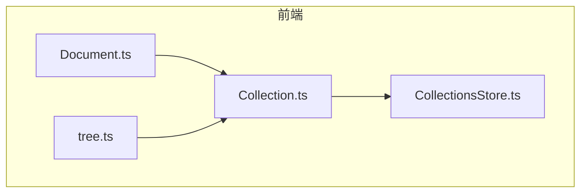
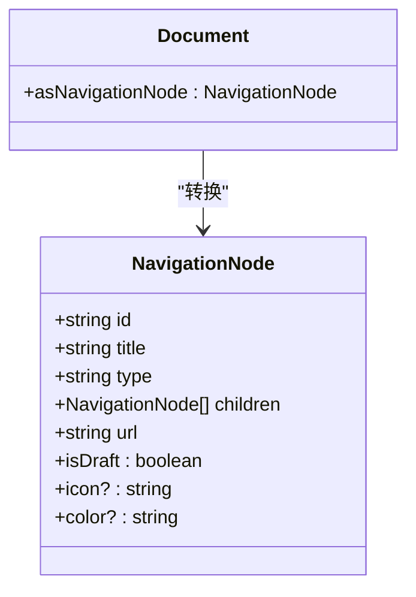
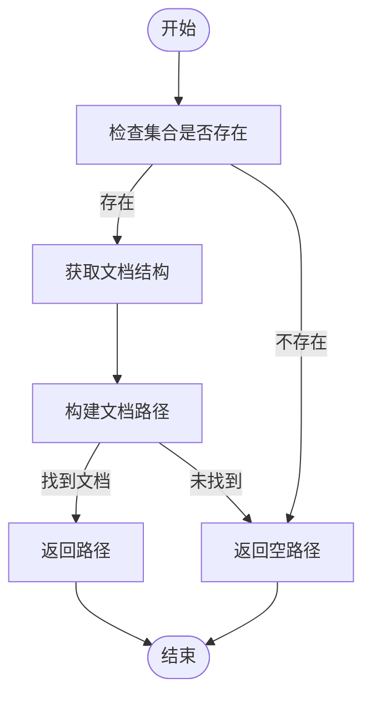
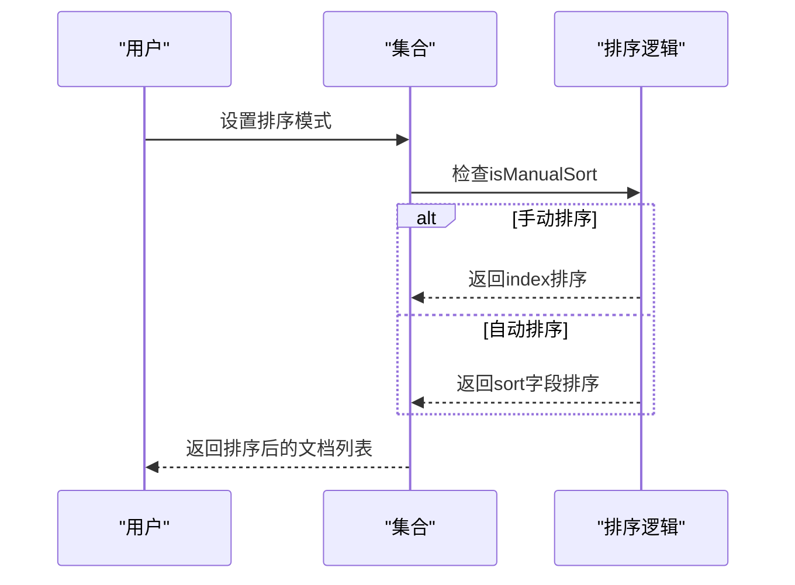
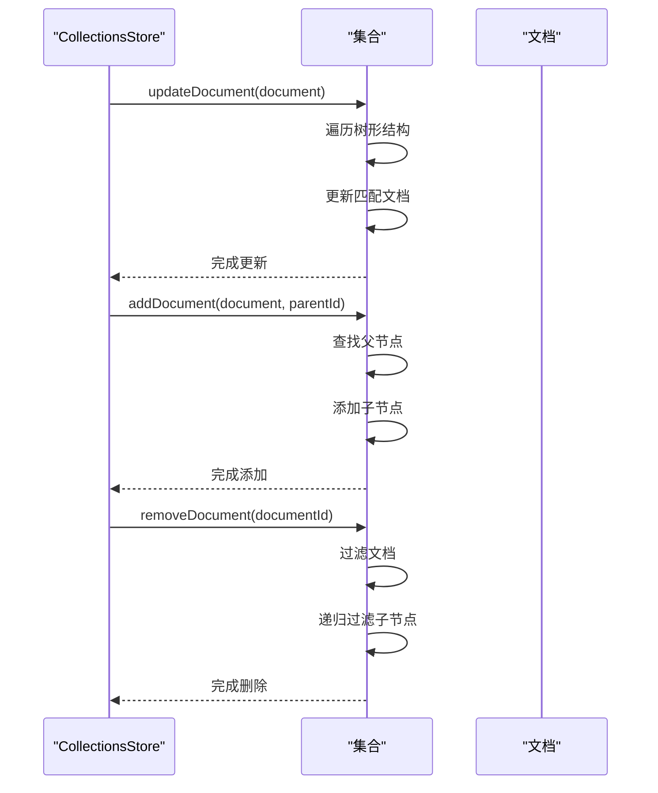
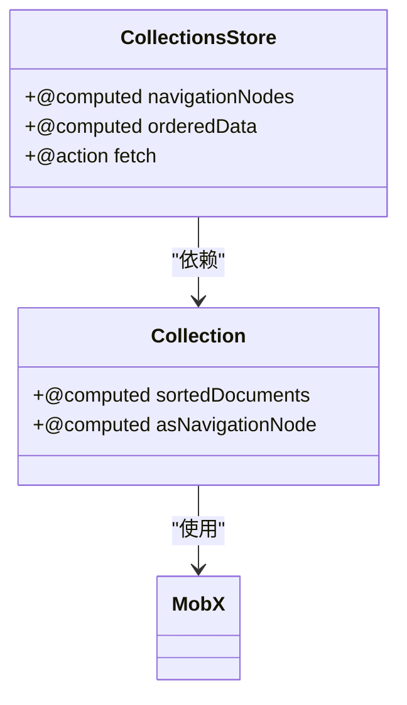
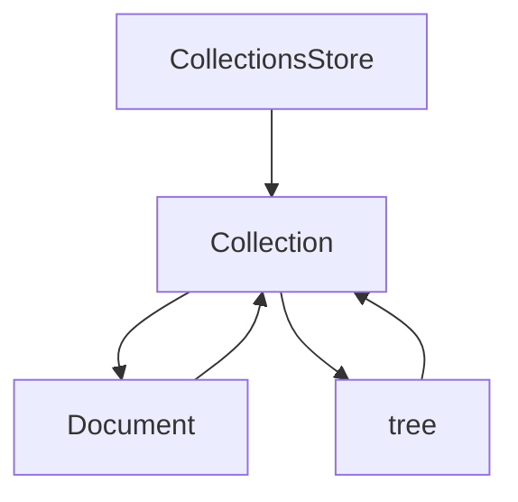

# 文档组织与排序

<cite>
**本文档中引用的文件**   
- [CollectionsStore.ts](file://app/stores/CollectionsStore.ts)
- [Collection.ts](file://app/models/Collection.ts)
- [Document.ts](file://app/models/Document.ts)
- [tree.ts](file://app/utils/tree.ts)
</cite>

## 目录
1. [简介](#简介)
2. [项目结构](#项目结构)
3. [核心组件](#核心组件)
4. [架构概述](#架构概述)
5. [详细组件分析](#详细组件分析)
6. [依赖分析](#依赖分析)
7. [性能考虑](#性能考虑)
8. [故障排除指南](#故障排除指南)
9. [结论](#结论)
10. [附录](#附录)（如有必要）

## 简介
本文档深入探讨了集合中文档的组织与排序功能。我们将详细解释NavigationNode数据结构的设计与实现，说明文档在集合中的树形结构组织方式。文档将涵盖文档排序机制，包括手动排序（index字段）和基于字段的自动排序（sort字段）两种模式的实现原理。通过实际代码示例，我们将说明文档添加、移动和重排序的操作流程，特别是CollectionsStore中updateDocument、addDocument和removeDocument方法的使用。为初学者提供文档层级关系的理解，同时为经验丰富的开发者提供技术细节，包括前端状态管理和性能优化策略，如computed属性的缓存机制。

## 项目结构
项目结构清晰地展示了文档组织与排序功能的实现。核心功能主要分布在`app/models/Collection.ts`和`app/stores/CollectionsStore.ts`文件中。`Collection`模型负责管理文档的树形结构和排序逻辑，而`CollectionsStore`则负责管理集合的状态和操作。`Document`模型通过`asNavigationNode`属性与集合结构集成，形成完整的文档组织体系。



**图表来源**
- [Collection.ts](file://app/models/Collection.ts#L19-L455)
- [CollectionsStore.ts](file://app/stores/CollectionsStore.ts#L17-L254)
- [Document.ts](file://app/models/Document.ts#L39-L703)
- [tree.ts](file://app/utils/tree.ts#L0-L35)

**章节来源**
- [Collection.ts](file://app/models/Collection.ts#L19-L455)
- [CollectionsStore.ts](file://app/stores/CollectionsStore.ts#L17-L254)

## 核心组件
核心组件包括`Collection`模型、`CollectionsStore`存储和`Document`模型。`Collection`模型通过`documents`属性维护文档的树形结构，通过`sort`属性控制排序方式。`CollectionsStore`提供`navigationNodes`计算属性，将所有集合转换为导航节点。`Document`模型通过`asNavigationNode`计算属性，将其自身转换为树形结构中的节点。

**章节来源**
- [Collection.ts](file://app/models/Collection.ts#L19-L455)
- [CollectionsStore.ts](file://app/stores/CollectionsStore.ts#L17-L254)
- [Document.ts](file://app/models/Document.ts#L39-L703)

## 架构概述
系统架构围绕集合和文档的树形结构组织与排序功能构建。`Collection`模型作为核心，维护文档的层级关系和排序规则。`CollectionsStore`作为状态管理器，协调集合间的操作。`Document`模型作为叶子节点，通过`asNavigationNode`属性融入树形结构。

```mermaid
classDiagram
class Collection {
+string name
+NavigationNode[] documents
+{field : string, direction : "asc" | "desc"} sort
+updateDocument(document)
+removeDocument(documentId)
+addDocument(document, parentDocumentId)
+asNavigationNode
}
class CollectionsStore {
+Collection[] orderedData
+NavigationNode[] navigationNodes
+fetch(id)
+fetchNamedPage(request, options)
}
class Document {
+string title
+string collectionId
+string parentDocumentId
+asNavigationNode
}
class NavigationNode {
+string id
+string title
+string type
+NavigationNode[] children
+string url
}
Collection --> CollectionsStore : "存储"
Collection --> Document : "包含"
Document --> NavigationNode : "转换"
CollectionsStore --> NavigationNode : "生成"
```

**图表来源**
- [Collection.ts](file://app/models/Collection.ts#L19-L455)
- [CollectionsStore.ts](file://app/stores/CollectionsStore.ts#L17-L254)
- [Document.ts](file://app/models/Document.ts#L39-L703)

## 详细组件分析
### NavigationNode数据结构分析
`NavigationNode`是文档组织与排序的核心数据结构。它定义了树形结构中节点的基本属性，包括id、title、type、children和url。每个文档通过`asNavigationNode`计算属性转换为`NavigationNode`，从而融入集合的树形结构中。



**图表来源**
- [Document.ts](file://app/models/Document.ts#L646-L666)
- [Collection.ts](file://app/models/Collection.ts#L350-L361)

### 文档树形结构组织分析
文档在集合中的树形结构通过`Collection`模型的`documents`属性维护。`addDocument`、`removeDocument`和`updateDocument`方法提供了对树形结构的增删改操作。`pathToDocument`方法通过遍历树形结构，生成文档的路径。



**图表来源**
- [Collection.ts](file://app/models/Collection.ts#L363-L405)
- [Document.ts](file://app/models/Document.ts#L580-L598)

### 文档排序机制分析
文档排序机制支持两种模式：手动排序和自动排序。手动排序通过`index`字段实现，自动排序通过`sort`字段实现。`isManualSort`计算属性判断当前排序模式，`sortedDocuments`计算属性根据排序规则返回排序后的文档列表。



**图表来源**
- [Collection.ts](file://app/models/Collection.ts#L113-L164)
- [CollectionsStore.ts](file://app/stores/CollectionsStore.ts#L39-L55)

### CollectionsStore操作流程分析
`CollectionsStore`提供了`updateDocument`、`addDocument`和`removeDocument`方法，用于操作集合中的文档。这些方法通过调用`Collection`模型的相应方法，实现对文档树形结构的修改。



**图表来源**
- [Collection.ts](file://app/models/Collection.ts#L233-L285)
- [CollectionsStore.ts](file://app/stores/CollectionsStore.ts#L17-L254)

### 前端状态管理与性能优化分析
前端状态管理通过MobX实现，`computed`属性提供缓存机制，避免重复计算。`comparer.structural`用于深度比较，确保只有当数据真正变化时才触发更新。



**图表来源**
- [CollectionsStore.ts](file://app/stores/CollectionsStore.ts#L39-L55)
- [Collection.ts](file://app/models/Collection.ts#L150-L164)

## 依赖分析
系统依赖关系清晰，`CollectionsStore`依赖`Collection`模型，`Collection`模型依赖`Document`模型。`Document`模型通过`asNavigationNode`属性与`Collection`模型交互，形成闭环。



**图表来源**
- [CollectionsStore.ts](file://app/stores/CollectionsStore.ts#L17-L254)
- [Collection.ts](file://app/models/Collection.ts#L19-L455)
- [Document.ts](file://app/models/Document.ts#L39-L703)
- [tree.ts](file://app/utils/tree.ts#L0-L35)

## 性能考虑
性能优化主要体现在`computed`属性的缓存机制上。`sortedDocuments`和`asNavigationNode`等计算属性只有在依赖数据变化时才会重新计算，避免了不必要的性能开销。`comparer.structural`确保深度比较的准确性，防止误触发更新。

## 故障排除指南
常见问题包括文档排序不生效、树形结构显示异常等。检查`sort`字段是否正确设置，确认`index`字段是否冲突。对于树形结构问题，检查`parentDocumentId`是否正确，确保文档层级关系无误。

**章节来源**
- [Collection.ts](file://app/models/Collection.ts#L233-L285)
- [CollectionsStore.ts](file://app/stores/CollectionsStore.ts#L17-L254)

## 结论
本文档详细介绍了集合中文档组织与排序功能的实现。通过`NavigationNode`数据结构，实现了文档的树形结构组织。通过`index`和`sort`字段，支持手动和自动两种排序模式。`CollectionsStore`提供了完整的操作接口，`computed`属性的缓存机制确保了高性能。这套系统为文档管理提供了灵活而强大的基础。