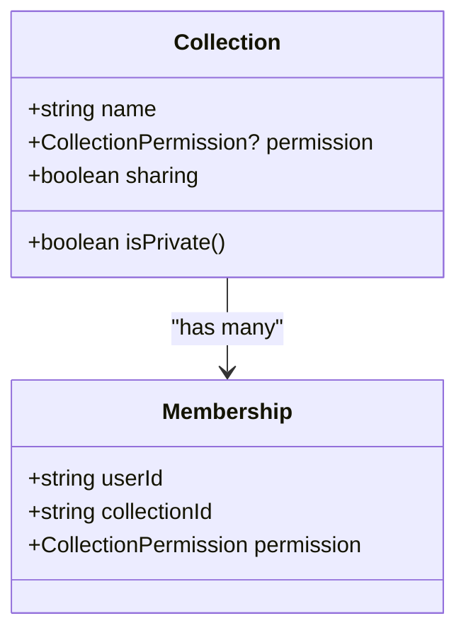
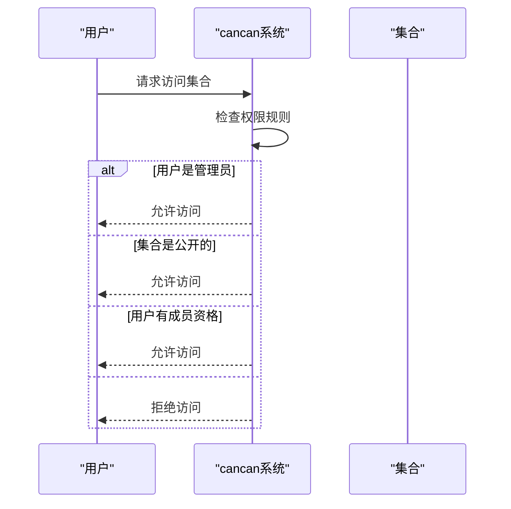
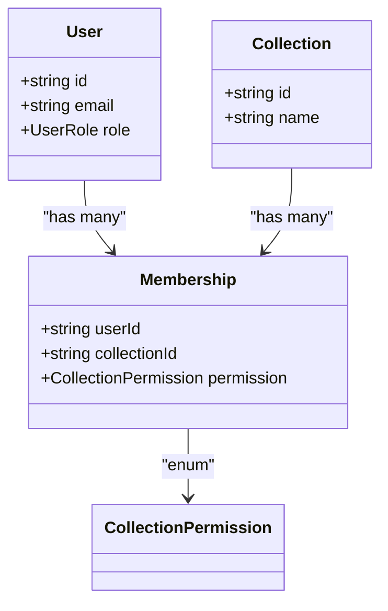
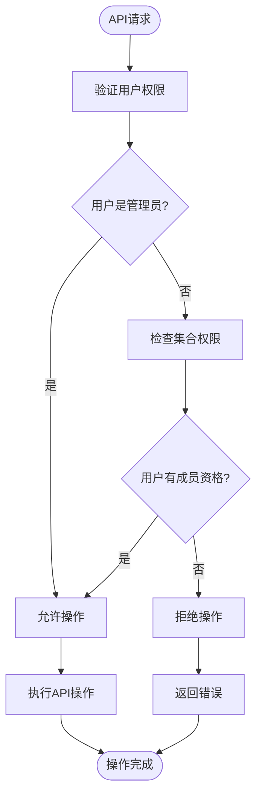
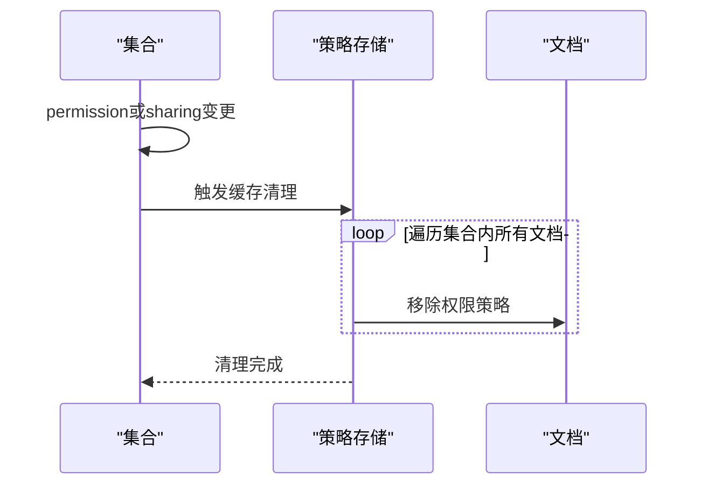
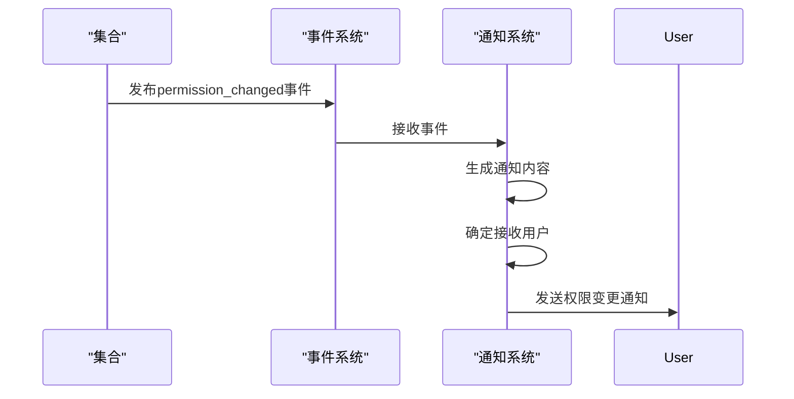

# 权限控制与访问管理

<cite>
**本文档引用的文件**   
- [Collection.ts](file://app/models/Collection.ts)
- [Collection.ts](file://server/models/Collection.ts)
- [collection.ts](file://server/policies/collection.ts)
- [cancan.ts](file://server/policies/cancan.ts)
- [Membership.ts](file://app/models/Membership.ts)
</cite>

## 目录
1. [简介](#简介)
2. [集合权限模型](#集合权限模型)
3. [权限验证机制](#权限验证机制)
4. [用户成员资格管理](#用户成员资格管理)
5. [共享设置与API控制](#共享设置与api控制)
6. [策略缓存与性能影响](#策略缓存与性能影响)
7. [权限变更通知系统](#权限变更通知系统)
8. [结论](#结论)

## 简介
本文档详细介绍了集合权限控制与访问管理系统的实现机制。系统通过`permission`字段和`sharing`字段来管理集合的访问权限，支持公开集合、私有集合和受限集合三种模式。权限验证基于cancan权限系统实现，确保用户只能访问其被授权的资源。文档还涵盖了用户成员资格管理、API端点控制、策略缓存清理以及通知系统集成等关键技术细节。

## 集合权限模型

集合权限模型通过`permission`和`sharing`两个核心字段来定义访问控制策略。`permission`字段决定了集合的默认访问权限级别，而`sharing`字段控制是否允许公开分享。

### 公开、私有和受限集合的区别

集合的访问类型主要由`permission`字段的值决定：

- **公开集合**：当`permission`字段有值时，表示该集合对工作区成员是公开的。工作区成员无需单独邀请即可访问。
- **私有集合**：当`permission`字段为空时，表示该集合是私有的。只有被明确邀请的成员才能访问。
- **受限集合**：结合`sharing`字段的设置，即使集合是公开的，也可以通过关闭`sharing`来限制公开分享。

**Diagram sources**
- [Collection.ts](file://app/models/Collection.ts#L19-L455)
- [Membership.ts](file://app/models/Membership.ts#L8-L30)

**Section sources**
- [Collection.ts](file://app/models/Collection.ts#L19-L455)
- [server/models/Collection.ts](file://server/models/Collection.ts#L87-L1007)

## 权限验证机制

权限验证机制基于cancan权限系统实现，通过定义一系列能力规则来控制用户对集合的操作权限。

### cancan权限系统应用

cancan系统通过`allow`函数定义权限规则，每个规则包含执行者、操作、目标和条件四个要素。在集合访问控制中，系统定义了多种权限能力：

**Diagram sources**
- [cancan.ts](file://server/policies/cancan.ts#L27-L217)
- [collection.ts](file://server/policies/collection.ts#L1-L212)

**Section sources**
- [cancan.ts](file://server/policies/cancan.ts#L1-L249)
- [collection.ts](file://server/policies/collection.ts#L1-L212)

## 用户成员资格管理

用户成员资格通过Membership模型进行管理，记录用户与集合之间的权限关系。

### 成员资格管理实现

Membership模型包含用户ID、集合ID和权限级别三个核心属性。当用户被添加到集合时，系统会创建相应的成员资格记录。

**Diagram sources**
- [Membership.ts](file://app/models/Membership.ts#L8-L30)
- [Collection.ts](file://app/models/Collection.ts#L19-L455)

**Section sources**
- [Membership.ts](file://app/models/Membership.ts#L8-L30)
- [server/models/Collection.ts](file://server/models/Collection.ts#L87-L1007)

## 共享设置与API控制

集合的共享设置通过API端点进行控制，允许动态调整集合的访问权限。

### API端点控制实现

系统提供了多个API端点来管理集合的共享设置，包括创建、更新和删除成员资格等操作。

**Diagram sources**
- [collection.ts](file://server/policies/collection.ts#L1-L212)
- [server/models/Collection.ts](file://server/models/Collection.ts#L87-L1007)

**Section sources**
- [collection.ts](file://server/policies/collection.ts#L1-L212)
- [server/models/Collection.ts](file://server/models/Collection.ts#L87-L1007)

## 策略缓存与性能影响

权限变更时，系统会自动清理相关的策略缓存，确保权限变更立即生效。

### 缓存清理机制

当集合的`permission`或`sharing`字段发生变化时，系统会触发缓存清理机制，移除所有相关文档的权限策略。

**Diagram sources**
- [Collection.ts](file://app/models/Collection.ts#L435-L455)
- [server/models/Collection.ts](file://server/models/Collection.ts#L87-L1007)

**Section sources**
- [Collection.ts](file://app/models/Collection.ts#L435-L455)
- [server/models/Collection.ts](file://server/models/Collection.ts#L87-L1007)

## 权限变更通知系统

权限系统与通知系统集成，当权限发生变更时会自动发送通知。

### 通知发送机制

当集合的权限设置发生变化时，系统会发布`permission_changed`事件，触发通知系统的处理流程。

**Diagram sources**
- [server/models/Collection.ts](file://server/models/Collection.ts#L593-L659)
- [server/policies/collection.ts](file://server/policies/collection.ts#L1-L212)

**Section sources**
- [server/models/Collection.ts](file://server/models/Collection.ts#L593-L659)
- [server/policies/collection.ts](file://server/policies/collection.ts#L1-L212)

## 结论
本文档详细介绍了集合权限控制与访问管理系统的实现。系统通过`permission`和`sharing`字段灵活控制集合的访问权限，结合cancan权限系统实现细粒度的访问控制。用户成员资格管理确保了私有集合的安全性，而API端点提供了灵活的共享设置控制。策略缓存清理机制保证了权限变更的即时生效，通知系统则确保了权限变更的透明性。这套权限管理系统为初学者提供了清晰的概念理解，同时为经验丰富的开发者提供了深入的技术细节。