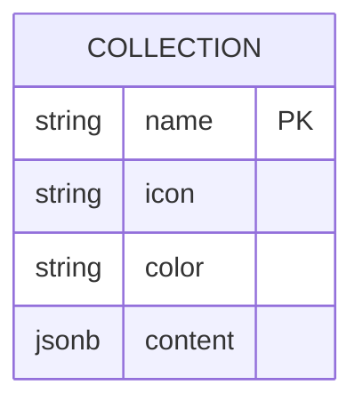

# 集合元数据管理

<cite>
**本文档引用的文件**   
- [Collection.ts](file://app/models/Collection.ts)
- [Collection.ts](file://server/models/Collection.ts)
- [validations.ts](file://shared/validations.ts)
- [CollectionForm.tsx](file://app/components/Collection/CollectionForm.tsx)
- [CollectionEdit.tsx](file://app/components/Collection/CollectionEdit.tsx)
</cite>

## 目录
1. [简介](#简介)
2. [核心属性与数据结构](#核心属性与数据结构)
3. [数据验证规则](#数据验证规则)
4. [创建与更新流程](#创建与更新流程)
5. [ProsemirrorData格式描述](#prosemirrordata格式描述)
6. [用户体验与界面展示](#用户体验与界面展示)
7. [技术实现细节](#技术实现细节)

## 简介
集合元数据管理是系统中用于组织和分类文档的核心功能。通过名称、描述、图标和颜色等属性，集合不仅提供了逻辑上的分组，还增强了用户界面的可视化体验。本文档详细介绍了集合元数据的实现方式，包括其存储结构、数据验证规则以及前后端处理流程，旨在为初学者提供清晰的概念理解，同时为经验丰富的开发者提供深入的技术细节。

## 核心属性与数据结构
集合元数据的核心属性包括名称、描述、图标和颜色，这些属性在前端和后端模型中均有定义。

### 前端模型
在前端，`Collection` 类定义了集合的基本属性：
- **名称 (name)**: 集合的名称，用于标识和搜索。
- **描述 (data)**: 使用 ProsemirrorData 格式存储的富文本描述。
- **图标 (icon)**: 用于表示集合的图标或表情符号。
- **颜色 (color)**: 用于高亮显示集合的颜色。

### 后端模型
在后端，`Collection` 模型同样定义了这些属性，并通过 Sequelize 进行数据库映射：
- **名称 (name)**: 字符串类型，最大长度为 100 个字符。
- **描述 (content)**: JSONB 类型，存储 ProsemirrorData 格式的描述内容。
- **图标 (icon)**: 字符串类型，最大长度为 50 个字符。
- **颜色 (color)**: 字符串类型，必须是有效的十六进制颜色值。

**Section sources**
- [Collection.ts](file://app/models/Collection.ts#L19-L455)
- [Collection.ts](file://server/models/Collection.ts#L87-L1007)

## 数据验证规则
为了确保数据的一致性和完整性，集合元数据在创建和更新时需要遵循一系列验证规则。

### 名称长度限制
集合名称的最大长度为 100 个字符。这一限制在 `CollectionValidation` 中定义，并在前后端进行验证。

### 图标格式要求
图标字段的最大长度为 50 个字符，且不允许包含 URL。此外，颜色字段必须是有效的十六进制颜色值。

### 描述内容验证
描述内容使用 ProsemirrorData 格式存储，最大长度为 100,000 个字符。描述内容的验证主要在后端进行，确保数据的完整性和一致性。



**Diagram sources **
- [Collection.ts](file://server/models/Collection.ts#L87-L1007)

**Section sources**
- [validations.ts](file://shared/validations.ts#L29-L35)
- [Collection.ts](file://server/models/Collection.ts#L87-L1007)

## 创建与更新流程
集合的创建和更新流程涉及前端表单验证、后端数据处理和数据库持久化。

### 前端表单验证
在前端，`CollectionForm` 组件负责处理集合的创建和更新。表单使用 `react-hook-form` 进行验证，确保输入的数据符合预定义的规则。例如，名称字段必须填写且不超过 100 个字符，图标字段不能包含 URL。

### 后端数据处理
当表单提交时，前端通过 API 调用将数据发送到后端。后端接收到数据后，首先进行验证，然后调用相应的服务方法进行处理。如果数据有效，后端会将其保存到数据库中。

### 数据库持久化
在数据库层面，集合元数据通过 Sequelize 模型进行持久化。每次创建或更新集合时，都会触发相应的钩子函数，如 `beforeValidate` 和 `beforeSave`，以确保数据的完整性和一致性。

**Section sources**
- [CollectionForm.tsx](file://app/components/Collection/CollectionForm.tsx#L56-L234)
- [Collection.ts](file://server/models/Collection.ts#L87-L1007)

## ProsemirrorData格式描述
ProsemirrorData 是一种用于存储富文本内容的 JSON 格式。它允许在描述字段中包含复杂的文本格式，如加粗、斜体、链接和图片。

### 数据结构
ProsemirrorData 的基本结构如下：
```json
{
  "type": "doc",
  "content": [
    {
      "type": "paragraph",
      "content": [
        {
          "type": "text",
          "text": "这是一个示例段落。",
          "marks": [
            {
              "type": "bold"
            }
          ]
        }
      ]
    }
  ]
}
```

### 处理流程
在前端，`ProsemirrorHelper` 工具类提供了多种方法来处理 ProsemirrorData，如 `isEmptyData` 用于检查内容是否为空，`toPlainText` 用于提取纯文本内容。在后端，`DocumentHelper` 类负责将 ProsemirrorData 转换为 Markdown 格式，以便于导出和备份。

**Section sources**
- [Collection.ts](file://app/models/Collection.ts#L19-L455)
- [Collection.ts](file://server/models/Collection.ts#L87-L1007)

## 用户体验与界面展示
集合元数据不仅影响数据的组织和管理，还直接影响用户的界面体验。图标和颜色的选择可以显著提升界面的美观度和可读性。

### 图标选择
用户可以在创建或编辑集合时选择图标。系统提供了一个图标选择器，支持从预定义的图标库中选择图标，也可以输入自定义的表情符号。

### 颜色高亮
颜色字段用于高亮显示集合的图标和其他相关元素。默认情况下，系统会根据现有集合的颜色自动选择一个合适的颜色，但用户也可以手动选择。

### 界面展示
在用户界面中，集合的名称、图标和颜色会被清晰地展示出来，帮助用户快速识别和导航。此外，集合的描述内容会在鼠标悬停时显示，提供更多的上下文信息。

**Section sources**
- [CollectionForm.tsx](file://app/components/Collection/CollectionForm.tsx#L56-L234)
- [CollectionEdit.tsx](file://app/components/Collection/CollectionEdit.tsx#L1-L33)

## 技术实现细节
集合元数据的实现涉及多个技术层面，包括前端框架、后端服务和数据库设计。

### 前端框架
前端使用 React 和 MobX 进行状态管理。`CollectionForm` 组件通过 `useForm` 钩子管理表单状态，并通过 `Controller` 组件处理复杂的输入控件。

### 后端服务
后端使用 Node.js 和 Express 框架，结合 Sequelize ORM 进行数据库操作。`Collection` 模型定义了集合的属性和关联关系，并通过钩子函数确保数据的完整性和一致性。

### 数据库设计
数据库使用 PostgreSQL，通过 JSONB 类型存储 ProsemirrorData 格式的描述内容。`collections` 表定义了集合的基本属性，并通过外键关联到其他表，如 `documents` 和 `users`。

**Section sources**
- [Collection.ts](file://app/models/Collection.ts#L19-L455)
- [Collection.ts](file://server/models/Collection.ts#L87-L1007)
- [CollectionForm.tsx](file://app/components/Collection/CollectionForm.tsx#L56-L234)