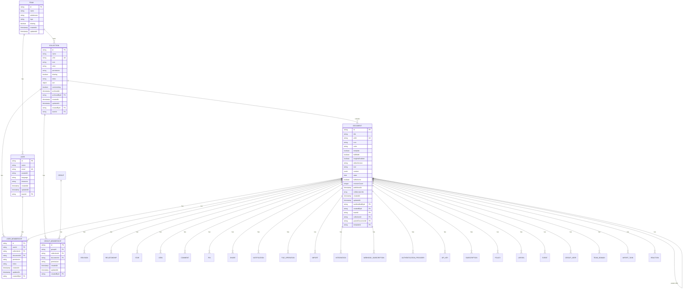

# 集合管理

<cite>
**本文档引用的文件**   
- [Collection.ts](file://app/models/Collection.ts)
- [Collection.ts](file://server/models/Collection.ts)
- [Document.ts](file://server/models/Document.ts)
- [collectionExporter.ts](file://server/commands/collectionExporter.ts)
</cite>

## 目录
1. [简介](#简介)
2. [集合模型实现](#集合模型实现)
3. [集合元数据管理](#集合元数据管理)
4. [集合与文档关系管理](#集合与文档关系管理)
5. [集合生命周期管理](#集合生命周期管理)
6. [权限验证与搜索索引](#权限验证与搜索索引)
7. [实体关系图](#实体关系图)

## 简介
集合是文档管理系统中的核心容器，用于组织和管理文档。集合不仅提供文档的逻辑分组，还支持权限控制、排序、搜索和共享等功能。本文档详细介绍了集合的实现，包括集合模型、元数据管理、与文档的关系以及生命周期管理。

## 集合模型实现

集合模型是文档管理系统中的核心组件，负责管理文档的组织、排序和权限。集合模型通过`Collection`类实现，该类继承自`ParanoidModel`，并包含多个属性和方法，用于管理集合的元数据和行为。

### 集合属性
集合模型包含以下属性：
- **name**: 集合的名称。
- **data**: 集合描述，以Prosemirror格式存储。
- **icon**: 集合的图标或表情符号。
- **color**: 集合图标的颜色。
- **permission**: 集合的默认权限。
- **sharing**: 是否启用公共共享。
- **index**: 集合的排序索引。
- **sort**: 文档的排序字段和方向。
- **commenting**: 是否启用评论。
- **documents**: 集合中的子文档。
- **url**: 集合的URL（已弃用，使用`path`代替）。
- **urlId**: 集合的URL ID。
- **archivedAt**: 集合归档的时间。
- **archivedBy**: 归档集合的用户。

### 集合方法
集合模型提供了多个方法，用于管理集合的行为：
- **fetchDocuments**: 获取集合中的文档。
- **updateDocument**: 更新集合中的文档。
- **removeDocument**: 从集合中移除文档。
- **addDocument**: 向集合中添加文档。
- **updateIndex**: 更新集合的排序索引。
- **share**: 共享集合。
- **getChildrenForDocument**: 获取文档的子文档。
- **pathToDocument**: 获取文档在集合中的路径。
- **star**: 收藏集合。
- **unstar**: 取消收藏集合。
- **subscribe**: 订阅集合。
- **unsubscribe**: 取消订阅集合。
- **archive**: 归档集合。
- **restore**: 恢复集合。
- **export**: 导出集合。

**Section sources**
- [Collection.ts](file://app/models/Collection.ts#L19-L455)

## 集合元数据管理

集合元数据管理涉及集合的名称、描述、图标、权限策略等属性的管理。这些属性通过集合模型的属性和方法进行管理。

### 名称和描述
集合的名称和描述通过`name`和`data`属性进行管理。`name`属性存储集合的名称，`data`属性存储集合的描述，以Prosemirror格式存储。

### 图标和颜色
集合的图标和颜色通过`icon`和`color`属性进行管理。`icon`属性存储集合的图标或表情符号，`color`属性存储集合图标的颜色。

### 权限策略
集合的权限策略通过`permission`属性进行管理。`permission`属性存储集合的默认权限，可以是`read_write`、`read`或`none`。集合的权限策略决定了用户对集合的访问权限。

### 公共共享
集合的公共共享通过`sharing`属性进行管理。`sharing`属性是一个布尔值，表示是否启用公共共享。如果`sharing`为`true`，则集合可以被公共访问。

### 排序
集合的排序通过`sort`属性进行管理。`sort`属性是一个对象，包含`field`和`direction`两个字段，分别表示排序字段和方向。排序字段可以是`title`或`index`，方向可以是`asc`或`desc`。

**Section sources**
- [Collection.ts](file://app/models/Collection.ts#L19-L455)

## 集合与文档关系管理

集合与文档之间的关系管理涉及文档在集合中的排序和组织。集合通过`documentStructure`属性管理文档的结构，该属性是一个JSONB字段，存储文档的树形结构。

### 文档结构
集合的`documentStructure`属性存储文档的树形结构。每个文档节点包含`id`、`title`、`url`、`icon`、`color`和`children`字段。`children`字段是一个数组，存储子文档的节点。

### 文档排序
集合的文档排序通过`sort`属性进行管理。`sort`属性决定了文档在集合中的排序方式。如果`sort.field`为`title`，则按文档标题排序；如果`sort.field`为`index`，则按文档的排序索引排序。

### 文档组织
集合的文档组织通过`addDocumentToStructure`和`removeDocumentInStructure`方法进行管理。`addDocumentToStructure`方法将文档添加到集合的文档结构中，`removeDocumentInStructure`方法将文档从集合的文档结构中移除。

### 文档路径
集合的文档路径通过`pathToDocument`方法进行管理。`pathToDocument`方法返回文档在集合中的路径，路径是一个数组，包含从根节点到目标文档的节点。

**Section sources**
- [Collection.ts](file://app/models/Collection.ts#L19-L455)
- [Document.ts](file://server/models/Document.ts#L94-L1314)

## 集合生命周期管理

集合的生命周期管理涉及集合的创建、更新、删除等操作。这些操作通过集合模型的方法和数据库操作进行管理。

### 集合创建
集合的创建通过`Collection`类的`create`方法进行。创建集合时，会生成一个唯一的`urlId`，并设置默认的`index`值。`index`值通过`fractionalIndex`函数生成，确保集合在团队中的排序。

### 集合更新
集合的更新通过`Collection`类的`update`方法进行。更新集合时，会检查`index`值是否冲突，并通过`removeIndexCollision`函数解决冲突。更新集合的权限或共享状态时，会触发`publishPermissionChangedEvent`事件。

### 集合删除
集合的删除通过`Collection`类的`destroy`方法进行。删除集合时，会检查是否是团队中的最后一个集合，如果是，则抛出错误。删除集合时，会将集合中的文档标记为已删除，并更新文档的`lastModifiedById`字段。

### 集合归档和恢复
集合的归档和恢复通过`archive`和`restore`方法进行。归档集合时，会将集合标记为已归档，并更新`archivedAt`字段。恢复集合时，会将集合标记为未归档，并清除`archivedAt`字段。

**Section sources**
- [Collection.ts](file://app/models/Collection.ts#L19-L455)
- [Collection.ts](file://server/models/Collection.ts#L87-L1007)

## 权限验证与搜索索引

集合的权限验证和搜索索引通过`SearchHelper`类进行管理。`SearchHelper`类提供了搜索和权限验证的功能。

### 权限验证
集合的权限验证通过`UserMembership`和`GroupMembership`类进行。`UserMembership`类表示用户对集合的权限，`GroupMembership`类表示组对集合的权限。权限验证通过检查用户或组的权限来确定用户对集合的访问权限。

### 搜索索引
集合的搜索索引通过`SearchQuery`类进行管理。`SearchQuery`类存储搜索查询的结果，包括文档的标题、内容和元数据。搜索索引通过`DocumentHelper`类生成，`DocumentHelper`类将文档内容转换为Prosemirror格式，并存储在`content`字段中。

### 性能优化
集合的性能优化通过缓存和索引进行。集合的文档结构通过`CacheHelper`类缓存，缓存的键为`collection_documents_key`。集合的排序索引通过数据库索引进行优化，确保排序操作的高效性。

**Section sources**
- [Collection.ts](file://app/models/Collection.ts#L19-L455)
- [Document.ts](file://server/models/Document.ts#L94-L1314)

## 实体关系图

**Diagram sources **
- [Collection.ts](file://app/models/Collection.ts#L19-L455)
- [Document.ts](file://server/models/Document.ts#L94-L1314)