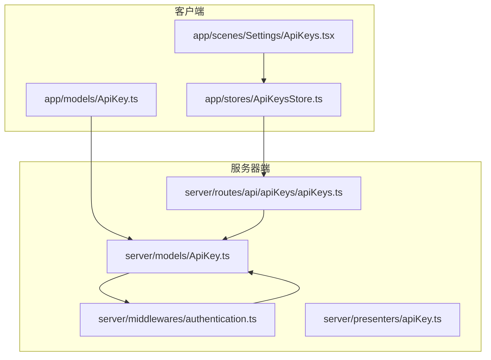
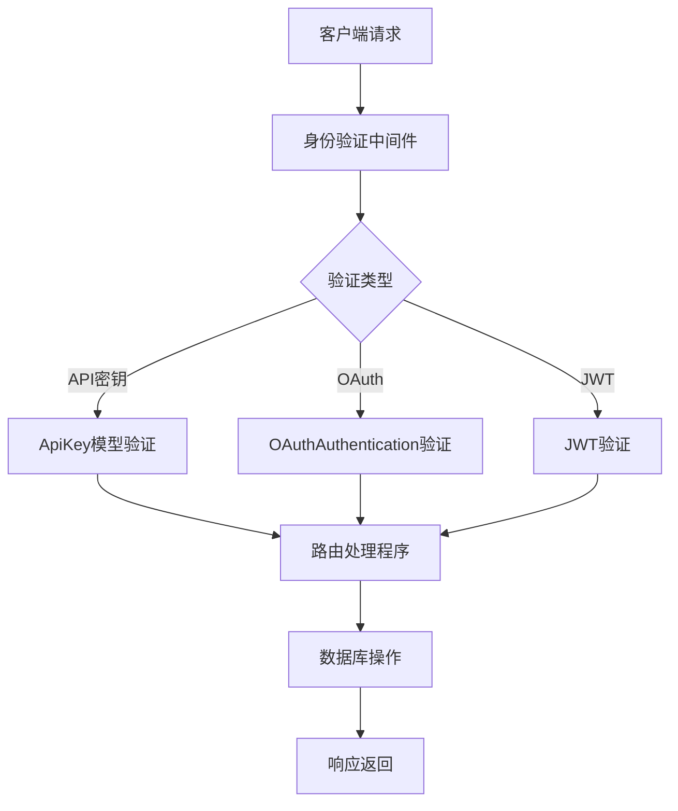
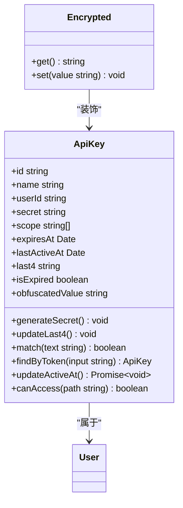
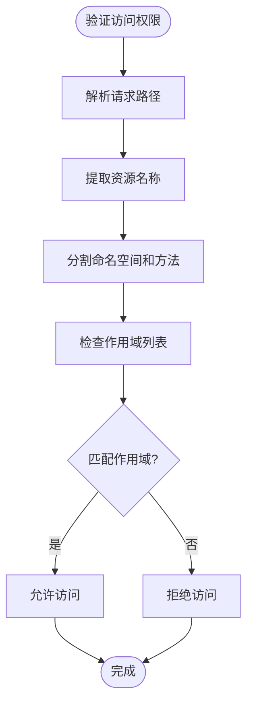
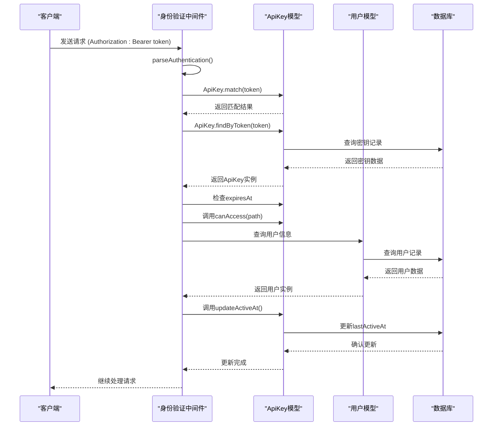
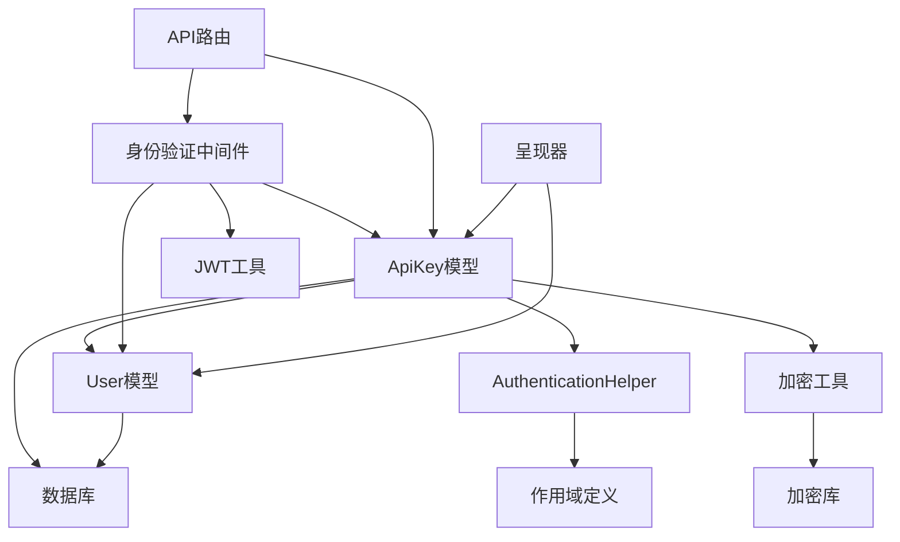

# API密钥管理

<cite>
**本文档中引用的文件**  
- [ApiKey.ts](file://app/models/ApiKey.ts)
- [ApiKey.ts](file://server/models/ApiKey.ts)
- [authentication.ts](file://server/middlewares/authentication.ts)
- [crypto.ts](file://server/utils/crypto.ts)
- [AuthenticationHelper.ts](file://shared/helpers/AuthenticationHelper.ts)
- [apiKey.ts](file://server/presenters/apiKey.ts)
- [apiKeys.ts](file://server/routes/api/apiKeys/apiKeys.ts)
- [schema.ts](file://server/routes/api/apiKeys/schema.ts)
- [Encrypted.ts](file://server/models/decorators/Encrypted.ts)
- [ApiKeyCleanupProcessor.ts](file://server/queues/processors/ApiKeyCleanupProcessor.ts)
</cite>

## 目录
1. [简介](#简介)
2. [项目结构](#项目结构)
3. [核心组件](#核心组件)
4. [架构概述](#架构概述)
5. [详细组件分析](#详细组件分析)
6. [依赖分析](#依赖分析)
7. [性能考虑](#性能考虑)
8. [故障排除指南](#故障排除指南)
9. [结论](#结论)

## 简介
本文档详细介绍了API密钥管理系统的安全实现，重点是ApiKey模型的设计和功能。文档涵盖了API密钥的创建、存储、验证和使用机制，包括加密存储、作用域管理和安全最佳实践。通过分析关键字段、安全考虑和验证流程，为初学者提供概念性理解，同时为经验丰富的开发者提供技术细节。

## 项目结构
API密钥管理功能分布在客户端和服务器端的多个模块中。主要文件包括客户端模型、服务器端模型、中间件和路由处理程序。系统采用分层架构，将数据模型、业务逻辑和API接口分离。

**Diagram sources**
- [app/models/ApiKey.ts](file://app/models/ApiKey.ts)
- [server/models/ApiKey.ts](file://server/models/ApiKey.ts)
- [server/middlewares/authentication.ts](file://server/middlewares/authentication.ts)
- [server/routes/api/apiKeys/apiKeys.ts](file://server/routes/api/apiKeys/apiKeys.ts)

**Section sources**
- [app/models/ApiKey.ts](file://app/models/ApiKey.ts)
- [server/models/ApiKey.ts](file://server/models/ApiKey.ts)

## 核心组件
ApiKey模型是API密钥管理系统的核心，负责处理密钥的创建、存储和验证。该模型在客户端和服务器端都有实现，确保数据一致性和类型安全。系统通过中间件进行身份验证，路由处理程序管理API请求，呈现器负责数据序列化。

**Section sources**
- [server/models/ApiKey.ts](file://server/models/ApiKey.ts)
- [server/middlewares/authentication.ts](file://server/middlewares/authentication.ts)
- [server/routes/api/apiKeys/apiKeys.ts](file://server/routes/api/apiKeys/apiKeys.ts)

## 架构概述
API密钥管理系统采用分层架构，将数据访问、业务逻辑和API接口分离。系统通过装饰器模式实现加密存储，使用钩子函数处理密钥生成和验证逻辑。身份验证中间件负责解析和验证API密钥，路由处理程序处理具体的API请求。

**Diagram sources**
- [server/middlewares/authentication.ts](file://server/middlewares/authentication.ts)
- [server/models/ApiKey.ts](file://server/models/ApiKey.ts)
- [server/routes/api/apiKeys/apiKeys.ts](file://server/routes/api/apiKeys/apiKeys.ts)

## 详细组件分析

### ApiKey模型分析
ApiKey模型实现了API密钥的安全存储和管理功能。模型包含多个关键字段，每个字段都有特定的安全考虑和使用场景。

#### 模型字段说明
| 字段 | 类型 | 描述 | 使用场景 |
|------|------|------|---------|
| id | string | 唯一标识符 | 数据库主键，用于唯一标识API密钥 |
| name | string | 人类可读的密钥名称 | 用户界面显示，帮助用户识别密钥用途 |
| teamId | string | 所属团队ID | 多租户支持，确定密钥所属的团队上下文 |
| userId | string | 所属用户ID | 确定密钥的所有者，用于权限检查 |
| lastTokenHash | string | 最后使用的令牌哈希 | 安全审计，跟踪密钥使用历史 |
| last8 | string | 密钥最后8个字符的预览 | 安全显示，避免完整密钥暴露 |
| secret | string | 密钥的加密存储值 | 安全存储，防止密钥明文存储 |
| scopes | string[] | 密钥的访问范围 | 权限控制，限制密钥的API访问权限 |
| createdAt | Date | 创建时间 | 审计跟踪，确定密钥生命周期 |
| updatedAt | Date | 更新时间 | 审计跟踪，记录密钥修改历史 |
| expiresAt | Date | 过期时间 | 安全策略，自动失效旧密钥 |
| lastActiveAt | Date | 最后活动时间 | 活动追踪，监控密钥使用频率 |

**Section sources**
- [server/models/ApiKey.ts](file://server/models/ApiKey.ts)
- [app/models/ApiKey.ts](file://app/models/ApiKey.ts)

#### 加密存储机制
系统使用Encrypted装饰器实现密钥的安全存储。该装饰器与数据库BLOB列配合使用，确保密钥在存储时被加密，在访问时自动解密。

**Diagram sources**
- [server/models/decorators/Encrypted.ts](file://server/models/decorators/Encrypted.ts)
- [server/models/ApiKey.ts](file://server/models/ApiKey.ts)
- [app/models/ApiKey.ts](file://app/models/ApiKey.ts)

#### 作用域管理
作用域管理通过AuthenticationHelper类实现，支持多种作用域格式，包括路径模式、命名空间作用域和简单作用域。

**Diagram sources**
- [shared/helpers/AuthenticationHelper.ts](file://shared/helpers/AuthenticationHelper.ts)
- [server/models/ApiKey.ts](file://server/models/ApiKey.ts)

### API密钥验证流程
API密钥验证流程是系统安全的核心，确保只有有效的密钥才能访问受保护的资源。

**Diagram sources**
- [server/middlewares/authentication.ts](file://server/middlewares/authentication.ts)
- [server/models/ApiKey.ts](file://server/models/ApiKey.ts)

## 依赖分析
API密钥管理系统依赖于多个核心组件和外部库，形成复杂的依赖网络。

**Diagram sources**
- [server/models/ApiKey.ts](file://server/models/ApiKey.ts)
- [server/middlewares/authentication.ts](file://server/middlewares/authentication.ts)
- [server/routes/api/apiKeys/apiKeys.ts](file://server/routes/api/apiKeys/apiKeys.ts)
- [server/presenters/apiKey.ts](file://server/presenters/apiKey.ts)

## 性能考虑
API密钥管理系统在设计时考虑了性能优化，特别是在频繁的验证操作中。

1. **缓存机制**: 系统使用虚拟列(value)缓存明文密钥，避免重复生成
2. **批量操作**: 支持分页查询API密钥列表，减少单次请求的数据量
3. **异步更新**: lastActiveAt字段的更新采用静默保存，不影响主请求性能
4. **索引优化**: 数据库表针对常用查询字段(如userId、expiresAt)建立了索引

**Section sources**
- [server/models/ApiKey.ts](file://server/models/ApiKey.ts)
- [server/routes/api/apiKeys/apiKeys.ts](file://server/routes/api/apiKeys/apiKeys.ts)

## 故障排除指南
### 常见问题及解决方案

1. **API密钥验证失败**
   - 检查密钥是否已过期(expiresAt)
   - 确认密钥的作用域(scopes)包含请求的API路径
   - 验证密钥格式是否正确，特别是前缀"ol_api_"

2. **密钥创建失败**
   - 检查用户是否有创建API密钥的权限
   - 确认团队设置是否允许成员创建API密钥
   - 验证密钥名称长度是否符合要求(1-50字符)

3. **性能问题**
   - 检查数据库索引是否正常
   - 监控lastActiveAt更新频率，避免过于频繁的写操作
   - 考虑增加API密钥的缓存层

**Section sources**
- [server/models/ApiKey.ts](file://server/models/ApiKey.ts)
- [server/middlewares/authentication.ts](file://server/middlewares/authentication.ts)
- [server/routes/api/apiKeys/apiKeys.ts](file://server/routes/api/apiKeys/apiKeys.ts)

## 结论
API密钥管理系统通过分层架构和安全设计，实现了密钥的安全存储、验证和管理。系统采用加密存储、作用域控制和过期机制等多重安全措施，确保API访问的安全性。通过合理的性能优化和清晰的错误处理，系统能够稳定可靠地处理API密钥相关的所有操作。建议定期轮换密钥，合理设置作用域，监控密钥使用情况，以进一步提高系统的安全性。