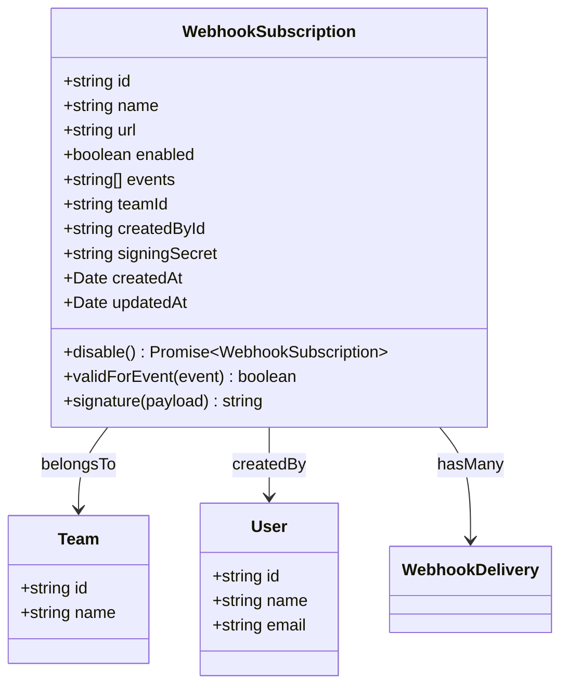
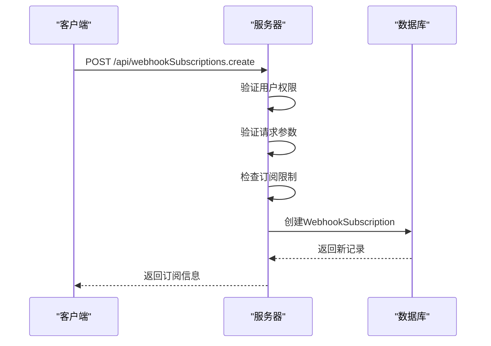
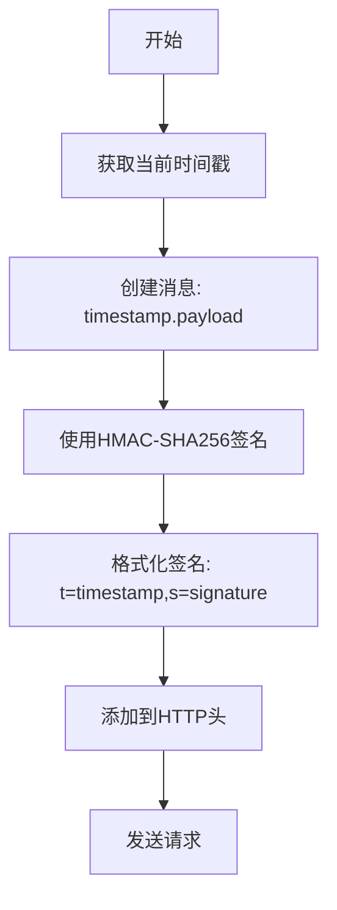
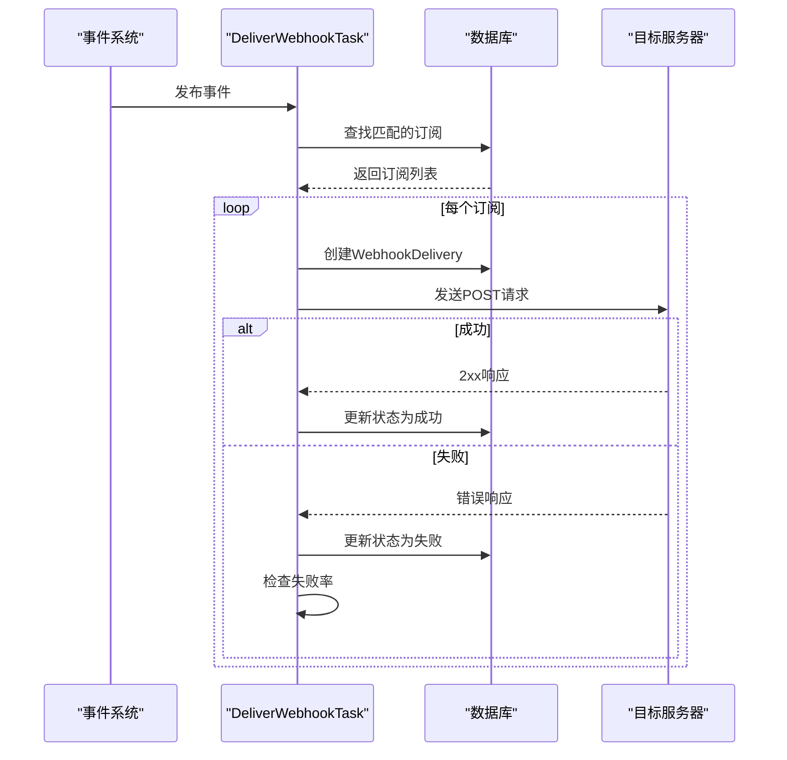
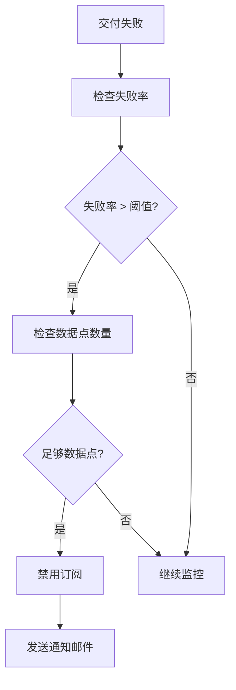

# Webhook订阅

<cite>
**本文档中引用的文件**   
- [WebhookSubscription.ts](file://server/models/WebhookSubscription.ts)
- [WebhookDelivery.ts](file://server/models/WebhookDelivery.ts)
- [DeliverWebhookTask.ts](file://plugins/webhooks/server/tasks/DeliverWebhookTask.ts)
- [validateWebhook.ts](file://server/middlewares/validateWebhook.ts)
- [webhookSubscriptions.ts](file://plugins/webhooks/server/api/webhookSubscriptions.ts)
- [webhookSubscription.ts](file://plugins/webhooks/server/presenters/webhookSubscription.ts)
- [webhook.ts](file://plugins/webhooks/server/presenters/webhook.ts)
- [WebhookSubscription.ts](file://app/models/WebhookSubscription.ts)
</cite>

## 目录
1. [介绍](#介绍)
2. [WebhookSubscription模型](#webhooksubscription模型)
3. [Webhook订阅的创建与配置](#webhook订阅的创建与配置)
4. [安全验证机制](#安全验证机制)
5. [事件交付流程](#事件交付流程)
6. [错误处理与重试策略](#错误处理与重试策略)
7. [Webhook事件序列化](#webhook事件序列化)
8. [性能考虑](#性能考虑)
9. [最佳实践](#最佳实践)
10. [结论](#结论)

## 介绍
Webhook是一种允许应用程序在特定事件发生时接收实时通知的机制。在本系统中，Webhook订阅功能使团队管理员能够配置外部端点，以便在系统内发生重要事件时接收HTTP POST请求。这些事件包括文档创建、用户操作、集合变更等。Webhook系统设计为安全、可靠且可扩展，支持事件过滤、签名验证和失败处理机制。

本文档详细介绍了Webhook订阅的实现，重点分析`WebhookSubscription`模型的关键字段、安全验证机制、事件交付流程和错误处理策略。文档旨在为初学者提供Webhook系统的概念性理解，同时为经验丰富的开发者提供技术细节和最佳实践。

## WebhookSubscription模型
`WebhookSubscription`模型是Webhook系统的核心，用于存储和管理Webhook订阅的配置信息。该模型定义了订阅的基本属性、关联关系和业务逻辑。

### 关键字段说明
`WebhookSubscription`模型包含以下关键字段：

- **id**: 订阅的唯一标识符，使用UUID格式。
- **url**: Webhook的目标URL，系统将向此地址发送POST请求。该字段经过URL验证，确保格式正确。
- **events**: 事件类型数组，用于过滤需要接收的事件。支持通配符`*`表示接收所有事件，或使用前缀匹配（如`documents.*`）。
- **teamId**: 关联的团队ID，表示该订阅属于哪个团队。
- **createdById**: 创建者用户ID，记录订阅的创建者。
- **enabled**: 布尔值，表示订阅是否启用。禁用的订阅不会触发事件交付。
- **signingSecret**: 签名密钥，用于生成和验证Webhook请求的签名，确保请求来源的安全性。该字段在数据库中加密存储。
- **name**: 订阅名称，用于标识和描述该Webhook订阅。
- **createdAt, updatedAt**: 时间戳，记录订阅的创建和最后更新时间。

### 模型实现
服务器端的`WebhookSubscription`模型继承自`ParanoidModel`，支持软删除功能。模型使用Sequelize ORM进行定义，包含数据验证、关联关系和实例方法。



**Diagram sources**
- [WebhookSubscription.ts](file://server/models/WebhookSubscription.ts#L30-L164)

**Section sources**
- [WebhookSubscription.ts](file://server/models/WebhookSubscription.ts#L30-L164)

## Webhook订阅的创建与配置
Webhook订阅的创建和配置通过API端点实现，需要管理员权限。系统对订阅数量进行限制，防止滥用。

### 创建流程
创建Webhook订阅的流程如下：
1. 客户端发送POST请求到`/api/webhookSubscriptions.create`端点。
2. 服务器验证用户权限（必须是团队管理员）。
3. 验证请求参数，包括URL格式、名称长度和事件数组。
4. 检查团队的订阅数量限制。
5. 创建新的`WebhookSubscription`记录并保存到数据库。
6. 返回创建的订阅信息。



**Diagram sources**
- [webhookSubscriptions.ts](file://plugins/webhooks/server/api/webhookSubscriptions.ts#L25-L68)

**Section sources**
- [webhookSubscriptions.ts](file://plugins/webhooks/server/api/webhookSubscriptions.ts#L25-L68)

### 事件过滤
Webhook订阅支持灵活的事件过滤机制。通过`events`字段，订阅者可以指定需要接收的事件类型。系统支持两种过滤模式：
- **精确匹配**: 当事件名称完全匹配数组中的某个值时触发。
- **前缀匹配**: 当事件名称以数组中的某个值加点号开头时触发（如`documents.create`匹配`documents.*`）。

特殊值`*`表示订阅所有事件。这种设计允许订阅者根据需要精细控制接收的事件类型，减少不必要的网络流量。

## 安全验证机制
Webhook系统实现了多层次的安全验证机制，确保通信的安全性和完整性。

### URL验证
在创建Webhook订阅时，系统会对目标URL进行严格验证：
- 使用`@IsUrl`装饰器确保URL格式正确。
- 限制URL长度不超过255个字符。
- 验证URL是否为空。

这些验证防止了无效或恶意URL的配置。

### 签名机制
Webhook请求包含数字签名，用于验证请求的真实性和完整性。签名生成算法如下：
1. 生成时间戳（毫秒级）。
2. 创建消息内容：`{时间戳}.{请求体JSON}`。
3. 使用HMAC-SHA256算法和订阅的`signingSecret`对消息内容进行签名。
4. 将时间戳和签名组合成最终的签名字符串：`t={时间戳},s={签名}`。

签名通过`Outline-Signature`HTTP头发送到目标服务器。接收方应使用相同的算法验证签名，确保请求未被篡改。



**Diagram sources**
- [WebhookSubscription.ts](file://server/models/WebhookSubscription.ts#L130-L164)

### 签名验证
接收方应实现签名验证逻辑，步骤如下：
1. 从`Outline-Signature`头提取时间戳和签名。
2. 检查时间戳是否在可接受的时间窗口内（通常为5分钟），防止重放攻击。
3. 使用相同的算法重新计算签名。
4. 使用安全的比较函数（如`safeEqual`）比较签名。

```typescript
import crypto from "crypto";

function verifySignature(payload: string, signatureHeader: string, secret: string): boolean {
  const [timestampPart, signaturePart] = signatureHeader.split(",");
  const timestamp = timestampPart.split("=")[1];
  const signature = signaturePart.split("=")[1];
  
  // 检查时间戳是否过期
  if (Date.now() - parseInt(timestamp) > 300000) { // 5分钟
    return false;
  }
  
  const expectedSignature = crypto
    .createHmac("sha256", secret)
    .update(`${timestamp}.${payload}`)
    .digest("hex");
    
  return crypto.timingSafeEqual(
    Buffer.from(signature),
    Buffer.from(expectedSignature)
  );
}
```

**Section sources**
- [validateWebhook.ts](file://server/middlewares/validateWebhook.ts#L1-L36)

## 事件交付流程
Webhook事件的交付是一个异步过程，确保主业务逻辑不受影响。

### 交付流程
当系统内发生事件时，Webhook交付流程如下：
1. 事件系统发布事件。
2. `DeliverWebhookTask`任务被触发。
3. 查找所有匹配该事件的启用订阅。
4. 对每个匹配的订阅，创建`WebhookDelivery`记录。
5. 发送HTTP POST请求到订阅的URL。
6. 记录交付结果（成功或失败）。



**Diagram sources**
- [DeliverWebhookTask.ts](file://plugins/webhooks/server/tasks/DeliverWebhookTask.ts#L81-L842)

**Section sources**
- [DeliverWebhookTask.ts](file://plugins/webhooks/server/tasks/DeliverWebhookTask.ts#L81-L842)

### WebhookDelivery模型
`WebhookDelivery`模型用于跟踪每次Webhook请求的交付状态，包含以下字段：
- **status**: 交付状态（pending, success, failed）。
- **statusCode**: HTTP响应状态码。
- **requestBody**: 发送的请求体。
- **requestHeaders**: 发送的请求头。
- **responseBody**: 接收的响应体。
- **responseHeaders**: 接收的响应头。
- **createdAt**: 交付创建时间。

该模型帮助调试和监控Webhook交付情况。

## 错误处理与重试策略
Webhook系统实现了智能的错误处理机制，确保系统的稳定性和可靠性。

### 失败检测
系统不实现自动重试，而是通过失败率分析来检测问题。当订阅的失败率超过阈值时，系统会自动禁用该订阅。

### 自动禁用机制
`DeliverWebhookTask`包含`checkAndDisableSubscription`方法，其逻辑如下：
1. 计算指定时间窗口内的所有交付记录。
2. 计算失败率（失败次数/总次数）。
3. 如果失败率超过阈值（由`WEBHOOK_FAILURE_RATE_THRESHOLD`环境变量配置）且有足够的数据点（至少10次交付），则禁用订阅。
4. 向订阅创建者发送通知邮件。

这种方法避免了对临时网络问题的过度反应，同时防止了持续失败的订阅消耗系统资源。



**Section sources**
- [DeliverWebhookTask.ts](file://plugins/webhooks/server/tasks/DeliverWebhookTask.ts#L763-L841)

## Webhook事件序列化
Webhook事件在发送前需要序列化为JSON格式。系统使用`presentWebhook`函数进行序列化。

### 序列化结构
Webhook请求体包含以下结构：
- **id**: 交付ID。
- **actorId**: 触发事件的用户ID。
- **webhookSubscriptionId**: 订阅ID。
- **event**: 事件名称。
- **payload**: 事件负载，包含模型数据和相关实体。
- **createdAt**: 交付时间。

```json
{
  "id": "delivery-123",
  "actorId": "user-456",
  "webhookSubscriptionId": "subscription-789",
  "event": "documents.create",
  "payload": {
    "id": "doc-123",
    "model": {
      "title": "示例文档",
      "url": "/doc/123"
    }
  },
  "createdAt": "2023-01-01T00:00:00Z"
}
```

**Section sources**
- [webhook.ts](file://plugins/webhooks/server/presenters/webhook.ts#L1-L38)

## 性能考虑
Webhook系统设计时考虑了性能和可扩展性。

### 异步处理
所有Webhook交付都是异步的，通过任务队列处理。这确保了主请求的响应时间不受Webhook交付的影响。

### 数据库索引
系统为关键字段创建了数据库索引，包括：
- `webhook_subscriptions`表的`teamId`和`enabled`字段。
- `webhook_deliveries`表的`webhookSubscriptionId`和`createdAt`字段。

这些索引优化了查询性能，特别是在查找订阅和交付记录时。

### 资源限制
系统对Webhook订阅数量进行限制，防止资源滥用。每个团队的订阅数量限制由`WebhookSubscriptionValidation.maxSubscriptions`常量定义。

## 最佳实践
### 对于订阅创建者
- **验证接收端点**: 在创建订阅前，确保目标URL可以接收和处理POST请求。
- **实现签名验证**: 始终验证`Outline-Signature`头，确保请求来源可信。
- **处理重复事件**: 网络问题可能导致重复事件，实现幂等处理逻辑。
- **监控交付状态**: 定期检查`WebhookDelivery`记录，确保事件正常接收。

### 对于系统管理员
- **监控失败率**: 关注被自动禁用的订阅，及时通知相关人员。
- **合理设置阈值**: 根据网络环境调整`WEBHOOK_FAILURE_RATE_THRESHOLD`和`WEBHOOK_FAILURE_TIME_WINDOW`。
- **定期清理**: 实现定期清理旧的`WebhookDelivery`记录的任务，防止数据库膨胀。

## 结论
Webhook订阅系统提供了一种强大而灵活的机制，用于在系统事件发生时通知外部应用程序。通过`WebhookSubscription`模型，系统实现了安全的事件交付，包括URL验证、签名机制和失败处理。异步交付确保了主业务逻辑的性能，而详细的交付跟踪提供了良好的可观察性。开发者应遵循最佳实践，确保Webhook系统的可靠性和安全性。