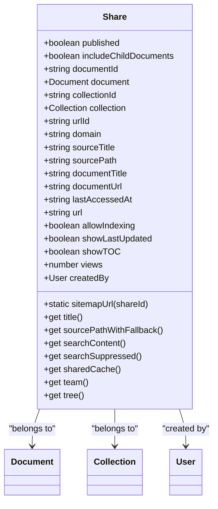
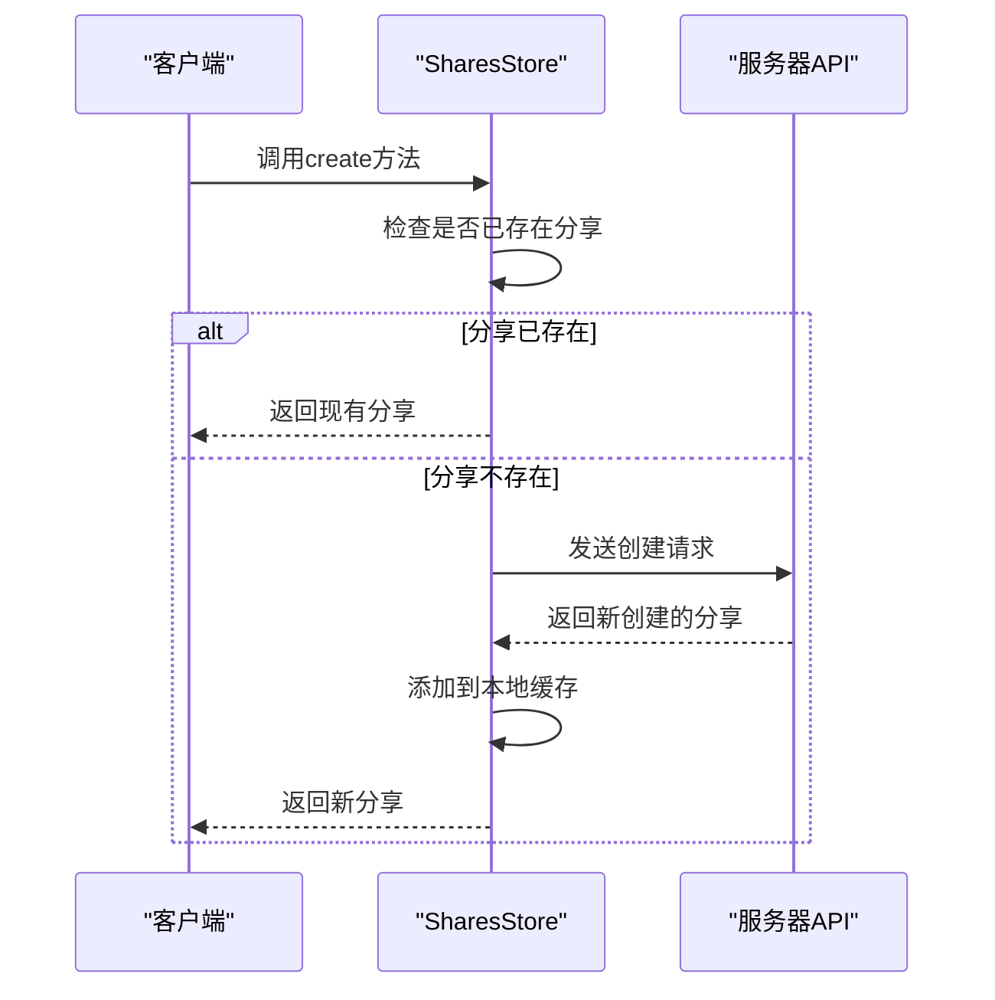
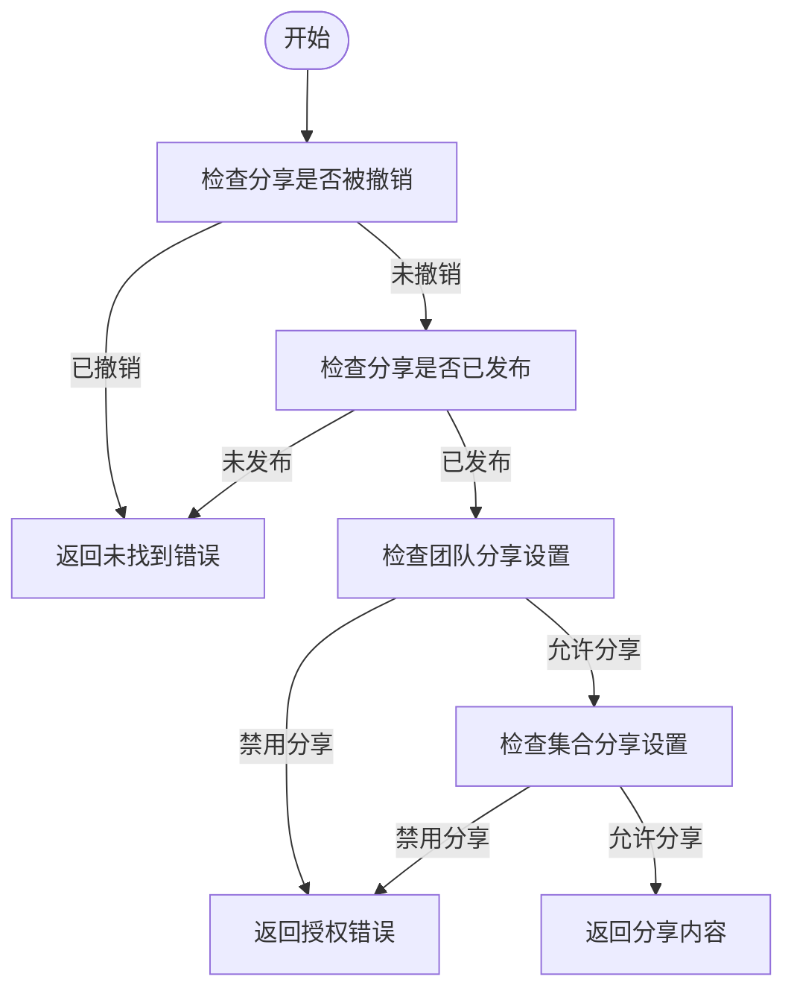
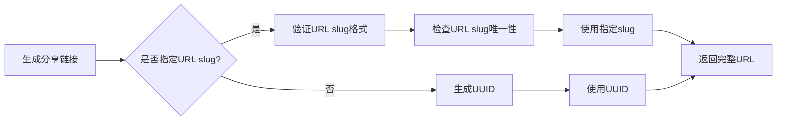
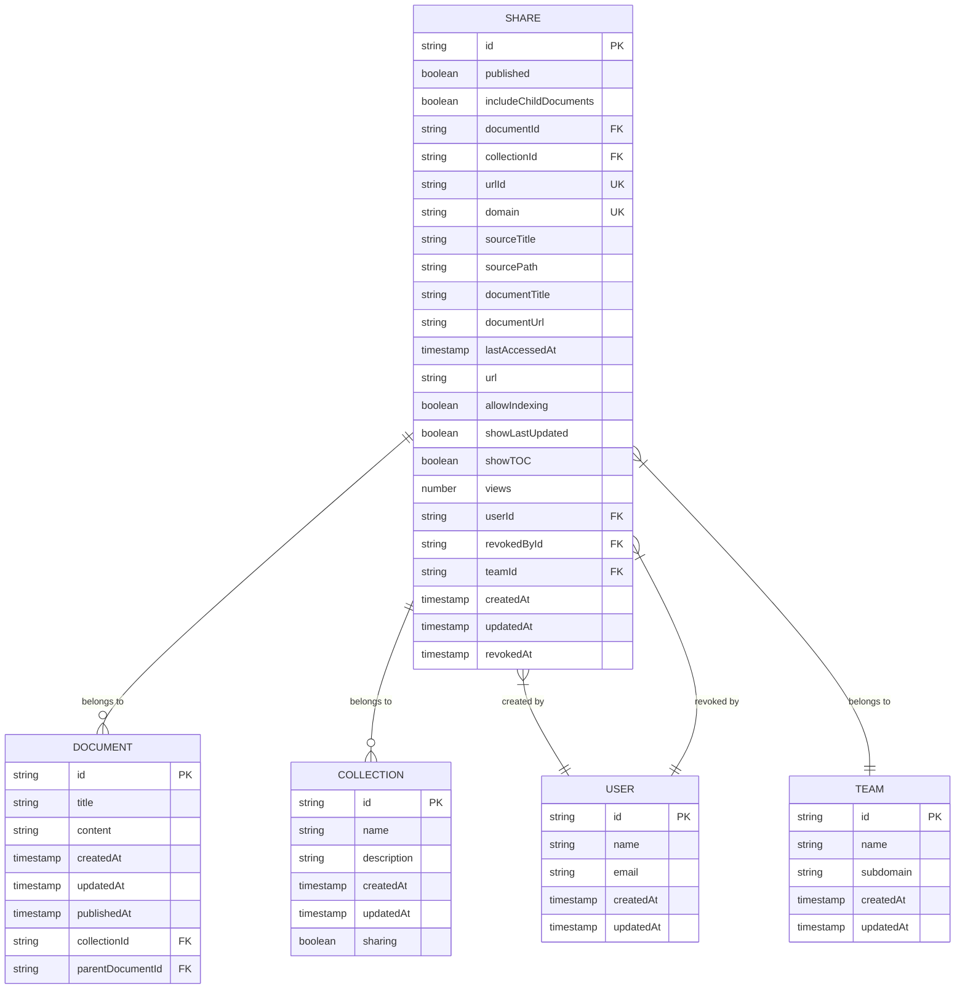

# 分享系统

<cite>
**本文档引用的文件**   
- [Share.ts](file://app/models/Share.ts)
- [Share.ts](file://server/models/Share.ts)
- [shareLoader.ts](file://server/commands/shareLoader.ts)
- [SharesStore.ts](file://app/stores/SharesStore.ts)
- [shares.ts](file://server/routes/api/shares/shares.ts)
- [PublicAccess.tsx](file://app/components/Sharing/Document/PublicAccess.tsx)
</cite>

## 目录
1. [介绍](#介绍)
2. [分享模型实现](#分享模型实现)
3. [分享链接创建与管理](#分享链接创建与管理)
4. [权限控制机制](#权限控制机制)
5. [关键字段说明](#关键字段说明)
6. [分享链接生成算法与安全考虑](#分享链接生成算法与安全考虑)
7. [实体关系图](#实体关系图)

## 介绍
分享系统是文档协作平台的核心功能之一，允许用户将文档或集合公开分享给外部用户或特定团队成员。本系统支持两种分享模式：公开分享和受限分享，提供了灵活的权限控制和访问管理机制。分享链接可以包含丰富的配置选项，如搜索引擎索引控制、最后更新时间显示和目录显示等，以满足不同场景的需求。

**Section sources**
- [Share.ts](file://app/models/Share.ts)
- [Share.ts](file://server/models/Share.ts)

## 分享模型实现
分享模型（Share）是分享系统的核心数据结构，定义了分享链接的各种属性和行为。该模型在客户端和服务器端都有实现，分别位于 `app/models/Share.ts` 和 `server/models/Share.ts` 文件中。客户端模型继承自基础模型类，实现了可搜索接口，并定义了与文档、集合和用户的关系。

**Diagram sources **
- [Share.ts](file://app/models/Share.ts#L12-L129)

**Section sources**
- [Share.ts](file://app/models/Share.ts#L12-L129)
- [Share.ts](file://server/models/Share.ts#L32-L240)

## 分享链接创建与管理
分享链接的创建通过 `SharesStore` 类的 `create` 方法实现。该方法首先检查是否已存在针对同一文档或集合的分享，如果存在则直接返回现有分享，否则创建新的分享记录。分享链接的管理包括更新配置、撤销分享和获取分享信息等操作。

**Diagram sources **
- [SharesStore.ts](file://app/stores/SharesStore.ts#L50-L66)

**Section sources**
- [SharesStore.ts](file://app/stores/SharesStore.ts#L50-L66)
- [shares.ts](file://server/routes/api/shares/shares.ts#L137-L229)

## 权限控制机制
分享系统的权限控制机制分为公开分享和受限分享两种模式。公开分享允许任何人通过链接访问内容，而受限分享则需要用户登录并具有相应的权限。权限验证在服务器端通过 `loadPublicShare` 和 `loadShareWithParent` 函数实现，确保只有授权用户才能访问受保护的内容。

**Diagram sources **
- [shareLoader.ts](file://server/commands/shareLoader.ts#L26-L27)

**Section sources**
- [shareLoader.ts](file://server/commands/shareLoader.ts#L26-L27)
- [shares.ts](file://server/routes/api/shares/shares.ts#L137-L229)

## 关键字段说明
分享模型包含多个关键字段，每个字段都有特定的作用和使用场景：

- **id**: 分享的唯一标识符，由系统自动生成。
- **url**: 分享链接的完整URL，用于外部访问。
- **publishedAt**: 分享发布时间，记录分享何时变为公开状态。
- **createdAt**: 分享创建时间，记录分享何时被创建。
- **updatedAt**: 分享最后更新时间，记录分享配置的最后修改时间。
- **revokedAt**: 分享撤销时间，当分享被撤销时设置此字段。
- **lastViewedAt**: 最后访问时间，记录分享链接的最后访问时间。
- **allowIndexing**: 是否允许搜索引擎索引，控制页面是否可被搜索引擎收录。
- **showLastUpdated**: 是否显示最后更新时间，在分享页面显示文档的最后修改时间。
- **showToc**: 是否显示目录，在分享页面默认显示文档的目录。

**Section sources**
- [Share.ts](file://app/models/Share.ts#L17-L19)
- [Share.ts](file://server/models/Share.ts#L130-L136)

## 分享链接生成算法与安全考虑
分享链接的生成算法确保了URL的唯一性和安全性。系统使用UUID作为默认的分享ID，同时支持自定义的URL slug。为了保证唯一性，系统在创建分享时会检查URL slug是否已被使用，并在数据库层面设置了唯一约束。安全方面，系统通过验证用户权限、检查团队和集合的分享设置以及防止跨站请求伪造（CSRF）等措施来保护分享链接的安全。

**Diagram sources **
- [Share.ts](file://server/models/Share.ts#L32-L240)

**Section sources**
- [Share.ts](file://server/models/Share.ts#L32-L240)
- [shares.ts](file://server/routes/api/shares/shares.ts#L137-L229)

## 实体关系图
分享模型与其他核心模型（如文档、集合和用户）之间存在明确的关系。这些关系在数据库层面通过外键约束实现，并在应用层面通过模型关系装饰器进行定义。

**Diagram sources **
- [Share.ts](file://server/models/Share.ts#L32-L240)
- [Document.ts](file://server/models/Document.ts#L94-L1314)
- [Collection.ts](file://server/models/Collection.ts#L87-L1007)

**Section sources**
- [Share.ts](file://server/models/Share.ts#L32-L240)
- [Document.ts](file://server/models/Document.ts#L94-L1314)
- [Collection.ts](file://server/models/Collection.ts#L87-L1007)