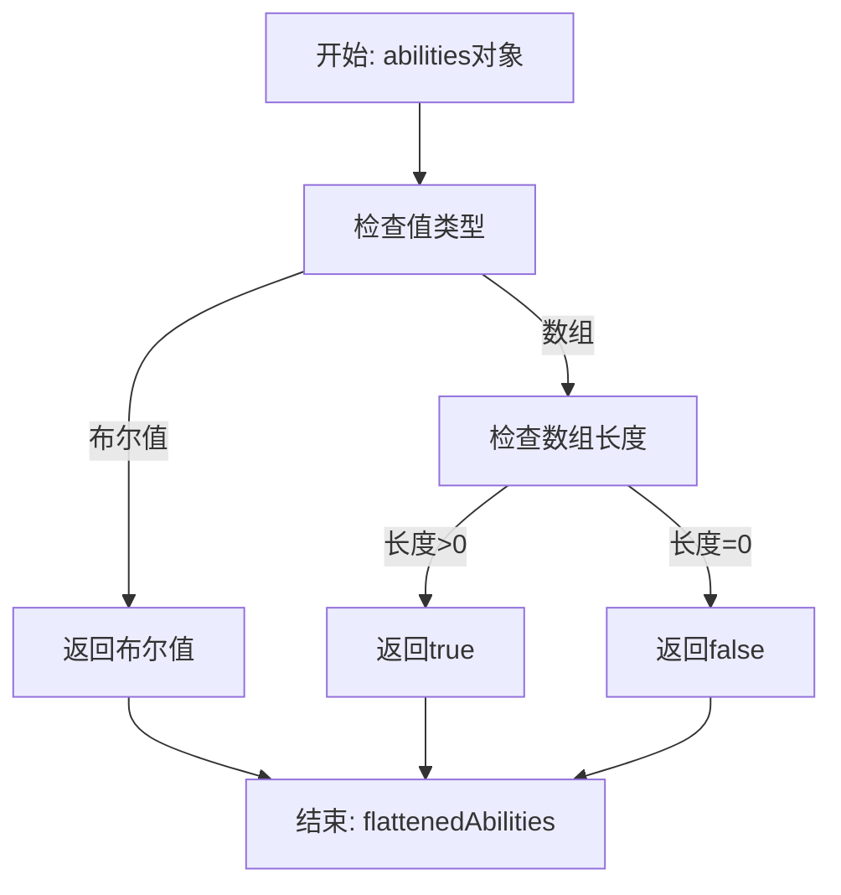
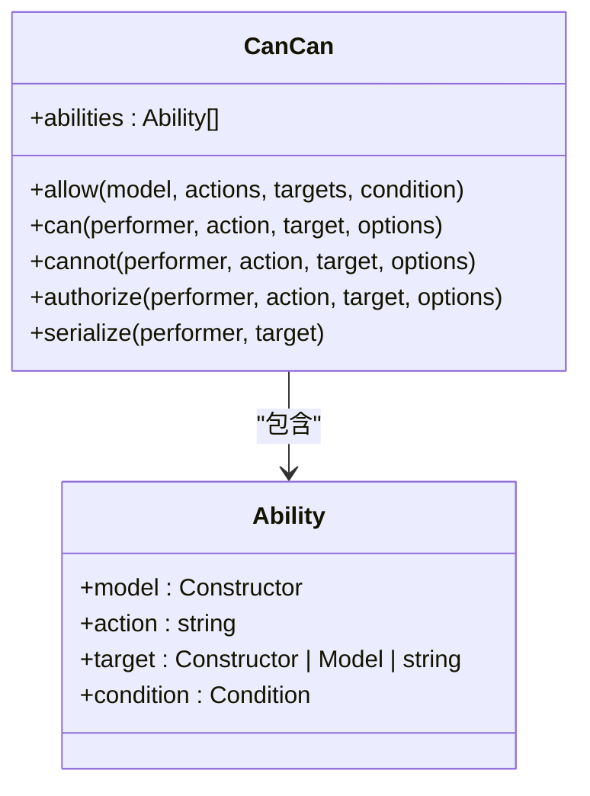
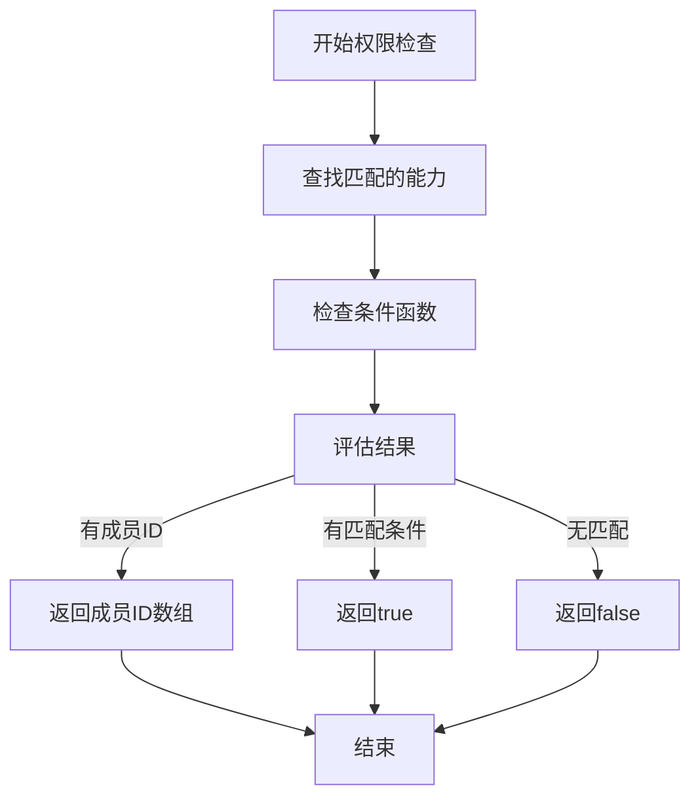
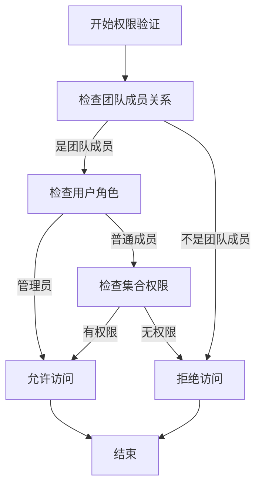

# 基于策略的访问控制

<cite>
**本文档引用的文件**  
- [Policy.ts](file://app/models/Policy.ts)
- [cancan.ts](file://server/policies/cancan.ts)
- [usePolicy.ts](file://app/hooks/usePolicy.ts)
- [PoliciesStore.ts](file://app/stores/PoliciesStore.ts)
- [collection.ts](file://server/policies/collection.ts)
- [document.ts](file://server/policies/document.ts)
- [team.ts](file://server/policies/team.ts)
- [utils.ts](file://server/policies/utils.ts)
</cite>

## 目录
1. [简介](#简介)
2. [权限控制体系概述](#权限控制体系概述)
3. [Policy模型详解](#policy模型详解)
4. [策略模式实现](#策略模式实现)
5. [权限继承机制](#权限继承机制)
6. [权限检查流程](#权限检查流程)
7. [权限管理流程](#权限管理流程)
8. [安全最佳实践](#安全最佳实践)
9. [总结](#总结)

## 简介

基于策略的访问控制系统为应用程序提供了细粒度的权限管理能力。该系统通过Policy模型和策略模式实现了对团队、用户、文档、集合、API密钥、Webhook订阅等不同层级资源的精确访问控制。本文档详细介绍了该权限控制系统的实现原理和使用方法。

## 权限控制体系概述

权限控制系统采用基于策略的访问控制（Policy-Based Access Control）模型，通过定义和验证策略来实现对系统资源的访问控制。该系统支持多层级的权限管理，包括团队级、集合级、文档级、API密钥级和Webhook订阅级等不同粒度的权限控制。

系统通过Policy模型存储和管理权限策略，每个策略与特定的资源（如文档、集合、团队等）相关联。权限检查通过can方法实现，该方法根据当前用户的身份和权限策略来判断是否允许执行特定操作。

**Section sources**
- [Policy.ts](file://app/models/Policy.ts)
- [cancan.ts](file://server/policies/cancan.ts)

## Policy模型详解

Policy模型是权限控制系统的核心数据结构，用于存储和管理权限策略。该模型定义了权限策略的关键字段和行为。

### 关键字段说明

- **id**: 策略的唯一标识符，通常与关联资源的ID相同
- **createdAt**: 策略创建时间
- **updatedAt**: 策略最后更新时间
- **collectionId**: 关联的集合ID
- **documentId**: 关联的文档ID
- **teamId**: 关联的团队ID
- **userId**: 关联的用户ID
- **integrationId**: 关联的集成ID
- **apiKeyId**: 关联的API密钥ID
- **webhookSubscriptionId**: 关联的Webhook订阅ID

### abilities字段

abilities字段是Policy模型的核心，它存储了具体的权限信息。该字段是一个记录对象，其键表示能力名称，值可以是布尔值或成员ID数组：

```typescript
abilities: Record<string, boolean | string[]>;
```

当值为布尔值时，表示该能力对所有用户都启用或禁用；当值为字符串数组时，数组中的每个元素代表具有该能力的成员ID。

### flattenedAbilities计算属性

flattenedAbilities是一个计算属性，用于将abilities字段中的复杂结构扁平化为简单的布尔值映射：



**Diagram sources**
- [Policy.ts](file://app/models/Policy.ts#L20-L32)

**Section sources**
- [Policy.ts](file://app/models/Policy.ts#L6-L61)

## 策略模式实现

权限控制系统通过策略模式实现了灵活的权限验证机制。该模式的核心是cancan.ts文件中定义的CanCan类。

### CanCan类

CanCan类提供了定义和检查权限能力的接口。它维护了一个能力列表，每个能力包含模型、操作、目标和条件等信息。



**Diagram sources**
- [cancan.ts](file://server/policies/cancan.ts#L10-L248)

### 权限定义

系统通过allow方法定义权限规则。例如，在collection.ts中定义了用户对集合的权限：

```typescript
allow(User, "createCollection", Team, (actor, team) =>
  and(
    isTeamModel(actor, team),
    isTeamMutable(actor),
    !actor.isGuest,
    !actor.isViewer,
    or(actor.isAdmin, !!team?.memberCollectionCreate)
  )
);
```

这些规则定义了在什么条件下用户可以执行特定操作。

### 权限检查

can方法是权限检查的核心，它通过以下步骤验证权限：

1. 查找匹配的能力规则
2. 执行条件函数
3. 返回检查结果



**Diagram sources**
- [cancan.ts](file://server/policies/cancan.ts#L80-L132)

**Section sources**
- [cancan.ts](file://server/policies/cancan.ts#L10-L248)
- [collection.ts](file://server/policies/collection.ts#L0-L211)
- [document.ts](file://server/policies/document.ts#L0-L331)
- [team.ts](file://server/policies/team.ts#L0-L60)

## 权限继承机制

权限系统实现了复杂的权限继承机制，确保权限变更能够正确传播到相关资源。

### 子资源权限继承

当集合或文档的权限发生变化时，系统会自动更新其子资源的权限。这通过Policy模型中的removeChildPolicies静态方法实现：

```typescript
@AfterChange
public static removeChildPolicies(
  model: Policy,
  previousAttributes: Partial<Policy>
) {
  const { documents, collections, policies } = model.store.rootStore;

  if (isEqual(model.abilities, previousAttributes.abilities)) {
    return;
  }

  const collection = collections.get(model.id);
  if (collection) {
    documents.inCollection(collection.id).forEach((i) => {
      policies.remove(i.id);
    });
    return;
  }

  const document = documents.get(model.id);
  if (document) {
    document.childDocuments.forEach((i) => {
      policies.remove(i.id);
    });
    return;
  }
}
```

该方法在策略变更后自动触发，确保子文档的权限策略得到更新。

### 成员权限移除

当用户失去某个成员资格时，系统会从所有相关策略中移除该成员的权限：

```typescript
@action
removeForMembership(id: string) {
  this.data.forEach((policy) => {
    Object.keys(policy.abilities).forEach((key) => {
      let can = policy.abilities[key];
      if (can === true || can === false) {
        return;
      }
      if (can.includes(id)) {
        can = can.filter((i) => i !== id);

        if (can.length === 0) {
          policy.abilities[key] = false;
        } else {
          policy.abilities[key] = can;
        }
      }
    });
  });
}
```

**Section sources**
- [Policy.ts](file://app/models/Policy.ts#L34-L60)
- [PoliciesStore.ts](file://app/stores/PoliciesStore.ts#L9-L38)

## 权限检查流程

权限检查流程是系统安全的核心，它确保每个操作都经过适当的权限验证。

### 客户端权限检查

在客户端，通过usePolicy钩子获取特定实体的权限：

```typescript
export default function usePolicy(entity?: string | Model | null) {
  const { policies } = useStores();
  const user = useCurrentUser({ rejectOnEmpty: false });
  const entityId = entity
    ? typeof entity === "string"
      ? entity
      : entity.id
    : "";
  const policy = policies.get(entityId);

  useEffect(() => {
    if (
      entity &&
      typeof entity !== "string" &&
      !entity.isNew &&
      !entity.isSaving
    ) {
      if (!policy && user) {
        void entity.loadRelations();
      }
    }
  }, [policies, policy, user, entity]);

  return policies.abilities(entityId);
}
```

该钩子会自动加载必要的关系数据，并返回实体的权限信息。

### 服务端权限验证

服务端通过策略文件（如collection.ts、document.ts）定义详细的权限规则。这些规则使用逻辑组合函数（and、or）构建复杂的条件判断。



**Diagram sources**
- [usePolicy.ts](file://app/hooks/usePolicy.ts#L12-L38)
- [utils.ts](file://server/policies/utils.ts#L0-L137)

**Section sources**
- [usePolicy.ts](file://app/hooks/usePolicy.ts#L12-L38)
- [cancan.ts](file://server/policies/cancan.ts#L10-L248)
- [utils.ts](file://server/policies/utils.ts#L0-L137)

## 权限管理流程

权限管理系统提供了完整的权限创建、更新和删除流程。

### 策略存储管理

PoliciesStore类负责管理所有策略的存储和检索：

```typescript
export default class PoliciesStore extends Store<Policy> {
  actions = [];

  constructor(rootStore: RootStore) {
    super(rootStore, Policy);
  }

  abilities(id: string) {
    const policy = this.get(id);
    return policy ? policy.flattenedAbilities : this.defaultAbilities;
  }

  private defaultAbilities = Object.freeze({} as Record<string, boolean>);
}
```

该存储提供了获取特定策略权限的接口，并处理默认权限的返回。

### 权限继承传播

当权限发生变化时，系统会自动处理权限的继承和传播：

1. 检测策略变更
2. 查找受影响的子资源
3. 更新子资源的权限策略
4. 通知相关组件重新渲染

这种机制确保了权限变更的一致性和及时性。

**Section sources**
- [PoliciesStore.ts](file://app/stores/PoliciesStore.ts#L6-L61)
- [Policy.ts](file://app/models/Policy.ts#L34-L60)

## 安全最佳实践

在使用基于策略的访问控制系统时，应遵循以下安全最佳实践：

1. **最小权限原则**: 只授予用户完成工作所需的最小权限
2. **权限继承谨慎使用**: 确保权限继承不会意外授予过多权限
3. **定期权限审查**: 定期检查和清理不必要的权限分配
4. **敏感操作双重验证**: 对关键操作实施额外的验证步骤
5. **审计日志记录**: 记录所有权限相关的操作以便审计

这些实践有助于维护系统的安全性和可靠性。

## 总结

基于策略的访问控制系统通过Policy模型和策略模式实现了灵活、细粒度的权限管理。系统支持多层级的权限控制，包括团队、集合、文档等不同资源类型。通过清晰的权限定义、继承机制和检查流程，该系统为应用程序提供了强大的安全保护能力。开发者可以基于此系统构建安全可靠的应用程序，同时为用户提供灵活的权限管理体验。