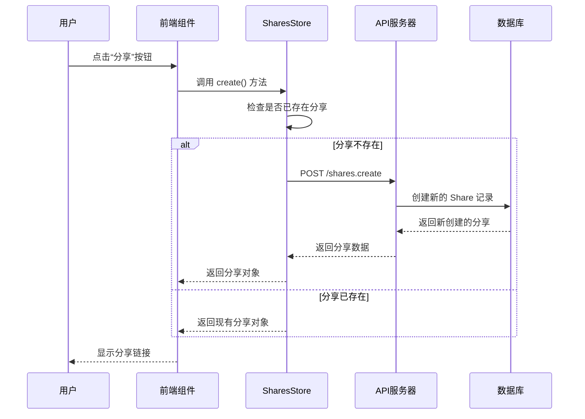
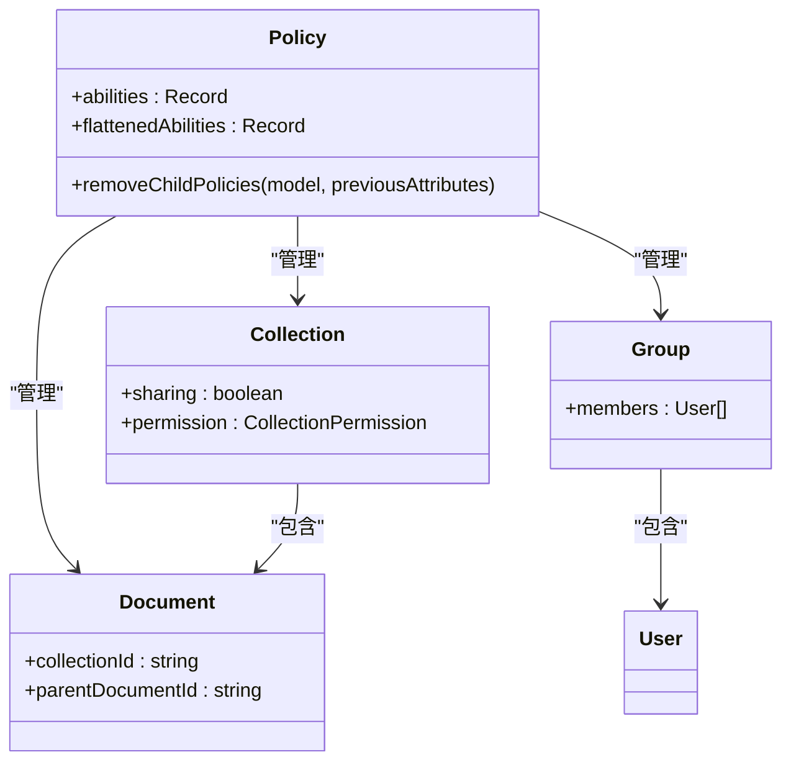
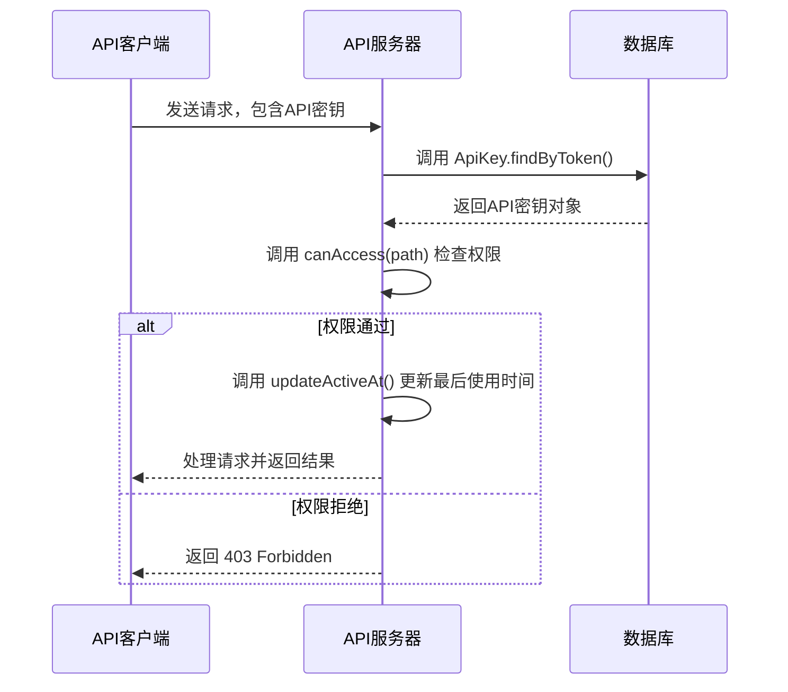
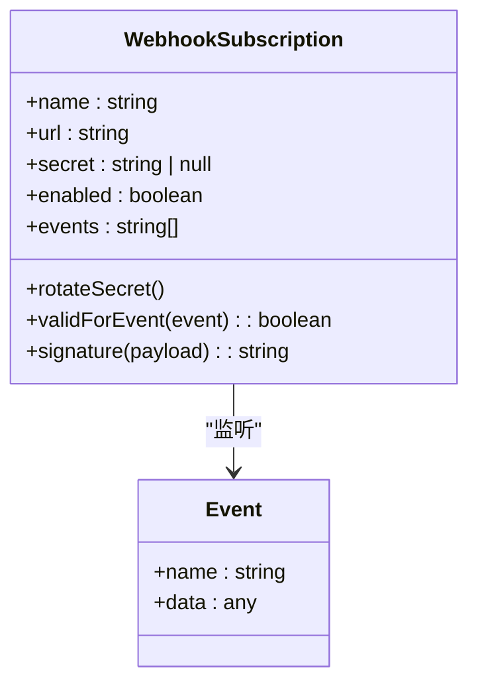
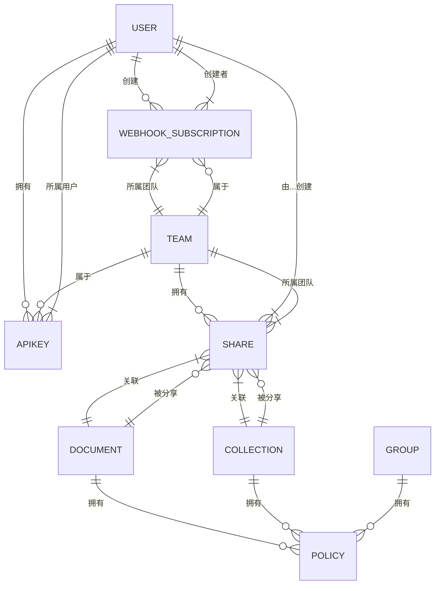

# 权限与共享模型

<cite>
**本文档中引用的文件**   
- [Share.ts](file://app/models/Share.ts)
- [Share.ts](file://server/models/Share.ts)
- [Policy.ts](file://app/models/Policy.ts)
- [cancan.ts](file://server/policies/cancan.ts)
- [ApiKey.ts](file://app/models/ApiKey.ts)
- [ApiKey.ts](file://server/models/ApiKey.ts)
- [WebhookSubscription.ts](file://app/models/WebhookSubscription.ts)
- [WebhookSubscription.ts](file://server/models/WebhookSubscription.ts)
- [Encrypted.ts](file://server/models/decorators/Encrypted.ts)
- [crypto.ts](file://server/utils/crypto.ts)
</cite>

## 目录
1. [介绍](#介绍)
2. [分享模型 (Share)](#分享模型-share)
3. [权限策略模型 (Policy)](#权限策略模型-policy)
4. [API密钥模型 (ApiKey)](#api密钥模型-apikey)
5. [Webhook订阅模型 (WebhookSubscription)](#webhook订阅模型-webhooksubscription)
6. [实体关系图](#实体关系图)

## 介绍
本文档详细介绍了权限与共享数据模型的实现，重点阐述了`Share`、`Policy`、`ApiKey`和`WebhookSubscription`四个核心模型。文档将深入解析分享链接的创建与管理机制、基于策略的细粒度权限控制系统、API密钥的安全存储与作用域管理，以及Webhook订阅的配置和安全验证流程。通过本指南，初学者可以获得权限体系的概念性理解，而经验丰富的开发者则能获取到技术细节、安全最佳实践和权限继承等高级主题。

## 分享模型 (Share)

`Share`模型是实现文档和集合公开共享功能的核心。它允许用户生成一个公开的链接，将特定的文档或集合分享给任何人，无论他们是否是团队成员。

### 分享链接的创建与管理
分享链接的创建由前端组件触发，例如`ShareButton`。当用户点击文档或集合的分享按钮时，会调用`SharesStore`的`create`方法。该方法首先检查是否已存在针对该文档或集合的分享，如果不存在，则通过API调用在后端创建一个新的`Share`记录。

**Diagram sources**
- [ShareButton.tsx](file://app/scenes/Document/components/ShareButton.tsx#L24-L66)
- [ShareButton.tsx](file://app/scenes/Collection/components/ShareButton.tsx#L25-L72)
- [SharesStore.ts](file://app/stores/SharesStore.ts#L130-L160)

### 权限控制机制
`Share`模型支持两种分享模式：公开分享和受限分享。

*   **公开分享 (Public Sharing)**: 当`published`字段为`true`时，分享链接是公开的。任何拥有该链接的人都可以访问共享的文档或集合。`canonicalUrl`属性会根据`urlId`或`id`生成最终的访问URL。
*   **受限分享 (Restricted Sharing)**: 通过`revokedAt`字段实现。当用户选择“撤销”分享时，`revoke`方法会被调用，将`revokedAt`设置为当前时间。此后，任何访问该链接的请求都会被拒绝。`isRevoked`计算属性用于快速判断分享是否已被撤销。

此外，`Share`模型还支持嵌套文档分享。通过`includeChildDocuments`字段，可以决定是否允许通过父文档的分享链接访问其所有子文档。

**Section sources**
- [Share.ts](file://app/models/Share.ts#L12-L129)
- [Share.ts](file://server/models/Share.ts#L32-L240)

## 权限策略模型 (Policy)

`Policy`模型是整个系统权限控制的基础，它实现了基于能力（Abilities）的细粒度访问控制。

### 基于策略的权限控制
每个`Policy`对象都包含一个`abilities`字段，该字段是一个键值对对象。键代表一种能力（如`readDocument`、`updateCollection`），值则表示谁拥有该能力。值可以是：
*   `true`: 表示该模型（如文档、集合）的拥有者或管理员拥有此能力。
*   `false`: 表示没有人拥有此能力。
*   `string[]`: 一个包含成员ID（如用户ID、组ID）的数组，表示这些成员拥有此能力。

这种设计允许权限在团队、用户、文档和集合等多个层级进行管理。例如，一个集合的`Policy`可以授予特定用户或组读取权限，而该集合内的文档可以继承这些权限，也可以拥有自己独立的权限。

### 权限继承与更新
`Policy`模型通过`@AfterChange`生命周期钩子来处理权限继承。当一个集合的权限发生变化时，`removeChildPolicies`静态方法会被触发，它会清除该集合下所有文档的旧权限策略，从而强制它们重新计算并继承新的权限。

**Diagram sources**
- [Policy.ts](file://app/models/Policy.ts#L6-L61)
- [cancan.ts](file://server/policies/cancan.ts#L8-L8)

**Section sources**
- [Policy.ts](file://app/models/Policy.ts#L6-L61)
- [cancan.ts](file://server/policies/cancan.ts#L8-L8)

## API密钥模型 (ApiKey)

`ApiKey`模型用于为外部应用或脚本提供安全的API访问权限。

### 安全存储与作用域管理
为了确保API密钥的安全，系统采用了双重保护机制：
1.  **哈希存储**: 当API密钥创建时，其明文值会通过`hash`函数（使用SHA-256）进行哈希处理，哈希值存储在数据库的`hash`字段中。原始明文仅在创建时短暂存在于内存中。
2.  **过期机制**: `expiresAt`字段允许为API密钥设置过期时间。`isExpired`计算属性可以方便地检查密钥是否已过期。

`scope`字段是实现作用域限制的关键。它是一个字符串数组，定义了该API密钥可以访问的API路径。`canAccess`方法会利用`AuthenticationHelper`来检查请求路径是否在密钥的授权范围内。如果`scope`为空，则密钥拥有完全访问权限。

**Diagram sources**
- [ApiKey.ts](file://server/models/ApiKey.ts#L26-L179)
- [crypto.ts](file://server/utils/crypto.ts#L26-L28)

**Section sources**
- [ApiKey.ts](file://app/models/ApiKey.ts#L7-L55)
- [ApiKey.ts](file://server/models/ApiKey.ts#L26-L179)

## Webhook订阅模型 (WebhookSubscription)

`WebhookSubscription`模型用于配置和管理外部系统的事件通知。

### 配置与安全验证
用户可以创建一个`WebhookSubscription`，指定一个`url`来接收事件通知。为了确保通信的安全性，系统提供了以下机制：
*   **签名验证**: `signature`方法使用HMAC-SHA256算法为每个Webhook负载生成一个签名。该签名包含时间戳和有效负载的哈希值。接收方可以使用相同的密钥和算法来验证签名的有效性，防止伪造请求。
*   **密钥轮换**: `rotateSecret`方法允许用户在不重新创建订阅的情况下轮换`secret`，增强了安全性。
*   **事件过滤**: `events`字段是一个字符串数组，用于定义该订阅感兴趣的事件类型（如`document.create`、`user.update`）。`validForEvent`方法会检查传入的事件是否匹配这些模式。

`secret`字段使用`@Encrypted`装饰器进行加密存储，确保其在数据库中不会以明文形式存在。

**Diagram sources**
- [WebhookSubscription.ts](file://server/models/WebhookSubscription.ts#L30-L164)
- [Encrypted.ts](file://server/models/decorators/Encrypted.ts#L13-L74)

**Section sources**
- [WebhookSubscription.ts](file://app/models/WebhookSubscription.ts#L4-L26)
- [WebhookSubscription.ts](file://server/models/WebhookSubscription.ts#L30-L164)

## 实体关系图
下图展示了`Share`、`Policy`、`ApiKey`和`WebhookSubscription`四个核心模型之间的关系及其与主要业务实体（如`User`、`Team`、`Document`、`Collection`）的关联。

**Diagram sources**
- [Share.ts](file://server/models/Share.ts#L32-L240)
- [ApiKey.ts](file://server/models/ApiKey.ts#L26-L179)
- [WebhookSubscription.ts](file://server/models/WebhookSubscription.ts#L30-L164)
- [Policy.ts](file://app/models/Policy.ts#L6-L61)