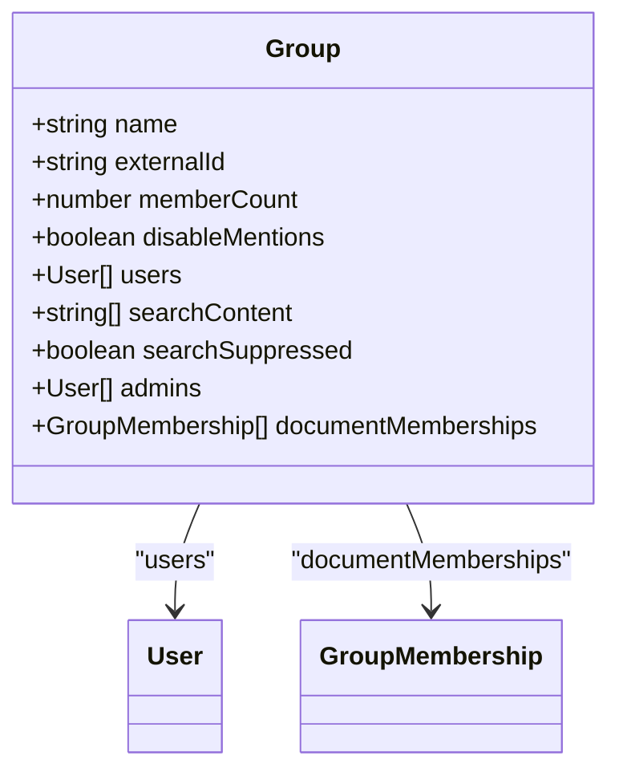
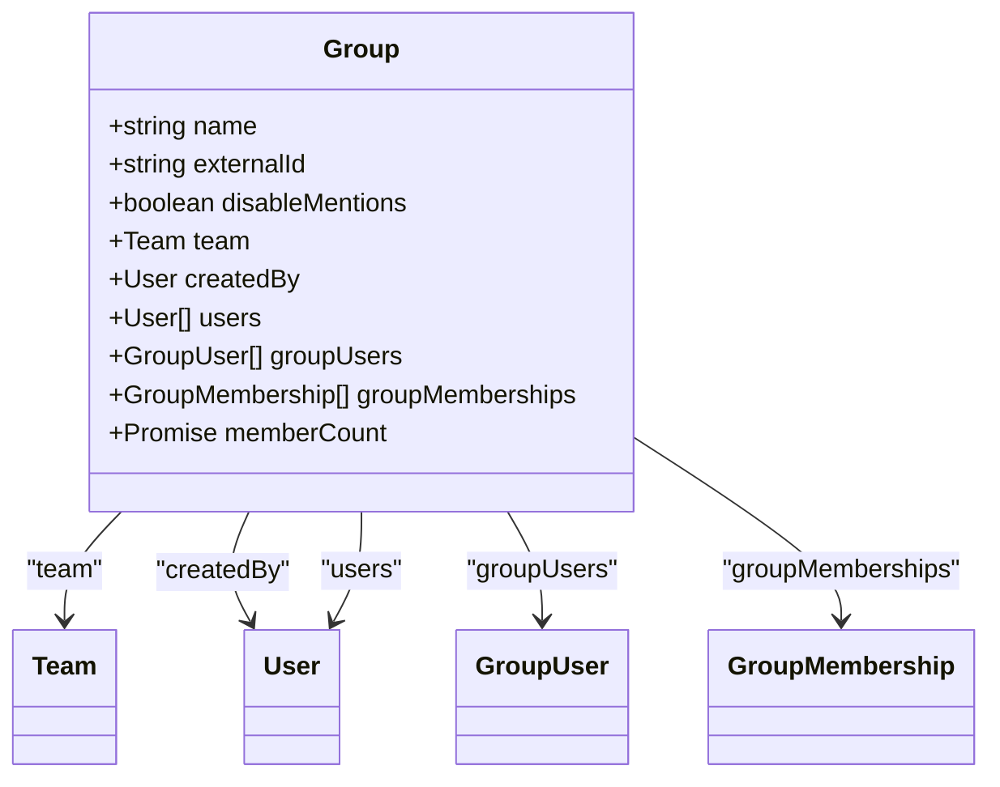
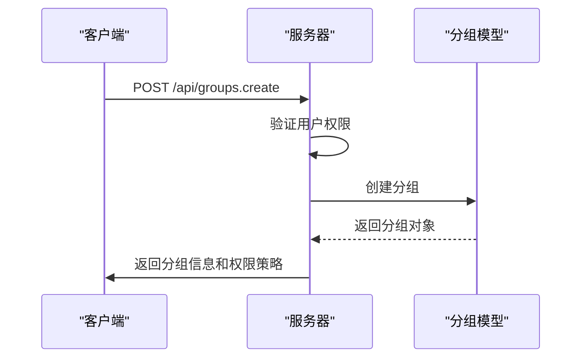
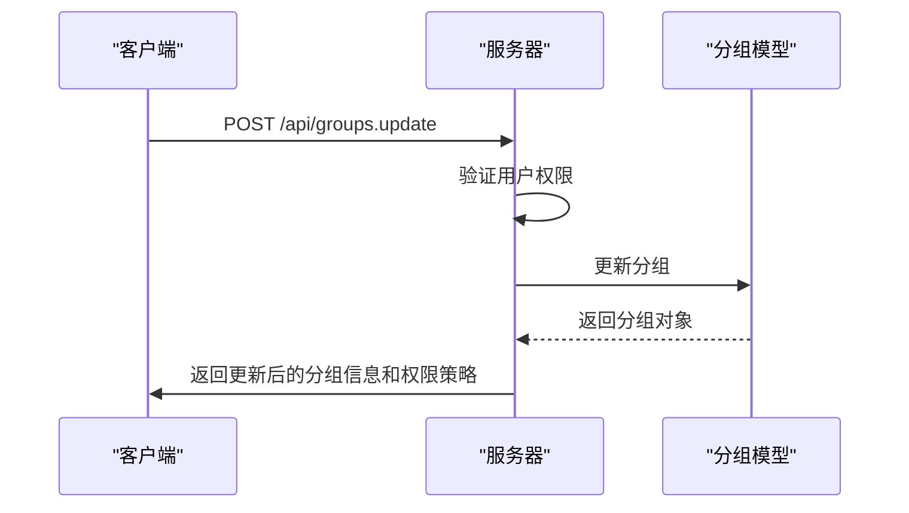
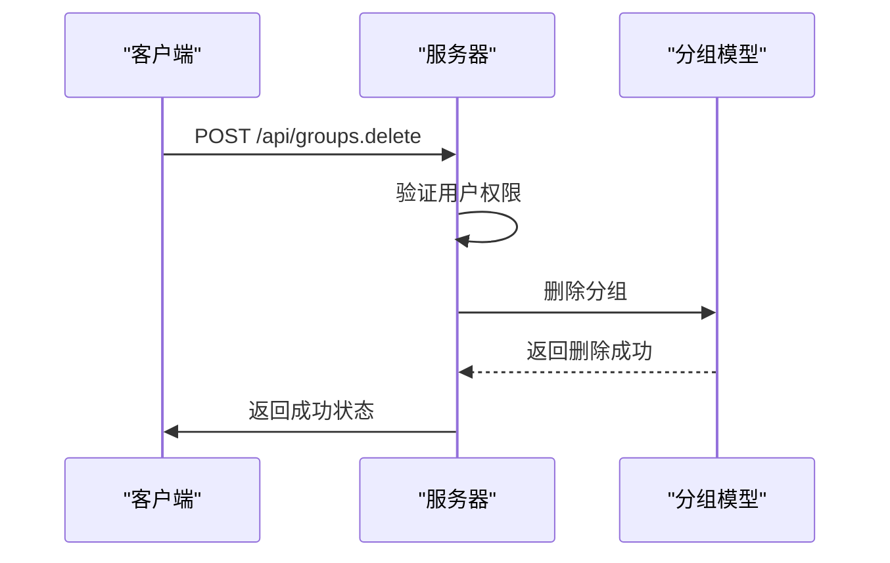
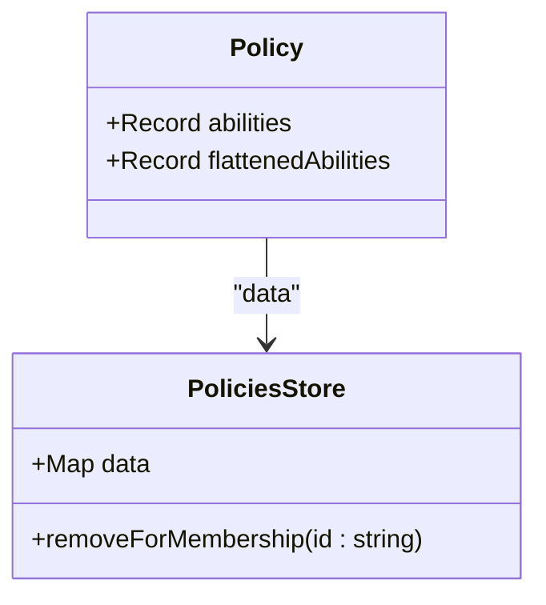

# 分组基本信息管理

<cite>
**本文档引用的文件**   
- [Group.ts](file://app/models/Group.ts)
- [Group.ts](file://server/models/Group.ts)
- [GroupsStore.ts](file://app/stores/GroupsStore.ts)
- [groups.ts](file://server/routes/api/groups/groups.ts)
- [group.ts](file://server/policies/group.ts)
- [GroupDialogs.tsx](file://app/scenes/Settings/components/GroupDialogs.tsx)
</cite>

## 目录
1. [引言](#引言)
2. [分组模型实现](#分组模型实现)
3. [分组属性与验证规则](#分组属性与验证规则)
4. [分组操作实现逻辑](#分组操作实现逻辑)
5. [权限控制机制](#权限控制机制)
6. [API调用示例](#api调用示例)
7. [状态管理与错误处理](#状态管理与错误处理)
8. [总结](#总结)

## 引言
分组是团队内部组织和权限管理的核心概念。通过分组，团队可以更高效地管理成员权限，简化文档和集合的访问控制。本文档详细介绍了分组的基本信息管理，重点分析了Group模型的实现，包括分组的创建、更新、删除操作的实现逻辑，以及分组级别的权限控制机制。

**Section sources**
- [Group.ts](file://app/models/Group.ts#L7-L85)
- [Group.ts](file://server/models/Group.ts#L21-L106)

## 分组模型实现
分组模型在前端和后端分别实现了不同的功能。前端的Group模型继承自Model类，实现了Searchable接口，用于支持搜索功能。后端的Group模型继承自ParanoidModel类，用于支持软删除功能。

### 前端分组模型
前端分组模型定义了分组的基本属性，包括名称、外部ID、成员数量和禁用提及等。这些属性通过@Field和@observable装饰器进行声明，确保了属性的可观察性和数据绑定。



**Diagram sources**
- [Group.ts](file://app/models/Group.ts#L7-L85)

### 后端分组模型
后端分组模型定义了分组的数据库表结构，包括名称、外部ID、禁用提及等字段。通过@Scopes装饰器定义了查询范围，通过@Table装饰器定义了表名和模型名。此外，还定义了分组与用户、团队等的关联关系。



**Diagram sources**
- [Group.ts](file://server/models/Group.ts#L21-L106)

## 分组属性与验证规则
分组模型定义了多个属性，每个属性都有相应的验证规则，确保数据的完整性和一致性。

### 名称
分组名称是一个字符串，最大长度为255个字符。通过@Length装饰器进行长度验证，确保名称不会过长。

### 外部ID
外部ID是一个字符串，用于标识分组的外部系统ID。该字段可以为空，但一旦设置，必须唯一。

### 禁用提及
禁用提及是一个布尔值，用于控制分组是否可以在文档或评论中被提及。如果设置为true，分组将无法被提及。

### 成员数量
成员数量是一个数字，表示分组中的成员数量。通过@CounterCache装饰器自动计算成员数量，确保数据的实时性。

**Section sources**
- [Group.ts](file://app/models/Group.ts#L7-L85)
- [Group.ts](file://server/models/Group.ts#L21-L106)

## 分组操作实现逻辑
分组的创建、更新和删除操作在后端通过API路由进行处理，每个操作都包含权限验证、数据验证和事件触发等步骤。

### 创建分组
创建分组的API路由为`groups.create`，需要用户具有创建分组的权限。请求体中包含分组的名称、外部ID和禁用提及等信息。创建成功后，返回分组的详细信息和权限策略。



**Diagram sources**
- [groups.ts](file://server/routes/api/groups/groups.ts#L28-L65)

### 更新分组
更新分组的API路由为`groups.update`，需要用户具有更新分组的权限。请求体中包含分组的ID和需要更新的字段。更新成功后，返回更新后的分组信息和权限策略。



**Diagram sources**
- [groups.ts](file://server/routes/api/groups/groups.ts#L123-L145)

### 删除分组
删除分组的API路由为`groups.delete`，需要用户具有删除分组的权限。请求体中包含分组的ID。删除成功后，返回成功状态。



**Diagram sources**
- [groups.ts](file://server/routes/api/groups/groups.ts#L174-L180)

## 权限控制机制
分组的权限控制通过权限策略（Policy）实现，每个分组都有一个对应的权限策略，定义了用户对分组的操作权限。

### 权限策略
权限策略通过`PoliciesStore`进行管理，每个分组的权限策略包含多个操作权限，如创建、读取、更新和删除等。权限策略的生成和更新通过`presentPolicies`函数实现。

### 权限验证
权限验证通过`authorize`函数实现，该函数检查用户是否具有对分组的指定操作权限。如果用户没有权限，将抛出授权错误。



**Diagram sources**
- [Policy.ts](file://app/models/Policy.ts#L0-L63)
- [PoliciesStore.ts](file://app/stores/PoliciesStore.ts#L0-L46)

## API调用示例
以下是一些常见的API调用示例，展示了如何通过API创建、更新和删除分组。

### 创建分组
```typescript
const group = new Group(
  {
    name: "开发团队",
    externalId: "dev-team-001",
    disableMentions: false,
  },
  groups
);

try {
  await group.save();
  dialogs.closeAllModals();
  dialogs.openModal({
    title: t("Group members"),
    content: <ViewGroupMembersDialog group={group} />,
  });
} catch (err) {
  toast.error(err.message);
}
```

### 更新分组
```typescript
const handleSubmit = React.useCallback(
  async (ev: React.SyntheticEvent) => {
    ev.preventDefault();
    setIsSaving(true);

    try {
      await group.save({
        name,
        disableMentions,
      });
      onSubmit();
    } catch (err) {
      toast.error(err.message);
    } finally {
      setIsSaving(false);
    }
  },
  [group, onSubmit, name, disableMentions]
);
```

### 删除分组
```typescript
const handleSubmit = async () => {
  await group.delete();
  onSubmit();
};
```

**Section sources**
- [GroupDialogs.tsx](file://app/scenes/Settings/components/GroupDialogs.tsx#L33-L70)

## 状态管理与错误处理
分组的状态管理通过`GroupsStore`进行，该存储管理了所有分组的数据和状态。错误处理通过`toast`组件实现，当操作失败时，显示错误消息。

### 状态管理
`GroupsStore`继承自`Store`类，管理了分组的加载、创建、更新和删除等操作。通过`fetchPage`方法加载分组列表，通过`add`和`remove`方法管理分组数据。

### 错误处理
错误处理通过`toast`组件实现，当操作失败时，显示错误消息。例如，创建分组失败时，显示错误消息“Could not create group”。

**Section sources**
- [GroupsStore.ts](file://app/stores/GroupsStore.ts#L12-L104)

## 总结
分组是团队内部组织和权限管理的重要工具。通过分组，团队可以更高效地管理成员权限，简化文档和集合的访问控制。本文档详细介绍了分组的基本信息管理，包括分组模型的实现、属性与验证规则、操作实现逻辑、权限控制机制、API调用示例以及状态管理与错误处理。希望本文档能帮助开发者更好地理解和使用分组功能。

**Section sources**
- [Group.ts](file://app/models/Group.ts#L7-L85)
- [Group.ts](file://server/models/Group.ts#L21-L106)
- [GroupsStore.ts](file://app/stores/GroupsStore.ts#L12-L104)
- [groups.ts](file://server/routes/api/groups/groups.ts#L28-L180)
- [group.ts](file://server/policies/group.ts#L0-L48)
- [GroupDialogs.tsx](file://app/scenes/Settings/components/GroupDialogs.tsx#L33-L70)