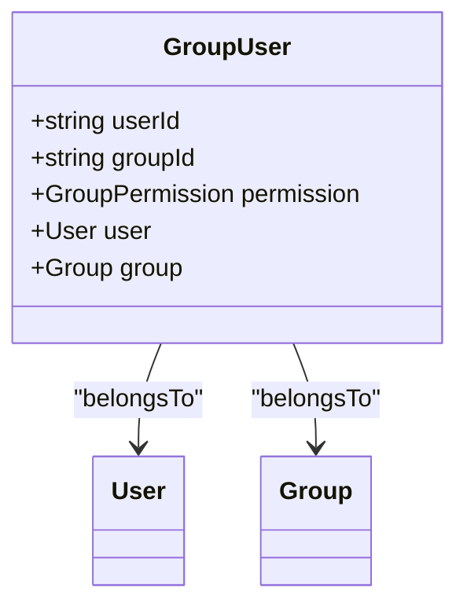
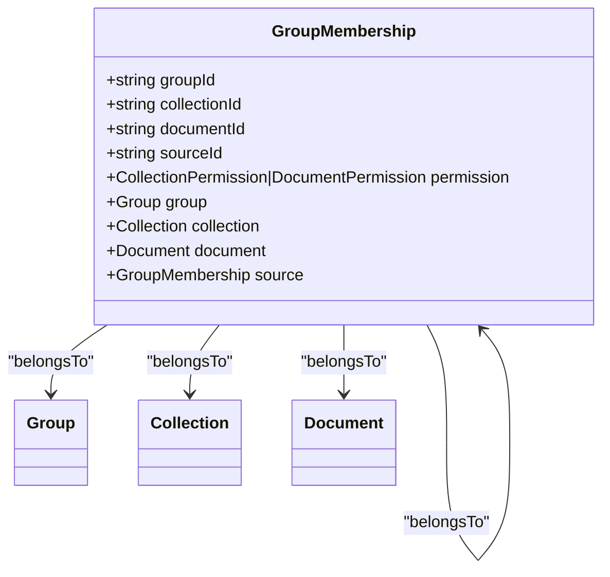
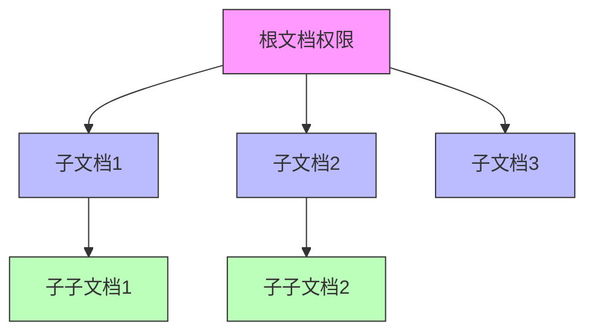
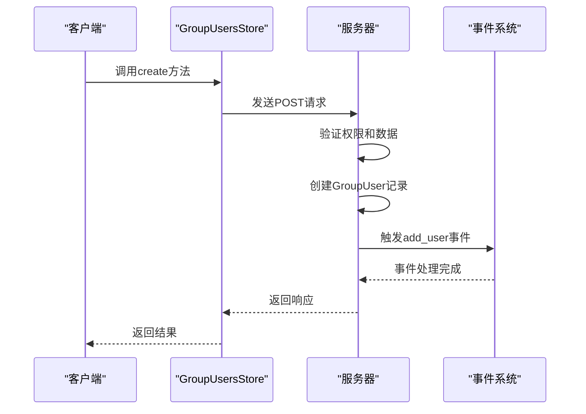
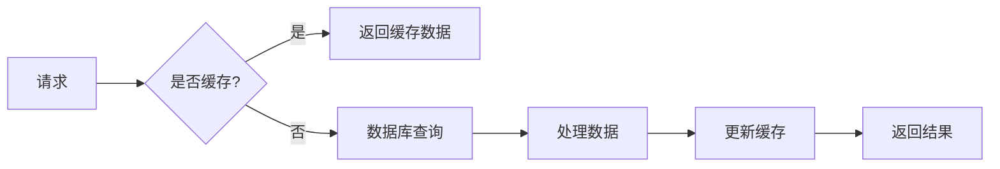
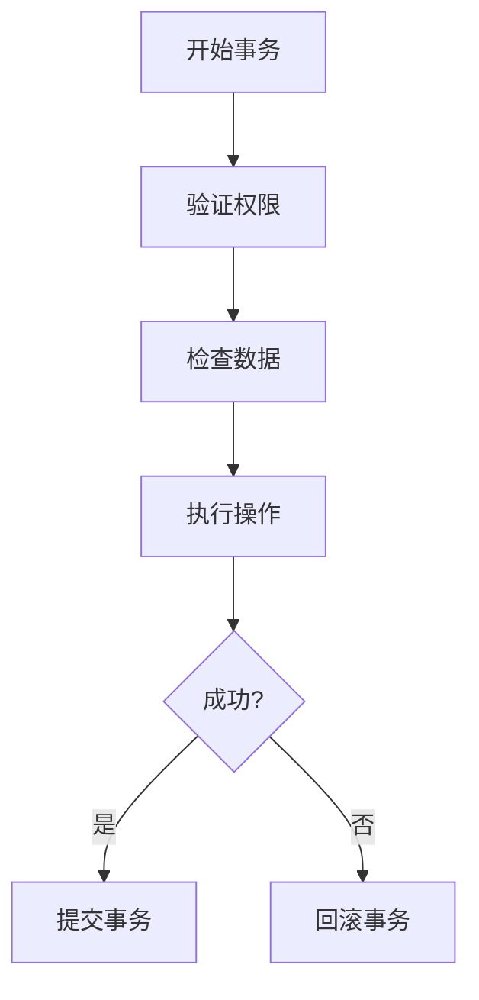

# 分组成员管理

<cite>
**本文档引用的文件**   
- [GroupUser.ts](file://app/models/GroupUser.ts)
- [GroupMembership.ts](file://app/models/GroupMembership.ts)
- [GroupUsersStore.ts](file://app/stores/GroupUsersStore.ts)
- [GroupMembershipsStore.ts](file://app/stores/GroupMembershipsStore.ts)
- [groups.ts](file://server/routes/api/groups/groups.ts)
- [groupMemberships.ts](file://server/routes/api/groupMemberships/groupMemberships.ts)
</cite>

## 目录
1. [简介](#简介)
2. [核心模型](#核心模型)
3. [成员关系管理](#成员关系管理)
4. [权限继承与覆盖](#权限继承与覆盖)
5. [事件与通知机制](#事件与通知机制)
6. [批量操作与性能优化](#批量操作与性能优化)
7. [并发控制与事务处理](#并发控制与事务处理)
8. [API调用流程](#api调用流程)
9. [初学者指南](#初学者指南)
10. [高级开发者指南](#高级开发者指南)

## 简介
本文档详细介绍了分组成员管理系统的实现机制，重点分析了GroupUser和GroupMembership模型的设计与功能。系统通过多对多关系管理用户与分组之间的关联，支持成员添加、移除、角色分配等操作。文档还涵盖了成员权限的继承和覆盖规则、成员状态管理、事件触发和通知机制等核心功能。

**Section sources**
- [GroupUser.ts](file://app/models/GroupUser.ts#L1-L35)
- [GroupMembership.ts](file://app/models/GroupMembership.ts#L1-L73)

## 核心模型

### GroupUser模型
GroupUser模型表示用户与分组之间的成员关系，包含用户ID、分组ID和成员权限等属性。该模型通过Sequelize ORM实现，支持级联删除操作。

**Diagram sources **
- [GroupUser.ts](file://app/models/GroupUser.ts#L11-L32)
- [GroupUser.ts](file://server/models/GroupUser.ts#L16-L74)

### GroupMembership模型
GroupMembership模型表示分组对集合或文档的访问权限，支持权限继承和来源追踪。该模型实现了复杂的权限管理逻辑，包括权限复制、根权限查找等功能。

**Diagram sources **
- [GroupMembership.ts](file://app/models/GroupMembership.ts#L12-L70)
- [GroupMembership.ts](file://server/models/GroupMembership.ts#L39-L430)

## 成员关系管理

### 成员添加
成员添加操作通过GroupUsersStore的create方法实现，该方法向服务器发送POST请求，将用户添加到指定分组中。系统会验证操作者的权限，并确保用户和分组的有效性。

**Section sources**
- [GroupUsersStore.ts](file://app/stores/GroupUsersStore.ts#L30-L50)
- [groups.ts](file://server/routes/api/groups/groups.ts#L339-L399)

### 成员移除
成员移除操作通过GroupUsersStore的delete方法实现，该方法向服务器发送POST请求，从指定分组中移除用户。系统会锁定相关记录以防止并发冲突，并在移除后更新缓存。

**Section sources**
- [GroupUsersStore.ts](file://app/stores/GroupUsersStore.ts#L52-L65)
- [groups.ts](file://server/routes/api/groups/groups.ts#L401-L450)

### 角色分配
角色分配操作通过GroupUsersStore的update方法实现，该方法允许修改分组成员的权限级别。系统会检查权限变更的合法性，并在必要时触发相应的事件。

**Section sources**
- [GroupUsersStore.ts](file://app/stores/GroupUsersStore.ts#L67-L88)
- [groups.ts](file://server/routes/api/groups/groups.ts#L451-L479)

## 权限继承与覆盖

### 权限继承机制
GroupMembership模型通过sourceId字段实现权限继承。当文档或集合的权限设置发生变化时，系统会自动更新所有继承该权限的子文档的权限设置。

**Diagram sources **
- [GroupMembership.ts](file://server/models/GroupMembership.ts#L300-L350)

### 权限覆盖规则
当子文档需要不同的权限设置时，可以创建独立的GroupMembership记录，覆盖继承的权限。系统会优先使用直接分配的权限，而不是继承的权限。

**Section sources**
- [GroupMembership.ts](file://server/models/GroupMembership.ts#L200-L250)

## 事件与通知机制

### 事件触发流程
当成员关系发生变化时，系统会自动触发相应的事件。这些事件包括成员添加、移除和权限更新等，通过Event模型记录并发布到消息队列中。

**Diagram sources **
- [GroupUsersStore.ts](file://app/stores/GroupUsersStore.ts#L30-L50)
- [groups.ts](file://server/routes/api/groups/groups.ts#L339-L399)

### 通知机制
系统通过WebSocket和邮件两种方式发送通知。实时通知通过WebSocket推送到客户端，而重要通知则通过邮件发送给相关人员。

**Section sources**
- [GroupUser.ts](file://server/models/GroupUser.ts#L50-L60)
- [GroupMembership.ts](file://server/models/GroupMembership.ts#L150-L180)

## 批量操作与性能优化

### 批量成员管理
系统支持批量添加和移除成员，通过优化的数据库查询和事务处理，确保批量操作的高效性和数据一致性。

**Section sources**
- [GroupUsersStore.ts](file://app/stores/GroupUsersStore.ts#L90-L120)

### 性能优化策略
系统采用多种性能优化策略，包括：
- 数据库索引优化
- 查询缓存
- 批量操作
- 异步处理

**Diagram sources **
- [GroupUsersStore.ts](file://app/stores/GroupUsersStore.ts#L10-L25)

## 并发控制与事务处理

### 并发控制
系统使用数据库行级锁和乐观锁机制来处理并发操作，确保在高并发场景下的数据一致性。

**Section sources**
- [groups.ts](file://server/routes/api/groups/groups.ts#L400-L450)

### 事务处理
所有关键操作都在数据库事务中执行，确保操作的原子性和一致性。事务失败时，系统会自动回滚所有更改。

**Diagram sources **
- [groups.ts](file://server/routes/api/groups/groups.ts#L300-L400)

## API调用流程

### 成员管理API
成员管理相关的API端点包括：
- `/groups.add_user`：添加成员
- `/groups.remove_user`：移除成员
- `/groups.update_user`：更新成员信息

**Section sources**
- [groups.ts](file://server/routes/api/groups/groups.ts#L339-L479)

### 权限管理API
权限管理相关的API端点包括：
- `/collections.add_group`：为集合添加分组权限
- `/documents.add_group`：为文档添加分组权限
- `/collections.remove_group`：移除集合的分组权限

**Section sources**
- [groupMemberships.ts](file://server/routes/api/groupMemberships/groupMemberships.ts#L50-L100)

## 初学者指南

### 基本概念
- **分组(Group)**：用户的集合，用于批量管理权限
- **成员(Member)**：属于某个分组的用户
- **权限(Permission)**：成员在分组中的角色和访问级别

### 基本操作
1. 创建分组
2. 添加成员
3. 分配权限
4. 管理成员

**Section sources**
- [GroupUser.ts](file://app/models/GroupUser.ts#L1-L35)
- [GroupMembership.ts](file://app/models/GroupMembership.ts#L1-L73)

## 高级开发者指南

### 复杂场景处理
对于复杂的成员管理场景，建议使用批量操作API，并注意处理可能的并发冲突。

### 扩展开发
开发者可以通过扩展GroupUsersStore和GroupMembershipsStore来添加自定义功能，如自定义权限验证、特殊通知等。

**Section sources**
- [GroupUsersStore.ts](file://app/stores/GroupUsersStore.ts#L1-L123)
- [GroupMembershipsStore.ts](file://app/stores/GroupMembershipsStore.ts#L1-L159)