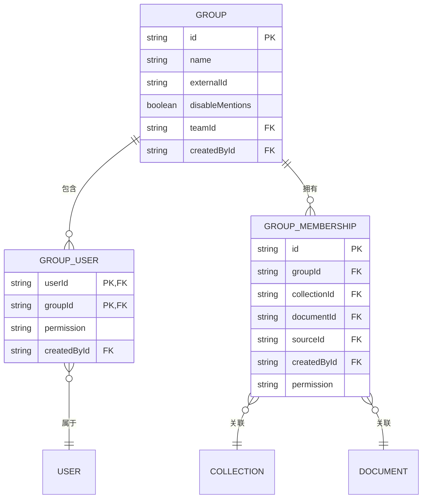

# 分组管理

<cite>
**本文档中引用的文件**   
- [Group.ts](file://app/models/Group.ts)
- [GroupMembership.ts](file://app/models/GroupMembership.ts)
- [GroupUser.ts](file://app/models/GroupUser.ts)
- [Group.ts](file://server/models/Group.ts)
- [GroupMembership.ts](file://server/models/GroupMembership.ts)
- [GroupUser.ts](file://server/models/GroupUser.ts)
- [GroupsStore.ts](file://app/stores/GroupsStore.ts)
- [GroupMembershipsStore.ts](file://app/stores/GroupMembershipsStore.ts)
- [GroupUsersStore.ts](file://app/stores/GroupUsersStore.ts)
</cite>

## 目录
1. [简介](#简介)
2. [分组数据模型](#分组数据模型)
3. [分组成员与权限](#分组成员与权限)
4. [分组与权限控制](#分组与权限控制)
5. [分组操作](#分组操作)
6. [实体关系图](#实体关系图)

## 简介
分组管理是团队协作系统中的核心功能，用于组织和管理团队内的用户。通过分组，可以简化权限分配，提高管理效率。本文档详细介绍了分组管理的数据模型，包括`Group`、`GroupMembership`和`GroupUser`模型的实现，以及分组在团队内的组织作用。

## 分组数据模型

分组数据模型主要包括`Group`、`GroupMembership`和`GroupUser`三个核心模型。`Group`模型表示一个分组，包含分组名称、外部ID、禁用提及等属性。`GroupMembership`模型表示分组与集合或文档的权限关系，而`GroupUser`模型则表示用户与分组的成员关系。

**Section sources**
- [Group.ts](file://app/models/Group.ts#L7-L85)
- [Group.ts](file://server/models/Group.ts#L21-L106)

## 分组成员与权限

分组成员通过`GroupUser`模型与分组关联，每个成员在分组中具有特定的权限级别。分组成员的权限管理通过`GroupUser`模型的`permission`字段实现，该字段定义了成员在分组中的角色，如管理员或普通成员。

**Section sources**
- [GroupUser.ts](file://app/models/GroupUser.ts#L11-L32)
- [GroupUser.ts](file://server/models/GroupUser.ts#L16-L74)
- [GroupUsersStore.ts](file://app/stores/GroupUsersStore.ts#L14-L122)

## 分组与权限控制

分组在权限控制中扮演着重要角色。通过`GroupMembership`模型，可以将分组的权限分配给特定的集合或文档。这种机制允许通过分组简化团队内的权限分配，确保只有授权的用户才能访问特定资源。

**Section sources**
- [GroupMembership.ts](file://app/models/GroupMembership.ts#L12-L70)
- [GroupMembership.ts](file://server/models/GroupMembership.ts#L39-L430)
- [GroupMembershipsStore.ts](file://app/stores/GroupMembershipsStore.ts#L13-L158)

## 分组操作

分组的创建、更新和删除操作通过相应的API端点实现。创建分组时，需要指定分组名称和团队ID。更新分组时，可以修改分组名称、外部ID或禁用提及属性。删除分组时，系统会自动清理相关的成员关系和权限分配。

**Section sources**
- [GroupsStore.ts](file://app/stores/GroupsStore.ts#L1-L111)
- [GroupMembershipsStore.ts](file://app/stores/GroupMembershipsStore.ts#L13-L158)
- [GroupUsersStore.ts](file://app/stores/GroupUsersStore.ts#L14-L122)

## 实体关系图

**Diagram sources **
- [Group.ts](file://server/models/Group.ts#L21-L106)
- [GroupUser.ts](file://server/models/GroupUser.ts#L16-L74)
- [GroupMembership.ts](file://server/models/GroupMembership.ts#L39-L430)