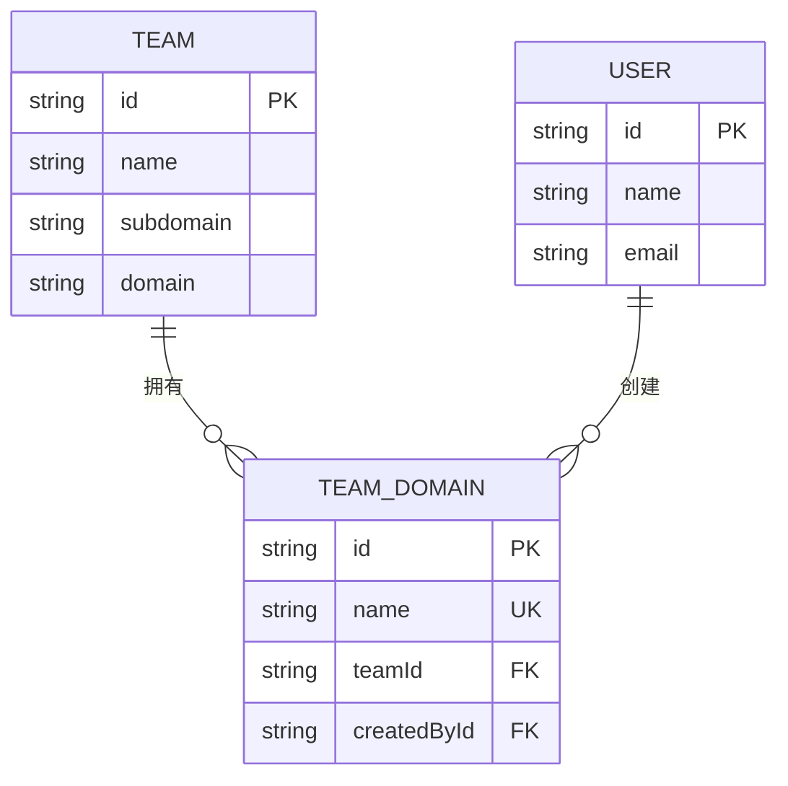
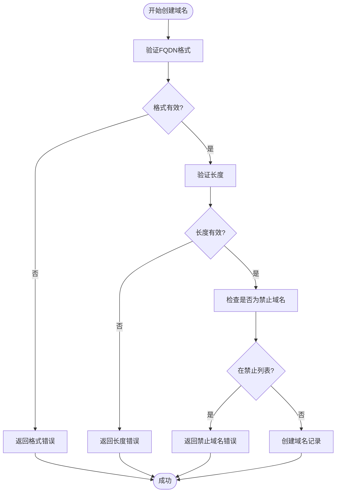
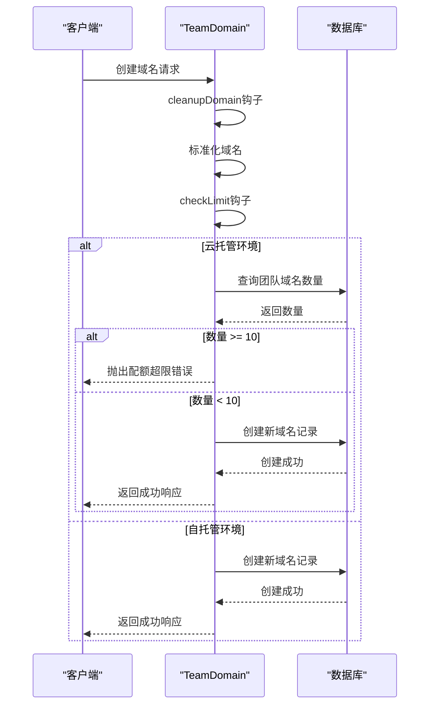

# 团队域名管理

<cite>
**本文档中引用的文件**  
- [TeamDomain.ts](file://server/models/TeamDomain.ts)
- [Team.ts](file://server/models/Team.ts)
- [IsFQDN.ts](file://server/models/validators/IsFQDN.ts)
- [Length.ts](file://server/models/validators/Length.ts)
- [validations.ts](file://shared/validations.ts)
- [domains.ts](file://shared/utils/domains.ts)
- [20220419052832-create-team-domains.js](file://server/migrations/20220419052832-create-team-domains.js)
</cite>

## 目录
1. [简介](#简介)
2. [核心模型与关联](#核心模型与关联)
3. [域名验证规则](#域名验证规则)
4. [生命周期钩子](#生命周期钩子)
5. [团队访问策略](#团队访问策略)
6. [操作与配额管理](#操作与配额管理)
7. [高级交互逻辑](#高级交互逻辑)

## 简介
本文档详细阐述了团队域名管理系统的实现机制，重点介绍 `TeamDomain` 模型及其与 `Team` 模型的关联。文档涵盖了域名验证、生命周期管理、访问控制策略以及在云托管环境下的配额限制等核心功能，为开发者提供全面的技术参考。

## 核心模型与关联
`TeamDomain` 模型用于管理团队允许的用户邮箱域名，实现基于域名的访问控制。该模型通过外键与 `Team` 和 `User` 模型建立关联，记录域名的创建者和所属团队。

**Diagram sources**
- [TeamDomain.ts](file://server/models/TeamDomain.ts#L22-L76)
- [Team.ts](file://server/models/Team.ts#L54-L473)

**Section sources**
- [TeamDomain.ts](file://server/models/TeamDomain.ts#L22-L76)
- [Team.ts](file://server/models/Team.ts#L54-L473)

## 域名验证规则
`TeamDomain` 模型的 `name` 字段（即域名）受到严格的验证规则约束，确保数据的准确性和安全性。

### 验证规则详情
- **FQDN格式检查**：使用 `@IsFQDN` 装饰器，通过 `class-validator` 库的 `isFQDN` 函数验证域名是否为完全限定域名。
- **长度限制**：使用 `@Length` 装饰器，限制域名长度不超过255个字符。
- **禁止域名列表**：使用 `@NotIn` 装饰器，在云托管环境下禁止使用 `email-providers` 包中列出的公共邮箱域名（如 `gmail.com`）。

**Diagram sources**
- [TeamDomain.ts](file://server/models/TeamDomain.ts#L28-L36)
- [IsFQDN.ts](file://server/models/validators/IsFQDN.ts#L6-L16)
- [Length.ts](file://server/models/validators/Length.ts#L7-L26)
- [validations.ts](file://shared/validations.ts#L93-L93)

**Section sources**
- [TeamDomain.ts](file://server/models/TeamDomain.ts#L28-L36)

## 生命周期钩子
`TeamDomain` 模型定义了两个关键的生命周期钩子，分别在验证前和创建前执行。

### cleanupDomain (域名标准化)
此钩子在 `@BeforeValidate` 阶段执行，负责对域名进行标准化处理：
- 将域名转换为小写
- 去除首尾空格
此操作确保了域名的唯一性和一致性，避免因大小写或空格导致的重复。

### checkLimit (域名数量限制)
此钩子在 `@BeforeCreate` 阶段执行，仅在云托管环境下生效：
- 查询当前团队已拥有的域名数量
- 与 `TeamValidation.maxDomains`（默认为10）进行比较
- 若超过限制，则抛出 `ValidationError`
该机制有效防止了资源滥用，确保了服务的公平性。

**Diagram sources**
- [TeamDomain.ts](file://server/models/TeamDomain.ts#L54-L75)

**Section sources**
- [TeamDomain.ts](file://server/models/TeamDomain.ts#L54-L75)

## 团队访问策略
`Team` 模型通过 `allowedDomains` 关联和 `isDomainAllowed` 方法实现基于域名的访问控制。

### isDomainAllowed 方法
该方法用于判断一个邮箱或域名是否被允许加入团队：
1. 接收邮箱或域名作为输入
2. 如果输入是邮箱，则解析出其域名部分
3. 从数据库加载该团队关联的所有 `TeamDomain` 记录
4. 检查解析出的域名是否存在于 `allowedDomains` 列表中
5. 如果列表为空（即未设置域名限制），则默认允许所有用户加入

此方法是实现企业级单点登录（SSO）和域内协作的核心逻辑。

**Section sources**
- [Team.ts](file://server/models/Team.ts#L282-L328)

## 操作与配额管理
系统提供了对团队域名的创建、删除和查询操作，并在云托管环境下实施了严格的配额管理。

### 创建与查询
- **创建**：通过 `TeamDomain.create()` 方法，传入 `teamId`、`name` 和 `createdById`。
- **查询**：利用 `Team` 模型的 `withDomains` 作用域，通过 `include` 选项一次性加载团队及其关联的域名。

### 云托管配额
在云托管环境中，每个团队最多只能拥有10个域名（由 `TeamValidation.maxDomains` 定义）。此限制通过 `checkLimit` 钩子强制执行，旨在平衡资源使用和用户体验。

**Section sources**
- [TeamDomain.ts](file://server/models/TeamDomain.ts#L54-L75)
- [Team.ts](file://server/models/Team.ts#L54-L473)

## 高级交互逻辑
`TeamDomain` 模型的实现还涉及与其他系统的交互。

### 与团队共享（Share）模型的交互
虽然 `TeamDomain` 主要用于用户访问控制，但其设计与 `Share` 模型有相似之处。`Share` 模型也使用域名进行访问控制，但其 `checkDomain` 钩子会检查域名是否已被其他分享链接占用，以避免冲突。

### 历史记录与迁移
数据库迁移文件 `20220419052832-create-team-domains.js` 负责创建 `team_domains` 表，并处理从旧的环境变量 `ALLOWED_DOMAINS` 迁移数据的逻辑，确保了系统的平滑升级。

**Section sources**
- [TeamDomain.ts](file://server/models/TeamDomain.ts#L22-L76)
- [20220419052832-create-team-domains.js](file://server/migrations/20220419052832-create-team-domains.js#L0-L100)