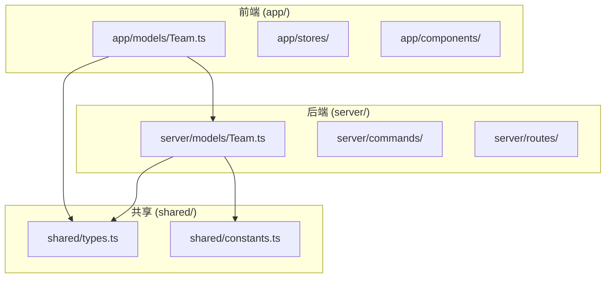
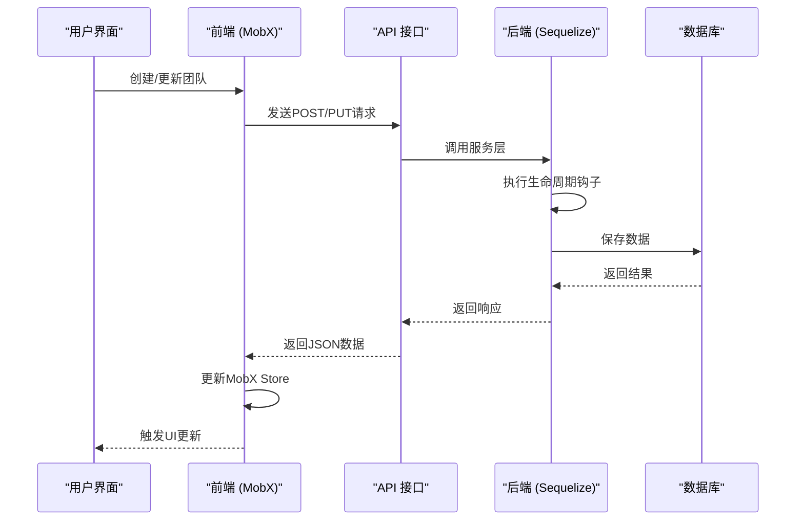
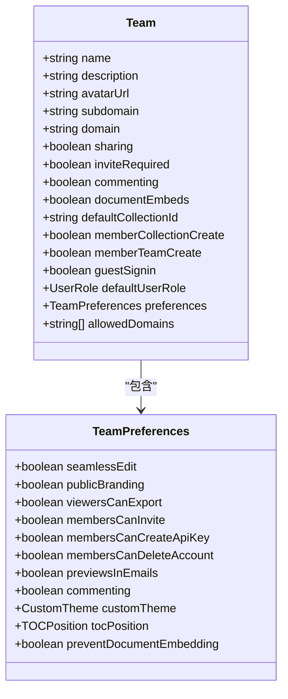
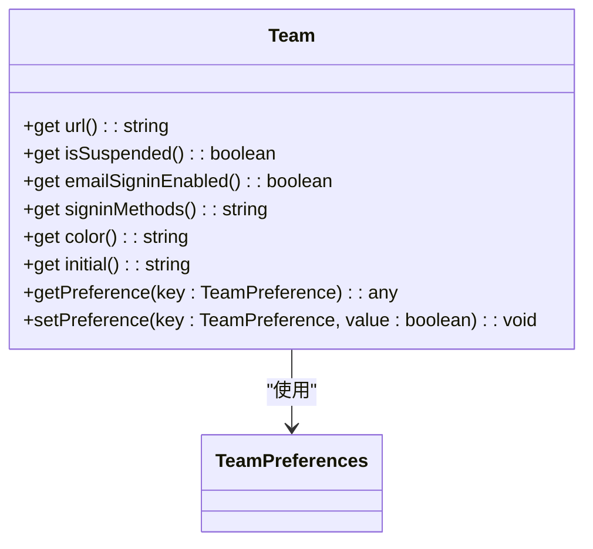
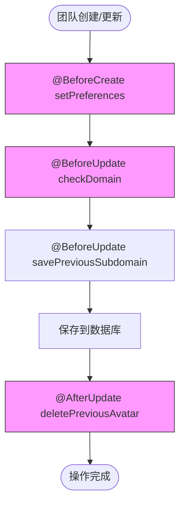
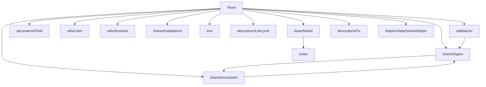

# 团队基本信息管理

<cite>
**本文档中引用的文件**  
- [Team.ts](file://app/models/Team.ts)
- [Team.ts](file://server/models/Team.ts)
- [types.ts](file://shared/types.ts)
- [constants.ts](file://shared/constants.ts)
- [TeamDomain.ts](file://server/models/TeamDomain.ts)
</cite>

## 目录
1. [简介](#简介)
2. [项目结构](#项目结构)
3. [核心组件](#核心组件)
4. [架构概述](#架构概述)
5. [详细组件分析](#详细组件分析)
6. [依赖关系分析](#依赖关系分析)
7. [性能考虑](#性能考虑)
8. [故障排除指南](#故障排除指南)
9. [结论](#结论)

## 简介
本文档详细介绍了团队基本信息管理系统的实现，重点围绕`Team`模型的设计与功能展开。系统通过前后端协同工作，实现了团队属性的存储、验证、生命周期管理以及数据同步机制。前端使用MobX实现响应式数据管理，后端通过Sequelize进行数据库操作和业务逻辑处理。文档涵盖了团队核心属性、设置方法、关联关系、生命周期钩子以及前后端数据同步等关键方面，为开发者提供了全面的技术参考。

## 项目结构
项目采用分层架构，前端代码位于`app/`目录，后端代码位于`server/`目录，共享类型定义位于`shared/`目录。`Team`模型在前后端均有定义，前端模型位于`app/models/Team.ts`，后端模型位于`server/models/Team.ts`，共享的类型和常量定义位于`shared/types.ts`和`shared/constants.ts`。



**Diagram sources**
- [app/models/Team.ts](file://app/models/Team.ts)
- [server/models/Team.ts](file://server/models/Team.ts)
- [shared/types.ts](file://shared/types.ts)
- [shared/constants.ts](file://shared/constants.ts)

**Section sources**
- [app/models/Team.ts](file://app/models/Team.ts)
- [server/models/Team.ts](file://server/models/Team.ts)
- [shared/types.ts](file://shared/types.ts)
- [shared/constants.ts](file://shared/constants.ts)

## 核心组件
`Team`模型是团队信息管理的核心，它定义了团队的所有属性、行为和业务规则。该模型在前后端保持一致的接口，通过`TeamPreferences`和`TeamPreferenceDefaults`等共享类型和常量来确保配置的一致性。

**Section sources**
- [app/models/Team.ts](file://app/models/Team.ts#L7-L121)
- [server/models/Team.ts](file://server/models/Team.ts#L54-L473)
- [shared/types.ts](file://shared/types.ts#L270-L319)
- [shared/constants.ts](file://shared/constants.ts#L30-L44)

## 架构概述
系统采用典型的前后端分离架构。前端通过API与后端通信，后端处理业务逻辑并与数据库交互。`Team`模型在前端负责状态管理和UI响应，在后端负责数据验证、持久化和业务规则执行。



**Diagram sources**
- [app/models/Team.ts](file://app/models/Team.ts)
- [server/models/Team.ts](file://server/models/Team.ts)
- [app/models/base/Model.ts](file://app/models/base/Model.ts)

## 详细组件分析

### Team模型属性分析
`Team`模型定义了团队的核心属性，包括名称、描述、图标、子域名等。这些属性在前后端模型中保持一致。



**Diagram sources**
- [app/models/Team.ts](file://app/models/Team.ts#L7-L121)
- [shared/types.ts](file://shared/types.ts#L270-L319)

#### 属性验证规则
后端`Team`模型使用Sequelize的验证装饰器对属性进行严格验证：
- **名称 (name)**: 长度在1到100字符之间，不能为空，不能包含URL。
- **子域名 (subdomain)**: 必须为小写字母、数字和连字符，长度在3到63字符之间，不能使用保留字。
- **自定义域名 (domain)**: 必须是有效的完全限定域名(FQDN)，且全局唯一。
- **头像URL (avatarUrl)**: 必须是有效的URL或相对路径，长度不超过4096字符。
- **默认用户角色 (defaultUserRole)**: 必须是`viewer`或`member`之一。

**Section sources**
- [server/models/Team.ts](file://server/models/Team.ts#L54-L150)

#### 设置方法分析
`Team`模型提供了一系列getter方法来计算和返回团队的派生属性：



**Diagram sources**
- [app/models/Team.ts](file://app/models/Team.ts#L76-L123)
- [server/models/Team.ts](file://server/models/Team.ts#L240-L260)

- **url**: 根据团队是否配置了自定义域名或子域名，动态生成团队的访问URL。
- **isSuspended**: 通过检查`suspendedAt`时间戳是否为空来判断团队是否被暂停。
- **emailSigninEnabled**: 判断是否启用了邮箱登录，需同时满足`guestSignin`为true且环境变量`EMAIL_ENABLED`为true。
- **signinMethods**: 返回当前支持的登录方式，目前固定返回"SSO"。
- **color**: 基于团队ID生成一个唯一的颜色值，用于UI显示。
- **initial**: 返回团队名称的首字母大写形式，用于头像占位符。

**Section sources**
- [app/models/Team.ts](file://app/models/Team.ts#L76-L123)
- [server/models/Team.ts](file://server/models/Team.ts#L240-L260)

### 关联关系分析
`Team`模型通过`HasMany`关系与其他核心实体建立关联，形成一个以团队为中心的数据结构。

```mermaid
erDiagram
TEAM ||--o{ COLLECTION : "拥有"
TEAM ||--o{ DOCUMENT : "拥有"
TEAM ||--o{ USER : "拥有"
TEAM ||--o{ AUTHENTICATION_PROVIDER : "拥有"
TEAM ||--o{ TEAM_DOMAIN : "拥有"
class TEAM {
id
name
subdomain
}
class COLLECTION {
id
name
teamId
}
class DOCUMENT {
id
title
teamId
}
class USER {
id
name
teamId
}
class AUTHENTICATION_PROVIDER {
id
name
teamId
}
class TEAM_DOMAIN {
id
name
teamId
}
```

**Diagram sources**
- [server/models/Team.ts](file://server/models/Team.ts#L330-L370)

- **HasMany Collections**: 一个团队可以拥有多个集合，这是团队内容组织的基础。
- **HasMany Documents**: 一个团队可以拥有多个文档，这些文档可以属于不同的集合。
- **HasMany Users**: 一个团队可以拥有多个用户，用户是团队的成员。
- **HasMany AuthenticationProviders**: 一个团队可以配置多个身份验证提供商，如Google、GitHub等。
- **HasMany TeamDomain**: 一个团队可以绑定多个自定义域名，用于团队访问。

**Section sources**
- [server/models/Team.ts](file://server/models/Team.ts#L330-L370)

### 生命周期钩子分析
`Team`模型在创建和更新时会触发一系列生命周期钩子，用于执行特定的业务逻辑。



**Diagram sources**
- [server/models/Team.ts](file://server/models/Team.ts#L372-L437)

- **BeforeCreate**: 在团队创建前执行，主要逻辑是为新团队设置默认偏好（如允许成员邀请）和初始化`lastActiveAt`时间戳。
- **BeforeUpdate**: 在团队更新前执行，包含两个钩子：
  - `checkDomain`: 验证自定义域名是否已被其他团队使用，防止冲突。
  - `savePreviousSubdomain`: 将旧的子域名保存到`previousSubdomains`数组中，最多保留3个历史子域名。
- **AfterUpdate**: 在团队更新后执行，`deletePreviousAvatar`钩子会检查头像URL是否发生变化，如果变化则安排删除旧的头像附件。

**Section sources**
- [server/models/Team.ts](file://server/models/Team.ts#L372-L437)

## 依赖关系分析
`Team`模型依赖于多个其他模块和组件，形成了一个复杂的依赖网络。



**Diagram sources**
- [app/models/Team.ts](file://app/models/Team.ts)
- [server/models/Team.ts](file://server/models/Team.ts)

**Section sources**
- [app/models/Team.ts](file://app/models/Team.ts)
- [server/models/Team.ts](file://server/models/Team.ts)

## 性能考虑
- **lastActiveAt更新**: `updateActiveAt`方法通过限制更新频率（至少5分钟一次）来避免频繁的数据库写入。
- **缓存机制**: `collectionIds`方法可以利用缓存来避免重复查询数据库。
- **批量操作**: 在删除团队时，后端命令会批量删除相关联的数据，提高效率。

## 故障排除指南
- **团队无法创建**: 检查团队名称、子域名或自定义域名是否违反了验证规则。
- **头像未更新**: 确认旧头像是否被正确删除，检查`deletePreviousAvatar`钩子是否正常执行。
- **域名冲突**: 当更新自定义域名时，如果提示"Domain is already in use"，说明该域名已被其他团队使用。
- **子域名历史丢失**: 检查`previousSubdomains`数组的长度，确保不超过3个历史记录。

**Section sources**
- [server/models/Team.ts](file://server/models/Team.ts#L372-L437)
- [server/commands/teamPermanentDeleter.ts](file://server/commands/teamPermanentDeleter.ts)

## 结论
团队基本信息管理系统通过精心设计的`Team`模型，实现了对团队核心属性的全面管理。系统利用前后端分离架构，结合MobX的响应式特性和Sequelize的强大ORM功能，确保了数据的一致性和业务逻辑的健壮性。生命周期钩子和关联关系的设计使得团队的创建、更新和删除操作能够自动处理复杂的业务规则和数据一致性。该设计为团队协作平台提供了坚实的基础，同时也为未来的功能扩展留下了良好的接口。