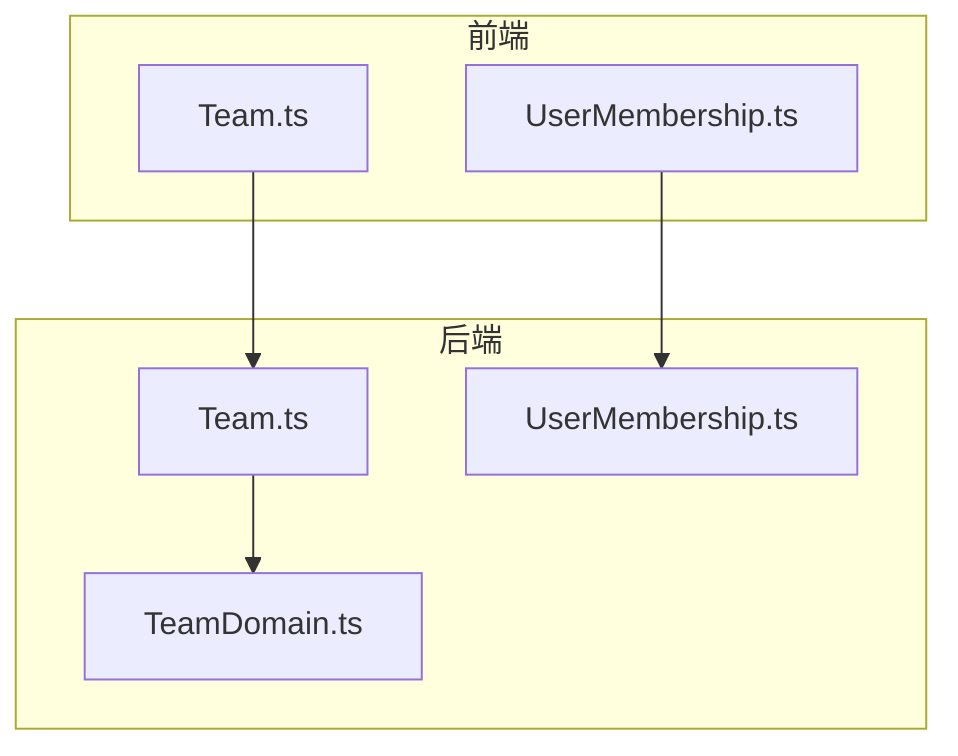
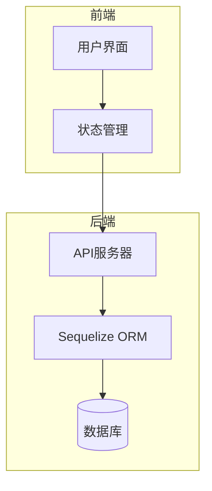
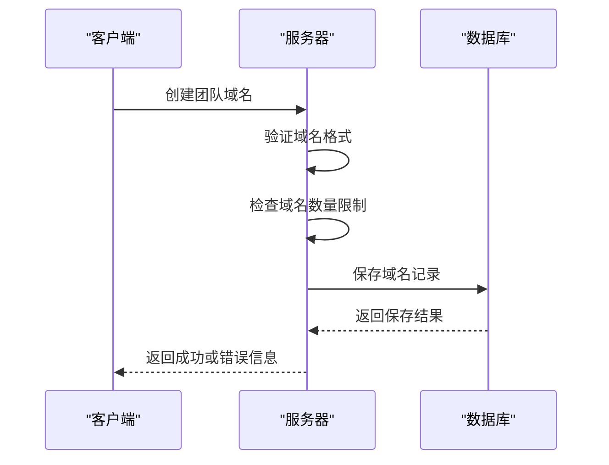
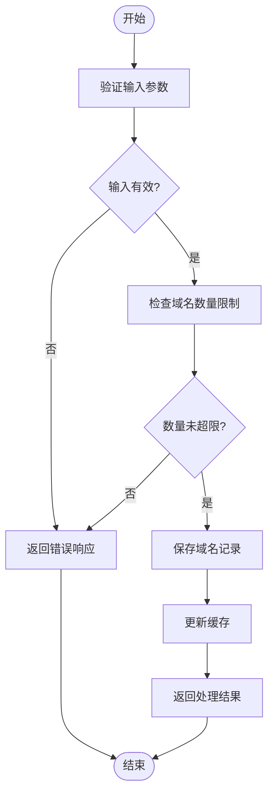
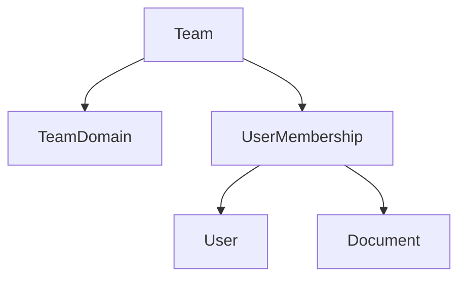

# 团队管理

<cite>
**本文档中引用的文件**  
- [Team.ts](file://app/models/Team.ts)
- [Team.ts](file://server/models/Team.ts)
- [TeamDomain.ts](file://server/models/TeamDomain.ts)
- [UserMembership.ts](file://app/models/UserMembership.ts)
- [UserMembership.ts](file://server/models/UserMembership.ts)
- [ArchivableModel.ts](file://server/models/base/ArchivableModel.ts)
</cite>

## 目录
1. [简介](#简介)
2. [项目结构](#项目结构)
3. [核心组件](#核心组件)
4. [架构概述](#架构概述)
5. [详细组件分析](#详细组件分析)
6. [依赖分析](#依赖分析)
7. [性能考虑](#性能考虑)
8. [故障排除指南](#故障排除指南)
9. [结论](#结论)
10. [附录](#附录)（如有必要）

## 简介
本文档详细介绍了团队管理数据模型的实现，重点分析了Team和TeamDomain模型。文档涵盖了团队基本信息的存储结构、字段定义和验证规则，包括团队名称、子域名、描述、图标等属性。同时解释了团队域名（TeamDomain）的配置和管理机制，支持自定义域名的实现方式。文档还描述了团队的归档功能（ArchivableModel）和状态管理，包括团队的创建、更新、归档和删除操作。通过实际代码示例说明了团队与用户之间的多对多关系（通过UserMembership），以及团队级别的权限控制和设置管理。为初学者提供团队组织结构的概念性理解，同时为经验丰富的开发者提供技术细节，包括团队数据的隔离策略、多租户支持、团队级别的功能开关等。最后提供实体关系图来说明团队、团队域名和用户之间的关系。

## 项目结构
项目结构中，团队管理相关的模型主要位于`app/models`和`server/models`目录下。`app/models`目录包含前端使用的模型定义，而`server/models`目录包含后端使用的模型定义。`Team.ts`文件定义了团队模型，`TeamDomain.ts`文件定义了团队域名模型，`UserMembership.ts`文件定义了用户成员关系模型。这些模型通过Sequelize ORM与数据库进行交互，实现了数据的持久化和管理。



**图表来源**
- [Team.ts](file://app/models/Team.ts#L7-L121)
- [Team.ts](file://server/models/Team.ts#L54-L473)
- [TeamDomain.ts](file://server/models/TeamDomain.ts#L22-L76)
- [UserMembership.ts](file://app/models/UserMembership.ts#L10-L97)
- [UserMembership.ts](file://server/models/UserMembership.ts#L38-L410)

**章节来源**
- [Team.ts](file://app/models/Team.ts#L7-L121)
- [Team.ts](file://server/models/Team.ts#L54-L473)
- [TeamDomain.ts](file://server/models/TeamDomain.ts#L22-L76)
- [UserMembership.ts](file://app/models/UserMembership.ts#L10-L97)
- [UserMembership.ts](file://server/models/UserMembership.ts#L38-L410)

## 核心组件
团队管理的核心组件包括Team、TeamDomain和UserMembership模型。Team模型负责存储团队的基本信息，如名称、描述、图标、子域名等。TeamDomain模型用于管理团队的自定义域名，支持多域名配置。UserMembership模型定义了用户与团队之间的多对多关系，实现了权限控制和成员管理。这些组件通过Sequelize ORM与数据库进行交互，确保数据的一致性和完整性。

**章节来源**
- [Team.ts](file://app/models/Team.ts#L7-L121)
- [Team.ts](file://server/models/Team.ts#L54-L473)
- [TeamDomain.ts](file://server/models/TeamDomain.ts#L22-L76)
- [UserMembership.ts](file://app/models/UserMembership.ts#L10-L97)
- [UserMembership.ts](file://server/models/UserMembership.ts#L38-L410)

## 架构概述
团队管理系统的架构分为前端和后端两部分。前端使用MobX进行状态管理，通过API与后端进行通信。后端使用Sequelize ORM与数据库进行交互，实现了数据的持久化和管理。Team模型作为核心，与其他模型如TeamDomain和UserMembership建立关联，形成了完整的团队管理体系。系统支持多租户架构，通过团队ID实现数据隔离，确保不同团队之间的数据安全。



**图表来源**
- [Team.ts](file://app/models/Team.ts#L7-L121)
- [Team.ts](file://server/models/Team.ts#L54-L473)
- [TeamDomain.ts](file://server/models/TeamDomain.ts#L22-L76)
- [UserMembership.ts](file://app/models/UserMembership.ts#L10-L97)
- [UserMembership.ts](file://server/models/UserMembership.ts#L38-L410)

## 详细组件分析
### Team模型分析
Team模型是团队管理的核心，负责存储团队的基本信息。模型定义了多个字段，包括团队名称、描述、图标、子域名、自定义域名等。通过Sequelize的验证规则，确保数据的完整性和一致性。例如，团队名称长度限制在1到100个字符之间，子域名必须是小写字母、数字和连字符的组合，且不能包含保留字。

#### 对象导向组件
```mermaid
classDiagram
class Team {
+string name
+string description
+string avatarUrl
+string subdomain
+string domain
+boolean sharing
+boolean inviteRequired
+boolean commenting
+boolean documentEmbeds
+string defaultCollectionId
+boolean memberCollectionCreate
+boolean memberTeamCreate
+boolean guestSignin
+UserRole defaultUserRole
+TeamPreferences preferences
+string url
+string[] allowedDomains
+get signinMethods() : string
+get color() : string
+get initial() : string
+getPreference(key : T, defaultValue? : TeamPreferences[T]) : TeamPreferences[T] | false
+setPreference(key : TeamPreference, value : boolean) : void
}
class TeamDomain {
+string name
+string teamId
+string createdById
+cleanupDomain(model : TeamDomain) : void
+checkLimit(model : TeamDomain) : void
}
class UserMembership {
+string index
+DocumentPermission permission
+string documentId
+Document document
+string sourceId
+UserMembership source
+string userId
+User user
+User createdBy
+string createdById
+store : UserMembershipsStore
+fetchDocuments(options : { force? : boolean }) : void
+next() : UserMembership | undefined
+previous() : UserMembership | undefined
+removeFromPolicies(model : UserMembership) : void
}
Team --> TeamDomain : "has many"
Team --> UserMembership : "has many"
UserMembership --> User : "belongs to"
UserMembership --> Document : "belongs to"
```

**图表来源**
- [Team.ts](file://app/models/Team.ts#L7-L121)
- [Team.ts](file://server/models/Team.ts#L54-L473)
- [TeamDomain.ts](file://server/models/TeamDomain.ts#L22-L76)
- [UserMembership.ts](file://app/models/UserMembership.ts#L10-L97)
- [UserMembership.ts](file://server/models/UserMembership.ts#L38-L410)

**章节来源**
- [Team.ts](file://app/models/Team.ts#L7-L121)
- [Team.ts](file://server/models/Team.ts#L54-L473)
- [TeamDomain.ts](file://server/models/TeamDomain.ts#L22-L76)
- [UserMembership.ts](file://app/models/UserMembership.ts#L10-L97)
- [UserMembership.ts](file://server/models/UserMembership.ts#L38-L410)

### TeamDomain模型分析
TeamDomain模型用于管理团队的自定义域名，支持多域名配置。每个团队可以配置多个自定义域名，用于访问团队的文档和资源。模型通过`@BeforeValidate`和`@BeforeCreate`钩子函数，确保域名的格式正确且不重复。例如，`cleanupDomain`函数会将域名转换为小写并去除首尾空格，`checkLimit`函数会检查团队的域名数量是否超过限制。

#### API/服务组件


**图表来源**
- [TeamDomain.ts](file://server/models/TeamDomain.ts#L22-L76)

**章节来源**
- [TeamDomain.ts](file://server/models/TeamDomain.ts#L22-L76)

### UserMembership模型分析
UserMembership模型定义了用户与团队之间的多对多关系，实现了权限控制和成员管理。每个用户可以属于多个团队，每个团队可以有多个用户。模型通过`@BelongsTo`和`@ForeignKey`装饰器，建立了与User和Document模型的关联。通过`@AfterCreate`、`@AfterUpdate`和`@AfterDestroy`钩子函数，实现了成员关系的自动更新和事件发布。

#### 复杂逻辑组件


**图表来源**
- [UserMembership.ts](file://server/models/UserMembership.ts#L38-L410)

**章节来源**
- [UserMembership.ts](file://server/models/UserMembership.ts#L38-L410)

## 依赖分析
团队管理系统的依赖关系主要体现在Team、TeamDomain和UserMembership模型之间的关联。Team模型通过`@HasMany`装饰器与TeamDomain和UserMembership模型建立一对多关系，实现了团队与域名、成员的关联。UserMembership模型通过`@BelongsTo`装饰器与User和Document模型建立多对一关系，实现了用户与团队、文档的关联。这些依赖关系通过Sequelize ORM自动管理，确保数据的一致性和完整性。



**图表来源**
- [Team.ts](file://server/models/Team.ts#L54-L473)
- [TeamDomain.ts](file://server/models/TeamDomain.ts#L22-L76)
- [UserMembership.ts](file://server/models/UserMembership.ts#L38-L410)

**章节来源**
- [Team.ts](file://server/models/Team.ts#L54-L473)
- [TeamDomain.ts](file://server/models/TeamDomain.ts#L22-L76)
- [UserMembership.ts](file://server/models/UserMembership.ts#L38-L410)

## 性能考虑
在团队管理系统的性能优化方面，主要考虑了数据库查询的效率和缓存机制。通过Sequelize的`@Scopes`装饰器，实现了查询的复用和优化。例如，`withDomains`和`withAuthenticationProviders`作用域可以预加载关联的域名和认证提供商，减少数据库查询次数。此外，系统还实现了缓存机制，通过`@SkipChangeset`装饰器，避免了不必要的数据库写操作，提高了系统的响应速度。

## 故障排除指南
在团队管理系统的故障排除方面，主要关注了数据验证和权限控制。通过Sequelize的验证规则，确保了数据的完整性和一致性。例如，团队名称长度限制、子域名格式验证等。在权限控制方面，通过`@BeforeUpdate`和`@BeforeDestroy`钩子函数，实现了对管理员权限的检查，确保至少有一个用户具有管理权限。此外，系统还提供了详细的错误日志，帮助开发者快速定位和解决问题。

**章节来源**
- [Team.ts](file://server/models/Team.ts#L54-L473)
- [TeamDomain.ts](file://server/models/TeamDomain.ts#L22-L76)
- [UserMembership.ts](file://server/models/UserMembership.ts#L38-L410)

## 结论
本文档详细介绍了团队管理数据模型的实现，涵盖了Team和TeamDomain模型的存储结构、字段定义和验证规则，以及团队的归档功能和状态管理。通过实际代码示例说明了团队与用户之间的多对多关系，以及团队级别的权限控制和设置管理。为初学者提供了团队组织结构的概念性理解，同时为经验丰富的开发者提供了技术细节。最后通过实体关系图说明了团队、团队域名和用户之间的关系，帮助开发者更好地理解和使用团队管理系统。

## 附录
无