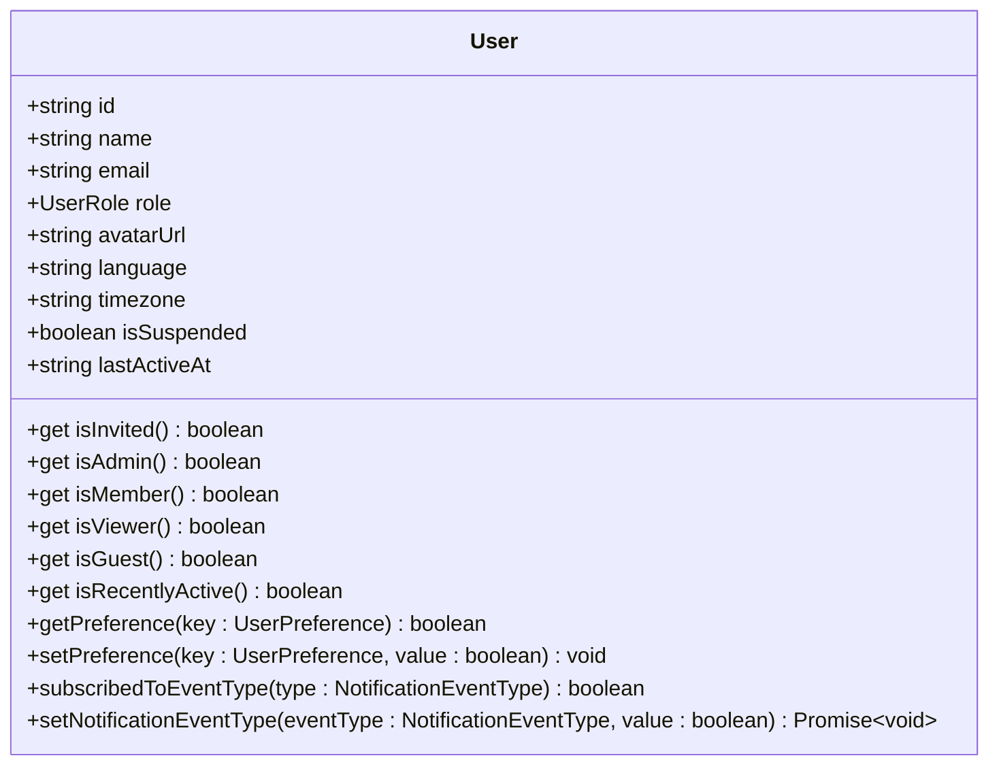
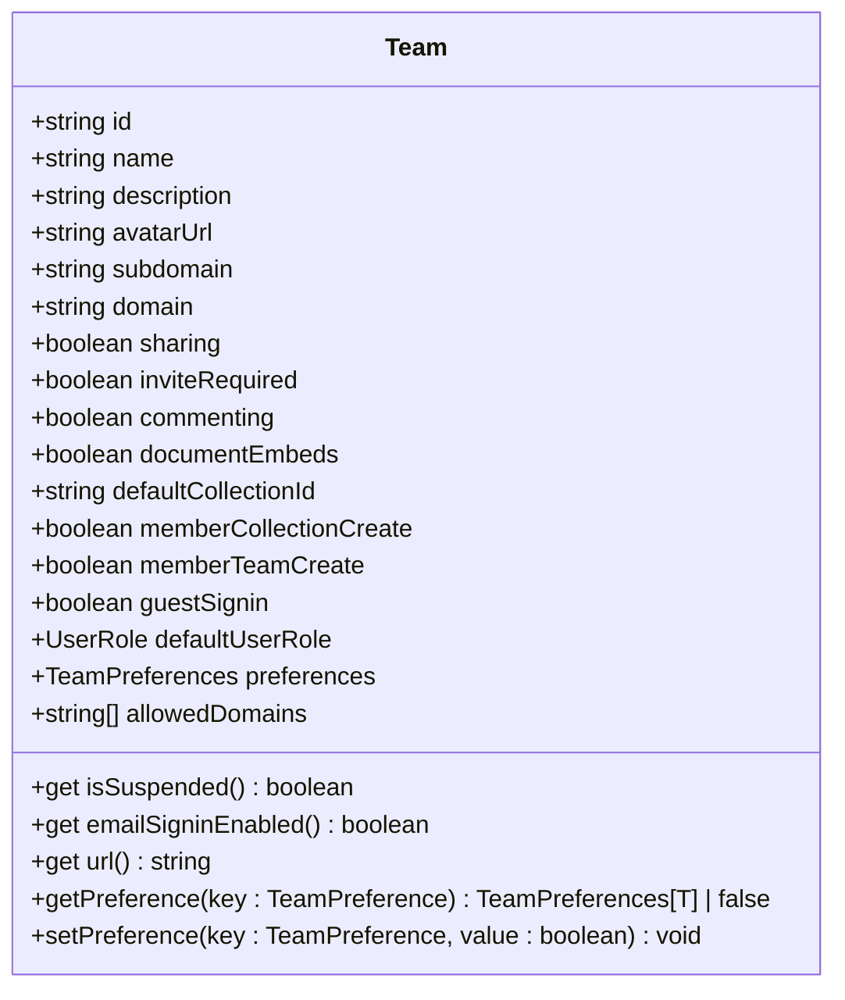
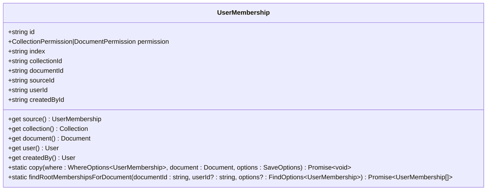
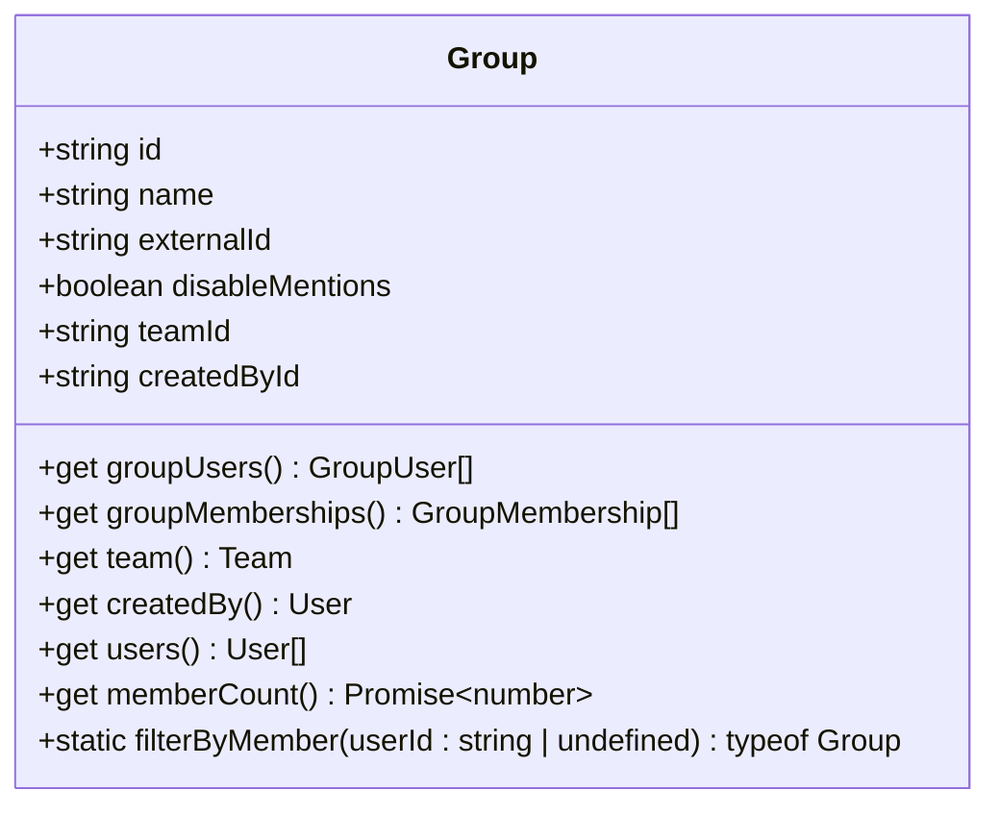
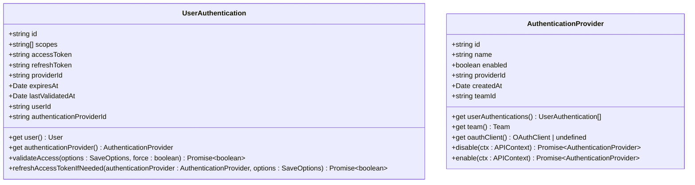
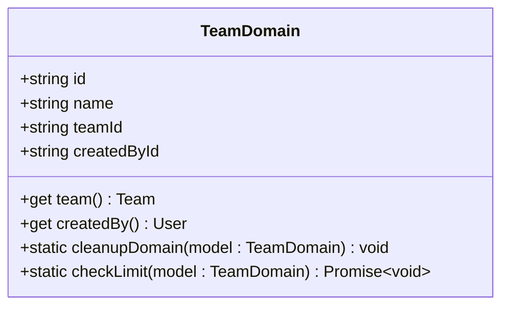
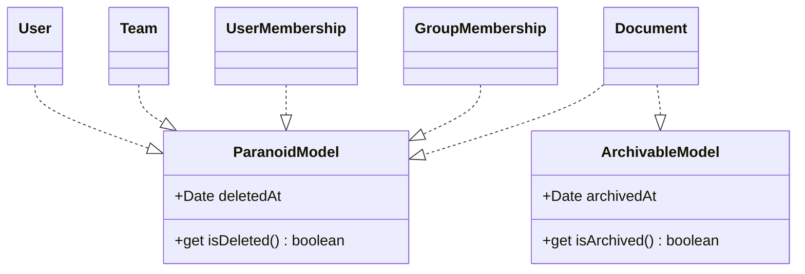

# 用户与团队模型

<cite>
**Referenced Files in This Document**   
- [User.ts](file://app/models/User.ts)
- [Team.ts](file://app/models/Team.ts)
- [UserMembership.ts](file://app/models/UserMembership.ts)
- [Group.ts](file://app/models/Group.ts)
- [GroupMembership.ts](file://app/models/GroupMembership.ts)
- [GroupUser.ts](file://app/models/GroupUser.ts)
- [UserAuthentication.ts](file://server/models/UserAuthentication.ts)
- [AuthenticationProvider.ts](file://server/models/AuthenticationProvider.ts)
- [TeamDomain.ts](file://server/models/TeamDomain.ts)
- [ParanoidModel.ts](file://server/models/base/ParanoidModel.ts)
- [ArchivableModel.ts](file://server/models/base/ArchivableModel.ts)
</cite>

## 目录
1. [简介](#简介)
2. [核心模型概述](#核心模型概述)
3. [用户模型](#用户模型)
4. [团队模型](#团队模型)
5. [用户与团队关系](#用户与团队关系)
6. [分组模型](#分组模型)
7. [认证信息模型](#认证信息模型)
8. [团队域名模型](#团队域名模型)
9. [软删除与归档机制](#软删除与归档机制)
10. [实体关系图](#实体关系图)

## 简介
本文档详细介绍了用户与团队数据模型的实现，重点分析了User、Team、UserMembership、Group、GroupMembership和GroupUser等核心模型。文档解释了用户与团队之间的多对多关系、分组在团队内的组织作用、用户与分组的关系，以及用户认证信息的存储和管理。同时，文档还描述了团队域名的配置和管理机制，为初学者提供用户权限体系的概念性理解，并为经验丰富的开发者提供技术细节。

## 核心模型概述
系统中的核心模型包括用户（User）、团队（Team）、用户成员资格（UserMembership）、分组（Group）、分组成员资格（GroupMembership）和分组用户（GroupUser）。这些模型通过复杂的关联关系构成了系统的权限和组织架构基础。用户与团队之间通过UserMembership实现多对多关系，分组在团队内组织用户，用户与分组通过GroupUser关联。

**Section sources**
- [User.ts](file://app/models/User.ts#L22-L245)
- [Team.ts](file://app/models/Team.ts#L7-L121)

## 用户模型
用户模型（User）是系统的核心实体，存储了用户的基本信息和状态。该模型继承自ParanoidModel，实现了软删除功能。用户模型包含姓名、邮箱、角色、头像URL等字段，并提供了多种计算属性和方法来判断用户状态。



**Diagram sources**
- [User.ts](file://app/models/User.ts#L22-L245)
- [User.ts](file://server/models/User.ts#L81-L856)

**Section sources**
- [User.ts](file://app/models/User.ts#L22-L245)
- [User.ts](file://server/models/User.ts#L81-L856)

## 团队模型
团队模型（Team）代表一个组织或工作空间，包含团队的基本信息和配置。该模型同样继承自ParanoidModel，支持软删除。团队模型包含名称、描述、头像URL、子域名等字段，并提供了判断团队状态和配置的方法。



**Diagram sources**
- [Team.ts](file://app/models/Team.ts#L7-L121)
- [Team.ts](file://server/models/Team.ts#L54-L473)

**Section sources**
- [Team.ts](file://app/models/Team.ts#L7-L121)
- [Team.ts](file://server/models/Team.ts#L54-L473)

## 用户与团队关系
用户与团队之间的关系通过UserMembership模型实现多对多关联。UserMembership模型存储了用户在团队中的权限信息，包括访问权限、排序索引等。该模型还实现了软删除功能，允许在不完全删除记录的情况下标记成员资格为已删除。



**Diagram sources**
- [UserMembership.ts](file://app/models/UserMembership.ts#L10-L97)
- [UserMembership.ts](file://server/models/UserMembership.ts#L38-L410)

**Section sources**
- [UserMembership.ts](file://app/models/UserMembership.ts#L10-L97)
- [UserMembership.ts](file://server/models/UserMembership.ts#L38-L410)

## 分组模型
分组模型（Group）用于在团队内组织用户，实现批量权限管理。每个分组属于一个团队，可以包含多个用户。分组模型提供了判断分组成员资格的方法，并支持通过外部ID进行集成。



**Diagram sources**
- [Group.ts](file://app/models/Group.ts#L7-L85)
- [Group.ts](file://server/models/Group.ts#L21-L106)

**Section sources**
- [Group.ts](file://app/models/Group.ts#L7-L85)
- [Group.ts](file://server/models/Group.ts#L21-L106)

## 认证信息模型
认证信息模型（UserAuthentication）存储了用户的第三方认证信息，如OAuth访问令牌、刷新令牌等。该模型与AuthenticationProvider关联，支持多种认证方式。UserAuthentication模型实现了令牌验证和刷新功能，确保认证信息的有效性。



**Diagram sources**
- [UserAuthentication.ts](file://server/models/UserAuthentication.ts#L24-L203)
- [AuthenticationProvider.ts](file://server/models/AuthenticationProvider.ts#L27-L140)

**Section sources**
- [UserAuthentication.ts](file://server/models/UserAuthentication.ts#L24-L203)
- [AuthenticationProvider.ts](file://server/models/AuthenticationProvider.ts#L27-L140)

## 团队域名模型
团队域名模型（TeamDomain）用于管理团队的自定义域名。每个团队可以配置多个域名，用于单点登录（SSO）或自定义访问。TeamDomain模型实现了域名验证和限制功能，确保域名的唯一性和有效性。



**Diagram sources**
- [TeamDomain.ts](file://server/models/TeamDomain.ts#L22-L76)

**Section sources**
- [TeamDomain.ts](file://server/models/TeamDomain.ts#L22-L76)

## 软删除与归档机制
系统实现了软删除和归档功能，通过ParanoidModel和ArchivableModel基类提供支持。ParanoidModel通过deletedAt字段实现软删除，ArchivableModel通过archivedAt字段实现归档功能。这些机制允许在不永久删除数据的情况下管理记录的状态。



**Diagram sources**
- [ParanoidModel.ts](file://server/models/base/ParanoidModel.ts#L3-L18)
- [ArchivableModel.ts](file://server/models/base/ArchivableModel.ts#L3-L21)

**Section sources**
- [ParanoidModel.ts](file://server/models/base/ParanoidModel.ts#L3-L18)
- [ArchivableModel.ts](file://server/models/base/ArchivableModel.ts#L3-L21)

## 实体关系图
以下实体关系图展示了用户、团队、分组和认证信息之间的关系。

```mermaid
erDiagram
USER {
string id PK
string name
string email
UserRole role
string avatarUrl
string language
string timezone
Date lastActiveAt
Date suspendedAt
Date deletedAt
Date createdAt
Date updatedAt
}
TEAM {
string id PK
string name
string description
string avatarUrl
string subdomain
string domain
boolean sharing
boolean inviteRequired
boolean commenting
boolean documentEmbeds
string defaultCollectionId
boolean memberCollectionCreate
boolean memberTeamCreate
boolean guestSignin
UserRole defaultUserRole
TeamPreferences preferences
Date suspendedAt
Date lastActiveAt
string[] previousSubdomains
Date deletedAt
Date createdAt
Date updatedAt
}
USER_MEMBERSHIP {
string id PK
CollectionPermission|DocumentPermission permission
string index
string collectionId FK
string documentId FK
string sourceId FK
string userId FK
string createdById FK
Date deletedAt
Date createdAt
Date updatedAt
}
GROUP {
string id PK
string name
string externalId
boolean disableMentions
string teamId FK
string createdById FK
Date deletedAt
Date createdAt
Date updatedAt
}
GROUP_MEMBERSHIP {
string id PK
CollectionPermission|DocumentPermission permission
string collectionId FK
string documentId FK
string sourceId FK
string groupId FK
string createdById FK
Date deletedAt
Date createdAt
Date updatedAt
}
GROUP_USER {
string id PK
string userId FK
string groupId FK
string createdById FK
GroupPermission permission
Date createdAt
Date updatedAt
}
AUTHENTICATION_PROVIDER {
string id PK
string name
boolean enabled
string providerId
string teamId FK
Date createdAt
Date updatedAt
}
USER_AUTHENTICATION {
string id PK
string[] scopes
string accessToken
string refreshToken
string providerId
Date expiresAt
Date lastValidatedAt
string userId FK
string authenticationProviderId FK
Date createdAt
Date updatedAt
}
TEAM_DOMAIN {
string id PK
string name
string teamId FK
string createdById FK
Date createdAt
Date updatedAt
}
USER ||--o{ TEAM : "belongs to"
USER ||--o{ USER_MEMBERSHIP : "has"
USER ||--o{ GROUP_USER : "belongs to"
USER ||--o{ USER_AUTHENTICATION : "has"
TEAM ||--o{ USER : "contains"
TEAM ||--o{ USER_MEMBERSHIP : "has"
TEAM ||--o{ GROUP : "contains"
TEAM ||--o{ AUTHENTICATION_PROVIDER : "has"
TEAM ||--o{ TEAM_DOMAIN : "has"
USER_MEMBERSHIP }o--|| COLLECTION : "grants access to"
USER_MEMBERSHIP }o--|| DOCUMENT : "grants access to"
GROUP ||--o{ GROUP_MEMBERSHIP : "has"
GROUP ||--o{ GROUP_USER : "contains"
GROUP_MEMBERSHIP }o--|| COLLECTION : "grants access to"
GROUP_MEMBERSHIP }o--|| DOCUMENT : "grants access to"
GROUP_USER }o--|| USER : "references"
AUTHENTICATION_PROVIDER ||--o{ USER_AUTHENTICATION : "has"
TEAM_DOMAIN }o--|| TEAM : "belongs to"
```

**Diagram sources**
- [User.ts](file://app/models/User.ts#L22-L245)
- [Team.ts](file://app/models/Team.ts#L7-L121)
- [UserMembership.ts](file://app/models/UserMembership.ts#L10-L97)
- [Group.ts](file://app/models/Group.ts#L7-L85)
- [GroupMembership.ts](file://app/models/GroupMembership.ts#L12-L70)
- [GroupUser.ts](file://app/models/GroupUser.ts#L11-L32)
- [UserAuthentication.ts](file://server/models/UserAuthentication.ts#L24-L203)
- [AuthenticationProvider.ts](file://server/models/AuthenticationProvider.ts#L27-L140)
- [TeamDomain.ts](file://server/models/TeamDomain.ts#L22-L76)

**Section sources**
- [User.ts](file://app/models/User.ts#L22-L245)
- [Team.ts](file://app/models/Team.ts#L7-L121)
- [UserMembership.ts](file://app/models/UserMembership.ts#L10-L97)
- [Group.ts](file://app/models/Group.ts#L7-L85)
- [GroupMembership.ts](file://app/models/GroupMembership.ts#L12-L70)
- [GroupUser.ts](file://app/models/GroupUser.ts#L11-L32)
- [UserAuthentication.ts](file://server/models/UserAuthentication.ts#L24-L203)
- [AuthenticationProvider.ts](file://server/models/AuthenticationProvider.ts#L27-L140)
- [TeamDomain.ts](file://server/models/TeamDomain.ts#L22-L76)