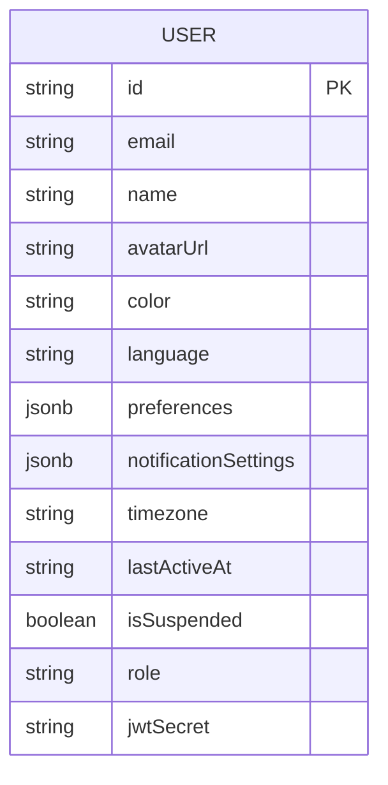
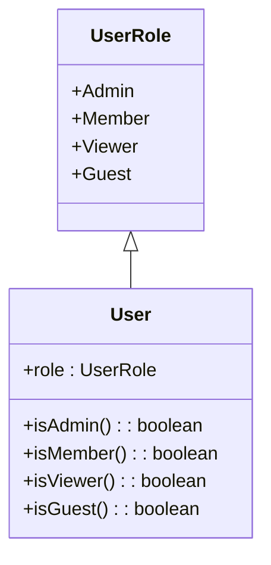
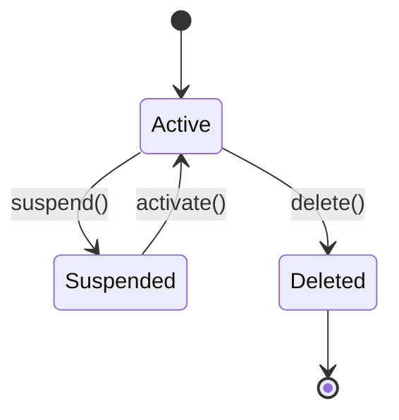
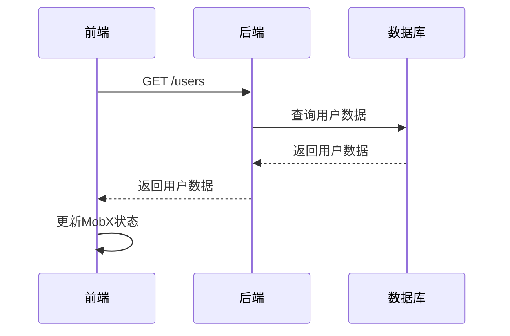
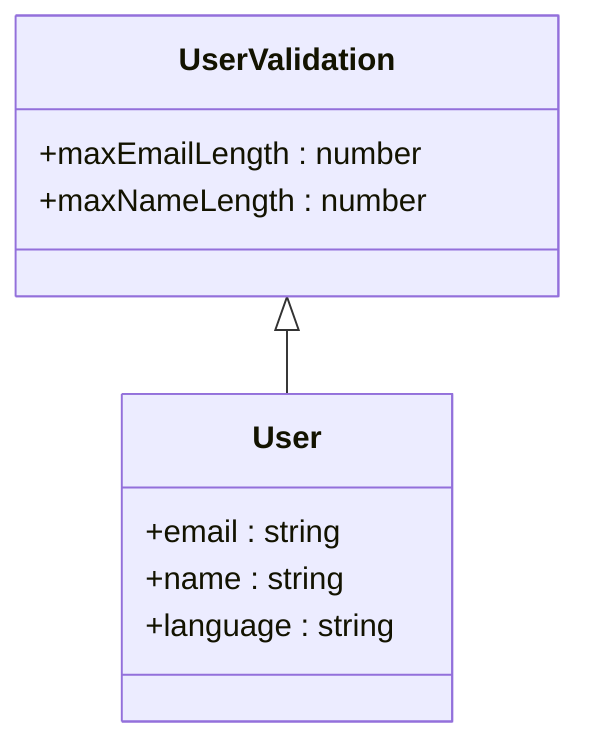
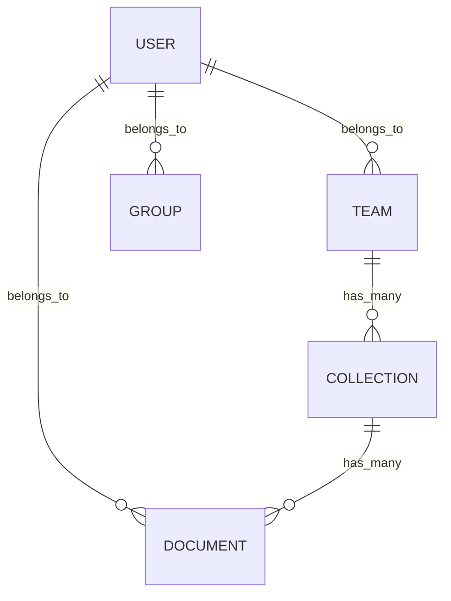

# 用户基本信息管理

<cite>
**本文档引用的文件**  
- [User.ts](file://app/models/User.ts)
- [User.ts](file://server/models/User.ts)
- [UsersStore.ts](file://app/stores/UsersStore.ts)
- [types.ts](file://shared/types.ts)
</cite>

## 目录
1. [简介](#简介)
2. [用户模型实现](#用户模型实现)
3. [用户基本信息存储结构](#用户基本信息存储结构)
4. [用户角色与权限](#用户角色与权限)
5. [用户状态管理机制](#用户状态管理机制)
6. [前端MobX模型与后端Sequelize模型对应关系](#前端mobx模型与后端sequelize模型对应关系)
7. [用户生命周期概念理解](#用户生命周期概念理解)
8. [字段级详细说明](#字段级详细说明)
9. [数据验证与默认值设置](#数据验证与默认值设置)
10. [关联查询与数据流](#关联查询与数据流)

## 简介
本文档详细介绍了用户基本信息管理系统的实现，重点分析了User模型的设计与实现。文档涵盖了用户基本信息的存储结构、字段定义、验证规则，以及用户角色、状态管理和生命周期等核心概念。通过前后端模型的对比分析，为不同层次的开发者提供了全面的技术指导。

## 用户模型实现

用户模型在前后端分别通过MobX和Sequelize实现，确保了数据的一致性和完整性。前端使用MobX进行状态管理，后端使用Sequelize进行数据库操作。

**Section sources**
- [User.ts](file://app/models/User.ts#L22-L245)
- [User.ts](file://server/models/User.ts#L81-L856)

## 用户基本信息存储结构

用户基本信息存储在数据库中，包含用户名、邮箱、头像、时区、语言偏好等属性。这些信息通过JSONB格式的preferences和notificationSettings字段进行扩展存储。



**Diagram sources**
- [User.ts](file://server/models/User.ts#L81-L856)

**Section sources**
- [User.ts](file://server/models/User.ts#L81-L856)

## 用户角色与权限

用户角色定义了用户在系统中的权限级别，包括Admin、Member、Viewer和Guest四种角色。每种角色具有不同的权限范围，确保了系统的安全性和灵活性。



**Diagram sources**
- [types.ts](file://shared/types.ts#L1-L6)
- [User.ts](file://server/models/User.ts#L81-L856)

**Section sources**
- [types.ts](file://shared/types.ts#L1-L6)
- [User.ts](file://server/models/User.ts#L81-L856)

## 用户状态管理机制

用户状态管理包括软删除（ParanoidModel）、暂停状态（isSuspended）和最近活动时间（lastActiveAt）的实现机制。这些机制确保了用户数据的完整性和系统的稳定性。



**Diagram sources**
- [User.ts](file://server/models/User.ts#L81-L856)
- [ParanoidModel.ts](file://app/models/base/ParanoidModel.ts#L0-L11)

**Section sources**
- [User.ts](file://server/models/User.ts#L81-L856)
- [ParanoidModel.ts](file://app/models/base/ParanoidModel.ts#L0-L11)

## 前端MobX模型与后端Sequelize模型对应关系

前端使用MobX模型进行状态管理，后端使用Sequelize模型进行数据库操作。两者通过API接口进行数据同步，确保了数据的一致性。



**Diagram sources**
- [User.ts](file://app/models/User.ts#L22-L245)
- [User.ts](file://server/models/User.ts#L81-L856)

**Section sources**
- [User.ts](file://app/models/User.ts#L22-L245)
- [User.ts](file://server/models/User.ts#L81-L856)

## 用户生命周期概念理解

用户生命周期包括创建、激活、暂停、删除等阶段。每个阶段都有相应的处理逻辑，确保了用户数据的完整性和系统的稳定性。

```mermaid
flowchart TD
A[创建用户] --> B[发送邀请]
B --> C{用户激活?}
C --> |是| D[激活用户]
C --> |否| E[标记为已邀请]
D --> F[用户活动]
F --> G{用户暂停?}
G --> |是| H[暂停用户]
G --> |否| I{用户删除?}
I --> |是| J[删除用户]
I --> |否| F
H --> K{用户激活?}
K --> |是| D
K --> |否| H
J --> [*]
```

**Diagram sources**
- [User.ts](file://server/models/User.ts#L81-L856)

**Section sources**
- [User.ts](file://server/models/User.ts#L81-L856)

## 字段级详细说明

### 加密存储的jwtSecret字段
jwtSecret字段用于生成和验证JWT令牌，确保了用户会话的安全性。该字段在数据库中以BLOB类型存储，并使用@Encrypted装饰器进行加密。

### JSONB格式的preferences字段
preferences字段用于存储用户的个性化设置，如是否记住最后路径、是否使用光标指针等。该字段以JSONB格式存储，支持灵活的扩展。

### JSONB格式的notificationSettings字段
notificationSettings字段用于存储用户的通知设置，包括邮件、应用内通知等。该字段以JSONB格式存储，支持多种通知渠道的配置。

**Section sources**
- [User.ts](file://server/models/User.ts#L81-L856)
- [types.ts](file://shared/types.ts#L246-L246)
- [types.ts](file://shared/types.ts#L382-L388)

## 数据验证与默认值设置

用户模型中的字段都设置了相应的验证规则和默认值，确保了数据的完整性和一致性。例如，邮箱字段必须是有效的邮箱地址，语言字段的默认值为系统默认语言。



**Diagram sources**
- [User.ts](file://server/models/User.ts#L81-L856)
- [UserValidation.ts](file://shared/validations/UserValidation.ts)

**Section sources**
- [User.ts](file://server/models/User.ts#L81-L856)

## 关联查询与数据流

用户模型与其他模型（如Team、Group、Document等）存在关联关系，通过外键和关联查询实现数据的联动。这些关联关系确保了数据的一致性和完整性。



**Diagram sources**
- [User.ts](file://server/models/User.ts#L81-L856)
- [Team.ts](file://server/models/Team.ts)
- [Group.ts](file://server/models/Group.ts)
- [Document.ts](file://server/models/Document.ts)

**Section sources**
- [User.ts](file://server/models/User.ts#L81-L856)
- [Team.ts](file://server/models/Team.ts)
- [Group.ts](file://server/models/Group.ts)
- [Document.ts](file://server/models/Document.ts)