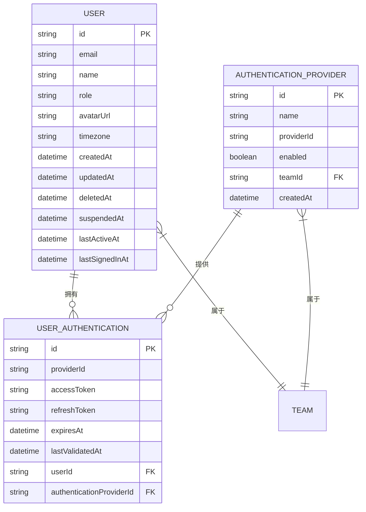
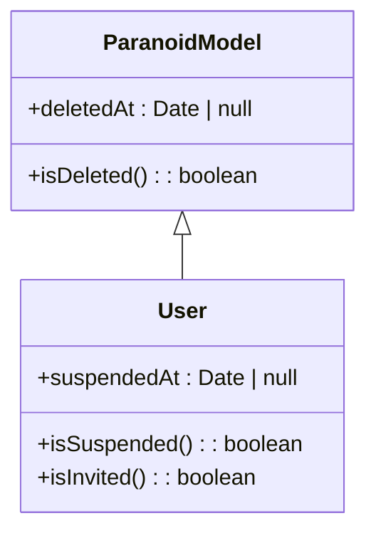
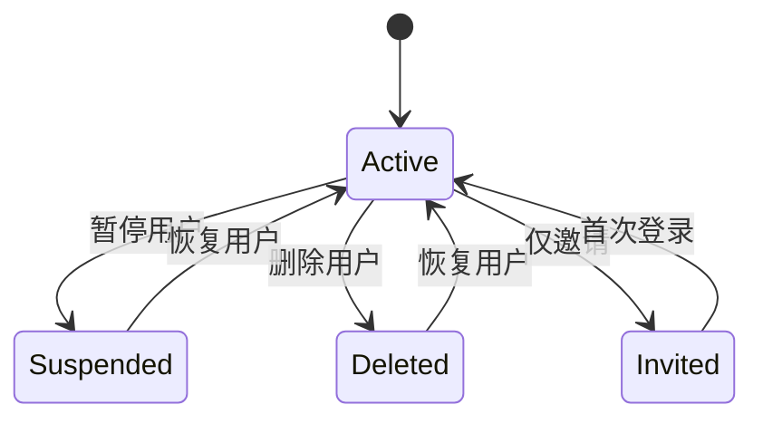
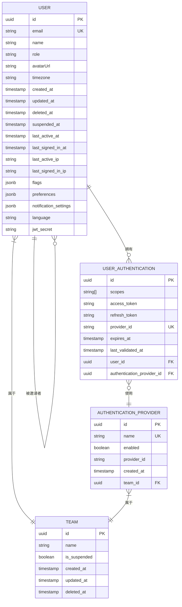

# 用户管理

<cite>
**本文档中引用的文件**
- [User.ts](file://app/models/User.ts)
- [User.ts](file://server/models/User.ts)
- [UserAuthentication.ts](file://server/models/UserAuthentication.ts)
- [AuthenticationProvider.ts](file://server/models/AuthenticationProvider.ts)
- [ParanoidModel.ts](file://server/models/base/ParanoidModel.ts)
</cite>

## 目录
1. [简介](#简介)
2. [核心数据模型](#核心数据模型)
3. [用户基本信息](#用户基本信息)
4. [用户认证信息](#用户认证信息)
5. [认证提供商](#认证提供商)
6. [软删除与用户状态](#软删除与用户状态)
7. [实体关系图](#实体关系图)
8. [安全考虑](#安全考虑)

## 简介
本文档详细介绍了用户管理系统中的核心数据模型，包括用户（User）、用户认证（UserAuthentication）和认证提供商（AuthenticationProvider）的实现。文档涵盖了用户基本信息的存储结构、字段定义和验证规则，解释了用户认证信息如何与用户关联以及支持多种认证方式的实现机制，并描述了认证提供商的配置和管理。同时，文档还说明了软删除（ParanoidModel）在用户管理中的应用以及用户状态的处理逻辑。

**Section sources**
- [User.ts](file://app/models/User.ts#L22-L245)
- [User.ts](file://server/models/User.ts#L81-L856)

## 核心数据模型
用户管理系统由三个核心数据模型组成：User、UserAuthentication和AuthenticationProvider。这些模型通过关联关系构成了完整的用户认证体系。

**Diagram sources**
- [User.ts](file://server/models/User.ts#L81-L856)
- [UserAuthentication.ts](file://server/models/UserAuthentication.ts#L24-L203)
- [AuthenticationProvider.ts](file://server/models/AuthenticationProvider.ts#L27-L140)

## 用户基本信息
用户基本信息存储在User模型中，包含了用户的核心属性和配置。

### 字段定义
| 字段 | 类型 | 是否必填 | 描述 |
|------|------|----------|------|
| email | string | 是 | 用户邮箱，用于登录和通信 |
| name | string | 是 | 用户显示名称 |
| role | enum | 否 | 用户角色（Admin/Member/Viewer/Guest） |
| avatarUrl | string | 否 | 用户头像URL |
| timezone | string | 否 | 用户时区 |
| language | string | 否 | 用户语言偏好 |
| preferences | JSONB | 否 | 用户偏好设置 |
| notificationSettings | JSONB | 否 | 通知设置 |
| lastActiveAt | datetime | 否 | 最后活跃时间 |
| suspendedAt | datetime | 否 | 暂停时间 |
| deletedAt | datetime | 否 | 删除时间 |

### 验证规则
- 邮箱必须是有效的电子邮件格式
- 名称长度必须在1到100个字符之间
- 邮箱长度必须在1到254个字符之间
- 头像URL长度必须小于4096个字符
- 时区必须是有效的时区标识符

### 计算属性
- **isSuspended**: 判断用户是否被暂停（个人暂停或团队暂停）
- **isInvited**: 判断用户是否仅被邀请但未登录
- **isAdmin**: 判断用户是否为管理员
- **isMember**: 判断用户是否为成员
- **isViewer**: 判断用户是否为查看者
- **isGuest**: 判断用户是否为访客
- **color**: 基于用户ID生成的颜色值
- **initial**: 用户名称的首字母

**Section sources**
- [User.ts](file://app/models/User.ts#L22-L245)
- [User.ts](file://server/models/User.ts#L81-L856)

## 用户认证信息
UserAuthentication模型用于存储用户的第三方认证信息，支持多种认证方式。

### 字段定义
| 字段 | 类型 | 是否必填 | 描述 |
|------|------|----------|------|
| scopes | array | 否 | OAuth权限范围 |
| accessToken | blob | 是 | 访问令牌（加密存储） |
| refreshToken | blob | 否 | 刷新令牌（加密存储） |
| providerId | string | 是 | 认证提供商用户ID |
| expiresAt | datetime | 否 | 令牌过期时间 |
| lastValidatedAt | datetime | 否 | 最后验证时间 |
| userId | string | 是 | 关联用户ID |
| authenticationProviderId | string | 是 | 关联认证提供商ID |

### 安全特性
- **accessToken**和**refreshToken**字段使用@Encrypted装饰器进行加密存储
- 令牌在数据库中以BLOB类型存储，确保安全性
- 支持令牌刷新机制，当访问令牌即将过期时自动刷新

### 实例方法
- **validateAccess**: 验证认证信息的有效性，检查令牌是否仍然有效
- **refreshAccessTokenIfNeeded**: 在访问令牌即将过期时刷新令牌
- **setValidated**: 创建时设置最后验证时间为当前时间
- **updateValidated**: 更新时如果访问令牌发生变化，则更新最后验证时间

**Section sources**
- [UserAuthentication.ts](file://server/models/UserAuthentication.ts#L24-L203)

## 认证提供商
AuthenticationProvider模型用于配置和管理不同的认证提供商。

### 字段定义
| 字段 | 类型 | 是否必填 | 描述 |
|------|------|----------|------|
| name | string | 是 | 认证提供商名称（google/azure/oidc） |
| enabled | boolean | 否 | 是否启用 |
| providerId | string | 是 | 认证提供商ID |
| teamId | string | 是 | 关联团队ID |
| createdAt | datetime | 否 | 创建时间 |

### 支持的认证方式
- Google OAuth
- Azure AD
- OIDC (OpenID Connect)

### 实例方法
- **oauthClient**: 根据提供商名称返回相应的OAuth客户端实例
- **disable**: 禁用认证提供商，确保至少有一个认证提供商处于启用状态
- **enable**: 启用认证提供商

### 配置管理
认证提供商的配置包括：
- 客户端ID（Client ID）
- 客户端密钥（Client Secret）
- 重定向URI
- 作用域（Scopes）
- 授权端点
- 令牌端点
- 用户信息端点

**Section sources**
- [AuthenticationProvider.ts](file://server/models/AuthenticationProvider.ts#L27-L140)
- [AuthenticationProvider.ts](file://app/models/AuthenticationProvider.ts#L4-L22)

## 软删除与用户状态
系统使用软删除机制来管理用户生命周期，确保数据的可恢复性和完整性。

### ParanoidModel实现

**Diagram sources**
- [ParanoidModel.ts](file://server/models/base/ParanoidModel.ts#L3-L18)
- [User.ts](file://server/models/User.ts#L81-L856)

### 状态处理逻辑
- **软删除**: 通过设置deletedAt字段实现，而不是物理删除记录
- **暂停**: 通过设置suspendedAt字段实现，用户无法登录
- **邀请**: 通过lastActiveAt字段为空来判断用户是否仅被邀请
- **活跃**: 通过lastActiveAt字段判断用户最近是否活跃

### 删除钩子
- **checkLastUser**: 确保团队中至少有一个用户存在
- **checkLastAdmin**: 确保团队中至少有一个管理员存在
- **removeIdentifyingInfo**: 删除用户时移除识别信息，保护隐私

### 状态转换

**Diagram sources**
- [User.ts](file://server/models/User.ts#L81-L856)

## 实体关系图

**Diagram sources**
- [User.ts](file://server/models/User.ts#L81-L856)
- [UserAuthentication.ts](file://server/models/UserAuthentication.ts#L24-L203)
- [AuthenticationProvider.ts](file://server/models/AuthenticationProvider.ts#L27-L140)

## 安全考虑
系统在用户管理方面实施了多项安全措施。

### 数据加密
- 敏感字段（如accessToken、refreshToken、jwtSecret）使用@Encrypted装饰器进行加密
- JWT密钥使用64字节的随机十六进制字符串
- 访问令牌和刷新令牌在数据库中以BLOB类型存储

### 会话管理
- **getJwtToken**: 生成用于API请求的会话令牌
- **getCollaborationToken**: 生成用于协作请求的会话令牌
- **getTransferToken**: 生成用于跨域会话传输的临时令牌
- **getEmailSigninToken**: 生成用于邮件登录的临时令牌

### 身份验证
- 支持多因素认证
- 令牌自动刷新机制
- 定期验证令牌有效性
- 支持一次性使用令牌

### 权限控制
- 基于角色的访问控制（RBAC）
- 团队级别的权限管理
- 细粒度的文档和集合权限
- 用户状态检查（暂停、删除等）

**Section sources**
- [User.ts](file://server/models/User.ts#L81-L856)
- [UserAuthentication.ts](file://server/models/UserAuthentication.ts#L24-L203)