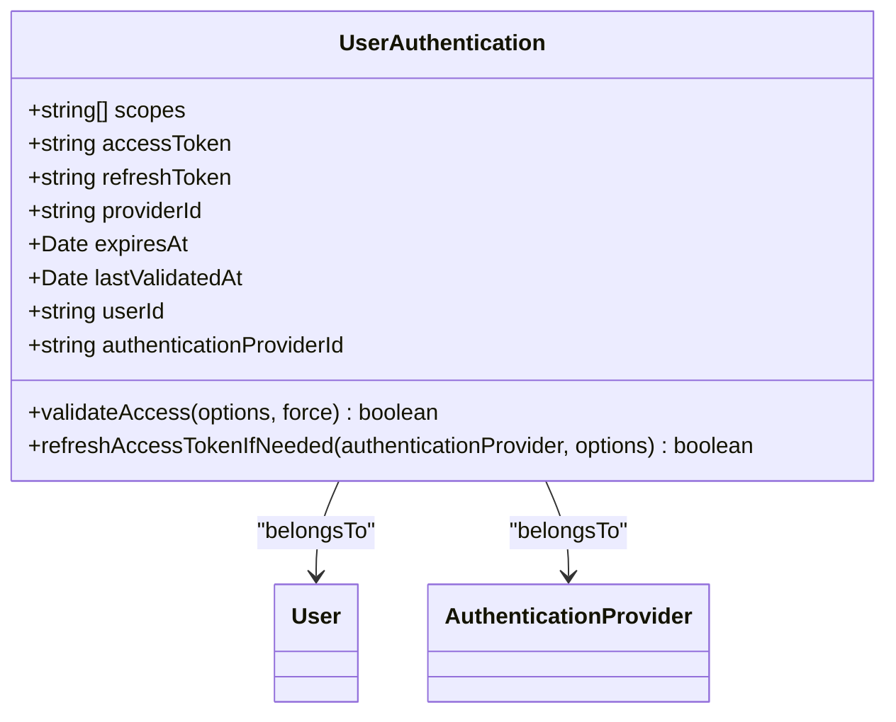
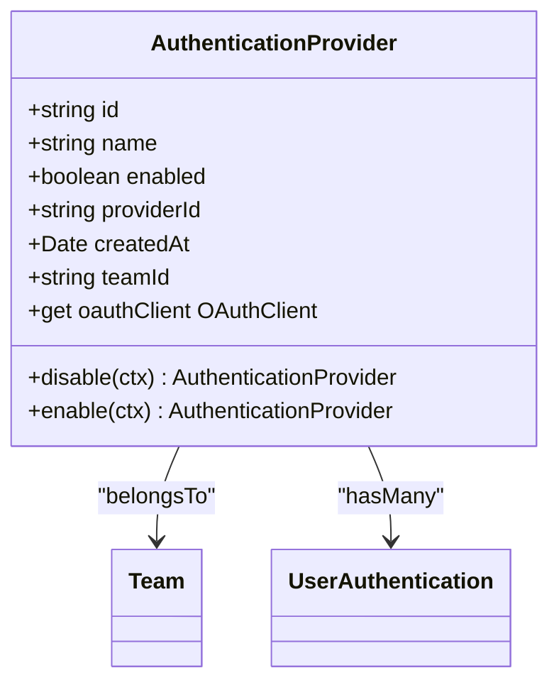
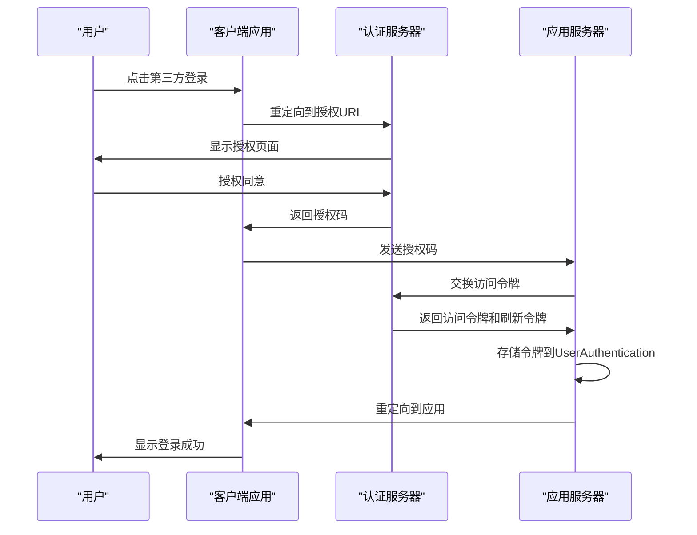
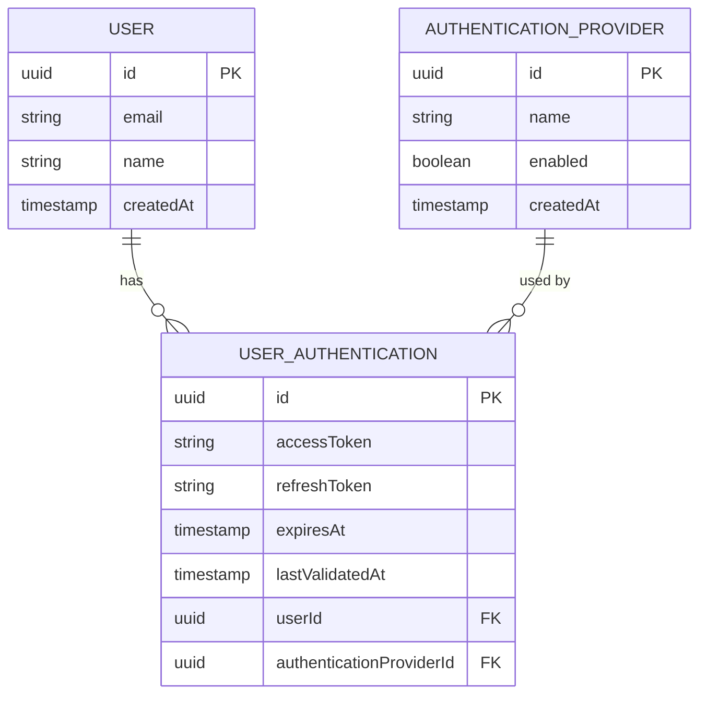
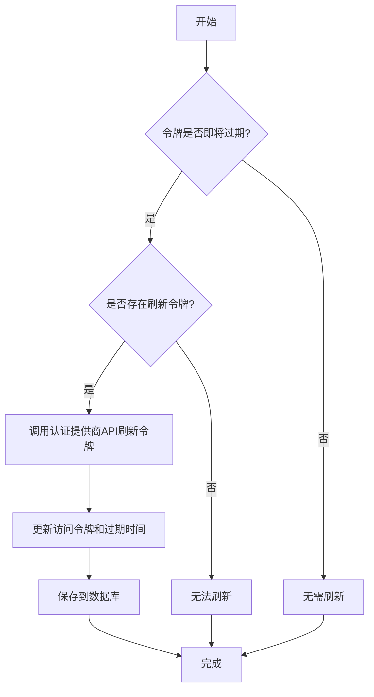

# 认证管理

<cite>
**本文档中引用的文件**   
- [UserAuthentication.ts](file://server/models/UserAuthentication.ts)
- [AuthenticationProvider.ts](file://server/models/AuthenticationProvider.ts)
- [User.ts](file://server/models/User.ts)
</cite>

## 目录
1. [简介](#简介)
2. [核心模型](#核心模型)
3. [认证信息存储结构](#认证信息存储结构)
4. [认证提供商配置机制](#认证提供商配置机制)
5. [OAuth认证流程](#oauth认证流程)
6. [用户与多认证方式关联](#用户与多认证方式关联)
7. [会话管理与令牌刷新](#会话管理与令牌刷新)
8. [安全性考虑](#安全性考虑)

## 简介
本文档详细介绍了用户认证管理系统的设计与实现，重点阐述了UserAuthentication和AuthenticationProvider模型的架构。系统采用用户主记录与认证信息分离的设计，支持多种第三方登录方式，包括Google、Azure、Slack等。文档将深入解析认证信息的存储结构、认证提供商的配置机制、OAuth认证流程的实现细节，以及会话管理和安全性考虑。

## 核心模型

本系统的核心认证模型包括UserAuthentication和AuthenticationProvider两个主要实体。UserAuthentication模型负责存储用户的第三方认证信息，而AuthenticationProvider模型则定义了认证提供商的配置。这种分离设计使得用户可以关联多个认证方式，同时保持用户主记录的简洁性。

**Section sources**
- [UserAuthentication.ts](file://server/models/UserAuthentication.ts#L24-L203)
- [AuthenticationProvider.ts](file://server/models/AuthenticationProvider.ts#L27-L140)

## 认证信息存储结构

UserAuthentication模型定义了用户认证信息的完整存储结构，包括OAuth令牌、刷新令牌和过期时间等关键字段。

**Diagram sources **
- [UserAuthentication.ts](file://server/models/UserAuthentication.ts#L24-L203)

### 字段说明
- **accessToken**: 存储OAuth访问令牌，使用BLOB类型并加密存储
- **refreshToken**: 存储刷新令牌，同样使用BLOB类型并加密存储
- **expiresAt**: 记录访问令牌的过期时间
- **lastValidatedAt**: 记录最后一次验证令牌有效性的时间
- **providerId**: 存储用户在认证提供商中的唯一标识
- **scopes**: 存储OAuth授权范围的数组

这些字段共同构成了完整的用户认证信息存储体系，确保了认证数据的安全性和完整性。

**Section sources**
- [UserAuthentication.ts](file://server/models/UserAuthentication.ts#L24-L203)

## 认证提供商配置机制

AuthenticationProvider模型实现了认证提供商的配置管理，支持多种第三方认证服务。

**Diagram sources **
- [AuthenticationProvider.ts](file://server/models/AuthenticationProvider.ts#L27-L140)

### 支持的提供商类型
系统通过oauthClient属性支持多种认证提供商：
- **Google**: 通过GoogleClient实现
- **Azure**: 通过AzureClient实现  
- **OIDC**: 通过OIDCClient实现

### 配置管理
认证提供商的配置包括：
- **name**: 认证提供商的名称
- **enabled**: 启用状态
- **providerId**: 提供商特定的ID
- **teamId**: 关联的团队ID

系统通过enable和disable方法管理提供商的启用状态，确保至少有一个认证提供商处于启用状态。

**Section sources**
- [AuthenticationProvider.ts](file://server/models/AuthenticationProvider.ts#L27-L140)

## OAuth认证流程

OAuth认证流程的实现包括认证代码处理、令牌获取和存储等关键步骤。

**Diagram sources **
- [UserAuthentication.ts](file://server/models/UserAuthentication.ts#L24-L203)
- [AuthenticationProvider.ts](file://server/models/AuthenticationProvider.ts#L27-L140)

### 令牌获取与存储
1. 用户通过第三方登录按钮发起认证请求
2. 系统重定向到认证提供商的授权URL
3. 用户在认证提供商处完成授权
4. 认证提供商返回授权码到应用服务器
5. 应用服务器使用授权码交换访问令牌和刷新令牌
6. 将获取的令牌安全存储到UserAuthentication记录中

**Section sources**
- [UserAuthentication.ts](file://server/models/UserAuthentication.ts#L24-L203)

## 用户与多认证方式关联

系统支持一个用户关联多个UserAuthentication记录，实现多认证方式的灵活管理。

**Diagram sources **
- [UserAuthentication.ts](file://server/models/UserAuthentication.ts#L24-L203)
- [AuthenticationProvider.ts](file://server/models/AuthenticationProvider.ts#L27-L140)
- [User.ts](file://server/models/User.ts#L81-L856)

### 关联关系实现
- 每个User可以有多个UserAuthentication记录
- 每个UserAuthentication记录关联一个AuthenticationProvider
- 通过userId和authenticationProviderId建立外键关系
- 使用@HasMany和@BelongsTo装饰器定义模型关系

这种设计允许用户使用不同的第三方账户登录同一个应用，提高了用户体验的灵活性。

**Section sources**
- [UserAuthentication.ts](file://server/models/UserAuthentication.ts#L24-L203)
- [User.ts](file://server/models/User.ts#L81-L856)

## 会话管理与令牌刷新

系统实现了完善的会话管理和令牌刷新机制，确保用户认证的安全性和连续性。

### 令牌验证
UserAuthentication模型提供了validateAccess方法，用于验证令牌的有效性：
- 每5分钟最多验证一次，避免频繁请求
- 检查令牌是否即将过期（5分钟内）
- 调用refreshAccessTokenIfNeeded方法刷新令牌

### 令牌刷新

**Diagram sources **
- [UserAuthentication.ts](file://server/models/UserAuthentication.ts#L24-L203)

refreshAccessTokenIfNeeded方法实现了智能的令牌刷新逻辑：
- 检查令牌是否在5分钟内过期
- 验证是否存在刷新令牌
- 调用认证提供商的rotateToken方法获取新令牌
- 更新数据库中的令牌信息

**Section sources**
- [UserAuthentication.ts](file://server/models/UserAuthentication.ts#L24-L203)

## 安全性考虑

系统在设计和实现中充分考虑了各种安全性因素。

### 数据安全
- **加密存储**: 访问令牌和刷新令牌使用@Encrypted装饰器加密存储
- **字段验证**: 对关键字段进行长度和格式验证
- **唯一性约束**: authenticationProviderId字段设置唯一约束

### 流程安全
- **状态检查**: 每次令牌验证都检查lastValidatedAt时间戳
- **错误处理**: 优雅处理各种认证错误，避免信息泄露
- **事务管理**: 关键操作使用数据库事务确保数据一致性

### 设计优势
认证信息与用户主记录分离的设计带来了以下优势：
- **安全性**: 敏感认证信息与用户基本信息分离，降低数据泄露风险
- **灵活性**: 用户可以轻松添加或删除第三方认证方式
- **可维护性**: 认证逻辑独立，便于扩展新的认证提供商
- **性能**: 减少用户主表的复杂性，提高查询性能

这种分离设计是现代认证系统的重要实践，既保证了安全性又提供了良好的用户体验。

**Section sources**
- [UserAuthentication.ts](file://server/models/UserAuthentication.ts#L24-L203)
- [AuthenticationProvider.ts](file://server/models/AuthenticationProvider.ts#L27-L140)