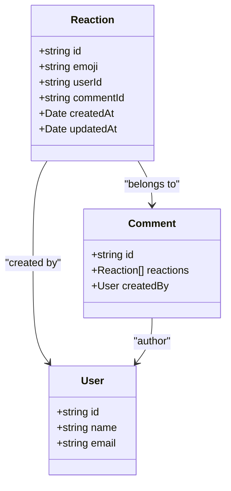
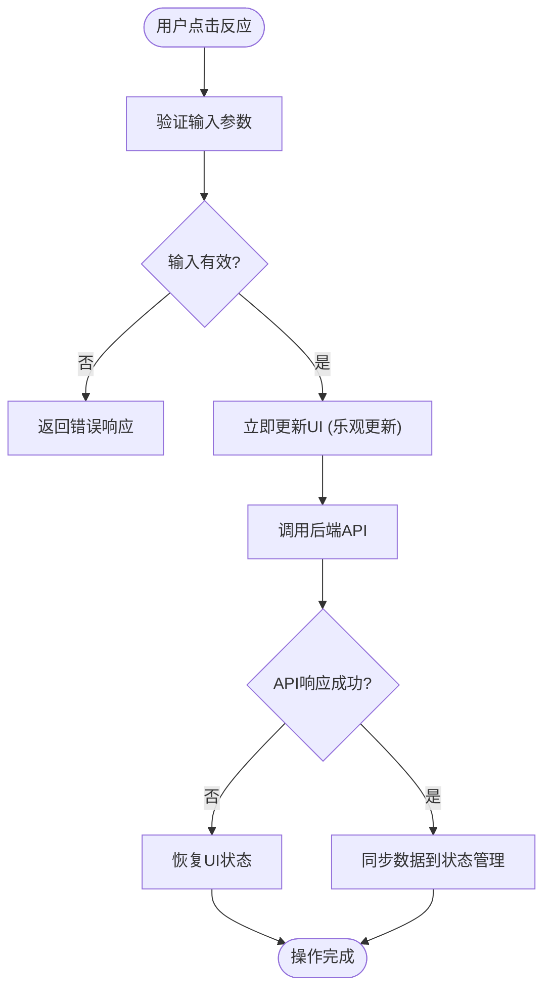
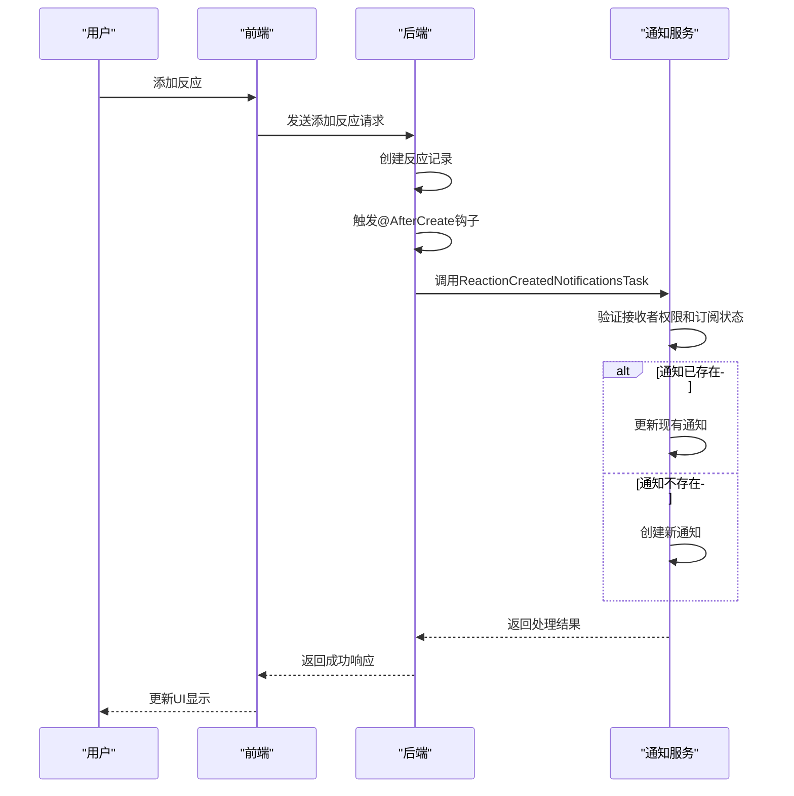

# 反应模型

<cite>
**本文档中引用的文件**   
- [Reaction.ts](file://server/models/Reaction.ts)
- [reaction.ts](file://server/presenters/reaction.ts)
- [reaction.tsx](file://app/components/Reactions/Reaction.tsx)
- [ReactionList.tsx](file://app/components/Reactions/ReactionList.tsx)
- [Comment.ts](file://app/models/Comment.ts)
- [reaction.ts](file://server/policies/reaction.ts)
- [ReactionCreatedNotificationsTask.ts](file://server/queues/tasks/ReactionCreatedNotificationsTask.ts)
- [ReactionRemovedNotificationsTask.ts](file://server/queues/tasks/ReactionRemovedNotificationsTask.ts)
- [emoji.ts](file://app/utils/emoji.ts)
</cite>

## 目录
1. [简介](#简介)
2. [数据结构设计](#数据结构设计)
3. [核心功能实现](#核心功能实现)
4. [用户交互与展示](#用户交互与展示)
5. [生命周期管理](#生命周期管理)
6. [通知系统集成](#通知系统集成)
7. [性能优化策略](#性能优化策略)
8. [高并发处理](#高并发处理)
9. [最佳实践](#最佳实践)

## 简介
反应模型是用户交互系统中的核心组件，用于存储和管理用户对内容的反应。该模型支持多种emoji反应类型，通过优化的数据结构设计实现了高效的存储和查询。反应模型不仅记录了用户对内容的反馈，还为社交互动提供了基础支持。系统通过前端组件和后端服务的协同工作，实现了反应的创建、删除和查询功能，同时确保了数据的一致性和完整性。对于初学者，反应模型提供了一个直观的用户反馈机制；对于经验丰富的开发者，则展示了复杂系统中数据模型的设计和实现细节。

**Section sources**
- [Reaction.ts](file://server/models/Reaction.ts#L27-L160)
- [reaction.tsx](file://app/components/Reactions/Reaction.tsx#L1-L174)

## 数据结构设计
反应模型的数据结构设计旨在高效存储用户对内容的反应。核心数据表包含emoji字段，用于存储用户选择的反应表情，该字段被限制为最多50个字符，确保了数据的规范性和存储效率。每个反应记录都与特定的用户和评论相关联，通过外键约束建立了清晰的关系模型。在服务器端，Reaction模型继承自IdModel，包含了id、emoji、userId和commentId等基本属性。这种设计不仅支持了反应的唯一性，还便于进行高效的查询和索引操作。

**Diagram sources**
- [Reaction.ts](file://server/models/Reaction.ts#L27-L45)
- [Comment.ts](file://app/models/Comment.ts#L12-L275)

## 核心功能实现
反应模型的核心功能包括反应的创建、删除和查询操作。当用户添加反应时，系统首先检查是否已存在相同类型的反应，如果存在则更新用户列表，否则创建新的反应记录。删除反应时，系统会从用户列表中移除对应的用户ID，当某个emoji的用户列表为空时，该反应记录将被删除。查询操作支持分页和排序，确保了在大量数据下的性能表现。处理重复反应的逻辑通过唯一约束和事务处理来保证，避免了数据不一致的问题。

**Section sources**
- [Reaction.ts](file://server/models/Reaction.ts#L56-L159)
- [Comment.ts](file://app/models/Comment.ts#L202-L255)

## 用户交互与展示
反应模型的用户交互通过前端组件实现，提供了直观的用户体验。Reaction组件负责显示单个反应的统计信息，包括emoji和反应用户数量。当用户悬停在反应上时，会显示包含具体用户信息的工具提示。ReactionList组件管理一组反应的展示，支持动态加载和更新。系统使用emojiToUrl工具函数将emoji转换为SVG图像，确保了跨平台的一致性显示。前端通过乐观更新策略，在发送API请求前立即更新UI，提升了用户交互的响应速度。

**Diagram sources**
- [Reaction.tsx](file://app/components/Reactions/Reaction.tsx#L88-L137)
- [emoji.ts](file://app/utils/emoji.ts#L1-L4)

## 生命周期管理
反应模型的生命周期管理通过数据库钩子和缓存机制实现。在创建反应时，@AfterCreate钩子会自动更新关联评论的反应缓存，确保数据的一致性。删除反应时，@AfterDestroy钩子同样会更新缓存。系统使用cloneDeep和uniq等工具函数处理数组操作，避免了引用问题。缓存更新采用事务锁定机制，防止了并发更新导致的数据竞争。这种设计确保了反应数据在数据库和缓存之间始终保持同步，提高了系统的可靠性和性能。

**Section sources**
- [Reaction.ts](file://server/models/Reaction.ts#L56-L159)
- [Comment.ts](file://app/models/Comment.ts#L202-L255)

## 通知系统集成
反应模型与通知系统深度集成，当用户收到新反应时会自动触发通知。ReactionCreatedNotificationsTask负责处理新增反应的通知，检查接收者是否订阅了相关事件类型，并验证其对文档的访问权限。如果已存在相同类型的未读通知，则更新现有通知而非创建新的。ReactionRemovedNotificationsTask处理反应移除的通知，将相关的通知归档。这种设计减少了通知数量，避免了信息过载，同时确保了重要信息的及时传达。

**Diagram sources**
- [ReactionCreatedNotificationsTask.ts](file://server/queues/tasks/ReactionCreatedNotificationsTask.ts#L1-L95)
- [ReactionRemovedNotificationsTask.ts](file://server/queues/tasks/ReactionRemovedNotificationsTask.ts#L1-L59)

## 性能优化策略
反应模型的性能优化策略包括查询优化和数据一致性维护。系统使用分页查询来处理大量反应数据，避免了一次性加载过多数据导致的性能问题。在数据库层面，通过适当的索引设计加速了常见查询操作。缓存机制减少了对数据库的直接访问，提高了响应速度。对于数据一致性，系统采用事务处理和锁定机制，确保了并发操作下的数据完整性。此外，通过批量操作和异步处理，进一步提升了系统的整体性能。

**Section sources**
- [Reaction.ts](file://server/models/Reaction.ts#L56-L159)
- [reaction.ts](file://server/presenters/reaction.ts#L3-L13)

## 高并发处理
在高并发场景下，反应模型通过多种机制确保系统的稳定性和数据的一致性。数据库事务和行级锁定防止了并发更新导致的数据竞争。系统使用乐观锁和版本控制来处理冲突，当检测到冲突时会自动重试操作。对于读操作，采用缓存和读写分离策略，减轻了数据库的负载。异步任务队列处理耗时操作，如通知发送，避免了阻塞主线程。这些机制共同作用，确保了系统在高负载下的可靠运行。

**Section sources**
- [Reaction.ts](file://server/models/Reaction.ts#L56-L159)
- [ReactionCreatedNotificationsTask.ts](file://server/queues/tasks/ReactionCreatedNotificationsTask.ts#L1-L95)

## 最佳实践
实现反应模型的最佳实践包括：使用唯一约束防止重复反应、通过事务确保数据一致性、采用分页查询处理大量数据、利用缓存提高性能、实施适当的索引策略优化查询速度。在前端，应使用乐观更新提升用户体验，同时妥善处理API调用失败的情况。后端应验证所有输入数据，防止恶意操作。通知系统应避免过度打扰用户，通过合并相似通知和提供订阅选项来平衡信息传递和用户体验。

**Section sources**
- [Reaction.ts](file://server/models/Reaction.ts#L27-L160)
- [reaction.ts](file://server/policies/reaction.ts#L1-L5)