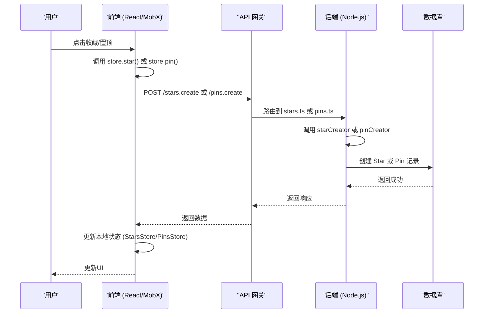
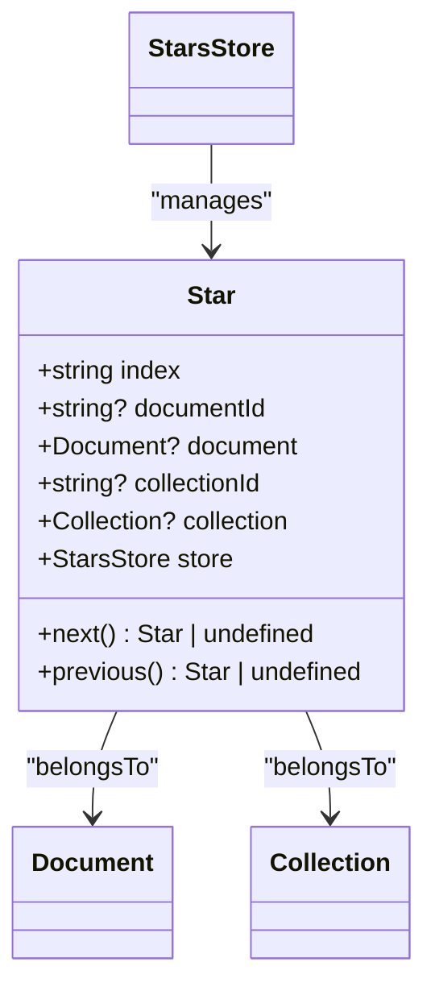
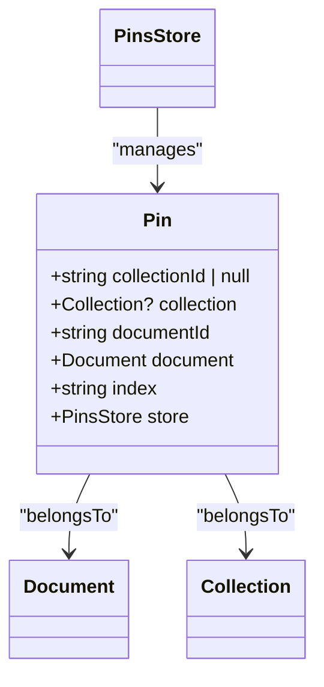
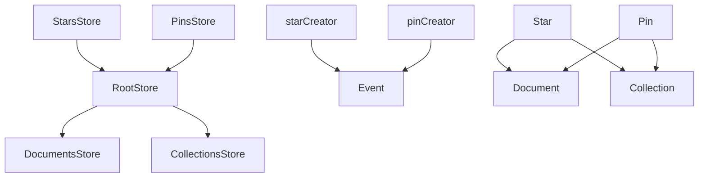

# 收藏与置顶模型

<cite>
**本文档引用文件**  
- [Star.ts](file://app/models/Star.ts)
- [Pin.ts](file://app/models/Pin.ts)
- [StarsStore.ts](file://app/stores/StarsStore.ts)
- [PinsStore.ts](file://app/stores/PinsStore.ts)
- [Document.ts](file://app/models/Document.ts)
- [Collection.ts](file://app/models/Collection.ts)
- [starCreator.ts](file://server/commands/starCreator.ts)
- [pinCreator.ts](file://server/commands/pinCreator.ts)
- [stars.ts](file://server/routes/api/stars/stars.ts)
- [pins.ts](file://server/routes/api/pins/pins.ts)
- [Star.ts](file://server/models/Star.ts)
- [Pin.ts](file://server/models/Pin.ts)
</cite>

## 目录
1. [简介](#简介)
2. [项目结构](#项目结构)
3. [核心组件](#核心组件)
4. [架构概述](#架构概述)
5. [详细组件分析](#详细组件分析)
6. [依赖分析](#依赖分析)
7. [性能考虑](#性能考虑)
8. [故障排除指南](#故障排除指南)
9. [结论](#结论)

## 简介
本文档详细介绍了收藏（Star）和置顶（Pin）两个用户偏好功能的数据模型设计。收藏功能允许用户标记重要文档或集合，便于快速访问；置顶功能则允许用户将文档固定在首页或特定集合中，确保其始终可见。这两个功能共同提升了用户界面的组织性和可访问性。文档将深入探讨其数据模型、实现逻辑、用户界面影响以及与其他系统的交互。

## 项目结构
项目采用分层架构，核心模型和存储逻辑分离。`app/models` 目录包含前端数据模型，如 `Star.ts` 和 `Pin.ts`，它们定义了数据结构和行为。`app/stores` 目录包含状态管理逻辑，如 `StarsStore.ts` 和 `PinsStore.ts`，负责与后端API通信并管理本地状态。后端逻辑位于 `server/commands` 和 `server/routes/api` 目录，处理具体的业务逻辑和API请求。

```mermaid
graph TB
subgraph "前端 (app/)"
A[app/models/Star.ts] --> B[app/stores/StarsStore.ts]
C[app/models/Pin.ts] --> D[app/stores/PinsStore.ts]
B --> E[API Client]
D --> E
end
subgraph "后端 (server/)"
F[server/routes/api/stars/stars.ts] --> G[server/commands/starCreator.ts]
H[server/routes/api/pins/pins.ts] --> I[server/commands/pinCreator.ts]
G --> J[server/models/Star.ts]
I --> K[server/models/Pin.ts]
end
E < --> F
E < --> H
```

**Diagram sources**
- [Star.ts](file://app/models/Star.ts)
- [Pin.ts](file://app/models/Pin.ts)
- [StarsStore.ts](file://app/stores/StarsStore.ts)
- [PinsStore.ts](file://app/stores/PinsStore.ts)
- [starCreator.ts](file://server/commands/starCreator.ts)
- [pinCreator.ts](file://server/commands/pinCreator.ts)
- [stars.ts](file://server/routes/api/stars/stars.ts)
- [pins.ts](file://server/routes/api/pins/pins.ts)

**Section sources**
- [Star.ts](file://app/models/Star.ts)
- [Pin.ts](file://app/models/Pin.ts)
- [StarsStore.ts](file://app/stores/StarsStore.ts)
- [PinsStore.ts](file://app/stores/PinsStore.ts)

## 核心组件
收藏（Star）和置顶（Pin）模型是用户个性化体验的核心。`Star` 模型记录用户对文档或集合的收藏行为，而 `Pin` 模型管理用户希望在首页或特定集合中置顶的文档。这两个模型都通过 `index` 字段实现自定义排序，并与 `Document` 和 `Collection` 模型建立关联。相关的 `Store` 类负责状态同步和业务逻辑。

**Section sources**
- [Star.ts](file://app/models/Star.ts)
- [Pin.ts](file://app/models/Pin.ts)
- [StarsStore.ts](file://app/stores/StarsStore.ts)
- [PinsStore.ts](file://app/stores/PinsStore.ts)

## 架构概述
系统采用前后端分离架构。前端通过 `StarsStore` 和 `PinsStore` 管理本地状态，并通过API客户端与后端通信。后端通过RESTful API（如 `/stars.create`, `/pins.delete`）接收请求，由 `starCreator` 和 `pinCreator` 命令处理核心逻辑，并将数据持久化到数据库中的 `stars` 和 `pins` 表。数据模型在前后端保持一致，确保了数据流的清晰和一致性。



**Diagram sources**
- [StarsStore.ts](file://app/stores/StarsStore.ts)
- [PinsStore.ts](file://app/stores/PinsStore.ts)
- [stars.ts](file://server/routes/api/stars/stars.ts)
- [pins.ts](file://server/routes/api/pins/pins.ts)
- [starCreator.ts](file://server/commands/starCreator.ts)
- [pinCreator.ts](file://server/commands/pinCreator.ts)
- [Star.ts](file://server/models/Star.ts)
- [Pin.ts](file://server/models/Pin.ts)

## 详细组件分析

### 收藏模型 (Star) 分析
`Star` 模型用于记录用户的收藏行为。它是一个简单的关联模型，通过 `documentId` 或 `collectionId` 关联到被收藏的实体，并通过 `index` 字段支持自定义排序。

#### 数据结构


**Diagram sources**
- [Star.ts](file://app/models/Star.ts)
- [Document.ts](file://app/models/Document.ts)
- [Collection.ts](file://app/models/Collection.ts)
- [StarsStore.ts](file://app/stores/StarsStore.ts)

#### 实现流程
收藏和取消收藏的操作主要在 `Document` 和 `Collection` 模型中通过 `star()` 和 `unstar()` 方法触发。

**创建收藏**
1.  **前端调用**: 用户在文档或集合上点击“收藏”按钮，触发 `document.star()` 或 `collection.star()`。
2.  **状态管理**: 方法调用 `StarsStore` 的 `create` 方法。
3.  **API请求**: `StarsStore` 通过 `client.post('/stars.create')` 发送创建请求。
4.  **后端处理**: `starCreator` 命令被调用，创建一个新的 `Star` 记录，并设置 `index` 值。
5.  **数据持久化**: 新的 `Star` 记录被保存到数据库的 `stars` 表中。
6.  **状态更新**: 后端返回数据，前端 `StarsStore` 更新本地状态，UI随之刷新。

**删除收藏**
1.  **前端调用**: 用户点击“已收藏”按钮，触发 `document.unstar()` 或 `collection.unstar()`。
2.  **查找记录**: 方法在 `StarsStore` 中查找对应的 `Star` 记录。
3.  **API请求**: 调用 `Star` 模型的 `delete()` 方法，发送 `DELETE /stars.delete` 请求。
4.  **后端处理**: `stars.ts` 路由处理删除请求，从数据库中移除记录。
5.  **状态更新**: 前端 `StarsStore` 移除本地记录，UI更新。

**查询收藏**
- **前端**: `StarsStore` 的 `fetchPage` 方法通过 `POST /stars.list` 获取用户的收藏列表。
- **后端**: `stars.ts` 路由处理请求，查询数据库并返回结果。

**Section sources**
- [Star.ts](file://app/models/Star.ts)
- [StarsStore.ts](file://app/stores/StarsStore.ts)
- [Document.ts](file://app/models/Document.ts)
- [Collection.ts](file://app/models/Collection.ts)
- [starCreator.ts](file://server/commands/starCreator.ts)
- [stars.ts](file://server/routes/api/stars/stars.ts)

### 置顶模型 (Pin) 分析
`Pin` 模型用于管理用户的置顶文档。与 `Star` 不同，`Pin` 可以指定文档是置顶到“首页”还是某个“集合”中。

#### 数据结构


**Diagram sources**
- [Pin.ts](file://app/models/Pin.ts)
- [Document.ts](file://app/models/Document.ts)
- [Collection.ts](file://app/models/Collection.ts)
- [PinsStore.ts](file://app/stores/PinsStore.ts)

#### 实现流程
置顶和取消置顶的操作通过 `Document` 模型的 `pin()` 和 `unpin()` 方法实现。

**创建置顶**
1.  **前端调用**: 用户在文档上点击“置顶”按钮，触发 `document.pin(collectionId?)`。
2.  **状态管理**: 方法创建一个新的 `Pin` 实例并调用其 `save()` 方法。
3.  **API请求**: `PinsStore` 的 `create` 方法通过 `client.post('/pins.create')` 发送请求。
4.  **后端处理**: `pinCreator` 命令被调用，创建 `Pin` 记录。如果 `collectionId` 为空，则表示置顶到首页。
5.  **数据持久化**: 新的 `Pin` 记录被保存到数据库的 `pins` 表中。
6.  **状态更新**: 前端 `PinsStore` 更新状态，UI刷新。

**删除置顶**
1.  **前端调用**: 用户点击“取消置顶”，触发 `document.unpin(collectionId?)`。
2.  **查找记录**: 方法在 `PinsStore` 中查找对应的 `Pin` 记录（根据 `documentId` 和 `collectionId`）。
3.  **API请求**: 调用 `Pin` 模型的 `delete()` 方法，发送 `DELETE /pins.delete` 请求。
4.  **后端处理**: `pins.ts` 路由处理删除请求。
5.  **状态更新**: 前端 `PinsStore` 移除记录，UI更新。

**查询置顶**
- **前端**: `PinsStore` 的 `fetchPage` 方法通过 `POST /pins.list` 获取所有置顶记录。`home` 计算属性过滤出首页置顶的文档。
- **后端**: `pins.ts` 路由处理请求，支持按 `collectionId` 过滤。

**Section sources**
- [Pin.ts](file://app/models/Pin.ts)
- [PinsStore.ts](file://app/stores/PinsStore.ts)
- [Document.ts](file://app/models/Document.ts)
- [pinCreator.ts](file://server/commands/pinCreator.ts)
- [pins.ts](file://server/routes/api/pins/pins.ts)

### 概念性理解
对于初学者，可以将“收藏”想象成书签，将重要的文档或集合标记起来，方便日后查找。而“置顶”则像是将最常用的文件夹或文档固定在桌面或浏览器标签页的最前面，确保它们始终在最显眼的位置，无需翻找。

## 依赖分析
`Star` 和 `Pin` 模型都依赖于 `Document` 和 `Collection` 模型，通过外键关联。`StarsStore` 和 `PinsStore` 依赖于 `RootStore` 来访问其他存储（如 `DocumentsStore`），并在获取数据时一并加载关联的文档。后端的 `starCreator` 和 `pinCreator` 命令依赖于 `Event` 模型来记录用户操作日志。



**Diagram sources**
- [StarsStore.ts](file://app/stores/StarsStore.ts)
- [PinsStore.ts](file://app/stores/PinsStore.ts)
- [RootStore.ts](file://app/stores/RootStore.ts)
- [starCreator.ts](file://server/commands/starCreator.ts)
- [pinCreator.ts](file://server/commands/pinCreator.ts)
- [Star.ts](file://app/models/Star.ts)
- [Pin.ts](file://app/models/Pin.ts)

**Section sources**
- [StarsStore.ts](file://app/stores/StarsStore.ts)
- [PinsStore.ts](file://app/stores/PinsStore.ts)
- [RootStore.ts](file://app/stores/RootStore.ts)

## 性能考虑
- **前端**: `StarsStore` 和 `PinsStore` 使用 `orderedData` 计算属性对数据进行排序，利用MobX的响应式特性，只有在数据变化时才重新计算。
- **后端**: 数据库表 `stars` 和 `pins` 建立了适当的索引（如 `documentId`, `collectionId`, `userId`），以加速查询。API支持分页（`/stars.list`, `/pins.list`），避免一次性加载过多数据。
- **缓存**: 前端使用 `usePersistedState` 钩子缓存置顶文档的数量，减少不必要的渲染。

## 故障排除指南
- **问题**: 用户无法收藏/置顶文档。
  - **检查**: 确认用户是否具有对目标文档或集合的“更新”权限。
  - **检查**: 查看API请求是否返回403错误，这通常表示权限不足。
- **问题**: 收藏/置顶列表未更新。
  - **检查**: 确认WebSocket连接是否正常，因为状态更新可能通过WebSocket推送。
  - **检查**: 查看 `StarsStore` 或 `PinsStore` 的 `isFetching` 状态，确认是否有未完成的请求。
- **问题**: 置顶到集合的文档未在集合中显示。
  - **检查**: 确认 `Pin` 记录的 `collectionId` 是否正确。
  - **检查**: 确认该集合的 `documents` 数据是否已加载。

**Section sources**
- [StarsStore.ts](file://app/stores/StarsStore.ts)
- [PinsStore.ts](file://app/stores/PinsStore.ts)
- [WebsocketProvider.tsx](file://app/components/WebsocketProvider.tsx)

## 结论
收藏和置顶模型通过简洁而有效的数据设计，极大地增强了用户对内容的组织和访问能力。从前端的响应式状态管理到后端的健壮API处理，整个系统设计清晰，职责分明。理解这两个模型的工作原理，对于开发和维护用户偏好功能至关重要。