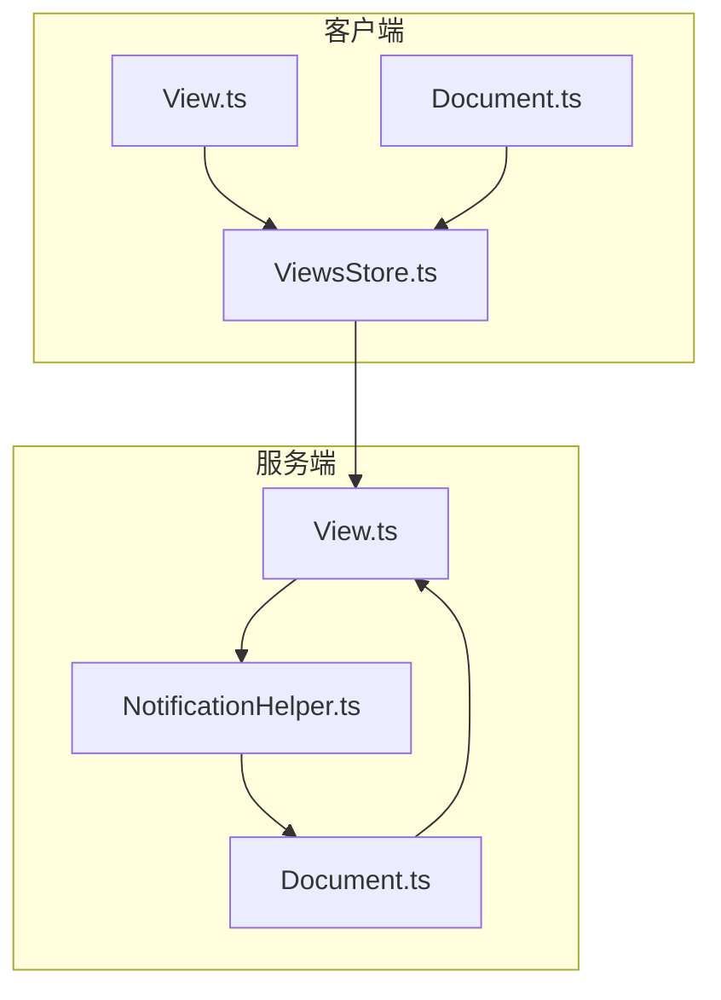
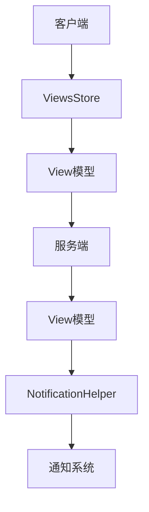
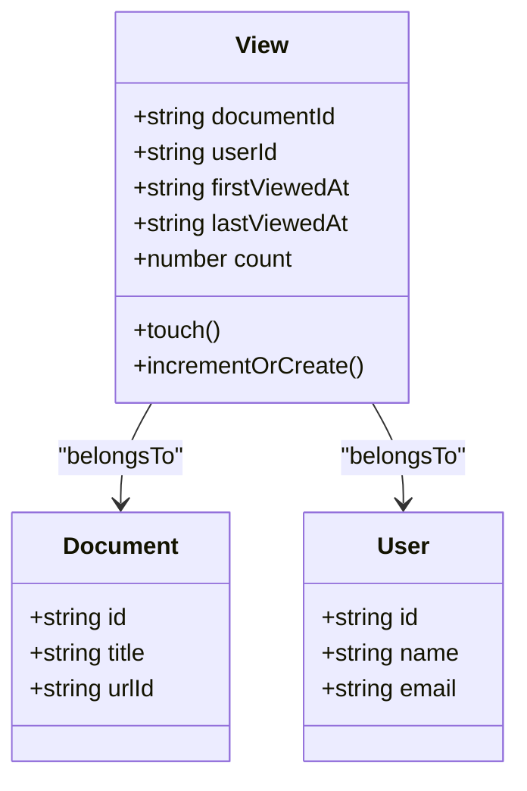
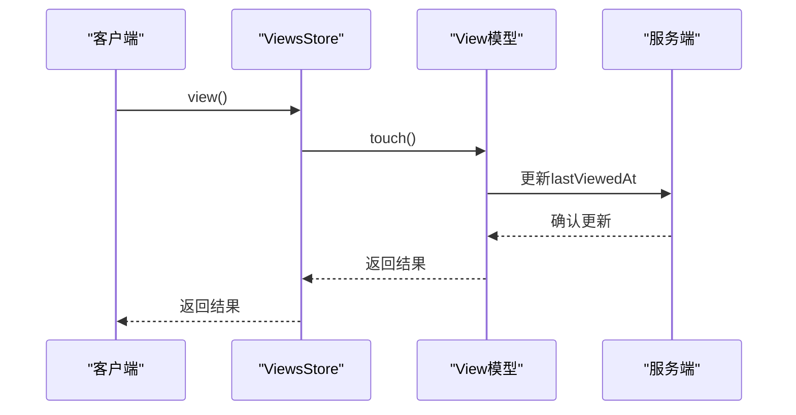
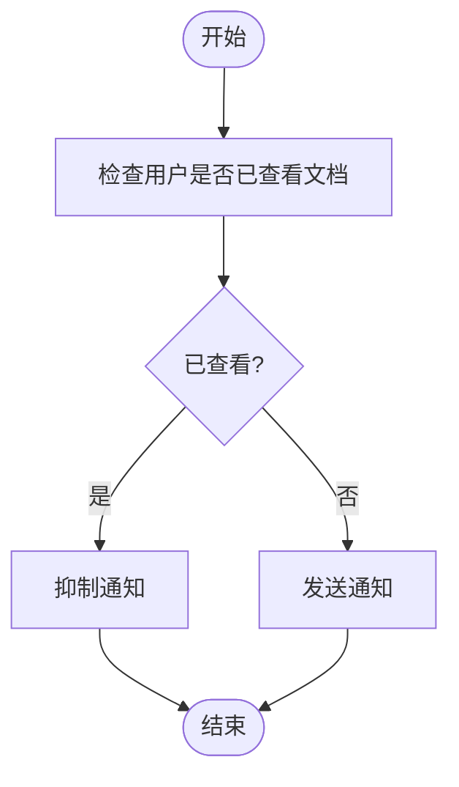
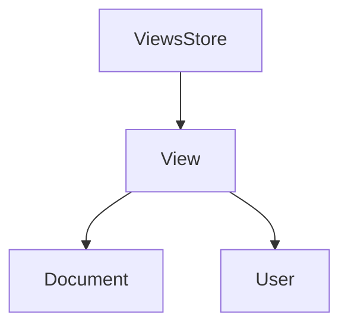

# 查看记录模型

<cite>
**本文档中引用的文件**   
- [View.ts](file://app/models/View.ts)
- [Document.ts](file://app/models/Document.ts)
- [ViewsStore.ts](file://app/stores/ViewsStore.ts)
- [View.ts](file://server/models/View.ts)
- [NotificationHelper.ts](file://server/models/helpers/NotificationHelper.ts)
</cite>

## 目录
1. [简介](#简介)
2. [项目结构](#项目结构)
3. [核心组件](#核心组件)
4. [架构概述](#架构概述)
5. [详细组件分析](#详细组件分析)
6. [依赖分析](#依赖分析)
7. [性能考虑](#性能考虑)
8. [故障排除指南](#故障排除指南)
9. [结论](#结论)
10. [附录](#附录)（如有必要）

## 简介
查看记录（View）模型是用户交互系统中的关键组成部分，用于跟踪用户对文档的访问行为。该模型不仅记录了用户首次和最近查看文档的时间戳，还通过与通知系统的集成，有效避免了向已查看用户发送重复通知。本文档将深入探讨View模型的数据存储结构、生命周期管理以及在高并发场景下的处理机制，为初学者提供概念性理解，同时为经验丰富的开发者提供技术细节和性能优化策略。

## 项目结构
项目结构清晰地展示了View模型在客户端和服务端的实现。客户端的View模型位于`app/models/View.ts`，而服务端的实现则位于`server/models/View.ts`。此外，`app/stores/ViewsStore.ts`负责管理View模型的存储和操作，`server/models/helpers/NotificationHelper.ts`则利用View记录来优化通知系统的逻辑。

**Diagram sources**
- [View.ts](file://app/models/View.ts)
- [ViewsStore.ts](file://app/stores/ViewsStore.ts)
- [Document.ts](file://app/models/Document.ts)
- [View.ts](file://server/models/View.ts)
- [NotificationHelper.ts](file://server/models/helpers/NotificationHelper.ts)

**Section sources**
- [View.ts](file://app/models/View.ts)
- [ViewsStore.ts](file://app/stores/ViewsStore.ts)
- [Document.ts](file://app/models/Document.ts)
- [View.ts](file://server/models/View.ts)
- [NotificationHelper.ts](file://server/models/helpers/NotificationHelper.ts)

## 核心组件
View模型的核心组件包括`documentId`、`userId`、`firstViewedAt`、`lastViewedAt`和`count`。这些字段共同记录了用户对文档的访问行为。`documentId`和`userId`用于关联文档和用户，`firstViewedAt`和`lastViewedAt`分别记录了用户首次和最近查看文档的时间，而`count`则统计了用户查看文档的次数。

**Section sources**
- [View.ts](file://app/models/View.ts)
- [View.ts](file://server/models/View.ts)

## 架构概述
View模型的架构设计旨在高效地跟踪用户对文档的访问行为，并与通知系统无缝集成。客户端通过`ViewsStore`管理View记录的创建、更新和查询，而服务端则通过`View`模型和`NotificationHelper`来处理数据存储和通知逻辑。

**Diagram sources**
- [ViewsStore.ts](file://app/stores/ViewsStore.ts)
- [View.ts](file://app/models/View.ts)
- [View.ts](file://server/models/View.ts)
- [NotificationHelper.ts](file://server/models/helpers/NotificationHelper.ts)

## 详细组件分析
### View模型分析
View模型通过`touch`方法更新`lastViewedAt`时间戳，确保每次用户查看文档时都能准确记录。`incrementOrCreate`方法则用于创建新的View记录或更新现有记录的`count`字段。

#### 对象导向组件：

**Diagram sources**
- [View.ts](file://app/models/View.ts)
- [View.ts](file://server/models/View.ts)

#### API/服务组件：

**Diagram sources**
- [ViewsStore.ts](file://app/stores/ViewsStore.ts)
- [View.ts](file://app/models/View.ts)
- [View.ts](file://server/models/View.ts)

**Section sources**
- [View.ts](file://app/models/View.ts)
- [ViewsStore.ts](file://app/stores/ViewsStore.ts)
- [View.ts](file://server/models/View.ts)

### 通知系统集成
`NotificationHelper`类通过`getCommentNotificationRecipients`方法检查用户是否已查看文档，从而决定是否发送通知。如果用户已查看文档，则不会发送通知，避免了重复通知的问题。

#### 复杂逻辑组件：

**Diagram sources**
- [NotificationHelper.ts](file://server/models/helpers/NotificationHelper.ts)

**Section sources**
- [NotificationHelper.ts](file://server/models/helpers/NotificationHelper.ts)

## 依赖分析
View模型依赖于`Document`和`User`模型，通过`belongsTo`关系进行关联。此外，`ViewsStore`依赖于`View`模型来管理View记录的生命周期。

**Diagram sources**
- [View.ts](file://app/models/View.ts)
- [View.ts](file://server/models/View.ts)

**Section sources**
- [View.ts](file://app/models/View.ts)
- [View.ts](file://server/models/View.ts)

## 性能考虑
在高并发场景下，View模型通过`incrementOrCreate`方法确保数据的一致性。该方法使用`findOrCreateWithCtx`来避免竞态条件，确保每次请求都能正确创建或更新View记录。

## 故障排除指南
在使用View模型时，常见的问题包括数据不一致和通知重复。确保`touch`方法在每次用户查看文档时都被调用，并检查`NotificationHelper`的逻辑是否正确处理了已查看用户。

**Section sources**
- [View.ts](file://app/models/View.ts)
- [NotificationHelper.ts](file://server/models/helpers/NotificationHelper.ts)

## 结论
View模型在用户交互系统中扮演着重要角色，通过精确记录用户对文档的访问行为，有效提升了用户体验。本文档详细介绍了View模型的实现细节、与通知系统的集成方式以及性能优化策略，为开发者提供了全面的参考。