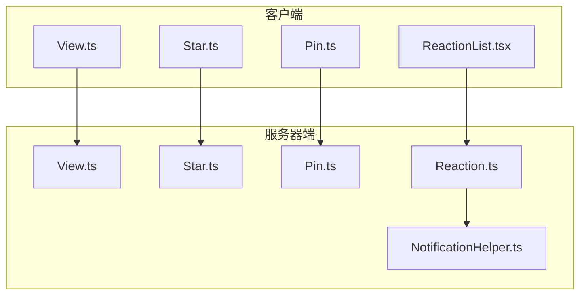
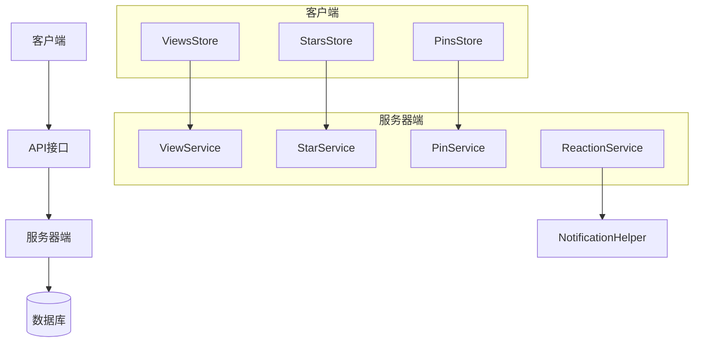
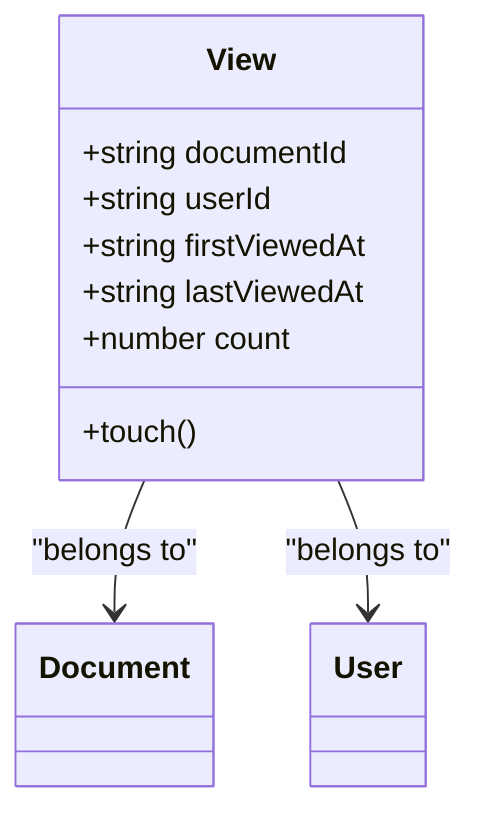
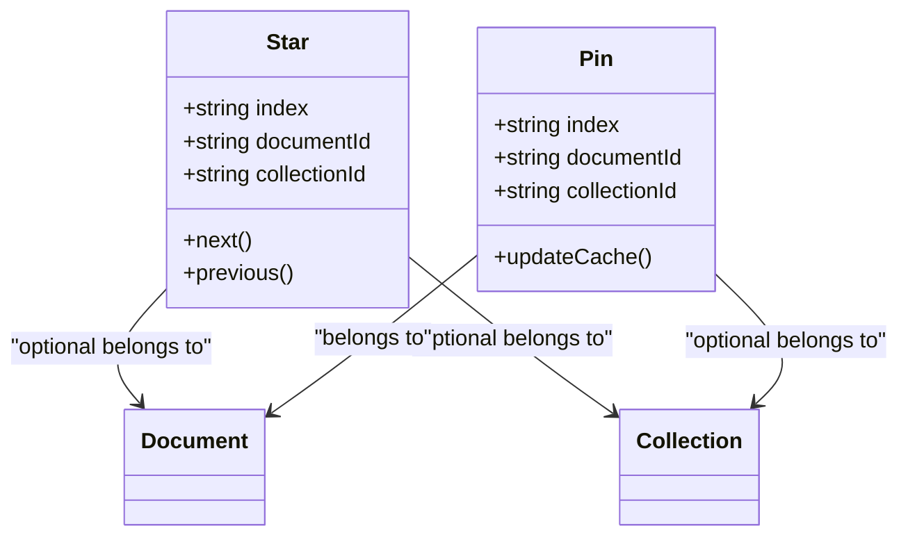
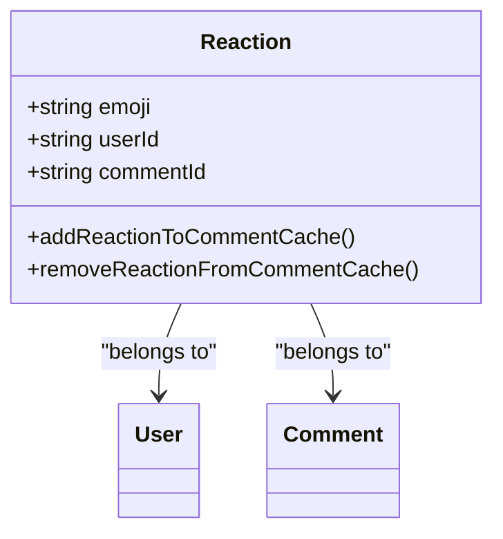
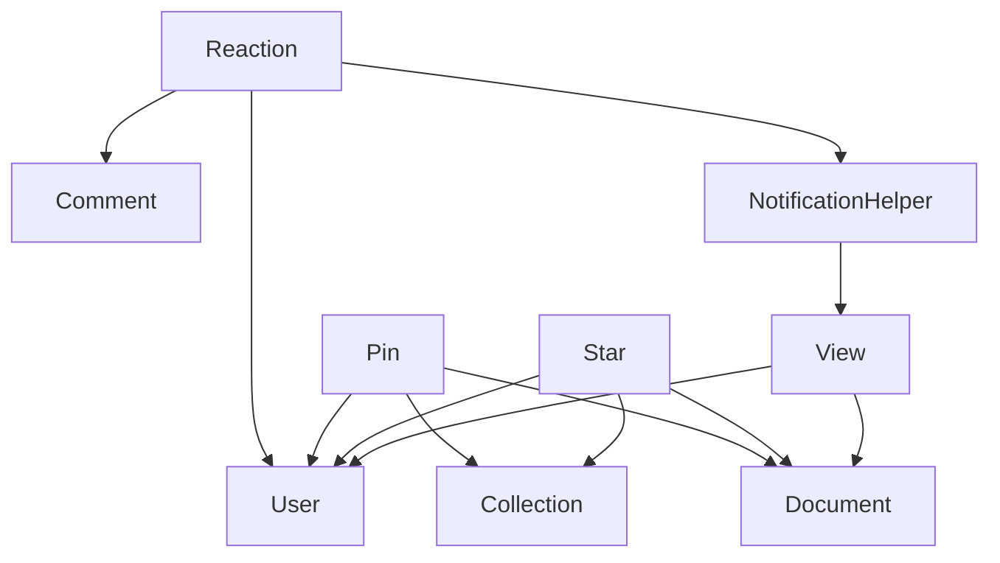

# 用户交互模型

<cite>
**本文档中引用的文件**  
- [View.ts](file://app/models/View.ts)
- [View.ts](file://server/models/View.ts)
- [ViewsStore.ts](file://app/stores/ViewsStore.ts)
- [Star.ts](file://app/models/Star.ts)
- [Star.ts](file://server/models/Star.ts)
- [StarsStore.ts](file://app/stores/StarsStore.ts)
- [Pin.ts](file://app/models/Pin.ts)
- [Pin.ts](file://server/models/Pin.ts)
- [PinsStore.ts](file://app/stores/PinsStore.ts)
- [Reaction.ts](file://server/models/Reaction.ts)
- [ReactionList.tsx](file://app/components/Reactions/ReactionList.tsx)
- [NotificationHelper.ts](file://server/models/helpers/NotificationHelper.ts)
</cite>

## 目录
1. [简介](#简介)
2. [项目结构](#项目结构)
3. [核心组件](#核心组件)
4. [架构概述](#架构概述)
5. [详细组件分析](#详细组件分析)
6. [依赖分析](#依赖分析)
7. [性能考虑](#性能考虑)
8. [故障排除指南](#故障排除指南)
9. [结论](#结论)

## 简介
本文档详细介绍了用户交互数据模型的实现，重点分析了查看（View）、收藏（Star）、置顶（Pin）和反应（Reaction）模型。这些模型共同构成了用户与文档系统交互的核心机制，支持从访问跟踪到社交互动的多种功能。文档将为初学者提供概念性理解，同时为经验丰富的开发者提供技术细节，包括数据一致性维护、性能优化和查询优化策略。

## 项目结构
用户交互模型分布在客户端和服务器端的多个文件中，形成了一个完整的交互系统。客户端模型负责状态管理和用户界面更新，而服务器端模型处理数据持久化和业务逻辑。

**图表来源**  
- [View.ts](file://app/models/View.ts)
- [server/models/View.ts](file://server/models/View.ts)
- [app/models/Star.ts](file://app/models/Star.ts)
- [server/models/Star.ts](file://server/models/Star.ts)
- [app/models/Pin.ts](file://app/models/Pin.ts)
- [server/models/Pin.ts](file://server/models/Pin.ts)
- [server/models/Reaction.ts](file://server/models/Reaction.ts)
- [app/components/Reactions/ReactionList.tsx](file://app/components/Reactions/ReactionList.tsx)
- [server/models/helpers/NotificationHelper.ts](file://server/models/helpers/NotificationHelper.ts)

## 核心组件
用户交互系统由四个核心模型组成：View、Star、Pin和Reaction。每个模型都有明确的职责和生命周期管理机制。View模型跟踪用户对文档的访问行为，Star和Pin模型提供用户界面的个性化展示功能，Reaction模型支持社交互动。这些模型通过客户端存储和服务器端持久化协同工作，确保数据的一致性和实时性。

**章节来源**  
- [View.ts](file://app/models/View.ts)
- [Star.ts](file://app/models/Star.ts)
- [Pin.ts](file://app/models/Pin.ts)
- [server/models/Reaction.ts](file://server/models/Reaction.ts)

## 架构概述
用户交互系统采用分层架构，将客户端和服务器端的功能分离。客户端负责用户界面展示和状态管理，服务器端处理数据持久化和业务逻辑。这种架构确保了系统的可维护性和可扩展性。

**图表来源**  
- [ViewsStore.ts](file://app/stores/ViewsStore.ts)
- [StarsStore.ts](file://app/stores/StarsStore.ts)
- [PinsStore.ts](file://app/stores/PinsStore.ts)
- [server/models/View.ts](file://server/models/View.ts)
- [server/models/Star.ts](file://server/models/Star.ts)
- [server/models/Pin.ts](file://server/models/Pin.ts)
- [server/models/Reaction.ts](file://server/models/Reaction.ts)
- [server/models/helpers/NotificationHelper.ts](file://server/models/helpers/NotificationHelper.ts)

## 详细组件分析
本节将深入分析每个用户交互模型的实现细节，包括数据结构、生命周期管理和与其他系统的集成。

### 查看模型分析
查看模型（View）用于跟踪用户对文档的访问行为，包括首次访问和最近访问时间戳。该模型在客户端和服务器端都有实现，确保数据的一致性。

**图表来源**  
- [View.ts](file://app/models/View.ts)
- [server/models/View.ts](file://server/models/View.ts)

#### 更新机制
查看记录的更新机制通过`touch`方法实现。当用户访问文档时，客户端调用`touch`方法更新`lastViewedAt`时间戳，然后通过API同步到服务器端。服务器端的`touch`静态方法直接更新数据库中的记录，确保高性能。

**章节来源**  
- [View.ts](file://app/models/View.ts#L25-L30)
- [server/models/View.ts#L100-L120](file://server/models/View.ts#L100-L120)

### 收藏和置顶模型分析
收藏（Star）和置顶（Pin）模型为用户提供个性化文档管理功能。收藏用于标记重要文档，置顶用于将文档固定在特定位置。

**图表来源**  
- [Star.ts](file://app/models/Star.ts)
- [server/models/Star.ts](file://server/models/Star.ts)
- [Pin.ts](file://app/models/Pin.ts)
- [server/models/Pin.ts](file://server/models/Pin.ts)

#### 用户界面影响
收藏和置顶功能直接影响用户界面的展示。收藏的文档在侧边栏的"收藏"部分显示，置顶的文档在首页或集合页面的顶部显示。`index`字段用于确定显示顺序，允许用户自定义排序。

**章节来源**  
- [Star.ts](file://app/models/Star.ts#L8-L47)
- [Pin.ts](file://app/models/Pin.ts#L11-L58)
- [StarsStore.ts](file://app/stores/StarsStore.ts)
- [PinsStore.ts](file://app/stores/PinsStore.ts)

### 反应模型分析
反应模型（Reaction）支持用户在评论中添加emoji反应，实现轻量级的社交互动。

**图表来源**  
- [server/models/Reaction.ts](file://server/models/Reaction.ts)
- [app/components/Reactions/ReactionList.tsx](file://app/components/Reactions/ReactionList.tsx)

#### Emoji存储和展示
反应模型的`emoji`字段存储用户选择的emoji字符，长度限制为50个字符。在展示时，系统将emoji与用户列表关联，显示每个emoji对应的用户头像集合。

**章节来源**  
- [server/models/Reaction.ts](file://server/models/Reaction.ts#L20-L30)
- [app/components/Reactions/ReactionList.tsx](file://app/components/Reactions/ReactionList.tsx#L24-L84)

## 依赖分析
用户交互模型之间存在复杂的依赖关系，这些关系确保了系统的整体一致性和功能完整性。

**图表来源**  
- [server/models/View.ts](file://server/models/View.ts)
- [server/models/Star.ts](file://server/models/Star.ts)
- [server/models/Pin.ts](file://server/models/Pin.ts)
- [server/models/Reaction.ts](file://server/models/Reaction.ts)
- [server/models/helpers/NotificationHelper.ts](file://server/models/helpers/NotificationHelper.ts)

## 性能考虑
用户交互系统在设计时充分考虑了性能优化。查看记录的更新使用批量操作，避免频繁的数据库写入。收藏和置顶的排序通过`index`字段实现，确保O(1)的查询性能。反应模型使用缓存机制，减少对数据库的直接访问。

## 故障排除指南
当用户交互功能出现问题时，可以按照以下步骤进行排查：
1. 检查客户端存储是否正确更新
2. 验证API调用是否成功
3. 确认服务器端数据持久化是否正常
4. 检查数据库索引是否完整

**章节来源**  
- [ViewsStore.ts](file://app/stores/ViewsStore.ts)
- [StarsStore.ts](file://app/stores/StarsStore.ts)
- [PinsStore.ts](file://app/stores/PinsStore.ts)

## 结论
用户交互模型是文档系统的核心组成部分，提供了丰富的用户参与功能。通过合理的架构设计和性能优化，这些模型能够支持大规模用户的并发访问和交互。未来可以考虑引入更多的社交功能，如点赞、分享等，进一步增强用户参与度。