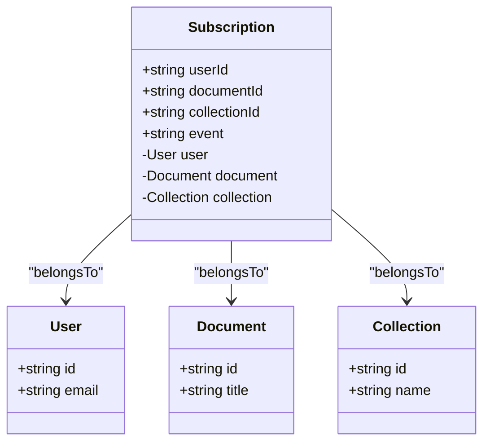
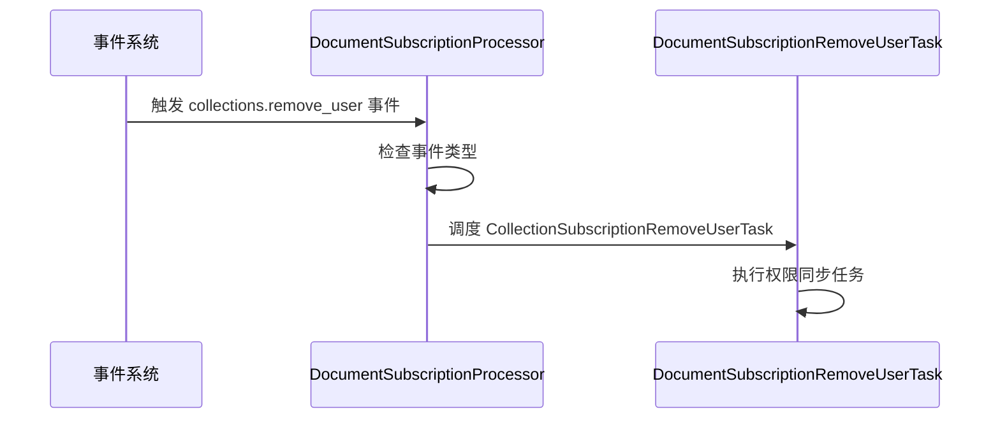
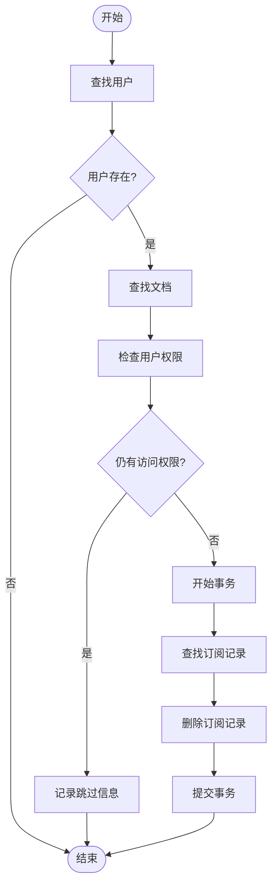
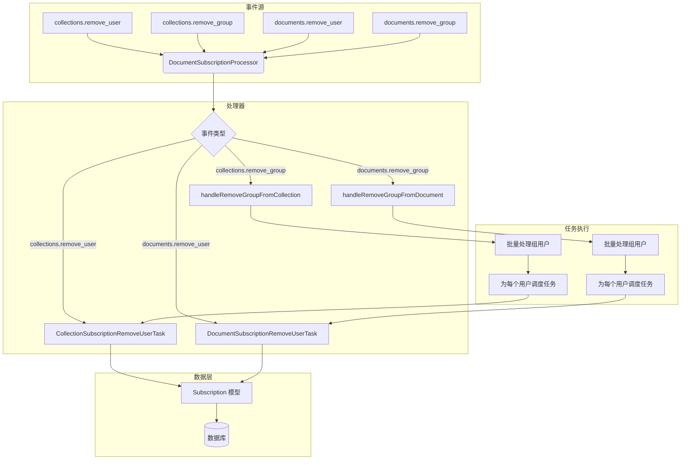

# 权限同步

<cite>
**Referenced Files in This Document**  
- [DocumentSubscriptionProcessor.ts](file://server/queues/processors/DocumentSubscriptionProcessor.ts)
- [Subscription.ts](file://server/models/Subscription.ts)
- [DocumentSubscriptionRemoveUserTask.ts](file://server/queues/tasks/DocumentSubscriptionRemoveUserTask.ts)
- [CollectionSubscriptionRemoveUserTask.ts](file://server/queues/tasks/CollectionSubscriptionRemoveUserTask.ts)
</cite>

## 目录
1. [权限同步概述](#权限同步概述)
2. [核心组件分析](#核心组件分析)
3. [权限变更处理流程](#权限变更处理流程)
4. [订阅管理逻辑](#订阅管理逻辑)
5. [性能优化与批量处理](#性能优化与批量处理)
6. [错误处理与事务管理](#错误处理与事务管理)
7. [权限同步架构图](#权限同步架构图)

## 权限同步概述

权限同步系统负责在用户权限发生变化时，自动维护其订阅状态的一致性。当用户被从集合或文档中移除时，系统会触发相应的事件处理流程，确保用户的订阅记录与实际权限保持同步。该机制通过事件驱动架构实现，利用异步任务队列来处理权限变更，保证了系统的响应性和可靠性。

**Section sources**
- [DocumentSubscriptionProcessor.ts](file://server/queues/processors/DocumentSubscriptionProcessor.ts#L1-L92)

## 核心组件分析

权限同步系统由多个核心组件构成，包括事件处理器、任务执行器和数据模型。这些组件协同工作，实现了完整的权限同步功能。

### DocumentSubscriptionProcessor

`DocumentSubscriptionProcessor` 是权限同步的核心处理器，负责监听和处理与权限变更相关的事件。该处理器订阅了四种特定事件：`collections.remove_user`、`collections.remove_group`、`documents.remove_user` 和 `documents.remove_group`。当这些事件发生时，处理器会根据事件类型调用相应的处理方法。

**Section sources**
- [DocumentSubscriptionProcessor.ts](file://server/queues/processors/DocumentSubscriptionProcessor.ts#L1-L92)

### Subscription 模型

`Subscription` 模型定义了用户订阅的核心数据结构。该模型包含用户ID、文档ID、集合ID和事件类型等关键字段，用于记录用户对特定文档或集合的订阅状态。模型通过外键关联用户、文档和集合，确保了数据的完整性和一致性。

**Diagram sources**
- [Subscription.ts](file://server/models/Subscription.ts#L1-L60)

## 权限变更处理流程

权限变更处理流程采用事件驱动架构，确保权限变更能够及时、准确地反映在用户的订阅状态上。

### 事件监听与分发

`DocumentSubscriptionProcessor` 通过 `applicableEvents` 静态属性定义了其监听的事件类型。当系统中发生权限变更事件时，处理器的 `perform` 方法会被调用，根据事件名称分发到相应的处理逻辑。

**Diagram sources**
- [DocumentSubscriptionProcessor.ts](file://server/queues/processors/DocumentSubscriptionProcessor.ts#L1-L92)

### 组权限变更处理

当用户从组中被移除时，系统需要处理更复杂的权限同步场景。`handleRemoveGroupFromCollection` 和 `handleRemoveGroupFromDocument` 私有方法负责处理组级别的权限变更。这些方法通过查询 `GroupUser` 模型，获取组内所有用户，并为每个用户调度相应的订阅移除任务。

**Section sources**
- [DocumentSubscriptionProcessor.ts](file://server/queues/processors/DocumentSubscriptionProcessor.ts#L50-L92)

## 订阅管理逻辑

订阅管理逻辑确保只有在用户确实失去访问权限时，才会移除其订阅记录。

### DocumentSubscriptionRemoveUserTask

`DocumentSubscriptionRemoveUserTask` 负责处理文档级别的订阅移除。该任务首先验证用户和文档的存在性，然后检查用户是否通过其他途径仍然具有文档访问权限。只有当用户完全失去访问权限时，才会执行订阅记录的删除操作。

**Diagram sources**
- [DocumentSubscriptionRemoveUserTask.ts](file://server/queues/tasks/DocumentSubscriptionRemoveUserTask.ts#L1-L53)

### CollectionSubscriptionRemoveUserTask

`CollectionSubscriptionRemoveUserTask` 的逻辑与文档级别任务类似，但针对集合级别的订阅进行处理。该任务同样会检查用户是否通过其他途径仍然具有集合访问权限，确保不会误删有效的订阅记录。

**Section sources**
- [CollectionSubscriptionRemoveUserTask.ts](file://server/queues/tasks/CollectionSubscriptionRemoveUserTask.ts#L1-L53)

## 性能优化与批量处理

权限同步系统在设计时充分考虑了性能优化，特别是在处理大规模团队和复杂权限结构时。

### 批量处理机制

对于组级别的权限变更，系统采用了批量处理机制。`findAllInBatches` 方法允许系统以批次方式处理组内用户，避免了一次性加载大量数据导致的内存压力。每个批次处理10个用户，这种设计平衡了处理效率和系统资源消耗。

### 异步任务调度

所有权限同步操作都通过异步任务队列执行，确保主线程不会被阻塞。这种设计提高了系统的响应性，允许在后台逐步处理权限变更，而不会影响用户的正常操作体验。

**Section sources**
- [DocumentSubscriptionProcessor.ts](file://server/queues/processors/DocumentSubscriptionProcessor.ts#L50-L92)

## 错误处理与事务管理

权限同步系统实现了完善的错误处理和事务管理机制，确保数据的一致性和完整性。

### 事务保护

所有数据库操作都在事务中执行，确保了操作的原子性。`sequelize.transaction` 方法用于创建事务，`Transaction.LOCK.UPDATE` 锁定机制防止了并发修改导致的数据竞争问题。

### 条件性删除

在删除订阅记录之前，系统会进行双重验证：首先检查用户和文档/集合的存在性，然后验证用户是否真的失去了访问权限。这种条件性删除策略避免了误操作，确保只有在必要时才会移除订阅记录。

**Section sources**
- [DocumentSubscriptionRemoveUserTask.ts](file://server/queues/tasks/DocumentSubscriptionRemoveUserTask.ts#L1-L53)

## 权限同步架构图

**Diagram sources**
- [DocumentSubscriptionProcessor.ts](file://server/queues/processors/DocumentSubscriptionProcessor.ts#L1-L92)
- [DocumentSubscriptionRemoveUserTask.ts](file://server/queues/tasks/DocumentSubscriptionRemoveUserTask.ts#L1-L53)
- [CollectionSubscriptionRemoveUserTask.ts](file://server/queues/tasks/CollectionSubscriptionRemoveUserTask.ts#L1-L53)