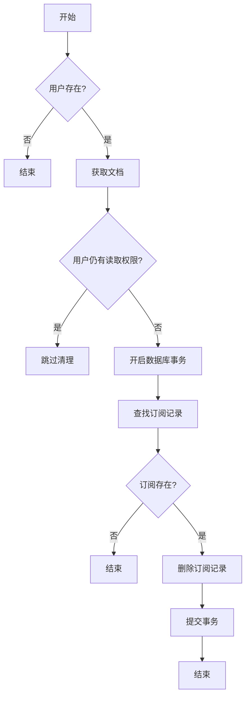
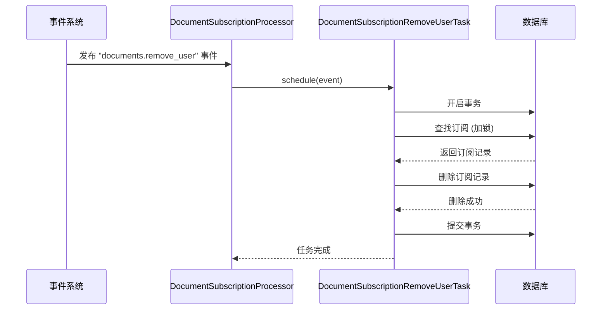

# 用户移除

<cite>
**本文档中引用的文件**  
- [DocumentSubscriptionRemoveUserTask.ts](file://server/queues/tasks/DocumentSubscriptionRemoveUserTask.ts)
- [Subscription.ts](file://server/models/Subscription.ts)
- [Document.ts](file://server/models/Document.ts)
- [User.ts](file://server/models/User.ts)
- [DocumentSubscriptionProcessor.ts](file://server/queues/processors/DocumentSubscriptionProcessor.ts)
</cite>

## 目录
1. [简介](#简介)
2. [任务职责与执行流程](#任务职责与执行流程)
3. [订阅清理逻辑详解](#订阅清理逻辑详解)
4. [事务性与安全性保证](#事务性与安全性保证)
5. [任务调度机制](#任务调度机制)
6. [批量处理与错误处理策略](#批量处理与错误处理策略)
7. [数据一致性与系统性能](#数据一致性与系统性能)
8. [总结](#总结)

## 简介
`DocumentSubscriptionRemoveUserTask` 是系统中用于处理用户从文档中移除时清理其订阅记录的核心任务。该任务确保当用户失去对某文档的访问权限时，其相关的订阅记录被安全、可靠地删除，从而维护系统的数据一致性。此任务在用户权限变更、文档权限调整或用户被移出团队成员时被触发，是保障通知系统准确性的关键组件。

**Section sources**
- [DocumentSubscriptionRemoveUserTask.ts](file://server/queues/tasks/DocumentSubscriptionRemoveUserTask.ts#L10-L51)

## 任务职责与执行流程
`DocumentSubscriptionRemoveUserTask` 的主要职责是响应“用户从文档中移除”的事件，识别并清理该用户在特定文档上的订阅记录。其执行流程如下：
1.  **用户验证**：根据事件中提供的 `userId` 从数据库中查找用户。如果用户不存在，则任务直接返回，避免无效操作。
2.  **文档获取**：根据事件中的 `documentId` 获取目标文档，并传入用户ID以进行权限预加载。
3.  **权限检查**：调用 `can(user, "read", document)` 检查该用户是否仍能通过其他途径（如所属集合的权限）访问该文档。如果用户仍有读取权限，则跳过清理，避免误删有效订阅。
4.  **事务性清理**：如果用户已无访问权限，则在一个数据库事务中执行订阅记录的查找与删除。

**Section sources**
- [DocumentSubscriptionRemoveUserTask.ts](file://server/queues/tasks/DocumentSubscriptionRemoveUserTask.ts#L10-L51)
- [User.ts](file://server/models/User.ts#L1-L860)
- [Document.ts](file://server/models/Document.ts#L1-L1318)

## 订阅清理逻辑详解
该任务的核心逻辑在于精准识别需要清理的订阅记录。它通过 `Subscription` 模型的 `findOne` 方法进行查询，查询条件严格限定为：
- `userId`：事件中指定的用户ID。
- `documentId`：事件中指定的文档ID。
- `event`：事件类型为 `SubscriptionType.Document`。

这种精确匹配确保了只删除与该用户和该文档直接关联的文档级订阅，而不会影响用户在其他文档或集合上的订阅。清理逻辑的健壮性体现在其前置的权限检查上，即使用户被从文档中移除，只要其仍能通过集合权限访问该文档，订阅就会被保留，这保证了用户体验的连贯性。

**Diagram sources**
- [DocumentSubscriptionRemoveUserTask.ts](file://server/queues/tasks/DocumentSubscriptionRemoveUserTask.ts#L10-L51)

## 事务性与安全性保证
该任务通过数据库事务和行级锁来保证操作的原子性和安全性。
- **事务性**：整个清理过程（查找和删除）被包裹在 `sequelize.transaction` 中。这意味着如果在删除过程中发生任何错误（如网络中断、数据库异常），整个事务将被回滚，确保数据库不会处于“订阅记录已删除但操作未完成”的中间状态，从而维护了数据的一致性。
- **安全性**：在 `findOne` 查询中使用了 `lock: Transaction.LOCK.UPDATE`。这会对找到的订阅记录行加锁，防止在事务提交前有其他并发任务或请求同时修改或删除同一条记录，有效避免了竞态条件（race condition）。

**Section sources**
- [DocumentSubscriptionRemoveUserTask.ts](file://server/queues/tasks/DocumentSubscriptionRemoveUserTask.ts#L35-L49)

## 任务调度机制
`DocumentSubscriptionRemoveUserTask` 并非由用户直接调用，而是由事件处理器 `DocumentSubscriptionProcessor` 在特定事件发生时自动调度。
- **触发事件**：当系统中发生 `documents.remove_user` 事件时，`DocumentSubscriptionProcessor` 会捕获该事件。
- **调度过程**：处理器会创建一个 `DocumentSubscriptionRemoveUserTask` 实例，并调用其 `schedule` 方法，将事件数据作为参数传递。这使得任务的执行与事件的产生完全解耦，符合事件驱动架构的设计原则。
- **关联任务**：类似的，当用户被从集合中移除时，会触发 `CollectionSubscriptionRemoveUserTask`，其逻辑与文档任务类似。

**Diagram sources**
- [DocumentSubscriptionProcessor.ts](file://server/queues/processors/DocumentSubscriptionProcessor.ts#L18-L46)
- [DocumentSubscriptionRemoveUserTask.ts](file://server/queues/tasks/DocumentSubscriptionRemoveUserTask.ts#L10-L51)

## 批量处理与错误处理策略
虽然 `DocumentSubscriptionRemoveUserTask` 本身处理的是单个用户-文档对，但系统通过其他机制实现了批量处理。
- **批量处理**：当一个用户组被从文档中移除时，系统会触发 `documents.remove_group` 事件。`DocumentSubscriptionProcessor` 会处理此事件，并利用 `GroupUser.findAllInBatches` 方法分批获取该组内的所有用户，然后为每个用户调度一个 `DocumentSubscriptionRemoveUserTask`。这种方式避免了因一次性加载大量用户而导致的内存溢出。
- **错误处理**：任务本身没有显式的 `try-catch` 块，因为它依赖于上层框架和队列系统的错误处理机制。如果任务执行失败（如数据库连接问题），队列系统（如Bull）会自动进行重试。同时，前置的用户和文档存在性检查也避免了因无效ID导致的错误。

**Section sources**
- [DocumentSubscriptionProcessor.ts](file://server/queues/processors/DocumentSubscriptionProcessor.ts#L61-L91)

## 数据一致性与系统性能
`DocumentSubscriptionRemoveUserTask` 在维护数据一致性和系统性能方面扮演着至关重要的角色。
- **数据一致性**：通过及时清理无效订阅，确保了通知系统的准确性。用户不会收到他们已无权访问的文档的更新通知，避免了信息泄露和用户体验混乱。
- **系统性能**：该任务的设计是轻量级的。它只操作单条订阅记录，并通过事务和锁保证了操作的高效与安全。结合分批处理机制，即使在大规模用户或组权限变更时，也能平稳运行，不会对数据库造成瞬时高负载。

## 总结
`DocumentSubscriptionRemoveUserTask` 是一个设计精巧、职责明确的后台任务。它通过事件驱动的方式，在用户权限变更时自动、安全地清理其订阅记录。其核心价值在于利用数据库事务和行级锁保证了操作的原子性与安全性，并通过与 `DocumentSubscriptionProcessor` 的协同工作，实现了对单个用户和用户组的灵活处理。该任务是保障系统数据一致性、提升用户体验和维持系统稳定性的关键一环。