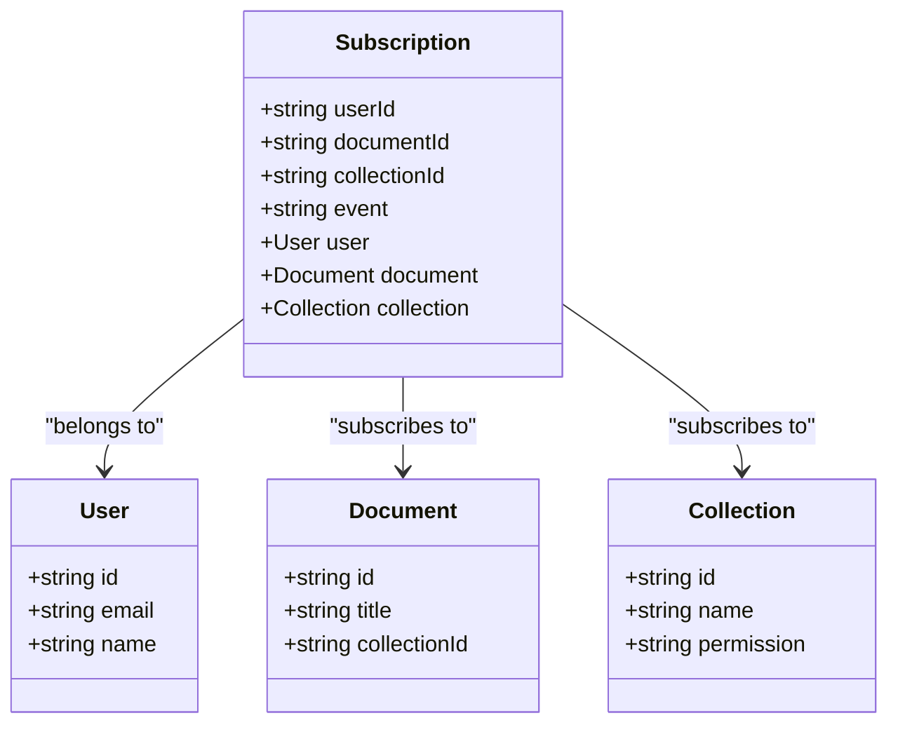
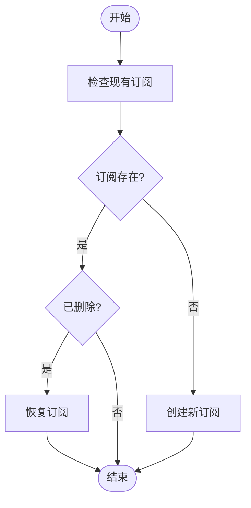
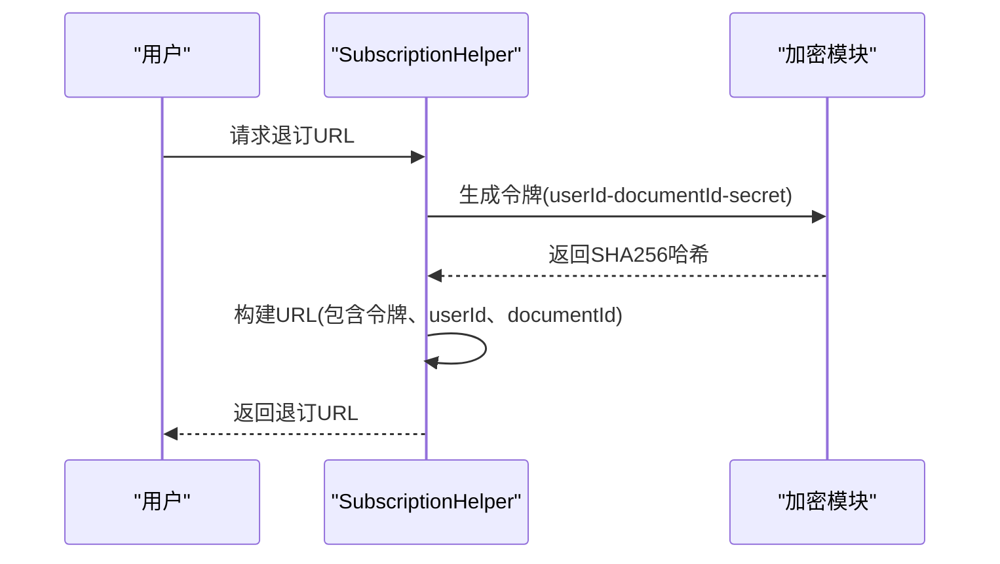
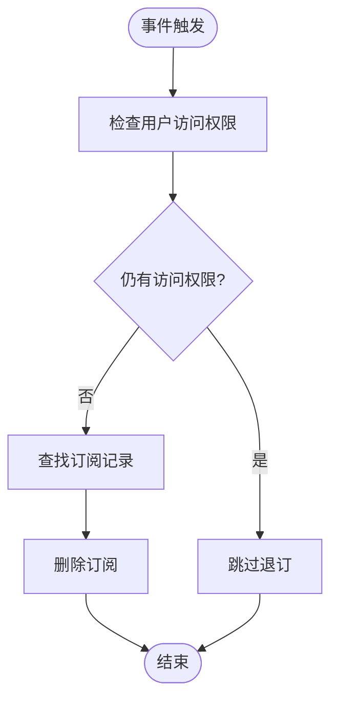

# 订阅机制

<cite>
**本文档引用的文件**   
- [Subscription.ts](file://app/models/Subscription.ts)
- [subscriptionCreator.ts](file://server/commands/subscriptionCreator.ts)
- [DocumentSubscriptionProcessor.ts](file://server/queues/processors/DocumentSubscriptionProcessor.ts)
- [SubscriptionHelper.ts](file://server/models/helpers/SubscriptionHelper.ts)
- [Document.ts](file://app/models/Document.ts)
- [Collection.ts](file://app/models/Collection.ts)
</cite>

## 目录
1. [简介](#简介)
2. [订阅数据模型](#订阅数据模型)
3. [订阅创建与管理](#订阅创建与管理)
4. [安全令牌机制](#安全令牌机制)
5. [用户权限变更处理](#用户权限变更处理)
6. [订阅生命周期管理](#订阅生命周期管理)
7. [错误处理与性能优化](#错误处理与性能优化)

## 简介
订阅机制允许用户接收文档或集合的更新通知。当用户订阅某个文档或集合时，系统会记录这一订阅关系，并在相关事件发生时向用户发送通知。该机制支持通过单击电子邮件中的链接进行一键退订，同时确保订阅状态与用户的访问权限保持同步。

**Section sources**
- [Document.ts](file://app/models/Document.ts#L39-L703)
- [Collection.ts](file://app/models/Collection.ts#L19-L455)

## 订阅数据模型
订阅模型（Subscription）用于表示用户对文档或集合的订阅关系。核心字段包括：
- **userId**: 订阅用户的ID
- **documentId**: 被订阅文档的ID
- **collectionId**: 被订阅集合的ID
- **event**: 订阅的事件类型

订阅可以针对文档或集合，但不能同时针对两者。模型通过`@Relation`装饰器与用户、文档和集合建立关联，并在删除相关实体时级联删除订阅。

**Diagram sources **
- [Subscription.ts](file://app/models/Subscription.ts#L11-L39)
- [server/models/Subscription.ts](file://server/models/Subscription.ts#L17-L56)

**Section sources**
- [Subscription.ts](file://app/models/Subscription.ts#L11-L39)
- [server/models/Subscription.ts](file://server/models/Subscription.ts#L17-L56)

## 订阅创建与管理
订阅的创建通过`subscriptionCreator`命令实现。该命令接受用户上下文、文档或集合ID以及事件类型作为参数。如果用户已存在软删除的订阅，则会恢复该订阅而非创建新的。

订阅的创建和删除流程包含以下步骤：
1. 检查用户是否已订阅
2. 如果存在软删除的订阅，则恢复
3. 否则创建新的订阅记录
4. 在事务中处理数据库操作以确保一致性

**Diagram sources **
- [subscriptionCreator.ts](file://server/commands/subscriptionCreator.ts#L25-L58)

**Section sources**
- [subscriptionCreator.ts](file://server/commands/subscriptionCreator.ts#L25-L58)

## 安全令牌机制
系统通过`SubscriptionHelper`类实现安全的退订机制。核心方法包括：
- **unsubscribeUrl**: 生成包含安全令牌的退订URL
- **unsubscribeToken**: 生成基于用户ID、文档ID和密钥的SHA256哈希令牌

退订URL包含用户ID、文档ID和生成的令牌，允许用户在未登录状态下通过单击链接退订。令牌的生成使用系统密钥作为盐值，防止被猜测。

**Diagram sources **
- [SubscriptionHelper.ts](file://server/models/helpers/SubscriptionHelper.ts#L7-L39)

**Section sources**
- [SubscriptionHelper.ts](file://server/models/helpers/SubscriptionHelper.ts#L7-L39)

## 用户权限变更处理
当用户被从文档或集合中移除时，系统会自动处理其订阅状态。`DocumentSubscriptionProcessor`监听相关事件并触发相应的退订任务：

- **documents.remove_user**: 触发`DocumentSubscriptionRemoveUserTask`
- **collections.remove_user**: 触发`CollectionSubscriptionRemoveUserTask`

处理逻辑包括：
1. 检查用户是否仍有其他方式访问文档/集合
2. 如果无访问权限，则在事务中查找并删除订阅
3. 使用行级锁确保并发安全

**Diagram sources **
- [DocumentSubscriptionProcessor.ts](file://server/queues/processors/DocumentSubscriptionProcessor.ts#L18-L91)
- [DocumentSubscriptionRemoveUserTask.ts](file://server/queues/tasks/DocumentSubscriptionRemoveUserTask.ts#L10-L51)

**Section sources**
- [DocumentSubscriptionProcessor.ts](file://server/queues/processors/DocumentSubscriptionProcessor.ts#L18-L91)
- [DocumentSubscriptionRemoveUserTask.ts](file://server/queues/tasks/DocumentSubscriptionRemoveUserTask.ts#L10-L51)

## 订阅生命周期管理
订阅的生命周期与用户权限紧密关联。系统通过以下机制确保订阅状态的准确性：
- **自动退订**: 当用户失去文档/集合访问权限时自动删除订阅
- **批量处理**: 使用`findAllInBatches`方法批量处理组成员的订阅变更
- **权限检查**: 在删除订阅前验证用户是否仍有其他访问途径

此外，文档和集合模型提供了`isSubscribed`计算属性，方便前端快速判断用户的订阅状态。

**Section sources**
- [Document.ts](file://app/models/Document.ts#L39-L703)
- [Collection.ts](file://app/models/Collection.ts#L19-L455)

## 错误处理与性能优化
系统在订阅管理中实现了多项错误处理和性能优化策略：
- **事务处理**: 所有数据库操作在事务中执行，确保数据一致性
- **软删除**: 订阅记录使用软删除，支持恢复操作
- **批量操作**: 使用`Promise.all`并行处理多个订阅的创建
- **锁机制**: 在查询订阅时使用行级锁防止并发冲突
- **分批处理**: 对大量组成员使用分批查询避免内存溢出

这些策略确保了订阅系统在高并发场景下的稳定性和性能。

**Section sources**
- [subscriptionCreator.ts](file://server/commands/subscriptionCreator.ts#L25-L58)
- [DocumentSubscriptionRemoveUserTask.ts](file://server/queues/tasks/DocumentSubscriptionRemoveUserTask.ts#L10-L51)