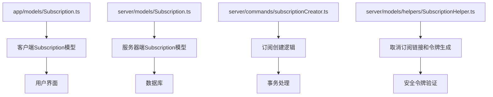
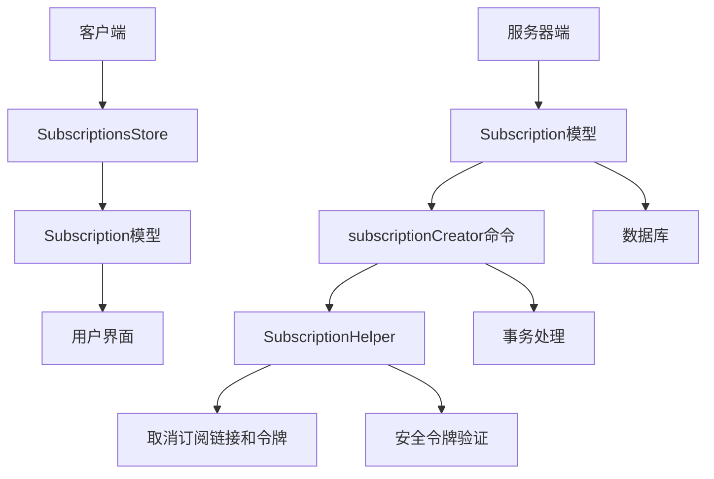
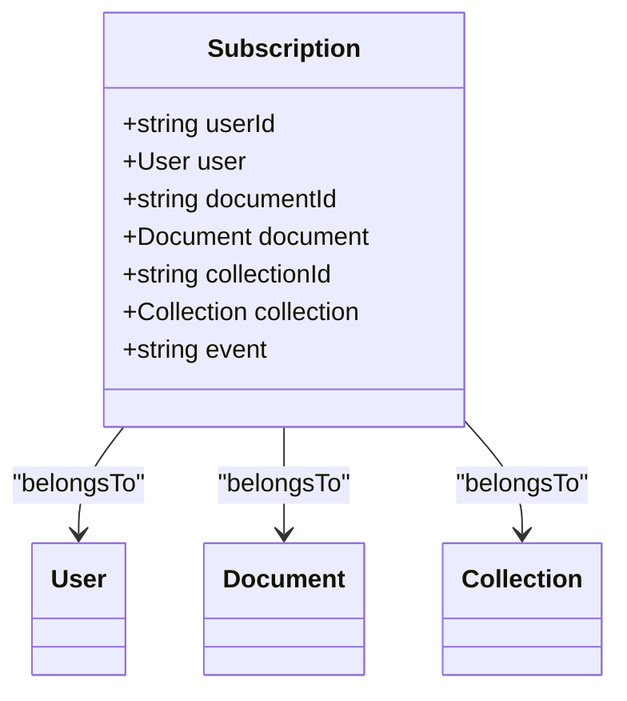
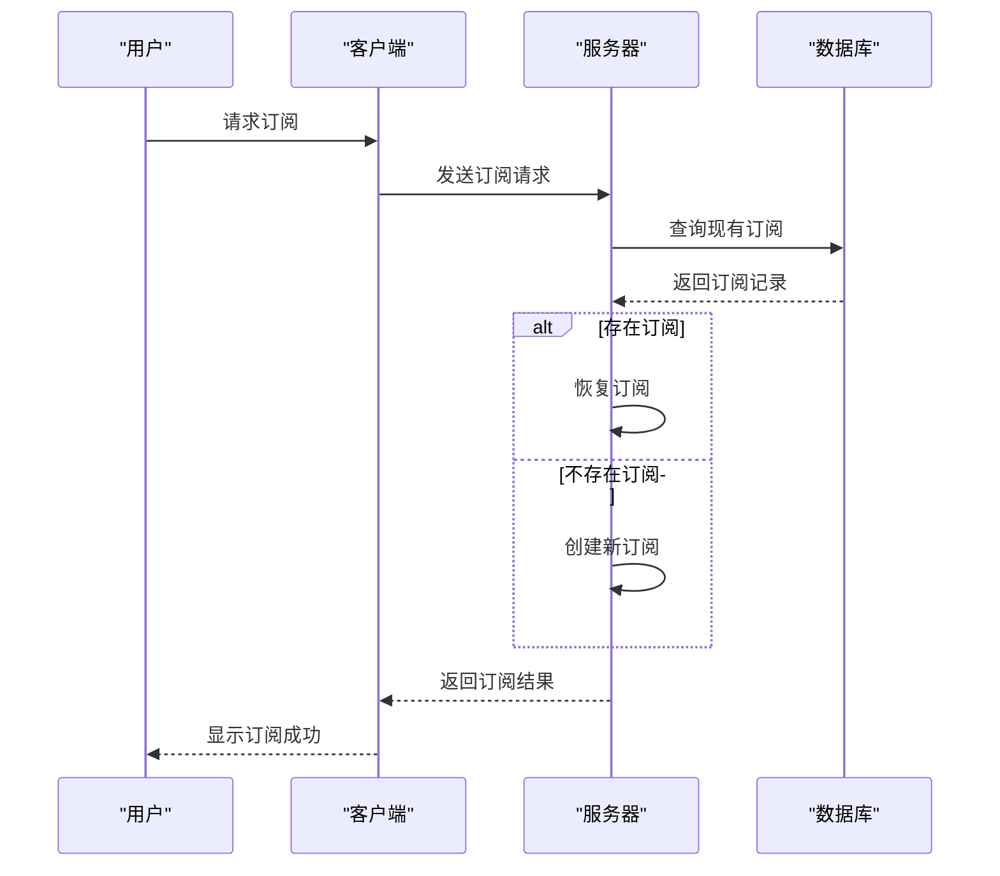
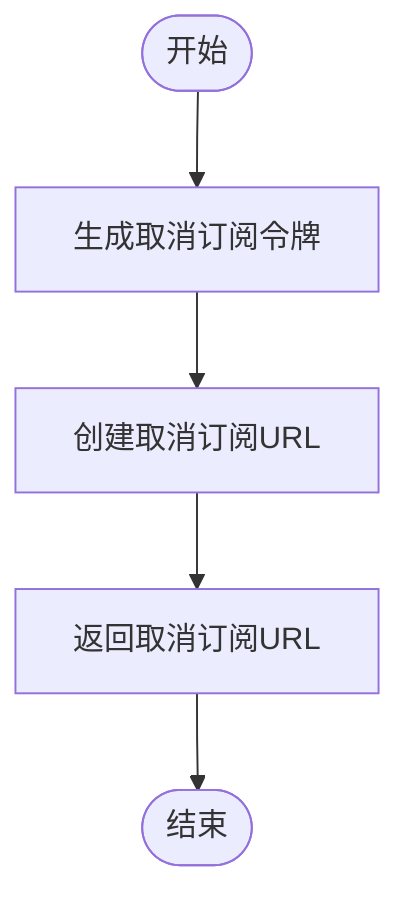
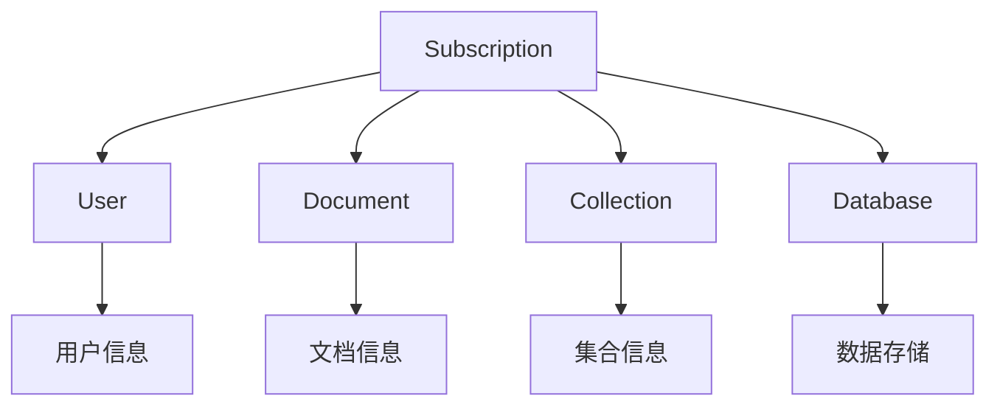

# 订阅管理

<cite>
**本文档引用的文件**   
- [Subscription.ts](file://app/models/Subscription.ts)
- [Subscription.ts](file://server/models/Subscription.ts)
- [subscriptionCreator.ts](file://server/commands/subscriptionCreator.ts)
- [SubscriptionsStore.ts](file://app/stores/SubscriptionsStore.ts)
- [SubscriptionHelper.ts](file://server/models/helpers/SubscriptionHelper.ts)
</cite>

## 目录
1. [简介](#简介)
2. [项目结构](#项目结构)
3. [核心组件](#核心组件)
4. [架构概述](#架构概述)
5. [详细组件分析](#详细组件分析)
6. [依赖分析](#依赖分析)
7. [性能考虑](#性能考虑)
8. [故障排除指南](#故障排除指南)
9. [结论](#结论)
10. [附录](#附录)（如有必要）

## 简介
本文档详细介绍了订阅管理系统的实现，重点分析了Subscription模型和用户订阅管理功能。文档解释了用户如何订阅文档或集合的更新，以及订阅数据模型中关键字段如userId、documentId、collectionId和event的用途。同时，文档深入探讨了SubscriptionHelper中unsubscribeUrl和unsubscribeToken等核心方法的实现逻辑，包括安全令牌的生成和验证机制。通过实际代码示例说明了订阅的创建、更新和删除流程，包括权限检查和事务处理。为初学者提供订阅系统的概念性理解，同时为经验丰富的开发者提供技术细节，包括订阅的批量处理、性能优化和错误处理策略。

## 项目结构
项目结构清晰地组织了订阅管理相关的文件，主要分布在app/models、server/models和server/commands目录中。Subscription模型在客户端和服务器端都有定义，确保了数据的一致性和完整性。客户端的Subscription模型位于app/models/Subscription.ts，而服务器端的模型位于server/models/Subscription.ts。订阅的创建逻辑由server/commands/subscriptionCreator.ts文件处理，而订阅的辅助功能如生成取消订阅链接和令牌则由server/models/helpers/SubscriptionHelper.ts提供。



**图表来源**
- [app/models/Subscription.ts](file://app/models/Subscription.ts#L1-L43)
- [server/models/Subscription.ts](file://server/models/Subscription.ts#L1-L60)
- [server/commands/subscriptionCreator.ts](file://server/commands/subscriptionCreator.ts#L1-L92)
- [server/models/helpers/SubscriptionHelper.ts](file://server/models/helpers/SubscriptionHelper.ts#L1-L41)

**章节来源**
- [app/models/Subscription.ts](file://app/models/Subscription.ts#L1-L43)
- [server/models/Subscription.ts](file://server/models/Subscription.ts#L1-L60)
- [server/commands/subscriptionCreator.ts](file://server/commands/subscriptionCreator.ts#L1-L92)
- [server/models/helpers/SubscriptionHelper.ts](file://server/models/helpers/SubscriptionHelper.ts#L1-L41)

## 核心组件
订阅管理系统的核心组件包括Subscription模型、subscriptionCreator命令和SubscriptionHelper辅助类。这些组件共同实现了用户订阅文档或集合更新的功能。

**章节来源**
- [app/models/Subscription.ts](file://app/models/Subscription.ts#L11-L39)
- [server/models/Subscription.ts](file://server/models/Subscription.ts#L17-L56)
- [server/commands/subscriptionCreator.ts](file://server/commands/subscriptionCreator.ts#L25-L58)
- [server/models/helpers/SubscriptionHelper.ts](file://server/models/helpers/SubscriptionHelper.ts#L7-L39)

## 架构概述
订阅管理系统的架构分为客户端和服务器端两部分。客户端通过SubscriptionsStore管理订阅状态，而服务器端通过Subscription模型和subscriptionCreator命令处理订阅的创建和管理。SubscriptionHelper辅助类提供了生成取消订阅链接和令牌的功能，确保了用户可以安全地取消订阅。



**图表来源**
- [app/stores/SubscriptionsStore.ts](file://app/stores/SubscriptionsStore.ts#L9-L56)
- [app/models/Subscription.ts](file://app/models/Subscription.ts#L11-L39)
- [server/models/Subscription.ts](file://server/models/Subscription.ts#L17-L56)
- [server/commands/subscriptionCreator.ts](file://server/commands/subscriptionCreator.ts#L25-L58)
- [server/models/helpers/SubscriptionHelper.ts](file://server/models/helpers/SubscriptionHelper.ts#L7-L39)

## 详细组件分析
### Subscription模型分析
Subscription模型是订阅管理系统的核心，定义了用户订阅文档或集合更新的数据结构。模型包含userId、documentId、collectionId和event等关键字段，用于标识订阅的用户、文档或集合以及订阅的事件类型。

#### 客户端Subscription模型


**图表来源**
- [app/models/Subscription.ts](file://app/models/Subscription.ts#L11-L39)

#### 服务器端Subscription模型


**图表来源**
- [server/models/Subscription.ts](file://server/models/Subscription.ts#L17-L56)

### subscriptionCreator命令分析
subscriptionCreator命令负责创建用户的订阅。该命令首先检查用户是否已经订阅了特定的文档或集合，如果已订阅，则恢复之前的订阅记录。如果未订阅，则创建新的订阅记录。



**图表来源**
- [server/commands/subscriptionCreator.ts](file://server/commands/subscriptionCreator.ts#L25-L58)

### SubscriptionHelper辅助类分析
SubscriptionHelper辅助类提供了生成取消订阅链接和令牌的功能。通过生成唯一的令牌，确保用户可以安全地取消订阅，而无需登录系统。



**图表来源**
- [server/models/helpers/SubscriptionHelper.ts](file://server/models/helpers/SubscriptionHelper.ts#L7-L39)

**章节来源**
- [server/models/helpers/SubscriptionHelper.ts](file://server/models/helpers/SubscriptionHelper.ts#L7-L39)

## 依赖分析
订阅管理系统依赖于多个组件，包括用户模型、文档模型、集合模型和数据库。这些依赖关系确保了订阅数据的完整性和一致性。



**图表来源**
- [app/models/Subscription.ts](file://app/models/Subscription.ts#L11-L39)
- [server/models/Subscription.ts](file://server/models/Subscription.ts#L17-L56)

**章节来源**
- [app/models/Subscription.ts](file://app/models/Subscription.ts#L11-L39)
- [server/models/Subscription.ts](file://server/models/Subscription.ts#L17-L56)

## 性能考虑
订阅管理系统的性能优化主要集中在减少数据库查询次数和提高事务处理效率。通过使用软删除和恢复机制，避免了频繁的插入和删除操作，从而提高了系统的响应速度。

## 故障排除指南
### 常见问题
- **订阅创建失败**：检查用户权限和文档或集合的有效性。
- **取消订阅链接无效**：确保令牌生成和验证逻辑正确无误。
- **订阅状态不一致**：检查数据库中的订阅记录是否正确更新。

**章节来源**
- [server/commands/subscriptionCreator.ts](file://server/commands/subscriptionCreator.ts#L25-L58)
- [server/models/helpers/SubscriptionHelper.ts](file://server/models/helpers/SubscriptionHelper.ts#L7-L39)

## 结论
订阅管理系统通过精心设计的模型和命令，实现了用户订阅文档或集合更新的功能。通过生成安全的取消订阅链接和令牌，确保了用户可以方便地管理自己的订阅。系统的性能优化和错误处理策略进一步提升了用户体验。

## 附录
### 代码示例
#### 创建订阅
```typescript
const subscription = await subscriptionCreator({
  ctx,
  documentId: 'doc123',
  event: SubscriptionType.Document,
  resubscribe: true,
});
```

#### 生成取消订阅链接
```typescript
const unsubscribeUrl = SubscriptionHelper.unsubscribeUrl('user123', 'doc123');
```

### 参考资料
- [Sequelize文档](https://sequelize.org/)
- [MobX文档](https://mobx.js.org/)
- [Node.js Crypto模块](https://nodejs.org/api/crypto.html)