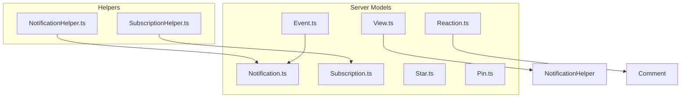
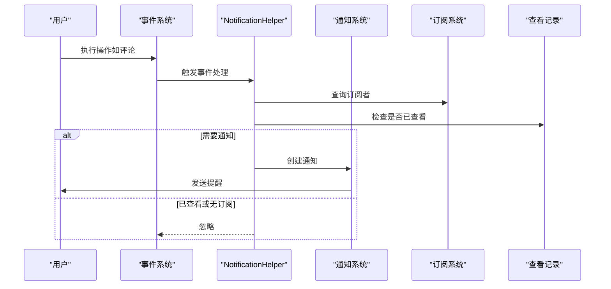
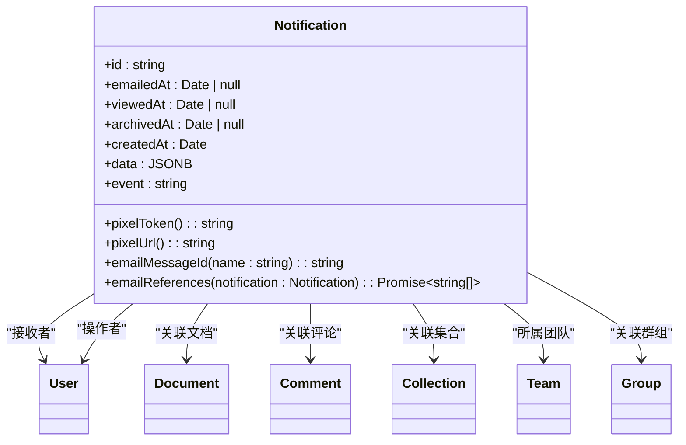
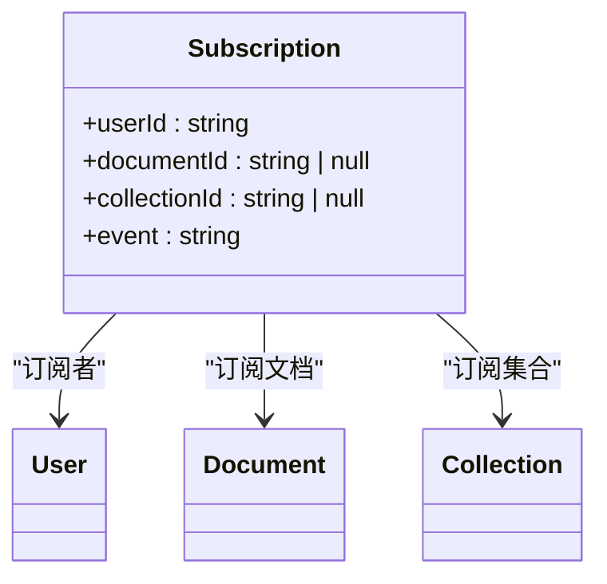
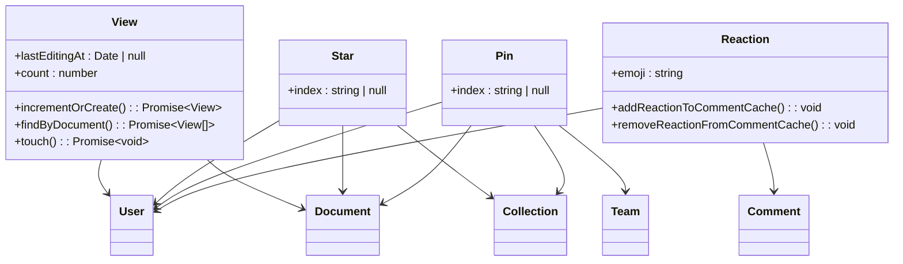
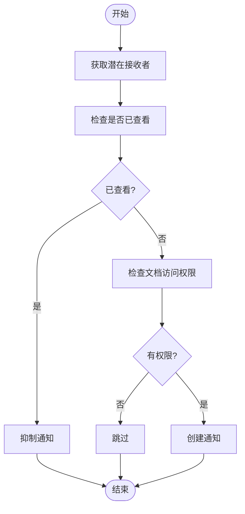
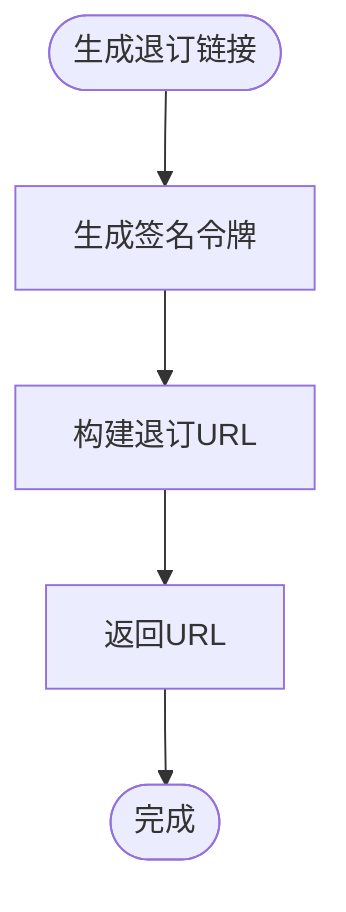
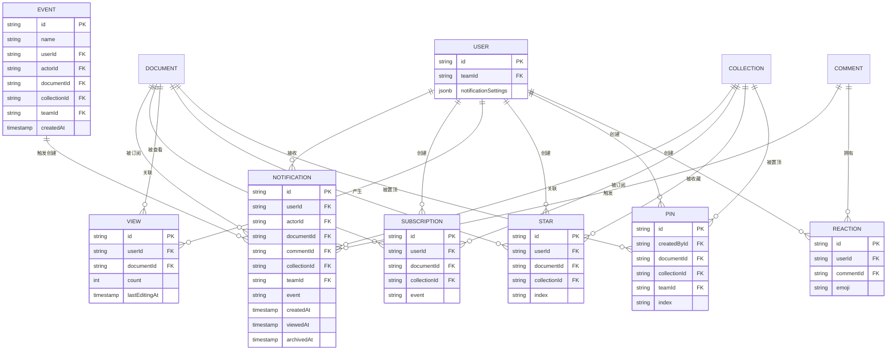

# 通知与订阅模型

<cite>
**本文档中引用的文件**  
- [Notification.ts](file://server/models/Notification.ts)
- [Subscription.ts](file://server/models/Subscription.ts)
- [Event.ts](file://server/models/Event.ts)
- [View.ts](file://server/models/View.ts)
- [Star.ts](file://server/models/Star.ts)
- [Pin.ts](file://server/models/Pin.ts)
- [Reaction.ts](file://server/models/Reaction.ts)
- [NotificationHelper.ts](file://server/models/helpers/NotificationHelper.ts)
- [SubscriptionHelper.ts](file://server/models/helpers/SubscriptionHelper.ts)
</cite>

## 目录
1. [简介](#简介)
2. [项目结构](#项目结构)
3. [核心组件](#核心组件)
4. [架构概述](#架构概述)
5. [详细组件分析](#详细组件分析)
6. [依赖分析](#依赖分析)
7. [性能考虑](#性能考虑)
8. [故障排除指南](#故障排除指南)
9. [结论](#结论)

## 简介
本文档详细介绍了通知与订阅系统的设计与实现，重点涵盖 `Notification`、`Subscription`、`Event`、`View`、`Star`、`Pin` 和 `Reaction` 数据模型。系统通过事件驱动机制实现用户行为的实时响应，支持文档、集合等资源的关注与提醒功能。同时，文档还解释了查看记录、收藏、置顶和反应等用户交互功能的数据结构与逻辑流程。

## 项目结构
通知与订阅相关的核心模型位于 `server/models/` 目录下，辅助逻辑封装在 `server/models/helpers/` 中。前端组件如通知面板、收藏按钮等位于 `app/components/Notifications/` 和 `app/components/Reactions/` 等路径。

**Diagram sources**
- [server/models/Notification.ts](file://server/models/Notification.ts#L1-L292)
- [server/models/Subscription.ts](file://server/models/Subscription.ts#L1-L60)
- [server/models/Event.ts](file://server/models/Event.ts#L1-L195)
- [server/models/helpers/NotificationHelper.ts](file://server/models/helpers/NotificationHelper.ts#L1-L245)
- [server/models/helpers/SubscriptionHelper.ts](file://server/models/helpers/SubscriptionHelper.ts#L1-L41)

**Section sources**
- [server/models/Notification.ts](file://server/models/Notification.ts#L1-L292)
- [server/models/Subscription.ts](file://server/models/Subscription.ts#L1-L60)
- [server/models/Event.ts](file://server/models/Event.ts#L1-L195)

## 核心组件

本文档涵盖以下核心数据模型及其交互逻辑：
- **Notification（通知）**：表示系统向用户发送的消息提醒。
- **Subscription（订阅）**：记录用户对特定资源（文档或集合）的关注。
- **Event（事件）**：触发通知生成的行为记录，如文档更新、评论等。
- **View（查看）**：记录用户对文档的访问行为，用于通知去重。
- **Star（收藏）**：用户对文档或集合的收藏标记。
- **Pin（置顶）**：用户将文档固定在首页或侧边栏。
- **Reaction（反应）**：用户对评论的快速反馈（如点赞、表情）。

这些模型共同构成了用户交互与系统反馈的核心机制。

**Section sources**
- [server/models/Notification.ts](file://server/models/Notification.ts#L1-L292)
- [server/models/Subscription.ts](file://server/models/Subscription.ts#L1-L60)
- [server/models/Event.ts](file://server/models/Event.ts#L1-L195)
- [server/models/View.ts](file://server/models/View.ts#L1-L128)
- [server/models/Star.ts](file://server/models/Star.ts#L1-L54)
- [server/models/Pin.ts](file://server/models/Pin.ts#L1-L62)
- [server/models/Reaction.ts](file://server/models/Reaction.ts#L1-L164)

## 架构概述

系统采用事件驱动架构，用户操作首先生成 `Event`，通过 `NotificationHelper` 判断是否需要发送通知，若需发送则创建 `Notification` 记录。用户通过 `Subscription` 决定接收哪些类型的通知，`View` 记录用于避免重复通知。`Star`、`Pin`、`Reaction` 则为增强用户交互体验的功能模块。

**Diagram sources**
- [server/models/Event.ts](file://server/models/Event.ts#L1-L195)
- [server/models/helpers/NotificationHelper.ts](file://server/models/helpers/NotificationHelper.ts#L1-L245)
- [server/models/Notification.ts](file://server/models/Notification.ts#L1-L292)

## 详细组件分析

### 通知模型分析

`Notification` 模型是系统通知的核心，存储所有待发送或已发送的通知记录。它关联用户、操作者、文档、评论等实体，并通过 `event` 字段区分不同类型的通知（如文档发布、评论创建等）。

**Diagram sources**
- [server/models/Notification.ts](file://server/models/Notification.ts#L1-L292)

**Section sources**
- [server/models/Notification.ts](file://server/models/Notification.ts#L1-L292)

### 订阅模型分析

`Subscription` 模型记录用户对特定资源的关注。用户可订阅某个文档或整个集合，当相关事件发生时，系统将检查订阅关系以决定通知接收者。

**Diagram sources**
- [server/models/Subscription.ts](file://server/models/Subscription.ts#L1-L60)

**Section sources**
- [server/models/Subscription.ts](file://server/models/Subscription.ts#L1-L60)

### 事件模型分析

`Event` 模型记录系统中发生的所有关键操作，是通知系统的触发源。每个事件包含操作者、目标资源、IP地址等元数据，并通过队列异步处理。

```mermaid
classDiagram
class Event {
+modelId : string | null
+name : string
+ip : string | null
+authType : string | null
+data : JSONB
+changes : JSONB
+createdAt : Date
+schedule(event : Partial~Event~) : void
+findLatest(where : WhereOptions) : Promise~Event | null~
+createFromContext(ctx : Context, attributes : any) : Promise~Event~
}
Event --> User : "用户"
Event --> Document : "文档"
Event --> Collection : "集合"
Event --> Team : "团队"
```

**Diagram sources**
- [server/models/Event.ts](file://server/models/Event.ts#L1-L195)

**Section sources**
- [server/models/Event.ts](file://server/models/Event.ts#L1-L195)

### 查看、收藏、置顶与反应模型分析

这些模型用于增强用户交互体验：
- `View`：记录用户访问，防止重复通知。
- `Star`：用户收藏文档或集合。
- `Pin`：用户将文档置顶显示。
- `Reaction`：用户对评论添加表情反馈。

**Diagram sources**
- [server/models/View.ts](file://server/models/View.ts#L1-L128)
- [server/models/Star.ts](file://server/models/Star.ts#L1-L54)
- [server/models/Pin.ts](file://server/models/Pin.ts#L1-L62)
- [server/models/Reaction.ts](file://server/models/Reaction.ts#L1-L164)

**Section sources**
- [server/models/View.ts](file://server/models/View.ts#L1-L128)
- [server/models/Star.ts](file://server/models/Star.ts#L1-L54)
- [server/models/Pin.ts](file://server/models/Pin.ts#L1-L62)
- [server/models/Reaction.ts](file://server/models/Reaction.ts#L1-L164)

### 通知生成逻辑分析

`NotificationHelper` 类封装了通知接收者的计算逻辑。根据事件类型（文档、评论、集合），查询符合条件的用户，并结合 `View` 记录进行去重，确保用户不会收到重复通知。

**Diagram sources**
- [server/models/helpers/NotificationHelper.ts](file://server/models/helpers/NotificationHelper.ts#L1-L245)

**Section sources**
- [server/models/helpers/NotificationHelper.ts](file://server/models/helpers/NotificationHelper.ts#L1-L245)

### 订阅管理逻辑分析

`SubscriptionHelper` 提供了用户退订的便捷功能，生成带签名的URL，允许用户无需登录即可取消订阅，提升用户体验。

**Diagram sources**
- [server/models/helpers/SubscriptionHelper.ts](file://server/models/helpers/SubscriptionHelper.ts#L1-L41)

**Section sources**
- [server/models/helpers/SubscriptionHelper.ts](file://server/models/helpers/SubscriptionHelper.ts#L1-L41)

## 依赖分析

系统各组件间存在紧密依赖关系，通过 Sequelize 的关联机制实现数据联动。事件触发通知，订阅决定接收者，查看记录用于去重，反应更新评论缓存。

**Diagram sources**
- [server/models/Notification.ts](file://server/models/Notification.ts#L1-L292)
- [server/models/Subscription.ts](file://server/models/Subscription.ts#L1-L60)
- [server/models/Event.ts](file://server/models/Event.ts#L1-L195)
- [server/models/View.ts](file://server/models/View.ts#L1-L128)
- [server/models/Star.ts](file://server/models/Star.ts#L1-L54)
- [server/models/Pin.ts](file://server/models/Pin.ts#L1-L62)
- [server/models/Reaction.ts](file://server/models/Reaction.ts#L1-L164)

**Section sources**
- [server/models/Notification.ts](file://server/models/Notification.ts#L1-L292)
- [server/models/Subscription.ts](file://server/models/Subscription.ts#L1-L60)
- [server/models/Event.ts](file://server/models/Event.ts#L1-L195)

## 性能考虑
系统通过多种方式优化性能：
- 使用数据库索引加速查询（如 `userId`、`documentId` 等字段）。
- 通过 `View` 记录避免重复通知，减少不必要的数据库写入。
- 事件处理采用异步队列，避免阻塞主请求。
- `NotificationHelper` 中使用 `uniqBy` 去重，减少重复用户处理。

## 故障排除指南
- **用户未收到通知**：检查用户是否订阅了相关事件类型，是否已查看文档，是否有访问权限。
- **通知重复**：检查 `View` 表中是否有最新访问记录，确认事件时间与查看时间的比较逻辑。
- **退订链接无效**：验证 `unsubscribeToken` 的生成逻辑，确保 `SECRET_KEY` 一致。

**Section sources**
- [server/models/helpers/NotificationHelper.ts](file://server/models/helpers/NotificationHelper.ts#L1-L245)
- [server/models/helpers/SubscriptionHelper.ts](file://server/models/helpers/SubscriptionHelper.ts#L1-L41)

## 结论
本文档全面解析了通知与订阅系统的设计与实现。系统通过事件驱动、订阅机制和查看记录去重，实现了高效、精准的用户提醒功能。`Star`、`Pin`、`Reaction` 等交互模型进一步增强了用户体验。整体架构清晰，扩展性强，适合大规模协作场景。