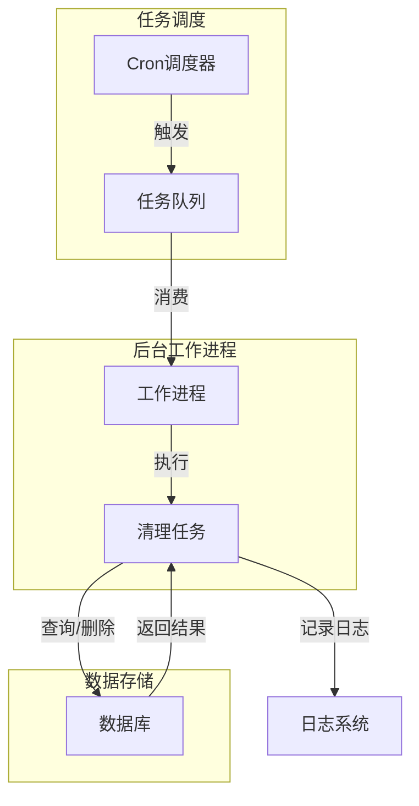
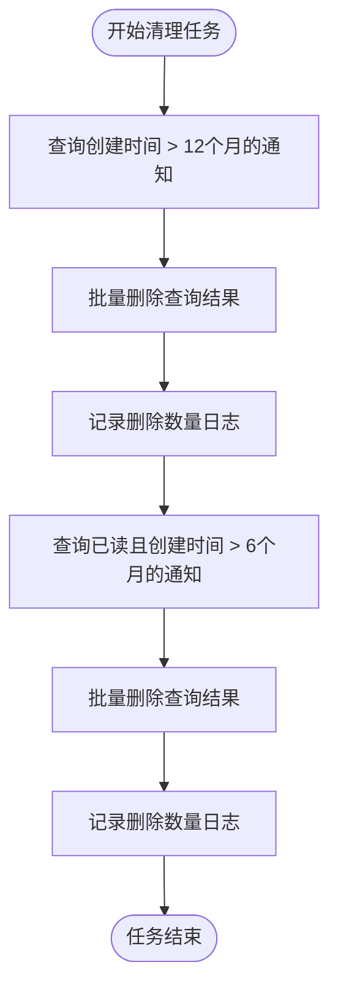
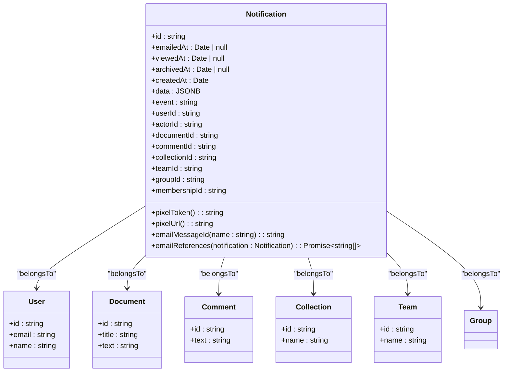
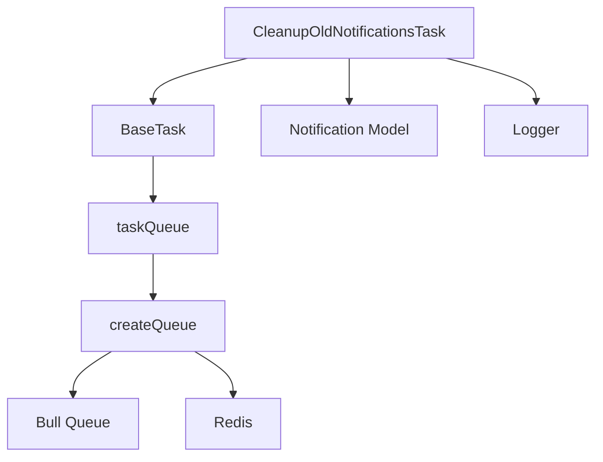

# 通知清理

<cite>
**Referenced Files in This Document**   
- [CleanupOldNotificationsTask.ts](file://server/queues/tasks/CleanupOldNotificationsTask.ts)
- [Notification.ts](file://server/models/Notification.ts)
- [BaseTask.ts](file://server/queues/tasks/BaseTask.ts)
- [queue.ts](file://server/queues/queue.ts)
- [index.ts](file://server/queues/index.ts)
</cite>

## 目录
1. [简介](#简介)
2. [项目结构](#项目结构)
3. [核心组件](#核心组件)
4. [架构概述](#架构概述)
5. [详细组件分析](#详细组件分析)
6. [依赖分析](#依赖分析)
7. [性能考虑](#性能考虑)
8. [故障排除指南](#故障排除指南)
9. [结论](#结论)
10. [附录](#附录)（如有必要）

## 简介
本文档详细介绍了系统中通知清理机制的设计与实现，重点阐述了过期通知的自动化清理流程。文档深入分析了`CleanupOldNotificationsTask`任务的执行逻辑和调度策略，解释了通知保留策略的设计原则，包括基于时间的过期规则和存储空间优化考虑。通过实际代码示例，说明了任务如何查询和删除过期通知，以及相关的权限验证和错误处理机制。同时，文档还描述了通知清理对系统性能和数据库维护的影响，以及如何平衡数据保留和存储成本。为初学者提供自动化任务和数据维护的概念性理解，同时为经验丰富的开发者提供技术细节，包括任务调度、批量删除优化和监控告警策略。

## 项目结构
通知清理功能主要分布在服务器端的`queues`和`models`目录中。`server/queues/tasks/`目录包含了各种后台任务的实现，其中`CleanupOldNotificationsTask.ts`是负责清理过期通知的核心任务。`server/models/`目录定义了数据模型，`Notification.ts`文件定义了通知实体的结构和行为。任务调度系统由`server/queues/`目录下的`queue.ts`和`index.ts`等文件构成，负责管理任务队列和执行。

**Section sources**
- [CleanupOldNotificationsTask.ts](file://server/queues/tasks/CleanupOldNotificationsTask.ts)
- [Notification.ts](file://server/models/Notification.ts)

## 核心组件
通知清理机制的核心组件包括`CleanupOldNotificationsTask`任务类、`Notification`模型类以及底层的任务调度框架。`CleanupOldNotificationsTask`继承自`BaseTask`，实现了具体的清理逻辑。`Notification`模型定义了通知数据的结构，并提供了与数据库交互的接口。任务调度框架则负责周期性地触发清理任务。

**Section sources**
- [CleanupOldNotificationsTask.ts](file://server/queues/tasks/CleanupOldNotificationsTask.ts#L8-L51)
- [BaseTask.ts](file://server/queues/tasks/BaseTask.ts#L16-L71)
- [Notification.ts](file://server/models/Notification.ts#L37-L288)

## 架构概述
通知清理系统采用基于队列的异步任务处理架构。清理任务被注册到一个名为`tasks`的Bull队列中，由独立的后台工作进程（worker）消费和执行。该架构实现了业务逻辑与任务调度的解耦，确保了清理操作不会阻塞主应用流程。系统通过`HealthMonitor`监控队列的健康状态，保证任务的可靠执行。

**Diagram sources **
- [queue.ts](file://server/queues/queue.ts#L1-L69)
- [index.ts](file://server/queues/index.ts#L23-L29)
- [HealthMonitor.ts](file://server/queues/HealthMonitor.ts#L1-L41)

## 详细组件分析

### CleanupOldNotificationsTask 分析
`CleanupOldNotificationsTask`是负责执行通知清理的核心任务。它继承自`BaseTask`，并重写了`perform`方法来实现具体的清理逻辑。

#### 执行逻辑
该任务的执行逻辑分为两个阶段：
1.  **清理创建时间超过12个月的通知**：首先，任务会查询并删除所有创建时间（`createdAt`）早于当前时间6个月的所有已读通知。这通过`Notification.destroy`方法实现，该方法直接在数据库层面执行批量删除操作，效率较高。

**Diagram sources **
- [CleanupOldNotificationsTask.ts](file://server/queues/tasks/CleanupOldNotificationsTask.ts#L11-L43)

#### 调度策略
该任务的调度策略由静态属性`static cron = TaskSchedule.Hour`定义，表示该任务将每小时执行一次。这种高频调度确保了过期通知能够被及时清理，防止数据库中积累大量无用数据。任务的优先级被设置为`TaskPriority.Background`，表明它是一个后台低优先级任务，不会影响系统的实时响应性能。

**Section sources**
- [CleanupOldNotificationsTask.ts](file://server/queues/tasks/CleanupOldNotificationsTask.ts#L8-L51)

### Notification 模型分析
`Notification`模型定义了通知数据的结构和行为，是清理任务操作的基础。

#### 数据结构
`Notification`模型包含多个关键字段：
- `id`: 通知的唯一标识符。
- `createdAt`: 通知的创建时间，是清理任务判断过期的核心依据。
- `viewedAt`: 通知的查看时间，用于区分已读和未读通知。
- `archivedAt`: 通知的归档时间。
- `event`: 通知的事件类型（如文档更新、评论等）。
- `userId`: 接收通知的用户ID。

这些字段通过Sequelize的装饰器（如`@Column`, `@CreatedAt`）映射到数据库表的列。

#### 保留策略设计
通知保留策略的设计原则是平衡用户体验和存储成本。系统采用双重过期规则：
1.  **长期保留**：所有通知，无论是否已读，只要创建时间不超过12个月，都会被保留。这确保了用户有足够的时间回顾历史通知。
2.  **短期清理**：对于已读通知，如果创建时间超过6个月，则会被清理。这针对的是用户已经处理过的、价值较低的通知，有效释放存储空间。

这种策略既保证了数据的可用性，又避免了不必要的存储开销。

**Diagram sources **
- [Notification.ts](file://server/models/Notification.ts#L37-L288)

## 依赖分析
通知清理任务依赖于多个核心组件。

**Diagram sources **
- [CleanupOldNotificationsTask.ts](file://server/queues/tasks/CleanupOldNotificationsTask.ts#L8-L51)
- [BaseTask.ts](file://server/queues/tasks/BaseTask.ts#L16-L71)
- [queue.ts](file://server/queues/queue.ts#L1-L69)
- [index.ts](file://server/queues/index.ts#L23-L29)

**Section sources**
- [CleanupOldNotificationsTask.ts](file://server/queues/tasks/CleanupOldNotificationsTask.ts#L6-L6)
- [BaseTask.ts](file://server/queues/tasks/BaseTask.ts#L1-L73)
- [queue.ts](file://server/queues/queue.ts#L1-L69)

## 性能考虑
通知清理对系统性能和数据库维护有显著影响。通过批量删除操作，减少了数据库的I/O次数和事务开销。每小时执行一次的调度频率在及时性和系统负载之间取得了平衡。清理已读通知的策略有效降低了数据库的存储压力和查询复杂度，提升了整体性能。然而，如果通知数据量巨大，单次清理操作仍可能对数据库造成短暂的负载高峰，因此建议在系统低峰期执行或进一步优化为分批删除。

## 故障排除指南
当通知清理任务出现问题时，应首先检查日志。`Logger.info`语句会记录任务的开始和删除数量，可用于确认任务是否正常执行。如果任务未按预期执行，需检查`taskQueue`的状态和`HealthMonitor`的监控日志，确认队列是否健康。数据库连接问题或权限不足也可能导致清理失败，应检查相关配置和错误日志。

**Section sources**
- [CleanupOldNotificationsTask.ts](file://server/queues/tasks/CleanupOldNotificationsTask.ts#L11-L43)
- [HealthMonitor.ts](file://server/queues/HealthMonitor.ts#L1-L41)

## 结论
本文档全面介绍了通知清理机制的实现。`CleanupOldNotificationsTask`任务通过高效的批量删除操作，结合合理的过期策略，实现了对过期通知的自动化管理。该机制不仅优化了存储空间，也提升了系统的整体性能和可维护性。其基于队列的异步架构保证了系统的稳定性和可靠性。

## 附录
### 通知事件类型
| 事件类型 (NotificationEventType) | 描述 |
| :--- | :--- |
| `PublishDocument` | 文档已发布 |
| `UpdateDocument` | 文档已更新 |
| `CreateComment` | 已创建评论 |
| `MentionedInDocument` | 在文档中被提及 |
| `AddUserToCollection` | 用户被添加到集合 |