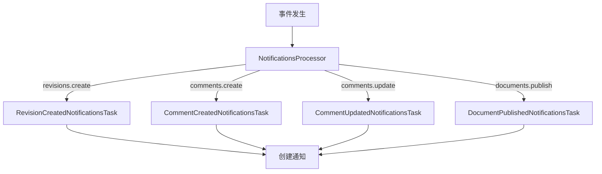
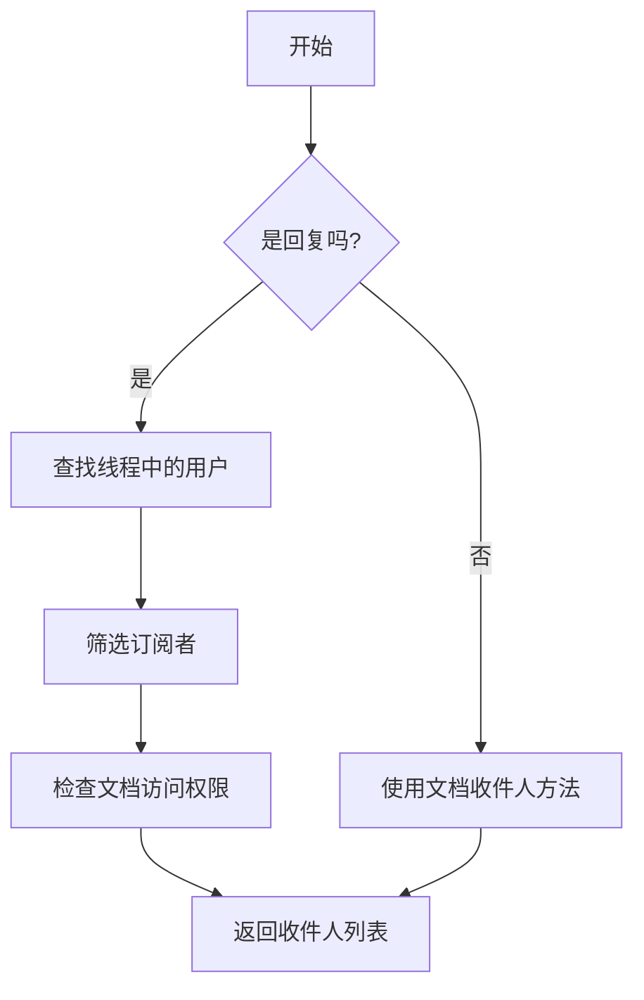
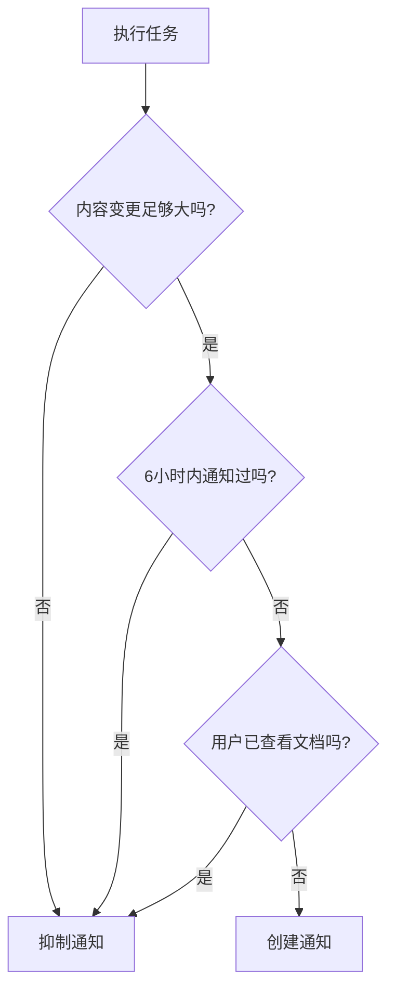

# 通知生成

<cite>
**本文档中引用的文件**   
- [Notification.ts](file://app/models/Notification.ts)
- [Notification.ts](file://server/models/Notification.ts)
- [NotificationHelper.ts](file://server/models/helpers/NotificationHelper.ts)
- [CommentCreatedNotificationsTask.ts](file://server/queues/tasks/CommentCreatedNotificationsTask.ts)
- [RevisionCreatedNotificationsTask.ts](file://server/queues/tasks/RevisionCreatedNotificationsTask.ts)
- [NotificationsProcessor.ts](file://server/queues/processors/NotificationsProcessor.ts)
</cite>

## 目录
1. [简介](#简介)
2. [通知数据模型](#通知数据模型)
3. [通知触发机制](#通知触发机制)
4. [收件人筛选与权限验证](#收件人筛选与权限验证)
5. [异步任务处理](#异步任务处理)
6. [性能优化与去重策略](#性能优化与去重策略)
7. [完整流程示例](#完整流程示例)
8. [结论](#结论)

## 简介
本文档详细介绍了通知生成机制，重点阐述了通知的触发和创建流程。文档涵盖了不同事件类型（如评论创建、文档更新、修订版本创建）如何触发通知生成，深入分析了核心方法的实现逻辑，包括收件人筛选规则和权限验证。同时，文档还描述了通知数据模型的设计以及不同类型通知的payload构造方式，为初学者提供事件驱动通知系统的概念性理解，为经验丰富的开发者提供技术细节。

**Section sources**
- [Notification.ts](file://app/models/Notification.ts#L17-L210)
- [Notification.ts](file://server/models/Notification.ts#L37-L288)

## 通知数据模型
通知系统的核心是`Notification`数据模型，它定义了通知的基本结构和属性。该模型包含事件类型、关联实体（文档、评论、集合等）、执行者（actor）以及接收者（user）等关键信息。

通知数据模型中的`event`字段表示通知的类型，如`PublishDocument`、`UpdateDocument`、`CreateComment`等。`data`字段则存储与特定事件相关的附加数据，如提及的用户、表情符号等。模型还包含时间戳字段，如`createdAt`、`viewedAt`和`archivedAt`，用于跟踪通知的生命周期。

**Section sources**
- [Notification.ts](file://server/models/Notification.ts#L37-L288)

## 通知触发机制
通知的触发是通过事件驱动的机制实现的。当系统中发生特定事件（如文档发布、评论创建）时，相应的事件处理器会将任务添加到异步任务队列中。`NotificationsProcessor`是核心的事件处理器，它监听一系列预定义的事件，并根据事件类型调度相应的通知任务。

例如，当`revisions.create`事件发生时，`NotificationsProcessor`会调用`revisionCreated`方法，该方法会调度`RevisionCreatedNotificationsTask`任务。类似地，`comments.create`事件会触发`commentCreated`方法，调度`CommentCreatedNotificationsTask`任务。这种设计确保了通知生成与主业务逻辑的解耦，提高了系统的响应性和可维护性。

**Diagram sources **
- [NotificationsProcessor.ts](file://server/queues/processors/NotificationsProcessor.ts#L23-L129)
- [RevisionCreatedNotificationsTask.ts](file://server/queues/tasks/RevisionCreatedNotificationsTask.ts#L21-L229)
- [CommentCreatedNotificationsTask.ts](file://server/queues/tasks/CommentCreatedNotificationsTask.ts#L22-L175)

## 收件人筛选与权限验证
通知系统的收件人筛选逻辑主要由`NotificationHelper`类中的静态方法实现。这些方法根据不同的事件类型确定哪些用户应该收到通知。

### 评论通知收件人
`getCommentNotificationRecipients`方法负责确定评论事件的收件人。如果评论是回复，系统会查找整个评论线程中涉及的所有用户（包括创建者和被提及的用户），并筛选出订阅了`CreateComment`事件的用户。对于非回复评论，系统会调用`getDocumentNotificationRecipients`方法。

**Diagram sources **
- [NotificationHelper.ts](file://server/models/helpers/NotificationHelper.ts#L20-L243)

### 文档通知收件人
`getDocumentNotificationRecipients`方法根据文档事件类型确定收件人。对于`PublishDocument`事件，它会查找团队中所有订阅了该事件且不是发布者的用户。对于其他事件（如更新），它会查找所有订阅了文档事件的用户，包括通过集合或文档本身订阅的用户。

在确定初步收件人列表后，系统会进行权限验证，确保收件人仍然有权限访问相关文档。此外，系统还会检查收件人是否已查看过文档，以避免发送冗余通知。

**Section sources**
- [NotificationHelper.ts](file://server/models/helpers/NotificationHelper.ts#L20-L243)

## 异步任务处理
通知的创建和发送是在后台异步任务中完成的，以避免阻塞主请求处理流程。`BaseTask`类定义了任务的基本结构和优先级。`CommentCreatedNotificationsTask`和`RevisionCreatedNotificationsTask`等具体任务继承自`BaseTask`，并在`perform`方法中实现具体的业务逻辑。

这些任务在执行时，首先会获取相关的文档和事件数据，然后调用`NotificationHelper`方法确定收件人，最后为每个符合条件的收件人创建`Notification`记录。任务的优先级通常设置为`Background`，以确保系统资源的合理分配。

**Section sources**
- [CommentCreatedNotificationsTask.ts](file://server/queues/tasks/CommentCreatedNotificationsTask.ts#L22-L175)
- [RevisionCreatedNotificationsTask.ts](file://server/queues/tasks/RevisionCreatedNotificationsTask.ts#L21-L229)
- [BaseTask.ts](file://server/queues/tasks/BaseTask.ts#L16-L71)

## 性能优化与去重策略
为了提高性能和用户体验，通知系统实现了多种优化和去重策略。

### 内容变更阈值
在`RevisionCreatedNotificationsTask`中，系统会比较新旧版本的内容，只有当变更超过一定阈值（默认5个字符）时，才会发送通知。这可以避免因微小编辑（如拼写修正）而产生大量不必要的通知。

### 时间窗口去重
系统会检查在最近6小时内是否已向同一用户发送过关于同一文档的通知。如果是，则会抑制新的通知，防止用户在短时间内收到重复通知。

### 视图状态检查
在发送通知前，系统会查询`View`模型，检查收件人是否在事件发生后已经查看过文档。如果已经查看，则认为用户已知晓变更，无需再发送通知。

**Diagram sources **
- [RevisionCreatedNotificationsTask.ts](file://server/queues/tasks/RevisionCreatedNotificationsTask.ts#L21-L229)

## 完整流程示例
以下是从评论创建到通知生成的完整流程：

1.  用户在文档中创建一条新评论。
2.  系统触发`comments.create`事件。
3.  `NotificationsProcessor`接收到事件，调用`commentCreated`方法。
4.  `commentCreated`方法调度`CommentCreatedNotificationsTask`任务。
5.  任务执行：
    -   获取评论和文档数据。
    -   为评论创建者自动创建文档订阅。
    -   解析评论内容，找出所有被提及的用户和用户组。
    -   为被提及的用户和用户组成员创建`MentionedInComment`和`GroupMentionedInComment`类型的通知。
    -   调用`getCommentNotificationRecipients`方法获取其他应通知的用户。
    -   为这些用户创建`CreateComment`类型的通知。
6.  所有通知记录被保存到数据库。
7.  后台邮件处理器（如`EmailsProcessor`）最终将这些通知以电子邮件形式发送给用户。

**Section sources**
- [NotificationsProcessor.ts](file://server/queues/processors/NotificationsProcessor.ts#L23-L129)
- [CommentCreatedNotificationsTask.ts](file://server/queues/tasks/CommentCreatedNotificationsTask.ts#L22-L175)

## 结论
本文档详细阐述了通知生成系统的架构和实现细节。该系统采用事件驱动和异步处理的设计模式，确保了高响应性和可扩展性。通过`NotificationHelper`类实现了灵活的收件人筛选逻辑，并结合权限验证和性能优化策略，为用户提供及时、相关且不冗余的通知体验。开发者可以基于此文档理解现有机制，并在此基础上进行功能扩展或优化。