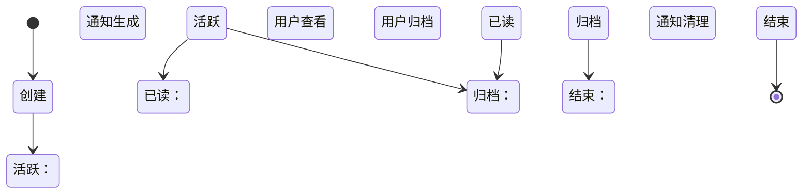
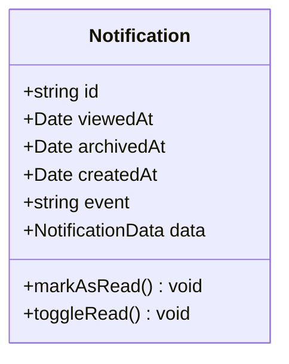
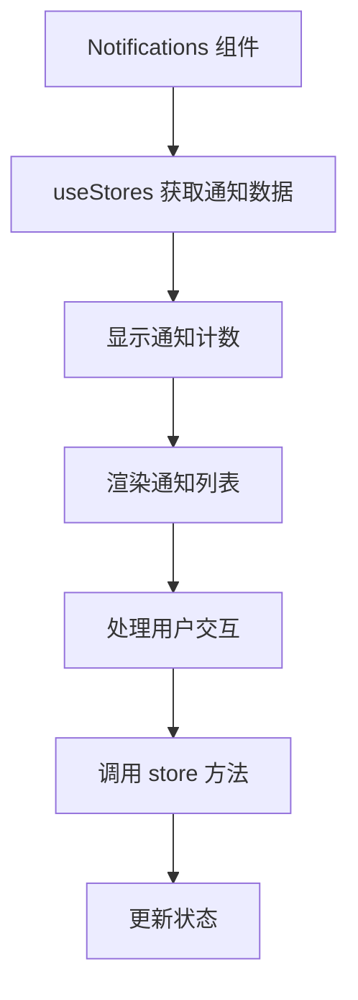
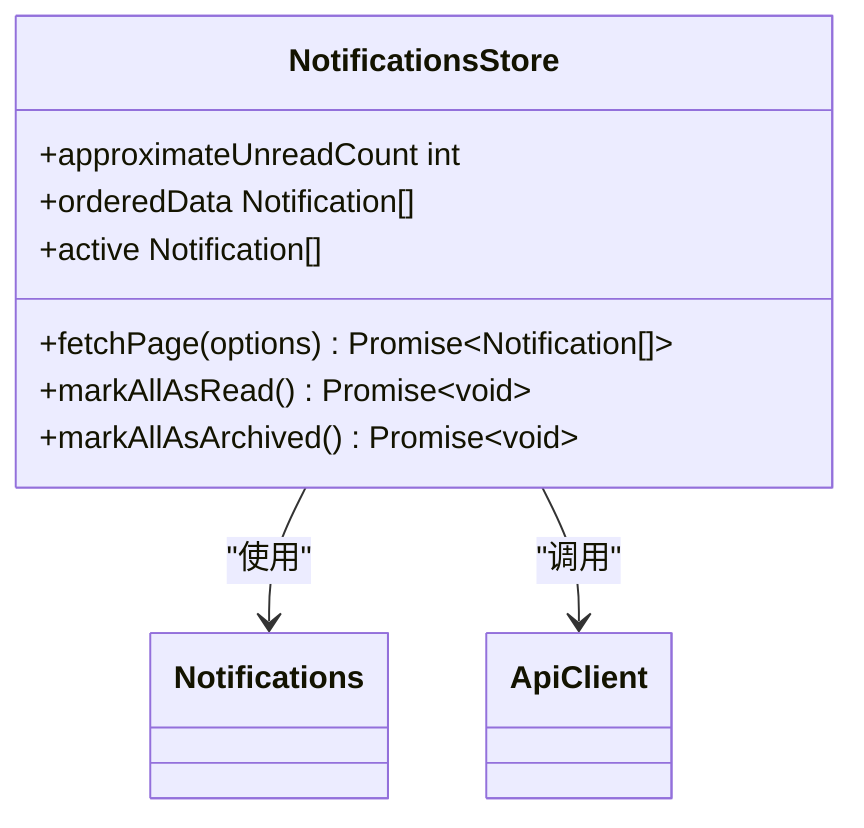
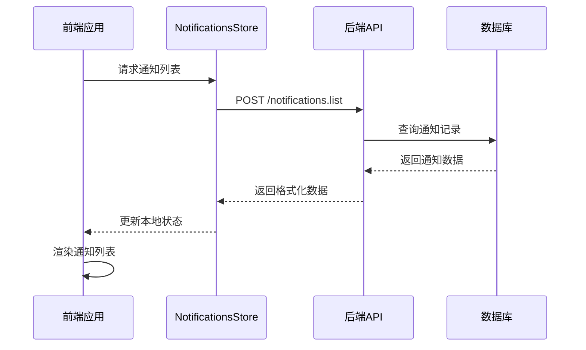
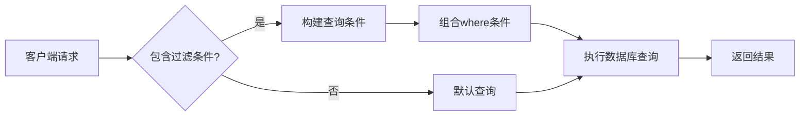
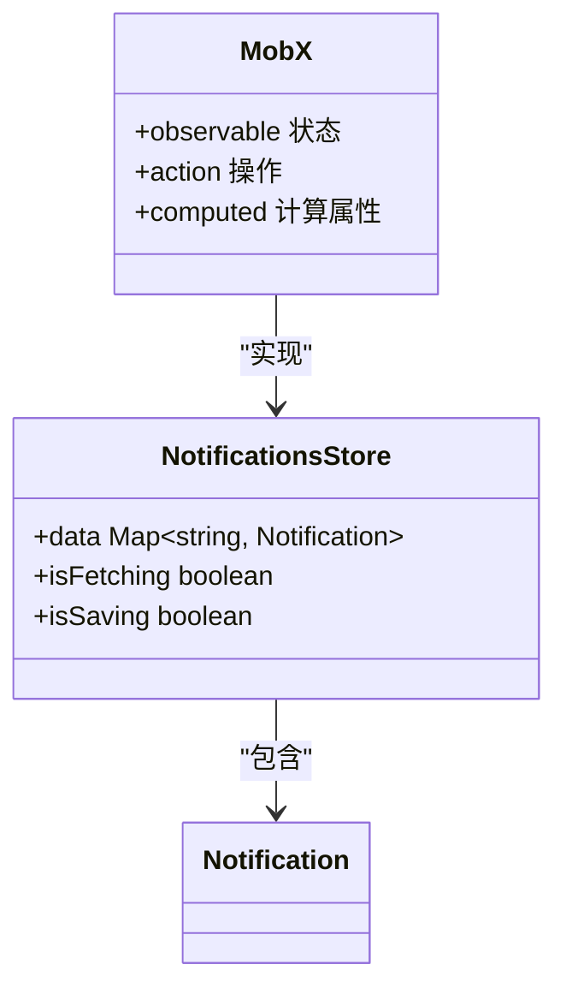

# 通知管理

<cite>
**本文档引用的文件**   
- [Notifications.tsx](file://app/components/Notifications/Notifications.tsx)
- [NotificationListItem.tsx](file://app/components/Notifications/NotificationListItem.tsx)
- [NotificationsStore.ts](file://app/stores/NotificationsStore.ts)
- [Notification.ts](file://server/models/Notification.ts)
- [notifications.ts](file://server/routes/api/notifications/notifications.ts)
- [schema.ts](file://server/routes/api/notifications/schema.ts)
</cite>

## 目录
1. [简介](#简介)
2. [通知生命周期管理](#通知生命周期管理)
3. [状态字段详解](#状态字段详解)
4. [前端组件分析](#前端组件分析)
5. [后端API分析](#后端api分析)
6. [查询与过滤机制](#查询与过滤机制)
7. [用户界面与交互流程](#用户界面与交互流程)
8. [技术细节与性能优化](#技术细节与性能优化)
9. [总结](#总结)

## 简介
通知管理功能是系统中重要的用户交互组件，负责处理和展示用户相关的各种系统事件。该功能通过前后端协同工作，实现了通知的创建、查看、标记已读和归档等完整生命周期管理。本文档将深入分析通知管理的各个方面，包括状态字段的用途、前后端交互流程、查询过滤机制以及用户体验设计。

**Section sources**
- [Notifications.tsx](file://app/components/Notifications/Notifications.tsx#L1-L138)
- [NotificationsStore.ts](file://app/stores/NotificationsStore.ts#L1-L98)

## 通知生命周期管理
通知的生命周期从创建到最终归档或删除，经历了多个状态变化阶段。系统通过`NotificationsStore`和后端API协同管理这些状态转换。

当系统事件发生时（如文档更新、评论创建等），后台任务会创建相应的通知记录。用户可以通过通知面板查看这些通知，系统会根据用户的交互行为更新通知状态。主要的生命周期阶段包括：

1. **创建阶段**：系统事件触发通知创建，存储在数据库中
2. **活跃阶段**：通知显示在用户的通知面板中，等待用户查看
3. **已读阶段**：用户查看通知后，`viewedAt`字段被更新
4. **归档阶段**：用户选择归档通知，`archivedAt`字段被设置
5. **结束阶段**：归档的通知从主视图中移除，保留在系统中供历史查询



**Diagram sources**
- [Notification.ts](file://server/models/Notification.ts#L37-L288)
- [NotificationsStore.ts](file://app/stores/NotificationsStore.ts#L10-L96)

**Section sources**
- [Notification.ts](file://server/models/Notification.ts#L37-L288)
- [NotificationsStore.ts](file://app/stores/NotificationsStore.ts#L10-L96)

## 状态字段详解
通知系统使用两个关键的时间戳字段来管理通知状态：`viewedAt`和`archivedAt`。

### viewedAt 字段
`viewedAt`字段用于标记通知是否已被用户查看。其主要特点包括：

- **数据类型**：可为空的日期时间字段
- **初始状态**：创建时为null，表示未读
- **更新机制**：当用户查看通知时，设置为当前时间戳
- **业务逻辑**：用于计算未读通知数量和显示未读状态



**Diagram sources**
- [Notification.ts](file://server/models/Notification.ts#L37-L288)

### archivedAt 字段
`archivedAt`字段用于管理通知的归档状态。其主要特点包括：

- **数据类型**：可为空的日期时间字段
- **初始状态**：创建时为null，表示未归档
- **更新机制**：当用户归档通知时，设置为当前时间戳
- **业务逻辑**：用于过滤归档通知，保持主通知列表的整洁

这两个字段共同构成了通知状态管理的核心，通过它们的组合可以实现复杂的状态过滤和查询功能。

**Section sources**
- [Notification.ts](file://server/models/Notification.ts#L37-L288)
- [schema.ts](file://server/routes/api/notifications/schema.ts#L52-L82)

## 前端组件分析
通知管理的前端实现主要由`Notifications`组件和`NotificationsStore`组成，采用React和MobX技术栈。

### Notifications 组件
`Notifications`组件是通知面板的主要UI组件，负责展示通知列表和提供用户交互控件。



该组件的主要功能包括：
- 显示通知标题和关闭按钮
- 展示未读通知数量
- 提供"全部标记为已读"的批量操作按钮
- 渲染分页的通知列表
- 处理空状态显示

### NotificationsStore
`NotificationsStore`是通知管理的状态管理器，负责与后端API通信并维护本地状态。



**Diagram sources**
- [Notifications.tsx](file://app/components/Notifications/Notifications.tsx#L1-L138)
- [NotificationsStore.ts](file://app/stores/NotificationsStore.ts#L10-L96)

**Section sources**
- [Notifications.tsx](file://app/components/Notifications/Notifications.tsx#L1-L138)
- [NotificationsStore.ts](file://app/stores/NotificationsStore.ts#L10-L96)

## 后端API分析
通知管理的后端API提供了完整的CRUD操作，主要通过`notifications.ts`文件实现。

### API端点
系统提供了以下主要API端点：

| 端点 | 方法 | 功能 |
|------|------|------|
| `/notifications.list` | POST | 获取通知列表 |
| `/notifications.update` | POST | 更新单个通知 |
| `/notifications.update_all` | POST | 批量更新通知 |
| `/notifications.pixel` | GET | 通知查看追踪 |

### 请求与响应流程


### 状态更新流程
当用户标记通知为已读时，系统执行以下流程：

1. 前端调用`markAllAsRead`方法
2. `NotificationsStore`发送POST请求到`/notifications.update_all`
3. 后端验证用户权限并锁定相关记录
4. 更新所有匹配通知的`viewedAt`字段
5. 返回成功响应并更新本地缓存

**Diagram sources**
- [notifications.ts](file://server/routes/api/notifications/notifications.ts#L76-L226)
- [schema.ts](file://server/routes/api/notifications/schema.ts#L52-L82)

**Section sources**
- [notifications.ts](file://server/routes/api/notifications/notifications.ts#L76-L226)
- [schema.ts](file://server/routes/api/notifications/schema.ts#L52-L82)

## 查询与过滤机制
通知系统提供了灵活的查询和过滤功能，支持按多种条件筛选通知。

### 过滤参数
系统支持以下过滤参数：

- **eventType**：按通知类型过滤（如文档更新、评论创建等）
- **archived**：按归档状态过滤（true/false/null）
- **分页参数**：offset和limit用于分页

### 查询实现
后端通过Sequelize ORM实现查询逻辑：



查询逻辑主要在`notifications.list`端点中实现，通过动态构建`where`条件来支持不同的过滤需求。

**Section sources**
- [notifications.ts](file://server/routes/api/notifications/notifications.ts#L76-L128)
- [schema.ts](file://server/routes/api/notifications/schema.ts#L52-L82)

## 用户界面与交互流程
通知管理的用户界面设计注重用户体验，提供了直观的操作流程。

### 用户交互流程
```mermaid
flowchart TD
A[用户点击通知图标] --> B[打开通知面板]
B --> C{有未读通知?}
C --> |是| D[显示未读计数]
C --> |否| E[显示"已全部阅读"]
D --> F[显示通知列表]
E --> F
F --> G{用户操作?}
G --> |标记为已读| H[更新viewedAt]
G --> |归档| I[更新archivedAt]
G --> |关闭| J[关闭面板]
H --> K[更新UI状态]
I --> K
K --> F
```

### 初学者指南
对于初学者，通知管理的主要操作包括：

1. **查看通知**：点击页面右上角的通知图标打开面板
2. **阅读通知**：点击通知条目查看详细内容
3. **批量操作**：使用"全部标记为已读"按钮处理所有未读通知
4. **清理通知**：通过归档功能保持通知列表整洁

这些操作简单直观，帮助用户快速掌握通知管理的基本功能。

**Section sources**
- [Notifications.tsx](file://app/components/Notifications/Notifications.tsx#L1-L138)
- [NotificationListItem.tsx](file://app/components/Notifications/NotificationListItem.tsx#L1-L100)

## 技术细节与性能优化
通知管理在技术实现上考虑了性能和可扩展性，采用了多种优化策略。

### 状态同步机制
系统采用MobX的状态管理机制，确保前后端状态的一致性：



### 批量操作优化
对于批量操作（如全部标记为已读），系统采用了以下优化：

- **事务处理**：使用数据库事务确保操作的原子性
- **批量更新**：通过`findAllInBatches`方法分批处理大量记录
- **本地缓存更新**：在发送请求后立即更新本地状态，提供即时反馈

### 性能优化策略
1. **分页加载**：避免一次性加载所有通知，减少内存占用
2. **懒加载**：仅在需要时加载通知详情
3. **缓存机制**：在`NotificationsStore`中缓存已加载的通知
4. **防抖处理**：对频繁的操作进行节流控制

这些优化策略确保了即使在通知数量较多的情况下，系统仍能保持良好的响应性能。

**Section sources**
- [NotificationsStore.ts](file://app/stores/NotificationsStore.ts#L10-L96)
- [notifications.ts](file://server/routes/api/notifications/notifications.ts#L178-L226)

## 总结
通知管理功能通过精心设计的前后端架构，实现了高效、可靠的通知生命周期管理。系统利用`viewedAt`和`archivedAt`状态字段，结合`NotificationsStore`和后端API，提供了完整的通知创建、查看、标记和归档功能。

对于初学者，直观的用户界面和简单的操作流程使得通知管理易于上手。对于经验丰富的开发者，系统的模块化设计、状态管理机制和性能优化策略提供了深入理解和扩展的基础。

通过本文档的详细分析，读者可以全面了解通知管理的实现原理，为功能扩展和问题排查提供坚实的基础。