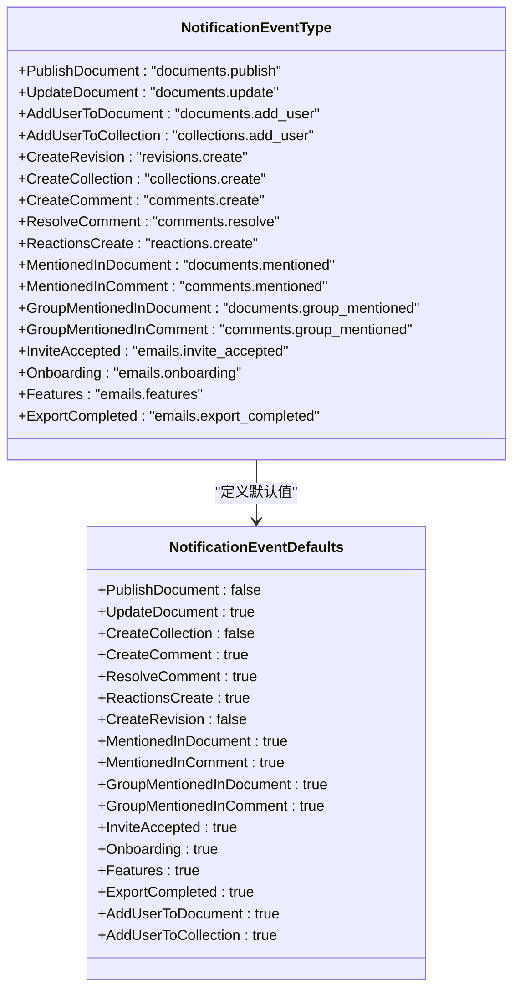
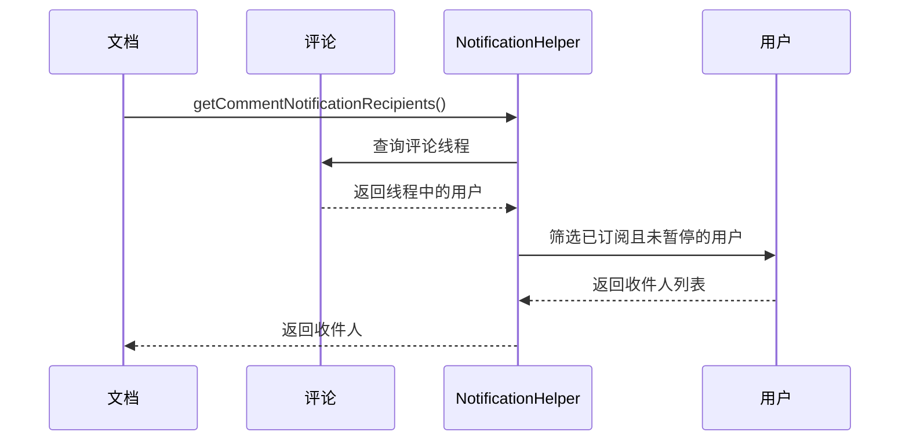
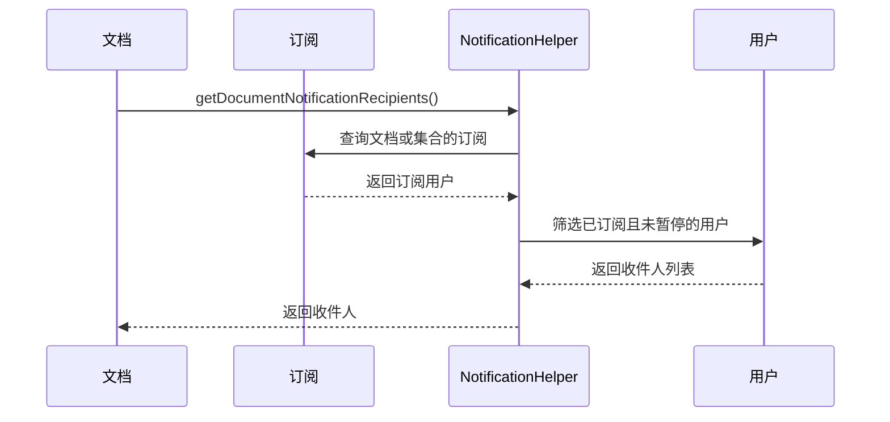

# 通知系统

<cite>
**Referenced Files in This Document**   
- [Notification.ts](file://app/models/Notification.ts)
- [Notification.ts](file://server/models/Notification.ts)
- [NotificationHelper.ts](file://server/models/helpers/NotificationHelper.ts)
- [CleanupOldNotificationsTask.ts](file://server/queues/tasks/CleanupOldNotificationsTask.ts)
- [types.ts](file://shared/types.ts)
</cite>

## 目录
1. [简介](#简介)
2. [通知数据模型](#通知数据模型)
3. [通知类型分类](#通知类型分类)
4. [通知生成机制](#通知生成机制)
5. [收件人筛选与去重](#收件人筛选与去重)
6. [通知生命周期管理](#通知生命周期管理)
7. [性能优化策略](#性能优化策略)

## 简介
通知系统是本应用的核心功能之一，负责在用户发生特定事件时向其发送通知。该系统涵盖了文档发布、评论创建、用户提及等多种场景，通过事件驱动的方式实现。通知系统不仅支持应用内通知，还集成了电子邮件通知功能，确保用户不会错过重要信息。本文档将深入探讨通知系统的实现细节，包括数据模型、事件分类、收件人筛选机制以及生命周期管理。

## 通知数据模型

通知系统的核心是`Notification`模型，该模型定义了通知的基本结构和行为。`Notification`类继承自`Model`基类，包含了通知的关键属性和方法。

### 核心字段
通知模型包含以下关键字段：

- **viewedAt**: `Date | null` - 表示通知被标记为已读的日期。如果为`null`，则表示通知未读。
- **archivedAt**: `Date | null` - 表示通知被归档的日期。如果为`null`，则表示通知未归档。
- **event**: `NotificationEventType` - 表示通知的类型，如文档发布、评论创建等。
- **data**: `NotificationData` - 存储与通知相关的附加数据，如表情符号等。
- **actor**: `User` - 触发通知的用户。
- **document**: `Document` - 与通知关联的文档。
- **collection**: `Collection` - 与通知关联的集合。
- **comment**: `Comment` - 与通知关联的评论。

### 关键方法
通知模型提供了以下关键方法：

- **toggleRead()**: 切换通知的已读状态。如果通知已读，则将其标记为未读；如果未读，则将其标记为已读。
- **markAsRead()**: 将通知标记为已读。
- **eventText(t: TFunction)**: 返回描述通知事件的翻译文本。
- **subject**: 返回通知的主题，通常是关联文档的标题。
- **path**: 返回与通知关联的模型的路径，可用于路由。

**Section sources**
- [Notification.ts](file://app/models/Notification.ts#L17-L210)

## 通知类型分类

通知系统通过`NotificationEventType`枚举定义了多种通知类型，涵盖了应用中的各种事件。这些类型不仅用于区分不同的通知场景，还用于控制通知的生成和接收。

### 主要通知类型
`NotificationEventType`枚举定义了以下主要通知类型：

- **PublishDocument**: 文档发布
- **UpdateDocument**: 文档更新
- **AddUserToDocument**: 用户被添加到文档
- **AddUserToCollection**: 用户被添加到集合
- **CreateRevision**: 创建修订版本
- **CreateCollection**: 创建集合
- **CreateComment**: 创建评论
- **ResolveComment**: 解决评论
- **ReactionsCreate**: 创建反应
- **MentionedInDocument**: 在文档中被提及
- **MentionedInComment**: 在评论中被提及
- **GroupMentionedInDocument**: 在文档中被群组提及
- **GroupMentionedInComment**: 在评论中被群组提及
- **InviteAccepted**: 邀请被接受
- **Onboarding**: 新用户引导
- **Features**: 新功能通知
- **ExportCompleted**: 导出完成

### 通知类型默认值
`NotificationEventDefaults`记录了每种通知类型的默认启用状态。例如，`UpdateDocument`和`CreateComment`默认启用，而`PublishDocument`和`CreateCollection`默认禁用。



**Diagram sources**
- [types.ts](file://shared/types.ts#L352-L370)

## 通知生成机制

通知的生成是一个事件驱动的过程，当特定事件发生时，系统会自动创建相应的通知。这一过程涉及事件触发、收件人筛选和通知创建等多个步骤。

### 事件触发
通知的生成通常由特定事件触发，如文档发布、评论创建等。这些事件通过事件处理器捕获，并调用相应的通知任务来生成通知。

### 通知创建流程
通知的创建流程如下：

1. **事件捕获**: 系统捕获特定事件，如文档发布或评论创建。
2. **收件人筛选**: 根据事件类型和相关实体，筛选出需要接收通知的用户。
3. **去重处理**: 确保同一用户不会收到重复的通知。
4. **通知创建**: 创建`Notification`实例并保存到数据库。

```mermaid
flowchart TD
Start([事件发生]) --> CaptureEvent["捕获事件"]
CaptureEvent --> FilterRecipients["筛选收件人"]
FilterRecipients --> Deduplicate["去重处理"]
Deduplicate --> CreateNotification["创建通知"]
CreateNotification --> SaveNotification["保存通知"]
SaveNotification --> End([通知生成完成])
Note over Start,SaveNotification: 通知生成流程
```

**Diagram sources**
- [NotificationHelper.ts](file://server/models/helpers/NotificationHelper.ts#L20-L243)

## 收件人筛选与去重

收件人筛选是通知系统的关键环节，确保通知能够准确地发送给相关用户。系统通过`NotificationHelper`类提供了多种方法来筛选收件人。

### 核心方法
`NotificationHelper`类提供了以下核心方法：

- **getCommentNotificationRecipients**: 获取评论事件的收件人。
- **getDocumentNotificationRecipients**: 获取文档事件的收件人。
- **getCollectionNotificationRecipients**: 获取集合事件的收件人。

#### getCommentNotificationRecipients
该方法用于获取评论事件的收件人。如果评论是回复，则通知所有参与该评论线程的用户；否则，通知订阅了该文档的用户。



**Diagram sources**
- [NotificationHelper.ts](file://server/models/helpers/NotificationHelper.ts#L58-L152)

#### getDocumentNotificationRecipients
该方法用于获取文档事件的收件人。根据通知类型，筛选出订阅了该文档或集合的用户。



**Diagram sources**
- [NotificationHelper.ts](file://server/models/helpers/NotificationHelper.ts#L163-L242)

## 通知生命周期管理

通知的生命周期管理包括查看、归档和清理等操作，确保通知系统的高效运行。

### 查看与归档
用户可以通过`toggleRead()`和`markAsRead()`方法将通知标记为已读或未读。归档操作通过设置`archivedAt`字段来实现。

### 清理策略
系统通过`CleanupOldNotificationsTask`定期清理旧的通知，以保持数据库的整洁。

```mermaid
flowchart TD
Start([开始清理]) --> DestroyOldNotifications["删除12个月前的通知"]
DestroyOldNotifications --> DestroyViewedNotifications["删除6个月前的已读通知"]
DestroyViewedNotifications --> End([清理完成])
Note over Start,End: 通知清理流程
```

**Diagram sources**
- [CleanupOldNotificationsTask.ts](file://server/queues/tasks/CleanupOldNotificationsTask.ts#L8-L51)

## 性能优化策略

通知系统通过多种策略优化性能，确保在高并发场景下的稳定运行。

### 批量处理
系统支持通知的批量处理，减少数据库操作次数，提高处理效率。

### 优先级排序
通知根据其重要性进行优先级排序，确保重要通知能够优先处理。

### 缓存机制
系统使用缓存机制存储常用数据，减少数据库查询次数，提高响应速度。

**Section sources**
- [NotificationHelper.ts](file://server/models/helpers/NotificationHelper.ts#L20-L243)
- [CleanupOldNotificationsTask.ts](file://server/queues/tasks/CleanupOldNotificationsTask.ts#L8-L51)