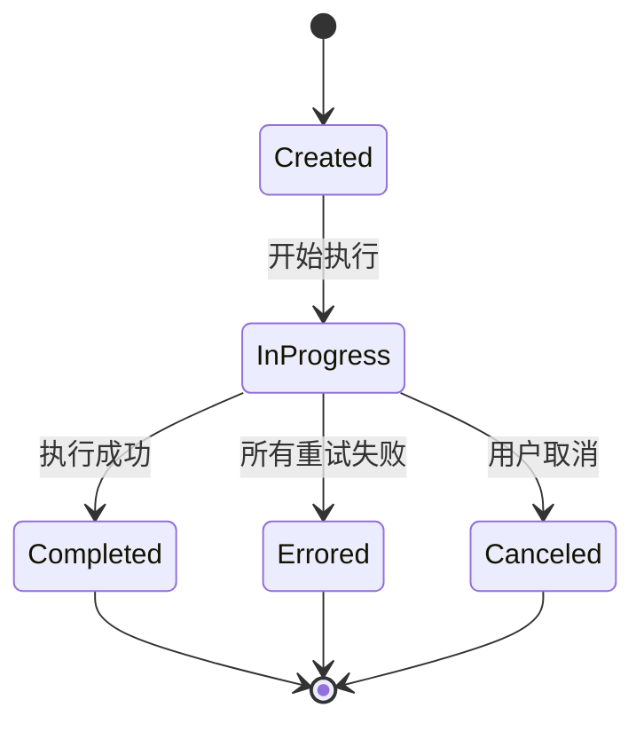

# 导入任务模型

<cite>
**本文档引用的文件**   
- [ImportTask.ts](file://server/models/ImportTask.ts)
- [Import.ts](file://server/models/Import.ts)
- [APIImportTask.ts](file://server/queues/tasks/APIImportTask.ts)
- [ImportsProcessor.ts](file://server/queues/processors/ImportsProcessor.ts)
- [types.ts](file://shared/types.ts)
</cite>

## 目录
1. [简介](#简介)
2. [模型字段定义](#模型字段定义)
3. [与导入模型的关系](#与导入模型的关系)
4. [任务调度机制](#任务调度机制)
5. [任务生命周期与状态转换](#任务生命周期与状态转换)
6. [错误处理与监控](#错误处理与监控)
7. [性能优化与最佳实践](#性能优化与最佳实践)

## 简介
导入任务模型（ImportTask）是系统导入功能的核心执行单元，负责将外部数据源的内容分批处理并导入到系统中。每个导入任务都隶属于一个导入（Import）实体，形成清晰的任务层级结构。该模型通过与队列系统的集成，实现了异步、可重试的导入流程，确保了数据导入的可靠性和稳定性。本文档详细介绍了导入任务模型的实现细节，包括字段定义、关系映射、调度机制和状态管理，为开发者提供了全面的技术参考。

## 模型字段定义
导入任务模型定义了多个关键字段，用于跟踪任务的执行状态和配置。这些字段包括：

- **id**: 任务的唯一标识符，继承自基础模型。
- **importId**: 外键，指向所属的导入（Import）记录，建立任务与导入的关联。
- **state**: 任务的当前状态，其值来自 `ImportTaskState` 枚举，包括 `created`、`in_progress`、`completed`、`errored` 和 `canceled`。
- **retryCount**: 记录任务重试的次数，用于实现重试策略。
- **lastError**: 存储最后一次执行失败时的错误信息，便于问题排查。
- **attempts**: 任务在队列中的尝试次数，由底层任务队列（如Bull）管理。
- **delay**: 任务执行的延迟时间（毫秒），用于控制任务的调度时机。
- **priority**: 任务的优先级，影响任务在队列中的执行顺序。
- **options**: 任务的配置选项，以JSON格式存储，可用于传递特定于任务的参数。
- **createdAt**: 任务创建的时间戳。
- **updatedAt**: 任务最后更新的时间戳。

此外，模型还包含一个 `input` 字段，用于存储任务执行所需的输入数据，以及一个 `output` 字段，用于存储任务执行后产生的输出结果。

**Section sources**
- [ImportTask.ts](file://server/models/ImportTask.ts#L30-L58)
- [types.ts](file://shared/types.ts#L73-L79)

## 与导入模型的关系
导入任务模型通过 `belongsTo` 关系与导入（Import）模型紧密关联，形成了一对多的层级结构。一个导入（Import）可以包含多个导入任务（ImportTask），而每个导入任务都必须隶属于一个且仅一个导入。

这种关系在代码中通过 Sequelize 的装饰器实现：
```typescript
@BelongsTo(() => Import, "importId")
import: Import<T>;

@ForeignKey(() => Import)
@Column(DataType.UUID)
importId: string;
```
此设计允许系统将一个大型的导入操作分解为多个小的、可独立执行的任务。例如，在从Notion导入数据时，根页面会创建一个导入记录，而每个子页面或数据库则会创建一个对应的导入任务。这种分而治之的策略不仅提高了导入的并发性和效率，还增强了系统的容错能力——单个任务的失败不会导致整个导入流程的中断。

**Section sources**
- [ImportTask.ts](file://server/models/ImportTask.ts#L52-L53)
- [Import.ts](file://server/models/Import.ts#L23-L87)

## 任务调度机制
导入任务的调度机制是其核心功能之一，它确保了任务能够按照预定的策略高效、可靠地执行。该机制主要由以下几个方面构成：

### 重试策略
任务的重试策略由 `options` 属性定义，具体配置如下：
```typescript
public get options(): JobOptions {
  return {
    priority: TaskPriority.Normal,
    attempts: 3,
    backoff: {
      type: "exponential",
      delay: 60 * 1000,
    },
  };
}
```
- **attempts**: 最大重试次数为3次。当任务执行失败时，队列系统会自动进行重试，直到达到最大次数。
- **backoff**: 采用指数退避（exponential）策略，初始延迟为60秒。这意味着第一次重试在1分钟后，第二次在4分钟后，第三次在16分钟后，有效避免了因瞬时故障导致的雪崩效应。

### 优先级管理
任务的优先级（`priority`）被设置为 `TaskPriority.Normal`，确保导入任务在系统资源紧张时不会抢占高优先级任务（如用户请求）的资源，同时也能保证其在低优先级任务之前得到处理。

### 执行流程
任务的执行流程由 `perform` 方法控制，遵循一个清晰的状态机模式：
1.  **创建 (Created)**: 任务被创建并放入队列。
2.  **进行中 (InProgress)**: 任务被消费者取出，状态更新为 `in_progress`，开始执行核心逻辑。
3.  **完成 (Completed)**: 核心逻辑执行成功，状态更新为 `completed`，并触发后续任务或流程。
4.  **失败 (Failed)**: 如果所有重试尝试均失败，`onFailed` 方法会被调用，将任务和其所属的导入状态均标记为 `errored`。

**Section sources**
- [APIImportTask.ts](file://server/queues/tasks/APIImportTask.ts#L233-L235)
- [APIImportTask.ts](file://server/queues/tasks/APIImportTask.ts#L195-L224)

## 任务生命周期与状态转换
导入任务的生命周期由其状态（`state`）驱动，状态的转换清晰地描绘了任务从创建到终结的全过程。下图展示了导入任务的状态转换图。



**Diagram sources**
- [types.ts](file://shared/types.ts#L73-L79)
- [APIImportTask.ts](file://server/queues/tasks/APIImportTask.ts#L138-L186)

**Section sources**
- [ImportTask.ts](file://server/models/ImportTask.ts#L36-L38)
- [APIImportTask.ts](file://server/queues/tasks/APIImportTask.ts#L100-L114)

## 错误处理与监控
系统具备完善的错误处理和监控机制，以确保导入过程的健壮性。

### 错误处理
当任务执行过程中抛出异常时，`perform` 方法会捕获该异常，将其消息截断后存储在 `lastError` 字段中，并将 `state` 设置为 `errored`。如果任务配置了重试，异常会被重新抛出，触发队列的重试机制。对于所有重试均失败的情况，`onFailed` 方法会执行最终的清理和状态更新操作。

### 监控
系统通过日志（Logger）记录任务的关键执行节点，例如任务开始、完成和失败。这些日志信息对于线上问题的排查和性能分析至关重要。此外，通过将任务的执行状态持久化到数据库，系统可以提供实时的导入进度查询功能。

**Section sources**
- [APIImportTask.ts](file://server/queues/tasks/APIImportTask.ts#L243-L243)
- [APIImportTask.ts](file://server/queues/tasks/APIImportTask.ts#L48-L57)

## 性能优化与最佳实践
为了优化导入任务的性能，系统采用了多项最佳实践：

1.  **批量处理**: 在创建后续任务时，使用 `chunk` 函数将输入数据分批处理，避免一次性创建过多数据库记录导致性能瓶颈。
2.  **事务管理**: 关键的数据库操作（如更新任务状态、创建文档）都包裹在数据库事务中，保证了数据的一致性和原子性。
3.  **异步执行**: 上传附件等耗时操作被发布到独立的队列任务（`UploadAttachmentsForImportTask`）中异步执行，避免阻塞主任务流程。
4.  **资源清理**: 系统包含专门的定时任务（如 `ErrorTimedOutImportsTask`）来清理长时间处于 `in_progress` 状态的“卡住”任务，防止资源泄漏。

遵循这些实践可以确保导入系统在处理大规模数据时依然保持高效和稳定。

**Section sources**
- [APIImportTask.ts](file://server/queues/tasks/APIImportTask.ts#L154-L163)
- [ImportsProcessor.ts](file://server/queues/processors/ImportsProcessor.ts#L269-L476)
- [ErrorTimedOutImportsTask.ts](file://server/queues/tasks/ErrorTimedOutImportsTask.ts#L18-L82)