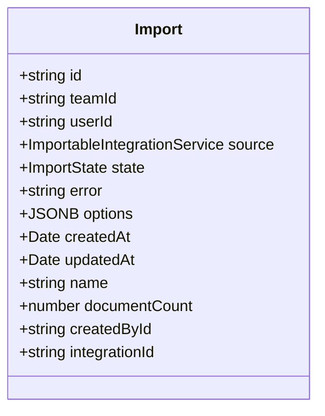
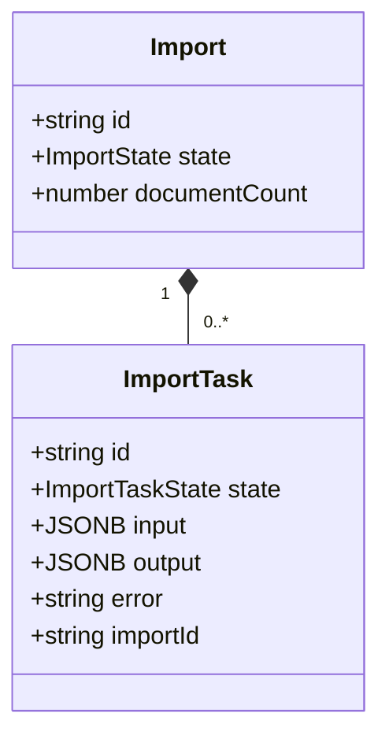
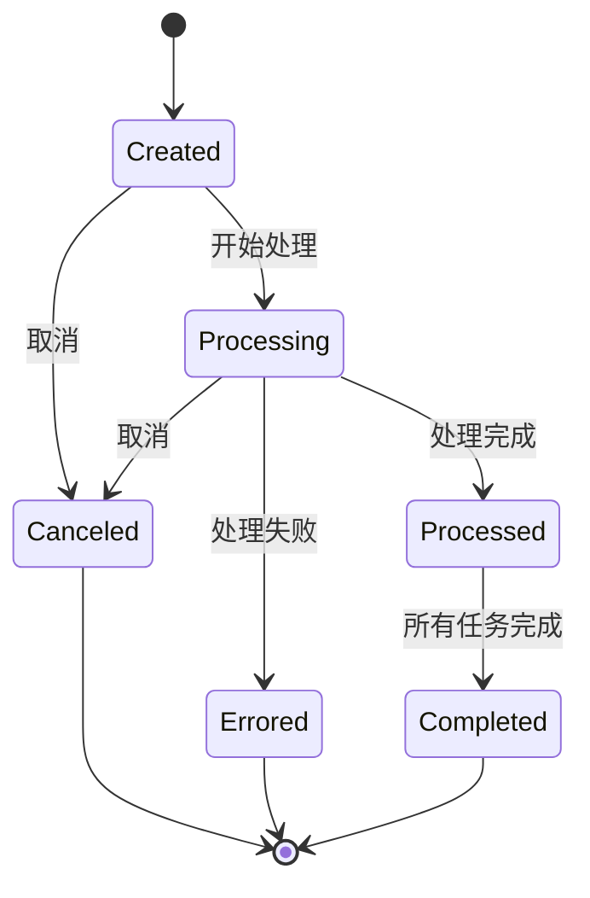
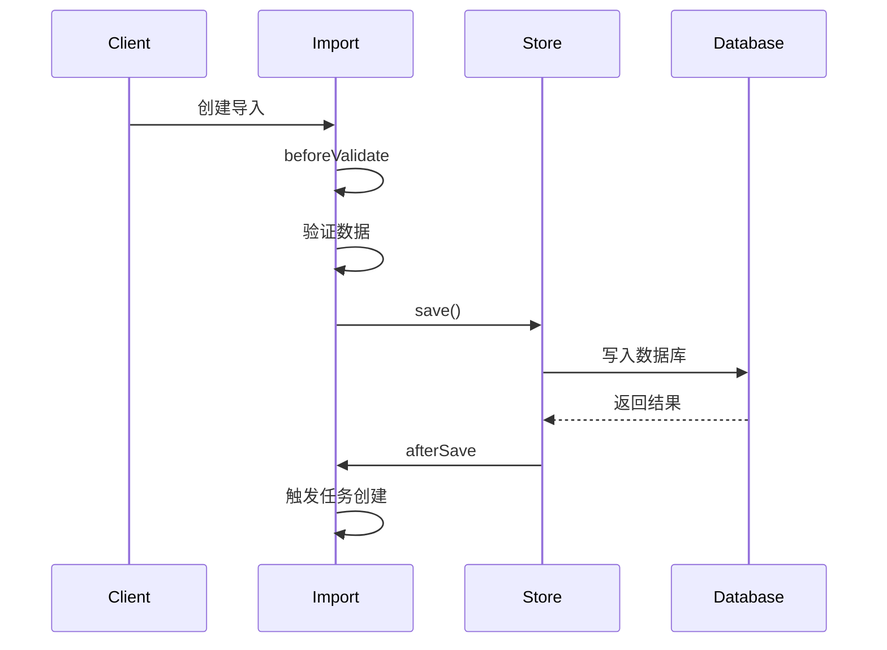
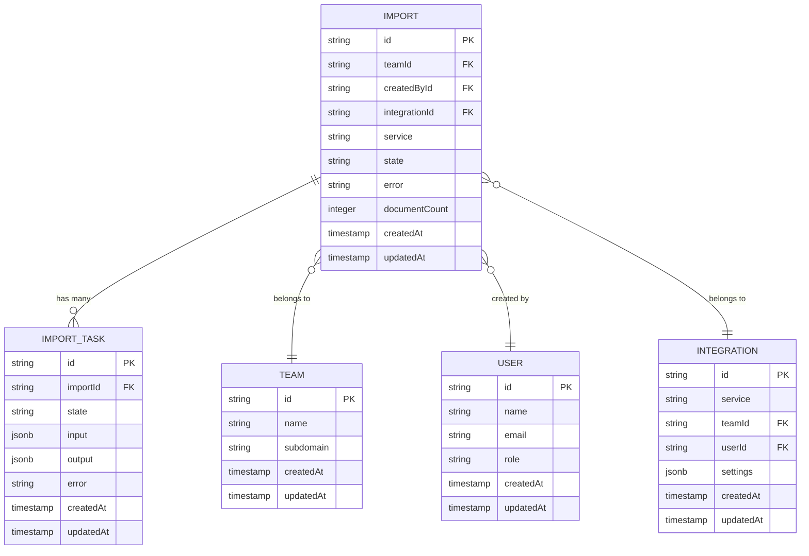

# 导入模型

<cite>
**本文档引用的文件**   
- [Import.ts](file://app/models/Import.ts)
- [Import.ts](file://server/models/Import.ts)
- [ImportTask.ts](file://server/models/ImportTask.ts)
- [types.ts](file://shared/types.ts)
- [ImportsStore.ts](file://app/stores/ImportsStore.ts)
- [APIImportTask.ts](file://server/queues/tasks/APIImportTask.ts)
- [Team.ts](file://server/models/Team.ts)
- [User.ts](file://server/models/User.ts)
- [Integration.ts](file://server/models/Integration.ts)
</cite>

## 目录
1. [简介](#简介)
2. [模型字段定义](#模型字段定义)
3. [父子任务结构](#父子任务结构)
4. [状态机实现](#状态机实现)
5. [生命周期钩子](#生命周期钩子)
6. [数据验证与索引优化](#数据验证与索引优化)
7. [关联关系](#关联关系)
8. [ER图](#er图)
9. [使用示例](#使用示例)
10. [总结](#总结)

## 简介
导入模型是系统中负责处理数据导入操作的核心实体。它管理从外部服务（如Notion）导入数据的整个生命周期，跟踪导入状态、错误信息和文档计数。该模型通过与ImportTask的hasMany关系形成父子任务结构，支持分批处理大型导入任务。导入模型实现了完整状态机，通过beforeValidate和afterSave钩子处理状态转换，并与Team、User和Integration等模型建立关联关系。

**Section sources**
- [Import.ts](file://app/models/Import.ts#L9-L54)
- [Import.ts](file://server/models/Import.ts#L23-L87)

## 模型字段定义
导入模型包含以下核心字段：

- **id**: 唯一标识符 (继承自IdModel)
- **teamId**: 所属团队ID，外键关联Team模型
- **userId**: 创建用户ID，外键关联User模型
- **source**: 外部服务来源，枚举类型ImportableIntegrationService
- **state**: 当前状态，枚举类型ImportState，包含Created、Processing、Processed、Completed、Errored、Canceled六种状态
- **error**: 错误描述，当导入出错时存储错误信息
- **options**: 导入选项，JSONB类型存储导入配置
- **createdAt**: 创建时间戳
- **updatedAt**: 更新时间戳
- **name**: 导入名称
- **documentCount**: 已创建文档计数
- **createdById**: 创建者ID，外键关联User模型
- **integrationId**: 集成ID，外键关联Integration模型



**Diagram sources **
- [Import.ts](file://server/models/Import.ts#L23-L87)

**Section sources**
- [Import.ts](file://server/models/Import.ts#L23-L87)
- [types.ts](file://shared/types.ts#L64-L71)

## 父子任务结构
导入模型通过hasMany关系与ImportTask模型关联，形成父子任务结构。每个导入任务被分解为多个子任务进行分批处理：

- **Import (父)**: 代表整个导入操作，管理整体状态和元数据
- **ImportTask (子)**: 代表导入的单个处理单元，可并行执行

这种设计支持大型导入任务的分批处理和错误恢复。当创建导入时，系统会生成多个ImportTask实例，每个处理一部分数据。ImportTask的状态变化会触发父级Import的状态更新。



**Diagram sources **
- [Import.ts](file://server/models/Import.ts#L23-L87)
- [ImportTask.ts](file://server/models/ImportTask.ts#L30-L58)

**Section sources**
- [Import.ts](file://server/models/Import.ts#L23-L87)
- [ImportTask.ts](file://server/models/ImportTask.ts#L30-L58)

## 状态机实现
导入模型实现了完整状态机，状态转换遵循严格流程：



状态转换规则：
- **Created → Processing**: 导入开始处理
- **Processing → Processed**: 单个任务处理完成
- **Processed → Completed**: 所有子任务完成
- **Processing → Errored**: 处理失败
- **Created/Processing → Canceled**: 用户取消

状态机通过APIImportTask等后台任务驱动，确保状态转换的原子性和一致性。

**Diagram sources **
- [types.ts](file://shared/types.ts#L64-L71)
- [types.ts](file://shared/types.ts#L73-L79)

**Section sources**
- [types.ts](file://shared/types.ts#L64-L71)
- [APIImportTask.ts](file://server/queues/tasks/APIImportTask.ts#L38-L408)

## 生命周期钩子
导入模型使用生命周期钩子处理状态转换和业务逻辑：

- **@AfterChange**: 当状态改变时触发，用于清理策略缓存
- **beforeValidate**: 验证前钩子，确保数据完整性
- **afterSave**: 保存后钩子，用于触发后续操作



**Diagram sources **
- [Import.ts](file://app/models/Import.ts#L47-L53)
- [Import.ts](file://app/models/Import.ts#L9-L54)

**Section sources**
- [Import.ts](file://app/models/Import.ts#L9-L54)

## 数据验证与索引优化
导入模型实现了严格的数据验证和索引优化：

**数据验证规则：**
- name字段：最大长度限制，不允许包含URL
- service字段：必须是ImportableIntegrationService枚举值
- state字段：必须是ImportState枚举值
- documentCount字段：默认值为0，数值类型

**索引优化：**
- 在teamId字段上创建索引，优化团队范围查询
- 在createdById字段上创建索引，优化用户范围查询
- 在state字段上创建索引，优化状态过滤查询
- 复合索引：(teamId, state)用于高效的状态过滤查询

这些优化确保了在大规模数据集上的查询性能。

**Section sources**
- [Import.ts](file://server/models/Import.ts#L23-L87)
- [validations.ts](file://shared/validations.ts#L58-L58)

## 关联关系
导入模型与其他核心模型建立以下关联关系：



**Diagram sources **
- [Import.ts](file://server/models/Import.ts#L23-L87)
- [Team.ts](file://server/models/Team.ts#L54-L473)
- [User.ts](file://server/models/User.ts#L81-L856)
- [Integration.ts](file://server/models/Integration.ts#L25-L105)
- [ImportTask.ts](file://server/models/ImportTask.ts#L30-L58)

**Section sources**
- [Import.ts](file://server/models/Import.ts#L23-L87)

## 使用示例
以下是导入模型的典型使用场景：

**创建导入记录：**
```typescript
const importModel = await Import.create({
  name: "Notion导入",
  service: IntegrationService.Notion,
  state: ImportState.Created,
  teamId: team.id,
  createdById: user.id,
  integrationId: integration.id,
});
```

**状态更新流程：**
```typescript
// 更新状态为处理中
importModel.state = ImportState.Processing;
await importModel.save();

// 处理完成，更新文档计数
importModel.documentCount += 10;
importModel.state = ImportState.Processed;
await importModel.save();
```

**错误处理：**
```typescript
try {
  // 处理导入逻辑
  await processImport(importModel);
} catch (error) {
  importModel.state = ImportState.Errored;
  importModel.error = error.message;
  await importModel.save();
}
```

**取消导入：**
```typescript
await importModel.cancel();
```

**Section sources**
- [Import.ts](file://app/models/Import.ts#L9-L54)
- [ImportsStore.ts](file://app/stores/ImportsStore.ts#L7-L24)

## 总结
导入模型是系统数据导入功能的核心，通过以下特性确保可靠性和可扩展性：
- **完整的状态机**：严格的状态转换确保导入过程的可靠性
- **父子任务结构**：支持大型导入任务的分批处理
- **丰富的关联关系**：与Team、User、Integration等模型紧密集成
- **数据验证**：确保数据完整性和一致性
- **索引优化**：保证大规模数据集的查询性能
- **生命周期钩子**：在关键节点执行业务逻辑

该模型设计支持从外部服务（如Notion）导入大量数据，同时提供良好的错误处理和用户反馈机制。

**Section sources**
- [Import.ts](file://app/models/Import.ts#L9-L54)
- [Import.ts](file://server/models/Import.ts#L23-L87)