# 数据导入系统

<cite>
**本文档引用的文件**  
- [Import.ts](file://server/models/Import.ts)
- [ImportTask.ts](file://server/models/ImportTask.ts)
- [APIImportTask.ts](file://server/queues/tasks/APIImportTask.ts)
- [ImportJSONTask.ts](file://server/queues/tasks/ImportJSONTask.ts)
- [ImportMarkdownZipTask.ts](file://server/queues/tasks/ImportMarkdownZipTask.ts)
- [ImportsProcessor.ts](file://server/queues/processors/ImportsProcessor.ts)
- [types.ts](file://shared/types.ts)
- [schema.ts](file://shared/schema.ts)
</cite>

## 目录
1. [简介](#简介)
2. [核心模型](#核心模型)
3. [导入状态管理](#导入状态管理)
4. [父子任务调度机制](#父子任务调度机制)
5. [API导入任务](#api导入任务)
6. [JSON导入任务](#json导入任务)
7. [Markdown ZIP导入任务](#markdown-zip导入任务)
8. [错误处理与恢复](#错误处理与恢复)
9. [性能优化](#性能优化)
10. [状态图](#状态图)

## 简介
数据导入系统是本平台的核心功能之一，负责从外部服务（如Notion）和本地文件（JSON、Markdown ZIP）导入内容。系统采用分层架构，通过Import和ImportTask模型实现任务的创建、调度和状态管理。导入流程包括分页处理、错误重试、事务管理和进度跟踪，确保大规模数据导入的可靠性和性能。

## 核心模型

### Import模型
Import模型代表一次完整的导入操作，包含导入的元数据、状态和统计信息。每个Import可以包含多个ImportTask，形成父子任务关系。

**Section sources**
- [Import.ts](file://server/models/Import.ts#L23-L87)
- [types.ts](file://shared/types.ts#L64-L71)

### ImportTask模型
ImportTask模型代表导入过程中的单个任务单元，用于实现分页处理和并行执行。每个ImportTask处理一部分数据，并将结果存储在output字段中。

**Section sources**
- [ImportTask.ts](file://server/models/ImportTask.ts#L30-L58)
- [types.ts](file://shared/types.ts#L73-L79)

## 导入状态管理

### Import状态
Import模型使用ImportState枚举管理其生命周期，包含以下状态：
- **Created**: 导入已创建，等待处理
- **InProgress**: 导入正在处理中
- **Processed**: 所有任务已完成，等待持久化
- **Completed**: 导入已完成，数据已持久化
- **Errored**: 导入出错
- **Canceled**: 导入已取消

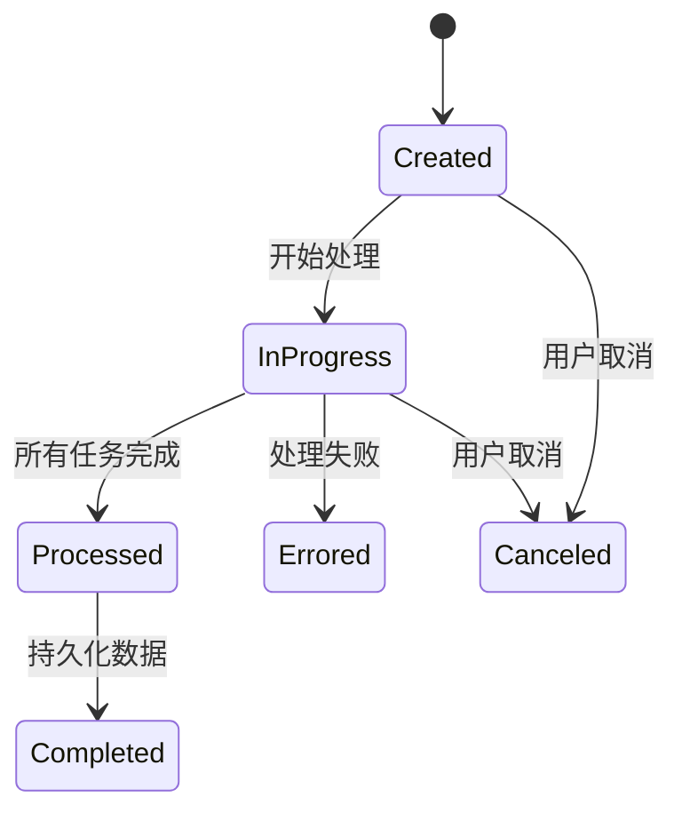

**Diagram sources**
- [Import.ts](file://server/models/Import.ts#L23-L87)
- [types.ts](file://shared/types.ts#L64-L71)

### ImportTask状态
ImportTask使用ImportTaskState枚举管理其状态，包含：
- **Created**: 任务已创建，等待执行
- **InProgress**: 任务正在执行
- **Completed**: 任务已完成
- **Errored**: 任务执行出错
- **Canceled**: 任务已取消

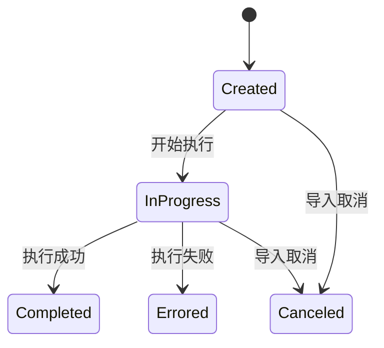

**Diagram sources**
- [ImportTask.ts](file://server/models/ImportTask.ts#L30-L58)
- [types.ts](file://shared/types.ts#L73-L79)

## 父子任务调度机制

### 任务创建流程
当Import创建时，系统会根据输入数据创建多个ImportTask，实现分页处理：

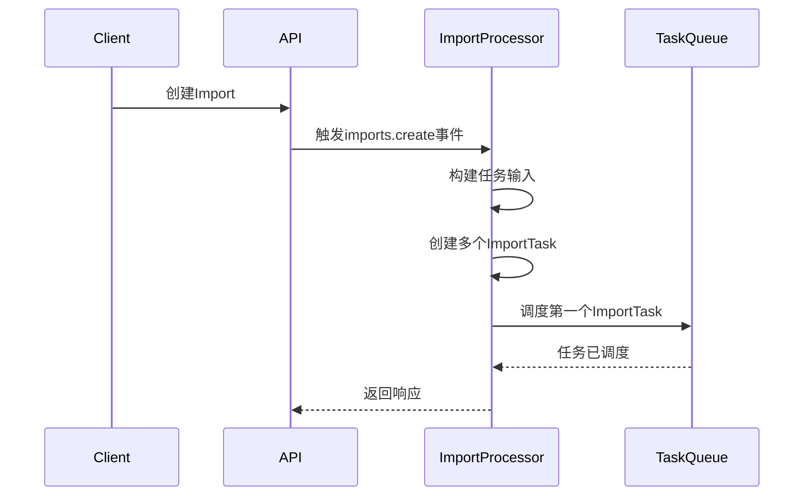

**Diagram sources**
- [ImportsProcessor.ts](file://server/queues/processors/ImportsProcessor.ts#L162-L217)
- [APIImportTask.ts](file://server/queues/tasks/APIImportTask.ts#L138-L186)

### 任务执行流程
ImportTask按顺序执行，每个任务完成后调度下一个任务：

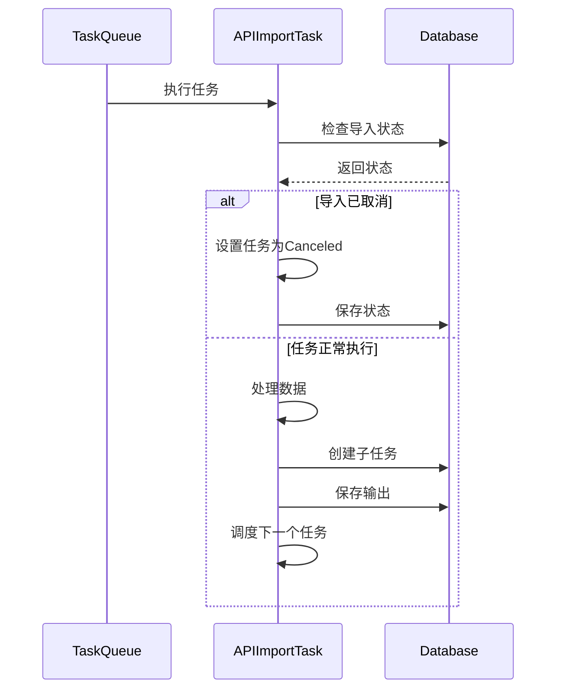

**Diagram sources**
- [APIImportTask.ts](file://server/queues/tasks/APIImportTask.ts#L195-L224)
- [ImportsProcessor.ts](file://server/queues/processors/ImportsProcessor.ts#L228-L260)

## API导入任务

### APIImportTask架构
APIImportTask是处理外部API数据导入的基类，采用模板方法模式，定义了标准的处理流程：

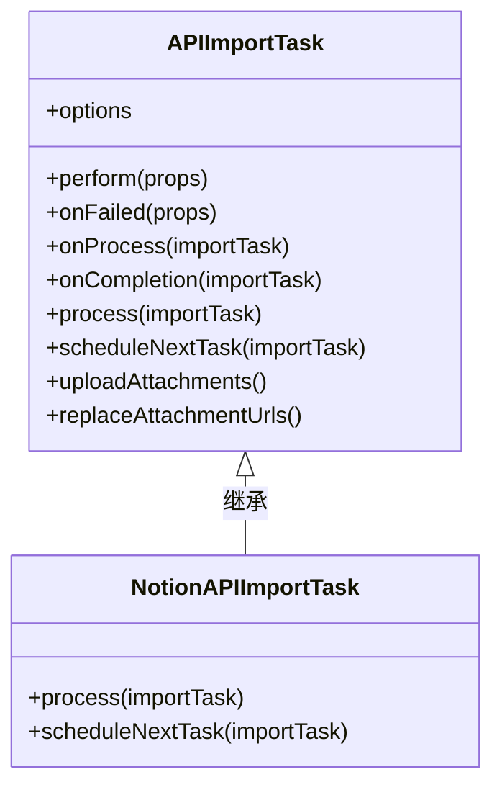

**Diagram sources**
- [APIImportTask.ts](file://server/queues/tasks/APIImportTask.ts#L38-L408)
- [NotionAPIImportTask.ts](file://plugins/notion/server/tasks/NotionAPIImportTask.ts#L22-L194)

### 分页处理
系统通过PagePerImportTask常量控制每个任务处理的数据量，避免内存溢出：

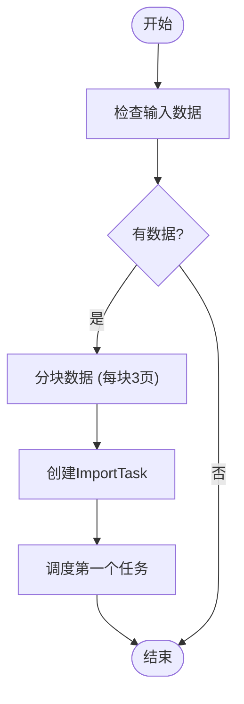

**Diagram sources**
- [ImportsProcessor.ts](file://server/queues/processors/ImportsProcessor.ts#L162-L217)
- [APIImportTask.ts](file://server/queues/tasks/APIImportTask.ts#L154-L163)

### 错误重试
APIImportTask配置了指数退避重试策略，确保临时性错误能够自动恢复：

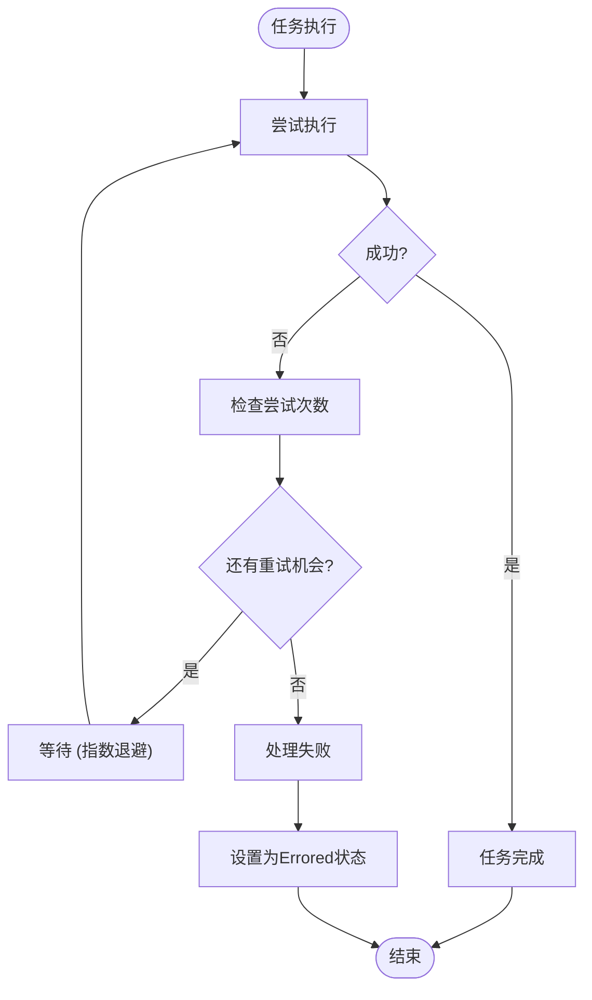

**Diagram sources**
- [APIImportTask.ts](file://server/queues/tasks/APIImportTask.ts#L48-L57)
- [BaseTask.ts](file://server/queues/tasks/BaseTask.ts#L64-L71)

### 事务管理
所有关键操作都在数据库事务中执行，确保数据一致性：

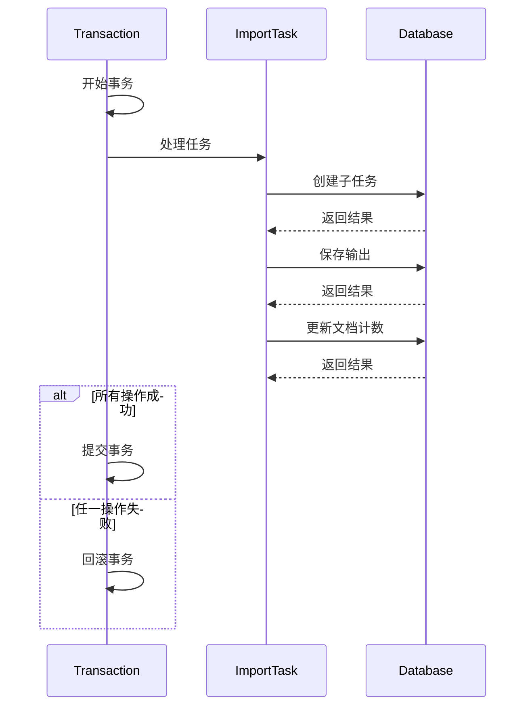

**Diagram sources**
- [APIImportTask.ts](file://server/queues/tasks/APIImportTask.ts#L243-L243)
- [ImportsProcessor.ts](file://server/queues/processors/ImportsProcessor.ts#L41-L629)

## JSON导入任务

### JSON导入流程
ImportJSONTask处理JSON格式的导入文件，解析文件结构并转换为系统数据：

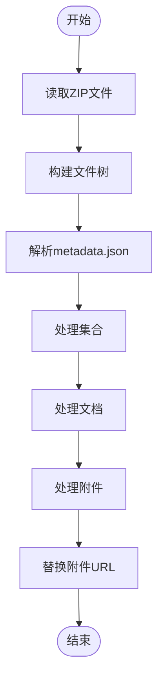

**Diagram sources**
- [ImportJSONTask.ts](file://server/queues/tasks/ImportJSONTask.ts#L19-L231)

### 文档结构处理
系统维护文档的父子关系，确保导入后的文档结构完整：

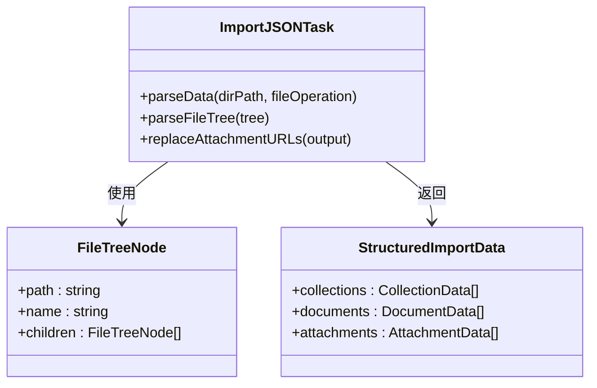

**Diagram sources**
- [ImportJSONTask.ts](file://server/queues/tasks/ImportJSONTask.ts#L19-L231)
- [ImportHelper.ts](file://server/utils/ImportHelper.ts#L15-L67)

## Markdown ZIP导入任务

### Markdown导入流程
ImportMarkdownZipTask处理Markdown格式的导入文件，支持复杂的文件结构：

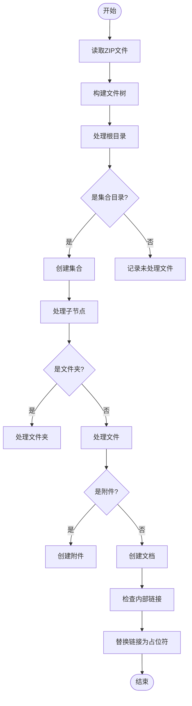

**Diagram sources**
- [ImportMarkdownZipTask.ts](file://server/queues/tasks/ImportMarkdownZipTask.ts#L14-L209)

### 附件引用处理
系统自动处理附件引用，将外部URL替换为内部重定向URL：

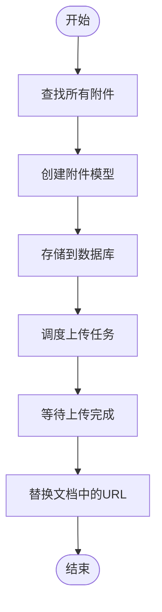

**Diagram sources**
- [ImportMarkdownZipTask.ts](file://server/queues/tasks/ImportMarkdownZipTask.ts#L14-L209)
- [UploadAttachmentsForImportTask.ts](file://server/queues/tasks/UploadAttachmentsForImportTask.ts#L19-L72)

### 内部链接处理
系统识别并处理文档间的内部链接，确保导入后链接仍然有效：

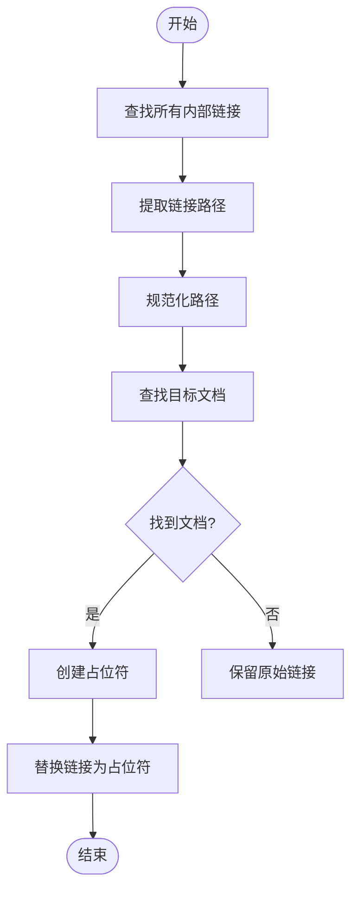

**Diagram sources**
- [ImportMarkdownZipTask.ts](file://server/queues/tasks/ImportMarkdownZipTask.ts#L14-L209)

## 错误处理与恢复

### 错误处理机制
系统采用分层错误处理策略，确保导入过程的可靠性：

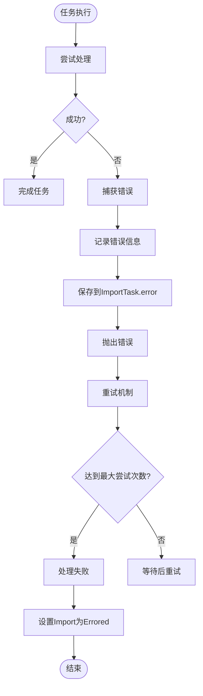

**Diagram sources**
- [APIImportTask.ts](file://server/queues/tasks/APIImportTask.ts#L100-L114)
- [ImportsProcessor.ts](file://server/queues/processors/ImportsProcessor.ts#L41-L629)

### 取消机制
用户可以随时取消导入操作，系统会优雅地终止所有相关任务：

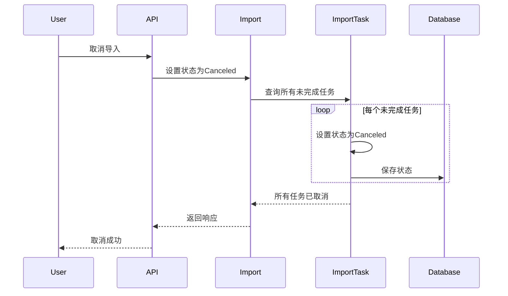

**Diagram sources**
- [Import.ts](file://server/models/Import.ts#L47-L53)
- [APIImportTask.ts](file://server/queues/tasks/APIImportTask.ts#L196-L199)

## 性能优化

### 批量处理
系统采用批量处理策略，减少数据库交互次数：

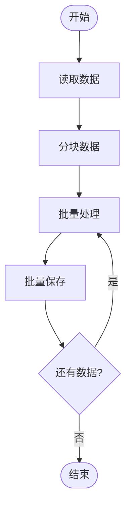

**Diagram sources**
- [APIImportTask.ts](file://server/queues/tasks/APIImportTask.ts#L154-L163)
- [ImportsProcessor.ts](file://server/queues/processors/ImportsProcessor.ts#L162-L217)

### 并行上传
附件上传采用并行处理，提高上传效率：

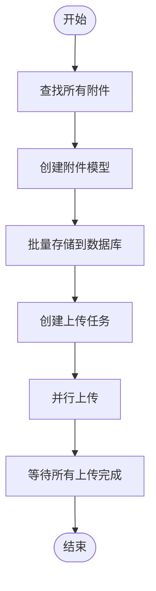

**Diagram sources**
- [UploadAttachmentsForImportTask.ts](file://server/queues/tasks/UploadAttachmentsForImportTask.ts#L19-L72)

### 内存优化
系统采用流式处理和分批加载，避免内存溢出：

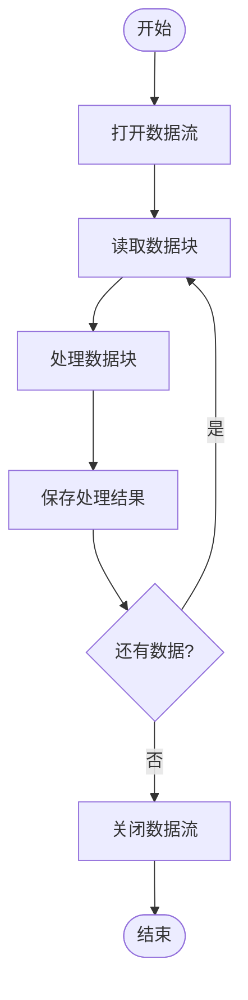

**Diagram sources**
- [ImportsProcessor.ts](file://server/queues/processors/ImportsProcessor.ts#L41-L629)
- [ImportTask.ts](file://server/queues/tasks/ImportTask.ts#L105-L555)

## 状态图

### Import状态图
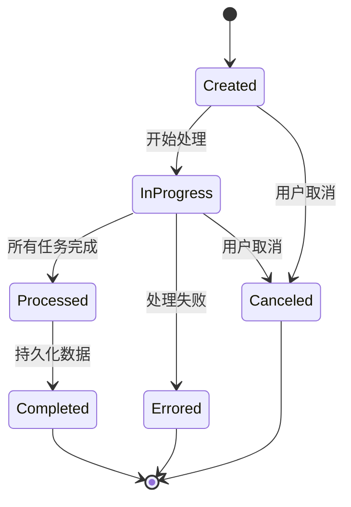

**Diagram sources**
- [Import.ts](file://server/models/Import.ts#L23-L87)
- [types.ts](file://shared/types.ts#L64-L71)

### ImportTask状态图
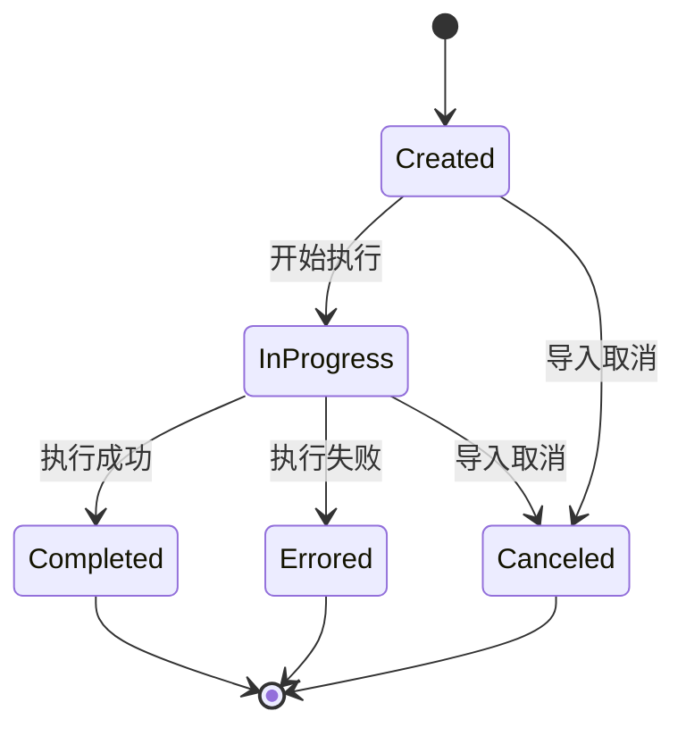

**Diagram sources**
- [ImportTask.ts](file://server/models/ImportTask.ts#L30-L58)
- [types.ts](file://shared/types.ts#L73-L79)

### 完整状态转换图
```mermaid
stateDiagram-v2
[*] --> ImportCreated
state ImportCreated {
[*] --> Created
Created --> InProgress : 开始处理
Created --> Canceled : 用户取消
}
state ImportInProgress {
InProgress --> Processed : 所有任务完成
InProgress --> Errored : 处理失败
InProgress --> Canceled : 用户取消
}
state ImportProcessed {
Processed --> Completed : 持久化数据
Processed --> Errored : 持久化失败
}
state ImportCompleted {
Completed --> [*]
}
state ImportErrored {
Errored --> [*]
}
state ImportCanceled {
Canceled --> [*]
}
state TaskCreated {
Created --> InProgress : 开始执行
Created --> Canceled : 导入取消
}
state TaskInProgress {
InProgress --> Completed : 执行成功
InProgress --> Errored : 执行失败
InProgress --> Canceled : 导入取消
}
state TaskCompleted {
Completed --> [*]
}
state TaskErrored {
Errored --> [*]
}
state TaskCanceled {
Canceled --> [*]
}
ImportCreated --> TaskCreated : 创建任务
ImportInProgress --> TaskInProgress : 执行任务
ImportProcessed --> TaskCompleted : 任务完成
ImportErrored --> TaskErrored : 任务失败
ImportCanceled --> TaskCanceled : 任务取消
```

**Diagram sources**
- [Import.ts](file://server/models/Import.ts#L23-L87)
- [ImportTask.ts](file://server/models/ImportTask.ts#L30-L58)
- [types.ts](file://shared/types.ts#L64-L79)