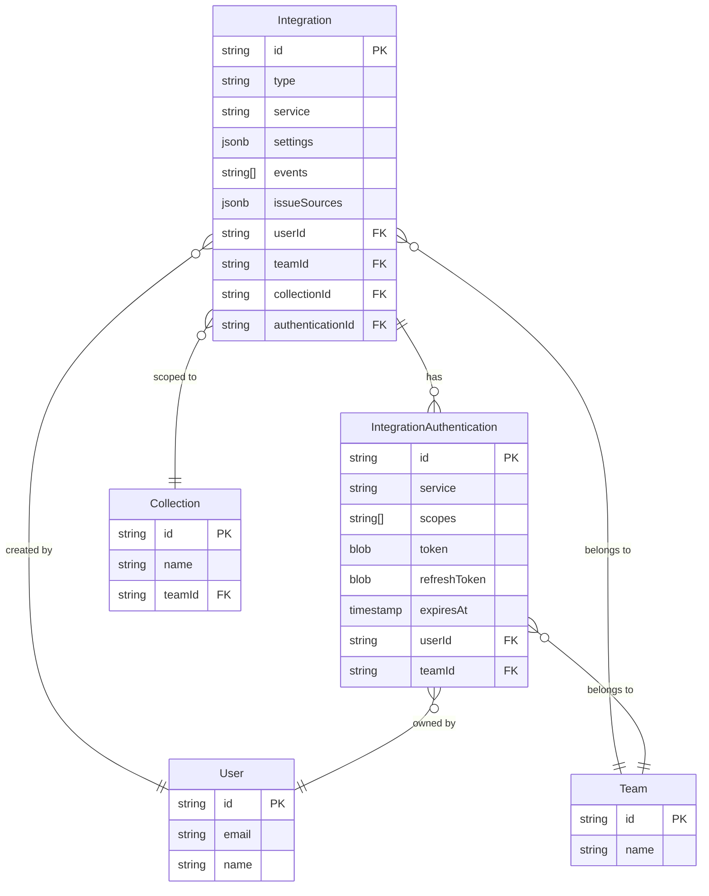

# 第三方集成模型

<cite>
**本文档引用的文件**
- [Integration.ts](file://server/models/Integration.ts)
- [IntegrationAuthentication.ts](file://server/models/IntegrationAuthentication.ts)
- [CacheIssueSourcesTask.ts](file://server/queues/tasks/CacheIssueSourcesTask.ts)
- [types.ts](file://shared/types.ts)
- [Integration.ts](file://app/models/Integration.ts)
</cite>

## 目录
1. [简介](#简介)
2. [核心数据模型](#核心数据模型)
3. [认证信息安全管理](#认证信息安全管理)
4. [集成生命周期管理](#集成生命周期管理)
5. [具体集成实现](#具体集成实现)
6. [实体关系图](#实体关系图)

## 简介
本文档详细介绍了系统中第三方集成（Integration）的核心数据模型及其相关组件。作为连接外部服务与系统内部功能的桥梁，集成模型支持多种服务类型，包括GitHub、Slack等，实现了内容嵌入、数据分析、命令交互等多种功能。文档将深入解析集成模型的字段含义、配置方式、与用户、团队、文档集合的关联关系，以及认证信息的安全存储和处理机制。

## 核心数据模型

### Integration模型
`Integration`模型是第三方集成的核心实体，定义了集成的基本属性和配置。该模型包含以下关键字段：

- **type**: 集成类型，使用`IntegrationType`枚举定义，包括`Post`（发布更新）、`Command`（接收命令）、`Embed`（内容嵌入）、`Analytics`（数据分析）等。
- **service**: 集成服务，使用`IntegrationService`枚举定义，如`GitHub`、`Slack`、`GoogleAnalytics`等。
- **settings**: 集成配置，类型为`IntegrationSettings<T>`，根据集成类型和具体服务的不同，配置内容也有所差异。例如，对于GitHub集成，配置可能包含安装信息；对于Google Analytics集成，则包含测量ID等。
- **events**: 事件列表，字符串数组，用于指定集成需要监听或触发的事件。
- **issueSources**: 问题源列表，类型为`IssueSource[]`，用于存储从外部服务获取的问题或拉取请求源信息。

`Integration`模型通过外键与`User`、`Team`、`Collection`等模型建立关联，确保集成的归属和作用范围。

**Section sources**
- [Integration.ts](file://server/models/Integration.ts#L25-L105)
- [types.ts](file://shared/types.ts#L106-L131)

### IntegrationSettings配置
`IntegrationSettings`是一个泛型类型，根据集成类型`T`的不同，其结构也有所不同。例如：
- 对于`Embed`类型的集成，配置可能包含URL、GitHub安装信息等。
- 对于`Analytics`类型的集成，配置则包含`measurementId`、`instanceUrl`等分析服务所需的参数。

这种设计使得集成模型能够灵活地支持多种服务和功能，同时保持类型安全。

**Section sources**
- [types.ts](file://shared/types.ts#L186-L227)

## 认证信息安全管理

### IntegrationAuthentication模型
为了安全地存储第三方服务的认证信息，系统使用了`IntegrationAuthentication`模型。该模型专门用于存储敏感数据，如访问令牌（token）、刷新令牌（refreshToken）等。

关键字段包括：
- **service**: 认证对应的服务。
- **scopes**: 授权范围列表。
- **token**: 访问令牌，使用`@Encrypted`装饰器进行加密存储。
- **refreshToken**: 刷新令牌，同样经过加密处理。
- **expiresAt**: 令牌过期时间。

**Section sources**
- [IntegrationAuthentication.ts](file://server/models/IntegrationAuthentication.ts#L32-L161)

### 敏感数据加密
`IntegrationAuthentication`模型使用`@Encrypted`装饰器对`token`和`refreshToken`字段进行加密。这意味着这些敏感信息在存储到数据库之前会被加密，即使数据库被泄露，攻击者也无法直接获取明文令牌。

### 认证刷新机制
模型提供了`refreshTokenIfNeeded`方法，用于在访问令牌即将过期时自动刷新。该方法通过以下步骤确保安全性和可靠性：
1. 检查令牌是否即将过期（默认阈值为5分钟）。
2. 如果需要刷新，则使用事务和行级锁来防止并发刷新导致的竞争条件。
3. 调用服务提供商特定的刷新回调函数获取新的令牌。
4. 更新数据库中的认证记录，并返回新的访问令牌。

此机制确保了集成服务的持续可用性，同时最大限度地减少了因令牌过期而导致的服务中断。

**Section sources**
- [IntegrationAuthentication.ts](file://server/models/IntegrationAuthentication.ts#L109-L161)

## 集成生命周期管理

### 创建与删除流程
当创建或删除一个集成时，系统会触发一系列后台任务来维护数据的一致性和缓存的有效性。

#### 创建流程
1. 创建`Integration`记录。
2. 创建关联的`IntegrationAuthentication`记录以存储认证信息。
3. 触发`IntegrationCreatedProcessor`处理器。
4. 调度`CacheIssueSourcesTask`任务，从外部服务获取问题源信息并缓存到集成记录中。
5. 清理团队相关的未展开数据（unfurl data）缓存，确保数据新鲜。

#### 删除流程
1. 触发`IntegrationDeletedProcessor`处理器。
2. 执行插件卸载钩子（uninstall hooks），允许相关插件执行清理操作（如GitHub插件会撤销访问权限）。
3. 清理团队相关的未展开数据缓存。
4. 强制删除`Integration`及其关联的`IntegrationAuthentication`记录。

**Section sources**
- [Integration.ts](file://server/models/Integration.ts#L91-L104)
- [IntegrationCreatedProcessor.ts](file://server/queues/processors/IntegrationCreatedProcessor.ts#L7-L29)
- [IntegrationDeletedProcessor.ts](file://server/queues/processors/IntegrationDeletedProcessor.ts#L7-L33)
- [CacheIssueSourcesTask.ts](file://server/queues/tasks/CacheIssueSourcesTask.ts#L9-L30)

### 缓存清理机制
`CacheHelper.clearData`方法被用于在集成创建或删除时清理相关的缓存数据。这确保了系统中显示的内容始终是最新的，避免了因缓存导致的陈旧信息问题。

## 具体集成实现

### GitHub集成
GitHub集成属于`Embed`类型，主要用于嵌入GitHub上的问题（Issues）和拉取请求（Pull Requests）。其配置`settings`中包含`github.installation`对象，存储了安装ID和账户信息。当集成创建时，系统会通过GitHub API获取该安装下所有仓库的问题源，并缓存到`issueSources`字段中。

### Slack集成
Slack集成支持`Post`和`Command`两种类型。`Post`类型用于将系统中的更新发布到指定的Slack频道；`Command`类型则允许用户在Slack中通过命令与系统交互。认证信息通过OAuth流程获取，并安全地存储在`IntegrationAuthentication`模型中。

**Section sources**
- [Integration.ts](file://app/models/Integration.ts#L11-L31)
- [IntegrationsStore.ts](file://app/stores/IntegrationsStore.ts#L7-L36)

## 实体关系图

**Diagram sources**
- [Integration.ts](file://server/models/Integration.ts#L25-L105)
- [IntegrationAuthentication.ts](file://server/models/IntegrationAuthentication.ts#L32-L161)
- [User.ts](file://server/models/User.ts#L81-L856)
- [Team.ts](file://server/models/Team.ts#L54-L473)
- [Collection.ts](file://server/models/Collection.ts#L87-L1007)