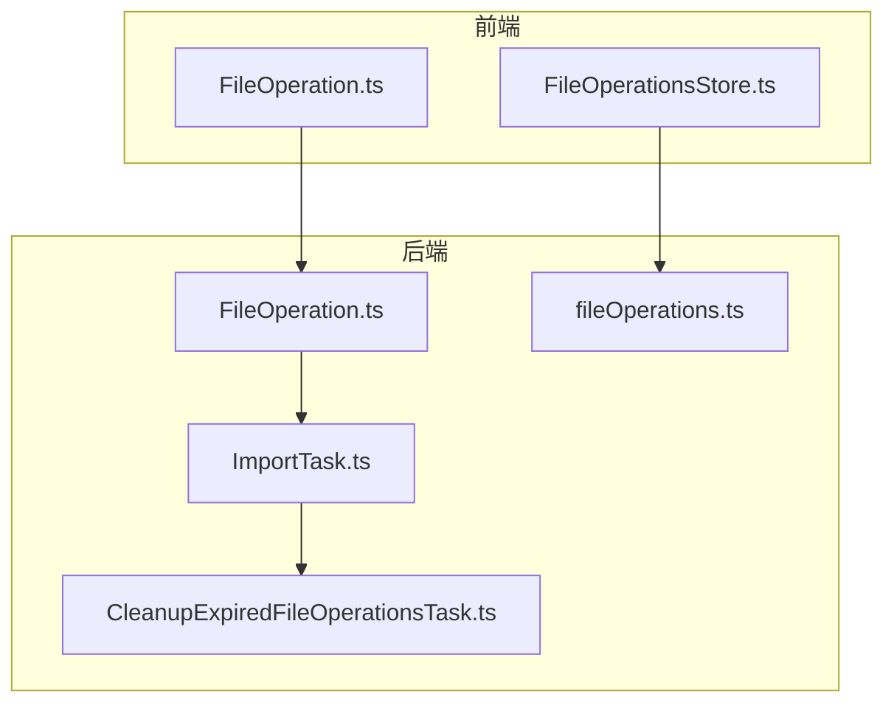
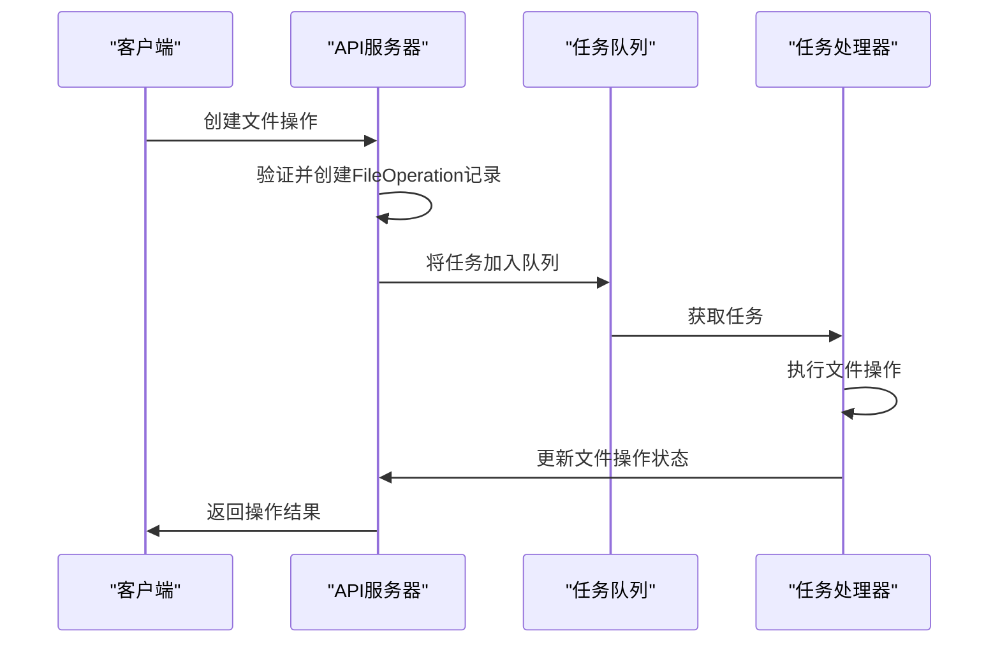
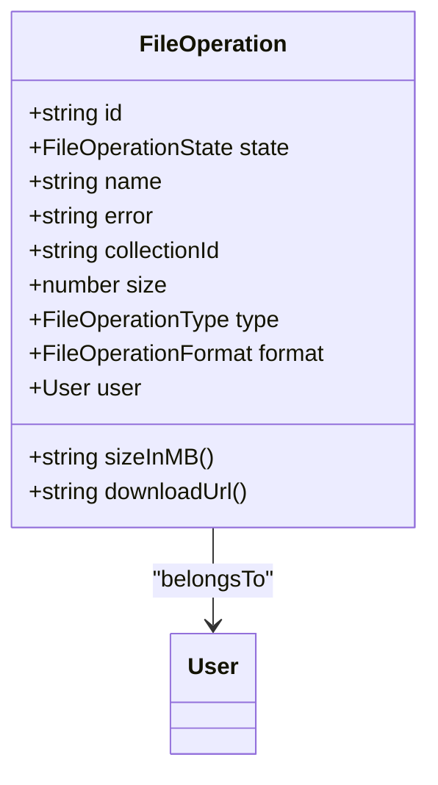
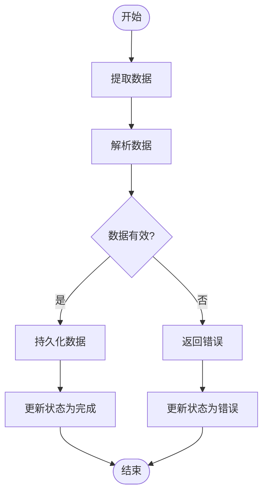
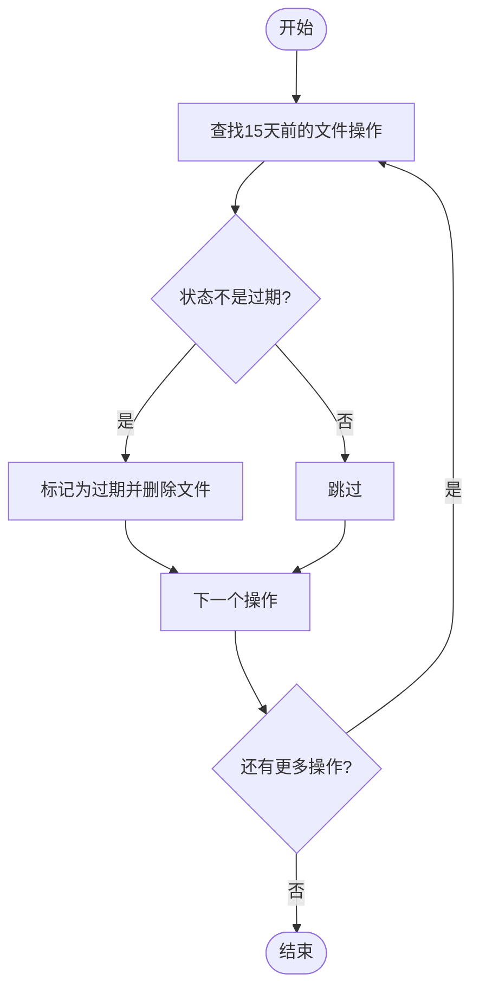
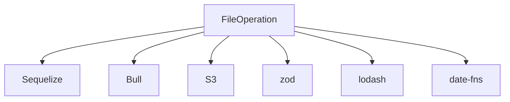

# 文件操作

<cite>
**Referenced Files in This Document**   
- [FileOperation.ts](file://app/models/FileOperation.ts)
- [FileOperation.ts](file://server/models/FileOperation.ts)
- [ImportTask.ts](file://server/queues/tasks/ImportTask.ts)
- [CleanupExpiredFileOperationsTask.ts](file://server/queues/tasks/CleanupExpiredFileOperationsTask.ts)
- [fileOperations.ts](file://server/routes/api/fileOperations/fileOperations.ts)
- [FileOperationsStore.ts](file://app/stores/FileOperationsStore.ts)
- [types.ts](file://shared/types.ts)
</cite>

## 目录
1. [简介](#简介)
2. [项目结构](#项目结构)
3. [核心组件](#核心组件)
4. [架构概述](#架构概述)
5. [详细组件分析](#详细组件分析)
6. [依赖分析](#依赖分析)
7. [性能考虑](#性能考虑)
8. [故障排除指南](#故障排除指南)
9. [结论](#结论)

## 简介
本文档详细介绍了文件操作系统的实现和管理，重点围绕FileOperation模型展开。文档涵盖了import、export、error、options等字段的含义和使用场景，以及与Team、User、Document的关联关系。详细解释了文件操作的创建、执行和清理流程，包括documentImporter命令如何处理文档导入，以及CleanupExpiredFileOperationsTask如何清理过期操作。文档还描述了文件操作的状态管理、错误处理和进度跟踪机制，并使用实际代码示例说明导入JSON、Markdown等文件的完整流程，以及如何处理导入过程中的错误和异常情况。为初学者提供文件操作的概念性理解，同时为经验丰富的开发者提供技术细节，包括性能优化、资源管理和错误恢复策略。

## 项目结构
项目结构清晰地组织了文件操作相关的组件和模型。核心文件操作逻辑分布在`app/models`和`server/models`目录下的`FileOperation.ts`文件中。服务器端的任务处理逻辑位于`server/queues/tasks`目录，包括`ImportTask.ts`和`CleanupExpiredFileOperationsTask.ts`等关键文件。API路由定义在`server/routes/api/fileOperations/fileOperations.ts`中，而前端状态管理则通过`app/stores/FileOperationsStore.ts`实现。共享的类型定义在`shared/types.ts`中统一管理。

**Diagram sources**
- [FileOperation.ts](file://app/models/FileOperation.ts#L1-L45)
- [FileOperation.ts](file://server/models/FileOperation.ts#L1-L169)
- [ImportTask.ts](file://server/queues/tasks/ImportTask.ts#L1-L557)
- [CleanupExpiredFileOperationsTask.ts](file://server/queues/tasks/CleanupExpiredFileOperationsTask.ts#L1-L41)
- [fileOperations.ts](file://server/routes/api/fileOperations/fileOperations.ts#L1-L132)
- [FileOperationsStore.ts](file://app/stores/FileOperationsStore.ts#L1-L39)
- [types.ts](file://shared/types.ts#L1-L600)

**Section sources**
- [FileOperation.ts](file://app/models/FileOperation.ts#L1-L45)
- [FileOperation.ts](file://server/models/FileOperation.ts#L1-L169)
- [ImportTask.ts](file://server/queues/tasks/ImportTask.ts#L1-L557)
- [CleanupExpiredFileOperationsTask.ts](file://server/queues/tasks/CleanupExpiredFileOperationsTask.ts#L1-L41)
- [fileOperations.ts](file://server/routes/api/fileOperations/fileOperations.ts#L1-L132)
- [FileOperationsStore.ts](file://app/stores/FileOperationsStore.ts#L1-L39)
- [types.ts](file://shared/types.ts#L1-L600)

## 核心组件
文件操作的核心组件包括FileOperation模型、ImportTask任务处理器和CleanupExpiredFileOperationsTask清理任务。FileOperation模型定义了文件操作的基本属性和行为，包括状态、类型、格式、大小和错误信息。ImportTask负责处理文件导入的整个流程，从数据提取到解析和持久化。CleanupExpiredFileOperationsTask则定期清理过期的文件操作记录，确保系统资源的有效利用。

**Section sources**
- [FileOperation.ts](file://app/models/FileOperation.ts#L1-L45)
- [FileOperation.ts](file://server/models/FileOperation.ts#L1-L169)
- [ImportTask.ts](file://server/queues/tasks/ImportTask.ts#L1-L557)
- [CleanupExpiredFileOperationsTask.ts](file://server/queues/tasks/CleanupExpiredFileOperationsTask.ts#L1-L41)

## 架构概述
文件操作系统的架构分为前端和后端两大部分。前端通过FileOperationsStore管理文件操作的状态，并提供用户界面。后端通过API路由接收请求，创建文件操作记录，并将其放入任务队列。任务处理器（如ImportTask）从队列中获取任务，执行具体的文件操作，并更新文件操作的状态。整个流程通过事件驱动的方式进行协调，确保各组件之间的松耦合。

**Diagram sources**
- [fileOperations.ts](file://server/routes/api/fileOperations/fileOperations.ts#L1-L132)
- [ImportTask.ts](file://server/queues/tasks/ImportTask.ts#L1-L557)

## 详细组件分析

### FileOperation模型分析
FileOperation模型是文件操作系统的核心数据结构，定义了文件操作的所有属性和行为。

#### 属性定义

**Diagram sources**
- [FileOperation.ts](file://app/models/FileOperation.ts#L1-L45)
- [FileOperation.ts](file://server/models/FileOperation.ts#L1-L169)

**Section sources**
- [FileOperation.ts](file://app/models/FileOperation.ts#L1-L45)
- [FileOperation.ts](file://server/models/FileOperation.ts#L1-L169)

### ImportTask任务分析
ImportTask负责处理文件导入的整个流程，包括数据提取、解析和持久化。

#### 执行流程

**Diagram sources**
- [ImportTask.ts](file://server/queues/tasks/ImportTask.ts#L1-L557)

**Section sources**
- [ImportTask.ts](file://server/queues/tasks/ImportTask.ts#L1-L557)

### CleanupExpiredFileOperationsTask任务分析
CleanupExpiredFileOperationsTask负责定期清理过期的文件操作记录。

#### 清理流程

**Diagram sources**
- [CleanupExpiredFileOperationsTask.ts](file://server/queues/tasks/CleanupExpiredFileOperationsTask.ts#L1-L41)

**Section sources**
- [CleanupExpiredFileOperationsTask.ts](file://server/queues/tasks/CleanupExpiredFileOperationsTask.ts#L1-L41)

## 依赖分析
文件操作系统依赖于多个核心组件和外部服务。主要依赖包括Sequelize ORM用于数据库操作，Bull队列系统用于任务调度，以及S3存储服务用于文件存储。此外，系统还依赖于各种验证和辅助工具，如zod用于数据验证，lodash用于数据处理，date-fns用于日期操作。

**Diagram sources**
- [FileOperation.ts](file://server/models/FileOperation.ts#L1-L169)
- [ImportTask.ts](file://server/queues/tasks/ImportTask.ts#L1-L557)

**Section sources**
- [FileOperation.ts](file://server/models/FileOperation.ts#L1-L169)
- [ImportTask.ts](file://server/queues/tasks/ImportTask.ts#L1-L557)

## 性能考虑
文件操作系统的性能优化主要集中在以下几个方面：首先，通过异步任务处理避免阻塞主线程；其次，使用批量操作减少数据库查询次数；再次，合理设置任务优先级和重试策略；最后，定期清理过期数据以释放存储空间。此外，系统还通过缓存机制减少重复计算，提高响应速度。

## 故障排除指南
当文件操作出现问题时，可以按照以下步骤进行排查：
1. 检查文件操作的状态是否为"error"
2. 查看错误信息以确定具体原因
3. 检查相关日志文件获取更多细节
4. 验证输入数据的格式和完整性
5. 确认存储服务的可用性
6. 检查任务队列是否正常工作

**Section sources**
- [FileOperation.ts](file://server/models/FileOperation.ts#L1-L169)
- [ImportTask.ts](file://server/queues/tasks/ImportTask.ts#L1-L557)

## 结论
文件操作系统通过FileOperation模型和相关任务处理器实现了完整的文件操作功能。系统设计合理，组件职责清晰，具有良好的可扩展性和维护性。通过异步任务处理和定期清理机制，系统能够高效地处理大量文件操作，同时保证资源的有效利用。未来可以进一步优化错误处理机制，提供更详细的错误报告和恢复策略。