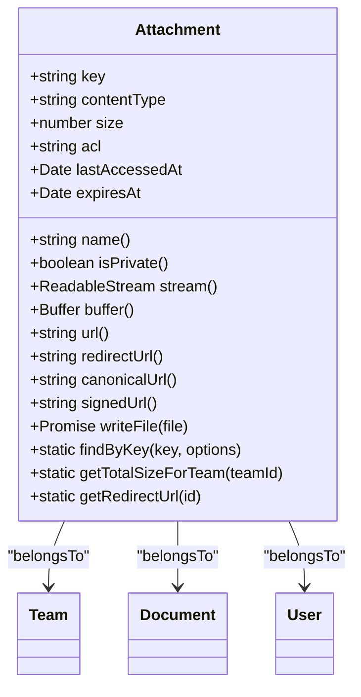
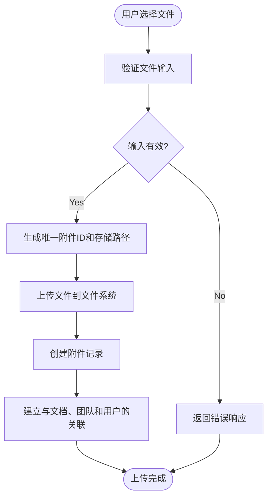

# 附件与文件管理

<cite>
**本文档中引用的文件**  
- [Attachment.ts](file://server/models/Attachment.ts)
- [AttachmentHelper.ts](file://server/models/helpers/AttachmentHelper.ts)
- [attachmentCreator.ts](file://server/commands/attachmentCreator.ts)
- [Document.ts](file://server/models/Document.ts)
- [Team.ts](file://server/models/Team.ts)
- [User.ts](file://server/models/User.ts)
</cite>

## 目录
1. [简介](#简介)
2. [附件数据模型](#附件数据模型)
3. [文件管理机制](#文件管理机制)
4. [核心字段详解](#核心字段详解)
5. [关联关系](#关联关系)
6. [附件助手类](#附件助手类)
7. [文档编辑器中的附件节点](#文档编辑器中的附件节点)
8. [文件上传流程](#文件上传流程)
9. [过期清理策略](#过期清理策略)
10. [安全性与性能优化](#安全性与性能优化)

## 简介
本文档详细介绍了附件（Attachment）数据模型和文件管理机制的实现。重点阐述了附件作为文件存储核心实体的设计，包括其关键字段的含义和管理方式，以及与文档、团队和用户的关联关系。文档还解释了AttachmentHelper工具类如何处理文件上传、下载、重定向和权限控制，包括presetToAcl和presetToExpiry等核心方法。此外，描述了在文档编辑器中附件节点的渲染和交互行为，以及附件URL替换的实现机制。通过实际代码示例说明了文件上传流程、附件引用处理和过期清理策略。为初学者提供文件管理系统的概念性理解，同时为经验丰富的开发者提供技术细节，包括存储策略、访问控制、性能优化和安全性考虑。

**Section sources**
- [Attachment.ts](file://server/models/Attachment.ts#L1-L30)
- [AttachmentHelper.ts](file://server/models/helpers/AttachmentHelper.ts#L1-L10)

## 附件数据模型
附件数据模型是文件存储的核心实体，负责管理所有上传文件的元数据和访问控制。该模型定义了文件的存储位置、访问权限、大小、过期时间等关键属性。

**Diagram sources**
- [Attachment.ts](file://server/models/Attachment.ts#L33-L236)

**Section sources**
- [Attachment.ts](file://server/models/Attachment.ts#L33-L236)

## 文件管理机制
文件管理机制通过AttachmentHelper工具类和attachmentCreator命令实现。AttachmentHelper负责生成文件存储路径、解析文件键、确定访问控制列表（ACL）和过期时间。attachmentCreator命令则负责创建附件记录并将其存储到文件系统中。

**Section sources**
- [AttachmentHelper.ts](file://server/models/helpers/AttachmentHelper.ts#L11-L117)
- [attachmentCreator.ts](file://server/commands/attachmentCreator.ts#L36-L94)

## 核心字段详解
附件数据模型包含多个核心字段，每个字段都有其特定的含义和管理方式。

### key字段
key字段是附件的唯一标识符，用于在文件系统中定位文件。它由bucket、userId、id和fileName组成，确保了文件的唯一性和可访问性。

**Section sources**
- [AttachmentHelper.ts](file://server/models/helpers/AttachmentHelper.ts#L22-L38)

### acl字段
acl字段定义了附件的访问控制列表，决定了文件的公开程度。默认值为"public-read"，表示文件可以被公开读取。其他可能的值包括"private"，表示文件只能由授权用户访问。

**Section sources**
- [AttachmentHelper.ts](file://server/models/helpers/AttachmentHelper.ts#L74-L81)

### size字段
size字段记录了附件的大小，以字节为单位。该字段在文件上传时自动填充，用于监控和管理存储空间的使用情况。

**Section sources**
- [Attachment.ts](file://server/models/Attachment.ts#L46-L51)

### expiresAt字段
expiresAt字段定义了附件的过期时间。对于某些预设类型的附件（如导入文件），系统会自动设置过期时间，以确保临时文件不会长期占用存储空间。

**Section sources**
- [AttachmentHelper.ts](file://server/models/helpers/AttachmentHelper.ts#L89-L97)

## 关联关系
附件数据模型与文档、团队和用户之间存在明确的关联关系。

### 与文档的关联
每个附件可以关联到一个文档，表示该文件是文档的一部分。这种关联通过documentId字段实现，允许系统在文档删除时自动清理相关附件。

**Section sources**
- [Attachment.ts](file://server/models/Attachment.ts#L219-L221)

### 与团队的关联
每个附件属于一个团队，通过teamId字段实现。这种关联有助于团队级别的存储管理和权限控制。

**Section sources**
- [Attachment.ts](file://server/models/Attachment.ts#L233-L235)

### 与用户的关联
每个附件由一个用户上传，通过userId字段实现。这种关联有助于追踪文件的上传者，并在用户删除时处理相关附件。

**Section sources**
- [Attachment.ts](file://server/models/Attachment.ts#L233-L235)

## 附件助手类
AttachmentHelper类提供了多个静态方法，用于处理文件管理的各种任务。

### presetToAcl方法
该方法根据附件的预设类型确定其访问控制列表。例如，头像文件通常设置为"public-read"，而其他文件则使用默认的ACL设置。

**Section sources**
- [AttachmentHelper.ts](file://server/models/helpers/AttachmentHelper.ts#L74-L81)

### presetToExpiry方法
该方法根据附件的预设类型确定其过期时间。例如，导入文件和工作区导入文件会在24小时后过期。

**Section sources**
- [AttachmentHelper.ts](file://server/models/helpers/AttachmentHelper.ts#L89-L97)

### presetToMaxUploadSize方法
该方法根据附件的预设类型确定其最大上传大小。不同类型的附件有不同的大小限制，以确保系统资源的合理使用。

**Section sources**
- [AttachmentHelper.ts](file://server/models/helpers/AttachmentHelper.ts#L105-L116)

## 文档编辑器中的附件节点
在文档编辑器中，附件以节点的形式呈现，用户可以进行上传、下载、替换和删除等操作。附件节点的渲染和交互行为由Attachment类的component方法实现。

**Section sources**
- [Attachment.tsx](file://shared/editor/nodes/Attachment.tsx#L18-L156)

## 文件上传流程
文件上传流程包括以下几个步骤：
1. 用户选择文件并触发上传操作。
2. 系统生成唯一的附件ID和存储路径。
3. 文件被上传到文件系统，并创建相应的附件记录。
4. 附件记录与文档、团队和用户建立关联。

**Diagram sources**
- [attachmentCreator.ts](file://server/commands/attachmentCreator.ts#L36-L94)

**Section sources**
- [attachmentCreator.ts](file://server/commands/attachmentCreator.ts#L36-L94)

## 过期清理策略
系统通过定期检查附件的过期时间来清理过期文件。对于设置了过期时间的附件，系统会在过期后自动删除，以释放存储空间。

**Section sources**
- [Attachment.ts](file://server/models/Attachment.ts#L219-L221)

## 安全性与性能优化
文件管理系统在设计时充分考虑了安全性和性能优化。通过访问控制列表（ACL）和权限验证确保文件的安全访问，通过合理的存储策略和缓存机制提高系统性能。

**Section sources**
- [Attachment.ts](file://server/models/Attachment.ts#L33-L236)
- [AttachmentHelper.ts](file://server/models/helpers/AttachmentHelper.ts#L11-L117)