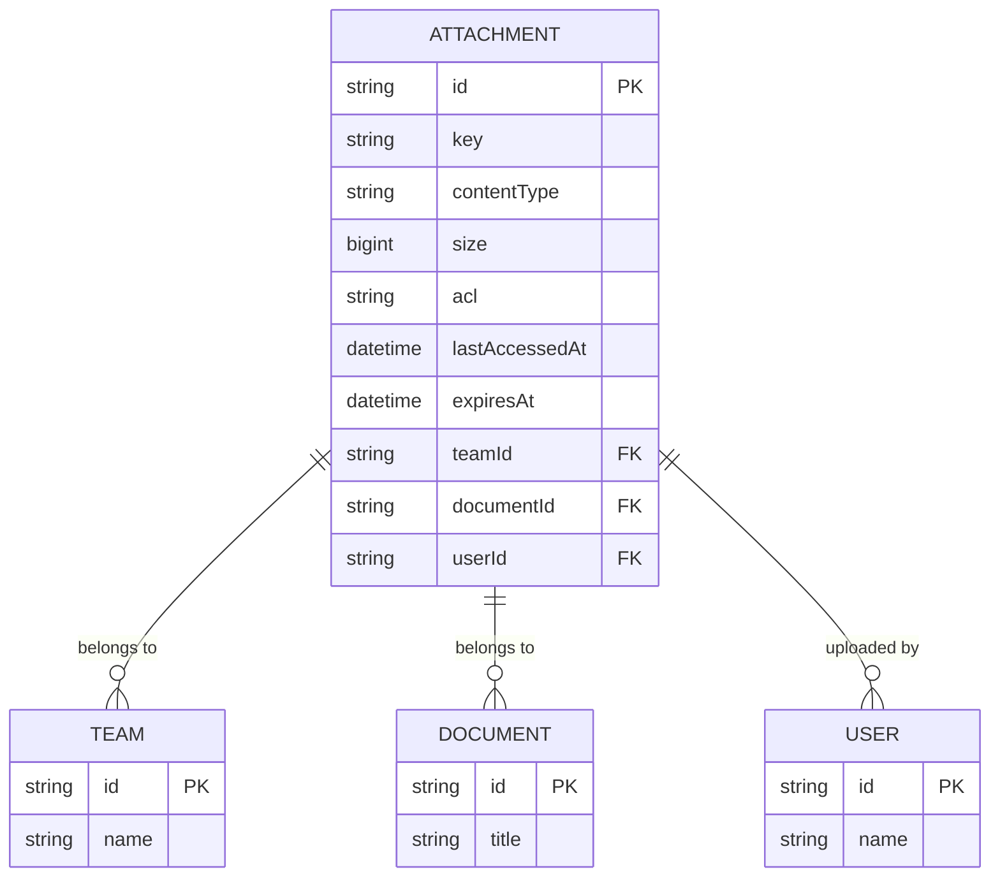
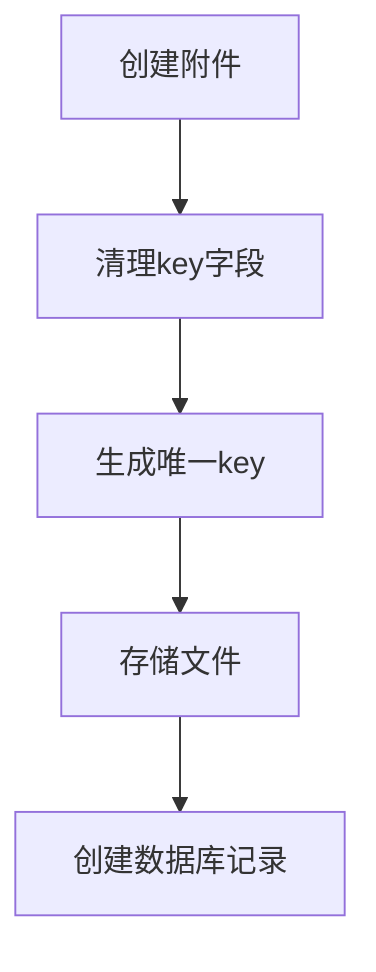
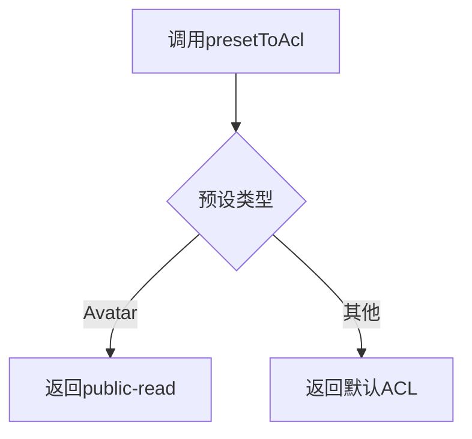
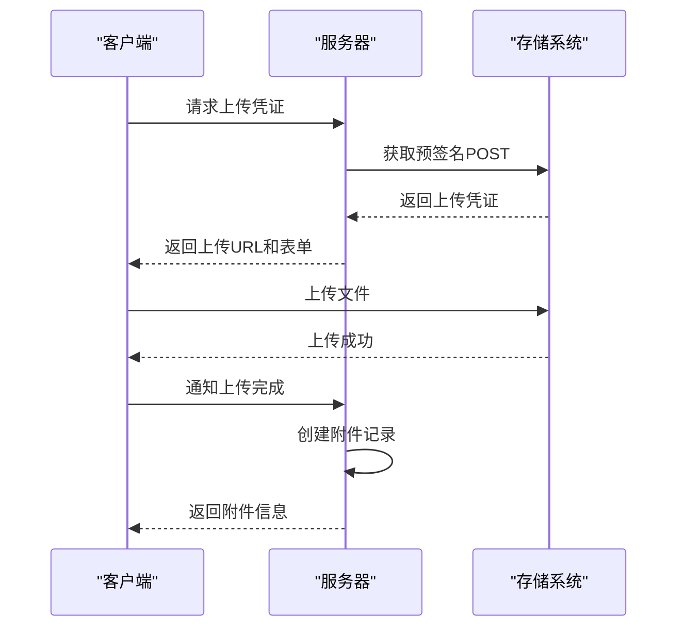
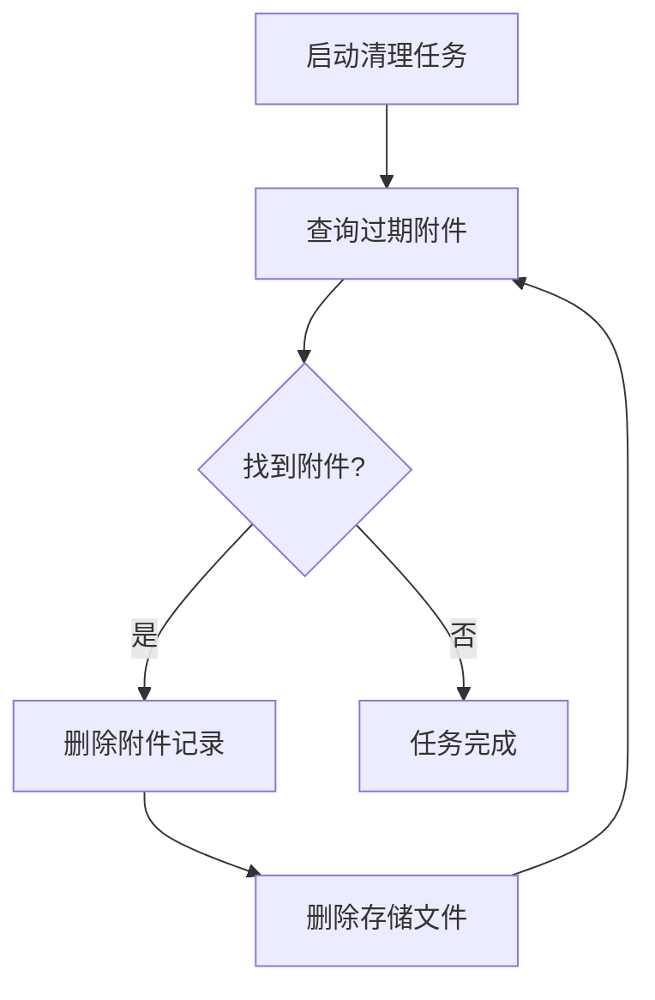

# 附件模型

<cite>
**本文档中引用的文件**   
- [Attachment.ts](file://server/models/Attachment.ts)
- [AttachmentHelper.ts](file://server/models/helpers/AttachmentHelper.ts)
- [attachmentCreator.ts](file://server/commands/attachmentCreator.ts)
- [CleanupExpiredAttachmentsTask.ts](file://server/queues/tasks/CleanupExpiredAttachmentsTask.ts)
- [attachments.ts](file://server/routes/api/attachments/attachments.ts)
- [BaseStorage.ts](file://server/storage/files/BaseStorage.ts)
- [Team.ts](file://server/models/Team.ts)
- [Document.ts](file://server/models/Document.ts)
</cite>

## 目录
1. [简介](#简介)
2. [数据模型](#数据模型)
3. [核心字段详解](#核心字段详解)
4. [关联关系](#关联关系)
5. [生命周期钩子](#生命周期钩子)
6. [附件助手类](#附件助手类)
7. [文件上传流程](#文件上传流程)
8. [过期清理策略](#过期清理策略)
9. [权限控制](#权限控制)
10. [性能与安全](#性能与安全)
11. [总结](#总结)

## 简介
附件模型是系统中用于管理文件存储的核心实体。它不仅负责存储文件的元数据，还管理文件的访问控制、生命周期和与文档、团队、用户等其他核心实体的关联。本文档将深入探讨附件模型的实现细节，为开发者提供全面的技术指导，同时为初学者提供清晰的概念性理解。

## 数据模型
附件模型定义了文件存储的核心结构，包含文件的元数据、访问控制信息和生命周期管理。

**Diagram sources**
- [Attachment.ts](file://server/models/Attachment.ts#L33-L236)
- [Team.ts](file://server/models/Team.ts#L54-L473)
- [Document.ts](file://server/models/Document.ts#L94-L1314)
- [User.ts](file://server/models/User.ts#L81-L856)

**Section sources**
- [Attachment.ts](file://server/models/Attachment.ts#L33-L236)

## 核心字段详解
附件模型包含多个关键字段，每个字段都有其特定的含义和管理方式。

### key
`key` 字段是文件在存储系统中的唯一标识符。它遵循特定的命名约定，包含存储桶、用户ID、附件ID和文件名。

**Section sources**
- [Attachment.ts](file://server/models/Attachment.ts#L42-L46)
- [AttachmentHelper.ts](file://server/models/helpers/AttachmentHelper.ts#L22-L38)

### acl
`acl` 字段定义了文件的访问控制级别，支持 `private` 和 `public-read` 两种模式。`private` 模式下的文件需要通过签名URL访问，而 `public-read` 模式的文件可以直接访问。

**Section sources**
- [Attachment.ts](file://server/models/Attachment.ts#L62-L66)
- [AttachmentHelper.ts](file://server/models/helpers/AttachmentHelper.ts#L74-L81)

### size
`size` 字段记录了文件的大小（以字节为单位）。这个值在文件上传时被设置，并用于计算团队的总存储使用量。

**Section sources**
- [Attachment.ts](file://server/models/Attachment.ts#L54-L56)

### expiresAt
`expiresAt` 字段定义了文件的过期时间。对于某些类型的附件（如导入文件），系统会自动设置一个过期时间，过期后文件将被自动清理。

**Section sources**
- [Attachment.ts](file://server/models/Attachment.ts#L74-L76)
- [AttachmentHelper.ts](file://server/models/helpers/AttachmentHelper.ts#L89-L97)

### teamId
`teamId` 字段标识了附件所属的团队。这是实现多租户架构的关键，确保文件存储和访问权限在团队级别进行隔离。

**Section sources**
- [Attachment.ts](file://server/models/Attachment.ts#L145-L148)

### id
`id` 字段是附件在数据库中的唯一标识符。它继承自 `IdModel`，确保了全局唯一性。

**Section sources**
- [IdModel.ts](file://server/models/base/IdModel.ts#L15-L19)

## 关联关系
附件模型与其他核心实体建立了明确的关联关系，形成了完整的数据模型。

### 与文档的关联
每个附件可以关联到一个文档，表示该附件是文档的一部分。这种关联支持文档中的文件引用和嵌入。

**Section sources**
- [Attachment.ts](file://server/models/Attachment.ts#L153-L158)

### 与团队的关联
附件必须属于一个团队，这实现了数据的多租户隔离。团队级别的存储配额和访问控制都依赖于这一关联。

**Section sources**
- [Attachment.ts](file://server/models/Attachment.ts#L145-L148)

### 与用户的关联
每个附件都记录了上传它的用户，这有助于追踪文件来源和实施基于用户的权限控制。

**Section sources**
- [Attachment.ts](file://server/models/Attachment.ts#L174-L179)

## 生命周期钩子
附件模型通过生命周期钩子在创建、更新和删除时执行特定的处理逻辑。

### 创建时的处理
在附件创建前，系统会自动对 `key` 字段进行清理，确保其符合存储系统的命名规范。

**Section sources**
- [Attachment.ts](file://server/models/Attachment.ts#L160-L163)

### 更新时的处理
附件的 `key` 字段一旦创建就不能更改，这是为了防止文件引用失效。系统通过 `preventKeyChange` 钩子强制执行这一规则。

**Section sources**
- [Attachment.ts](file://server/models/Attachment.ts#L165-L172)

### 删除时的处理
当附件被删除时，系统不仅会从数据库中移除记录，还会从存储系统中删除实际的文件，确保数据完全清理。

**Section sources**
- [Attachment.ts](file://server/models/Attachment.ts#L174-L179)

## 附件助手类
`AttachmentHelper` 类提供了处理文件上传、下载、重定向和权限控制的核心方法。

### presetToAcl 方法
`presetToAcl` 方法根据附件预设类型返回相应的访问控制级别。例如，头像文件通常设置为公开可读。

**Section sources**
- [AttachmentHelper.ts](file://server/models/helpers/AttachmentHelper.ts#L74-L81)

### presetToExpiry 方法
`presetToExpiry` 方法为特定类型的附件（如导入文件）设置过期时间，确保临时文件不会长期占用存储空间。

**Section sources**
- [AttachmentHelper.ts](file://server/models/helpers/AttachmentHelper.ts#L89-L97)

## 文件上传流程
文件上传是一个多步骤的过程，涉及客户端、服务器和存储系统的协同工作。

**Diagram sources**
- [attachments.ts](file://server/routes/api/attachments/attachments.ts#L87-L163)
- [BaseStorage.ts](file://server/storage/files/BaseStorage.ts#L111-L127)

**Section sources**
- [attachments.ts](file://server/routes/api/attachments/attachments.ts#L87-L163)

## 过期清理策略
系统通过后台任务定期清理过期的附件，以释放存储空间。

**Diagram sources**
- [CleanupExpiredAttachmentsTask.ts](file://server/queues/tasks/CleanupExpiredAttachmentsTask.ts#L14-L33)

**Section sources**
- [CleanupExpiredAttachmentsTask.ts](file://server/queues/tasks/CleanupExpiredAttachmentsTask.ts#L14-L33)

## 权限控制
附件的访问权限通过多种机制进行控制，确保数据安全。

### 私有附件访问
私有附件通过签名URL进行访问，每次访问都会更新最后访问时间，并设置适当的缓存策略。

**Section sources**
- [attachments.ts](file://server/routes/api/attachments/attachments.ts#L276-L278)

### 公开附件访问
公开附件可以直接通过CDN URL访问，系统会设置长期缓存以提高性能。

**Section sources**
- [Attachment.ts](file://server/models/Attachment.ts#L104-L106)

## 性能与安全
附件模型在设计时充分考虑了性能和安全因素。

### 存储策略
系统支持多种存储后端（如S3、本地存储），并提供统一的接口进行文件操作。

**Section sources**
- [BaseStorage.ts](file://server/storage/files/BaseStorage.ts#L111-L127)

### 安全考虑
所有文件上传都经过严格的验证，包括文件大小、类型和内容安全检查，防止恶意文件上传。

**Section sources**
- [attachments.ts](file://server/routes/api/attachments/attachments.ts#L124-L134)

## 总结
附件模型是系统文件管理功能的核心，它通过精心设计的数据结构、生命周期管理和权限控制，为用户提供安全、高效的文件存储和访问体验。理解其工作原理对于开发和维护相关功能至关重要。