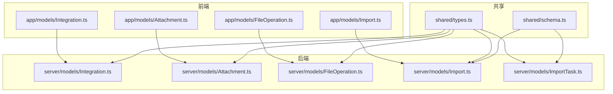
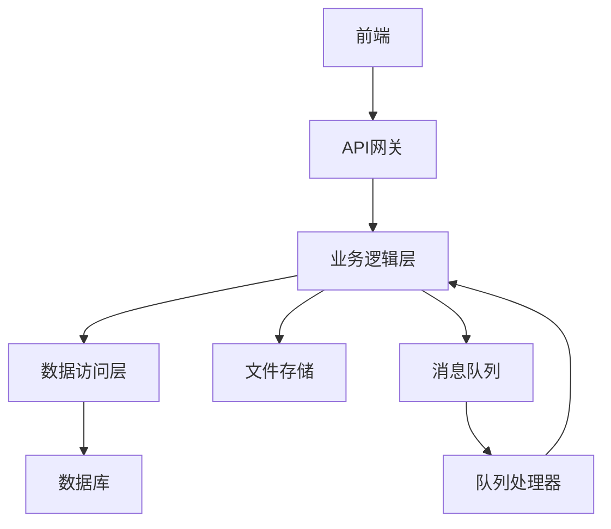
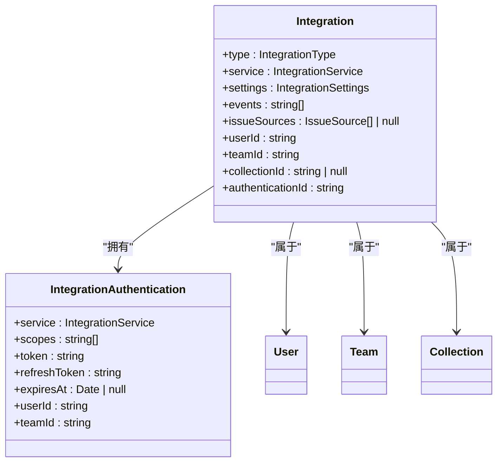
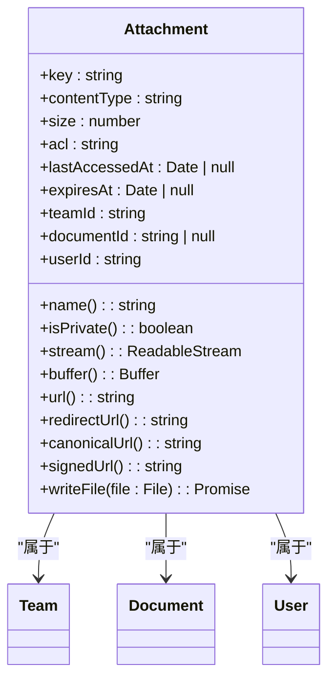
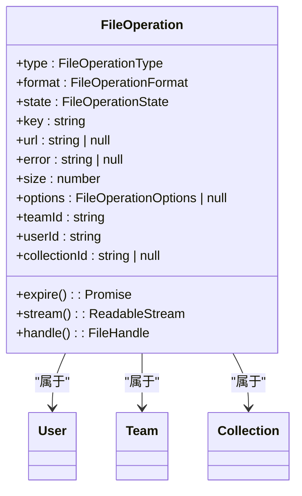
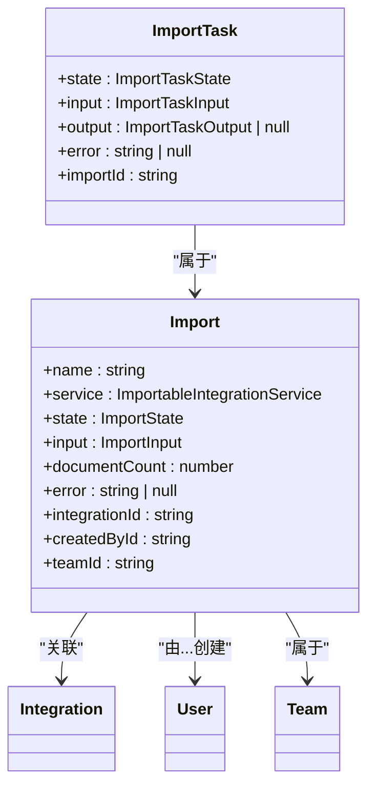
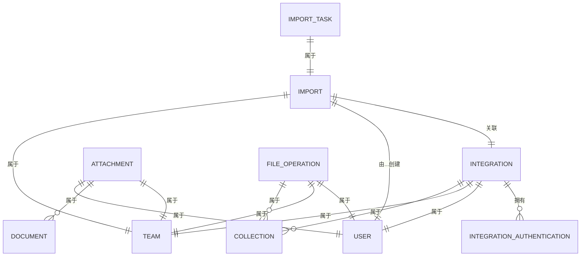

# 集成与扩展模型

<cite>
**本文档中引用的文件**  
- [Integration.ts](file://server/models/Integration.ts)
- [Attachment.ts](file://server/models/Attachment.ts)
- [FileOperation.ts](file://server/models/FileOperation.ts)
- [Import.ts](file://server/models/Import.ts)
- [ImportTask.ts](file://server/models/ImportTask.ts)
- [IntegrationAuthentication.ts](file://server/models/IntegrationAuthentication.ts)
- [AttachmentHelper.ts](file://server/models/helpers/AttachmentHelper.ts)
- [FileOperationCreatedProcessor.ts](file://server/queues/processors/FileOperationCreatedProcessor.ts)
- [IntegrationCreatedProcessor.ts](file://server/queues/processors/IntegrationCreatedProcessor.ts)
- [ErrorTimedOutFileOperationsTask.ts](file://server/queues/tasks/ErrorTimedOutFileOperationsTask.ts)
- [CleanupExpiredFileOperationsTask.ts](file://server/queues/tasks/CleanupExpiredFileOperationsTask.ts)
</cite>

## 目录
1. [简介](#简介)
2. [项目结构](#项目结构)
3. [核心组件](#核心组件)
4. [架构概述](#架构概述)
5. [详细组件分析](#详细组件分析)
6. [依赖分析](#依赖分析)
7. [性能考虑](#性能考虑)
8. [故障排除指南](#故障排除指南)
9. [结论](#结论)

## 简介
本文档详细介绍了集成与扩展数据模型的实现，重点涵盖Integration、Attachment、FileOperation、Import和ImportTask模型。文档解释了第三方集成的配置与管理、附件的存储机制、文件操作的状态跟踪，以及数据导入的处理流程。通过实际代码示例说明文件上传、下载、转换和存储的实现细节，并提供实体关系图来说明各模型之间的关系。

## 项目结构
项目结构清晰地组织了前端、后端和共享代码。核心模型位于`server/models`目录下，而前端组件和场景位于`app`目录中。`plugins`目录包含了各种第三方集成插件。

**图示来源**
- [Integration.ts](file://server/models/Integration.ts#L25-L105)
- [Attachment.ts](file://server/models/Attachment.ts#L34-L236)
- [FileOperation.ts](file://server/models/FileOperation.ts#L34-L165)
- [Import.ts](file://server/models/Import.ts#L23-L87)
- [ImportTask.ts](file://server/models/ImportTask.ts#L30-L58)

**章节来源**
- [server/models/Integration.ts](file://server/models/Integration.ts#L1-L109)
- [server/models/Attachment.ts](file://server/models/Attachment.ts#L1-L240)
- [server/models/FileOperation.ts](file://server/models/FileOperation.ts#L1-L169)
- [server/models/Import.ts](file://server/models/Import.ts#L1-L91)
- [server/models/ImportTask.ts](file://server/models/ImportTask.ts#L1-L62)

## 核心组件
核心组件包括Integration、Attachment、FileOperation、Import和ImportTask模型，它们共同构成了系统的集成与扩展能力。这些模型通过Sequelize ORM定义，并包含丰富的关联和钩子函数。

**章节来源**
- [server/models/Integration.ts](file://server/models/Integration.ts#L25-L105)
- [server/models/Attachment.ts](file://server/models/Attachment.ts#L34-L236)
- [server/models/FileOperation.ts](file://server/models/FileOperation.ts#L34-L165)
- [server/models/Import.ts](file://server/models/Import.ts#L23-L87)
- [server/models/ImportTask.ts](file://server/models/ImportTask.ts#L30-L58)

## 架构概述
系统架构采用分层设计，前端通过API与后端交互，后端处理业务逻辑并与数据库通信。文件操作和导入任务通过队列处理器异步执行，确保系统的响应性和可扩展性。

**图示来源**
- [FileOperationCreatedProcessor.ts](file://server/queues/processors/FileOperationCreatedProcessor.ts#L10-L56)
- [IntegrationCreatedProcessor.ts](file://server/queues/processors/IntegrationCreatedProcessor.ts#L7-L29)

## 详细组件分析
### Integration模型分析
Integration模型用于管理第三方集成，包括认证信息、事件源和同步设置。它与IntegrationAuthentication模型关联，后者存储加密的访问令牌和刷新令牌。

**图示来源**
- [Integration.ts](file://server/models/Integration.ts#L25-L105)
- [IntegrationAuthentication.ts](file://server/models/IntegrationAuthentication.ts#L32-L161)

**章节来源**
- [Integration.ts](file://server/models/Integration.ts#L25-L105)
- [IntegrationAuthentication.ts](file://server/models/IntegrationAuthentication.ts#L32-L161)

### Attachment模型分析
Attachment模型管理附件的存储和访问。附件可以是私有的或公开的，存储在S3兼容的存储系统中。模型提供了获取流、缓冲区和签名URL的方法。

**图示来源**
- [Attachment.ts](file://server/models/Attachment.ts#L34-L236)
- [AttachmentHelper.ts](file://server/models/helpers/AttachmentHelper.ts#L11-L117)

**章节来源**
- [Attachment.ts](file://server/models/Attachment.ts#L34-L236)
- [AttachmentHelper.ts](file://server/models/helpers/AttachmentHelper.ts#L11-L117)

### FileOperation模型分析
FileOperation模型跟踪文件操作的状态，如导出和导入。操作可以是创建、上传、完成、错误或过期状态。模型提供了流和句柄方法来访问文件内容。

**图示来源**
- [FileOperation.ts](file://server/models/FileOperation.ts#L34-L165)

**章节来源**
- [FileOperation.ts](file://server/models/FileOperation.ts#L34-L165)

### Import和ImportTask模型分析
Import模型表示一次导入操作，而ImportTask模型表示导入过程中的单个任务。导入可以是JSON或Markdown格式的文件，任务状态包括排队、进行中、成功和失败。

**图示来源**
- [Import.ts](file://server/models/Import.ts#L23-L87)
- [ImportTask.ts](file://server/models/ImportTask.ts#L30-L58)

**章节来源**
- [Import.ts](file://server/models/Import.ts#L23-L87)
- [ImportTask.ts](file://server/models/ImportTask.ts#L30-L58)

## 依赖分析
各模型之间存在复杂的依赖关系。Integration依赖于IntegrationAuthentication进行认证，Attachment和FileOperation都依赖于User和Team模型。Import模型与Integration模型关联，而ImportTask模型属于Import模型。

**图示来源**
- [Integration.ts](file://server/models/Integration.ts#L25-L105)
- [Attachment.ts](file://server/models/Attachment.ts#L34-L236)
- [FileOperation.ts](file://server/models/FileOperation.ts#L34-L165)
- [Import.ts](file://server/models/Import.ts#L23-L87)
- [ImportTask.ts](file://server/models/ImportTask.ts#L30-L58)

**章节来源**
- [Integration.ts](file://server/models/Integration.ts#L25-L105)
- [Attachment.ts](file://server/models/Attachment.ts#L34-L236)
- [FileOperation.ts](file://server/models/FileOperation.ts#L34-L165)
- [Import.ts](file://server/models/Import.ts#L23-L87)
- [ImportTask.ts](file://server/models/ImportTask.ts#L30-L58)

## 性能考虑
系统通过异步处理文件操作和导入任务来提高性能。定时任务如ErrorTimedOutFileOperationsTask和CleanupExpiredFileOperationsTask定期清理过期和超时的操作，确保系统资源的有效利用。

**章节来源**
- [ErrorTimedOutFileOperationsTask.ts](file://server/queues/tasks/ErrorTimedOutFileOperationsTask.ts#L11-L48)
- [CleanupExpiredFileOperationsTask.ts](file://server/queues/tasks/CleanupExpiredFileOperationsTask.ts#L11-L39)

## 故障排除指南
常见问题包括认证失败、文件上传超时和导入错误。检查日志文件和数据库记录可以帮助诊断问题。确保环境变量如AWS_S3_ACL和FILE_STORAGE_UPLOAD_MAX_SIZE正确配置。

**章节来源**
- [IntegrationAuthentication.ts](file://server/models/IntegrationAuthentication.ts#L32-L161)
- [AttachmentHelper.ts](file://server/models/helpers/AttachmentHelper.ts#L11-L117)
- [FileOperation.ts](file://server/models/FileOperation.ts#L34-L165)

## 结论
本文档详细介绍了集成与扩展数据模型的实现，涵盖了从配置管理到文件处理的各个方面。通过理解这些模型和它们之间的关系，开发者可以更好地利用系统的集成能力，为用户提供丰富的功能。