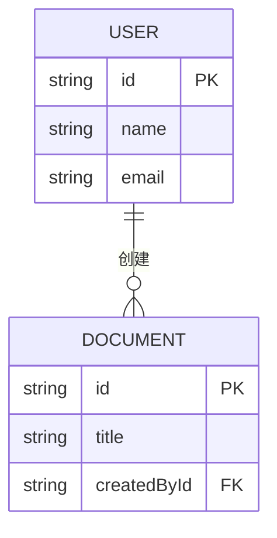
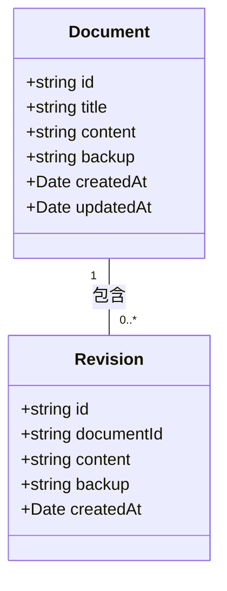
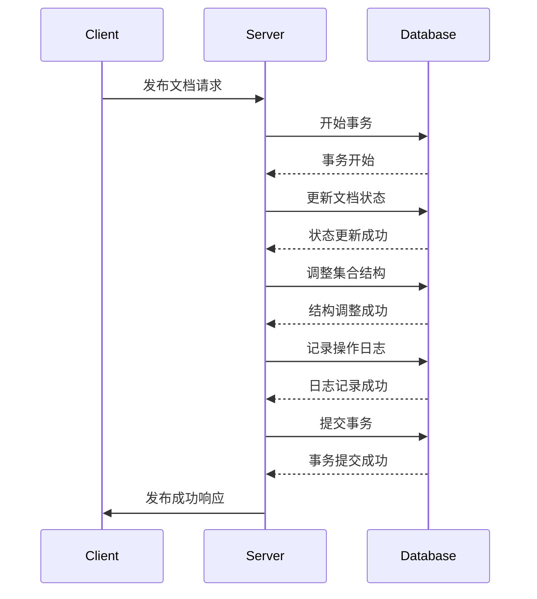
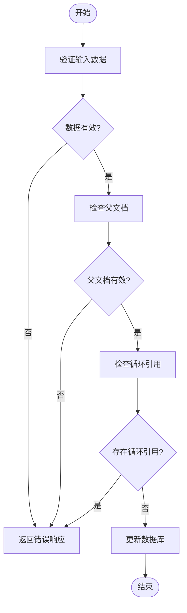

# 一致性保证

<cite>
**本文档引用的文件**   
- [20160814095336-add-document-createdById.js](file://server/migrations/20160814095336-add-document-createdById.js)
- [20200519032353-text-backup.js](file://server/migrations/20200519032353-text-backup.js)
- [Document.ts](file://app/models/Document.ts)
- [Revision.ts](file://app/models/Revision.ts)
- [Document.ts](file://server/models/Document.ts)
- [Revision.ts](file://server/models/Revision.ts)
- [RevisionsStore.ts](file://app/stores/RevisionsStore.ts)
</cite>

## 目录
1. [引言](#引言)
2. [数据一致性设计原则](#数据一致性设计原则)
3. [创建者ID添加机制](#创建者id添加机制)
4. [文本备份机制](#文本备份机制)
5. [事务管理与回滚策略](#事务管理与回滚策略)
6. [数据验证与完整性约束](#数据验证与完整性约束)
7. [最佳实践](#最佳实践)
8. [结论](#结论)

## 引言
baozi项目通过一系列精心设计的机制来确保数据的一致性和完整性。本文档详细介绍了项目中实现数据一致性的核心机制，重点分析了创建者ID添加和文本备份两个关键迁移文件的实现细节。文档旨在为初学者提供概念性概述，同时为经验丰富的开发者提供深入的技术细节，包括外键约束、数据校验、原子操作、错误检测和恢复机制。

**本文档引用的文件**
- [20160814095336-add-document-createdById.js](file://server/migrations/20160814095336-add-document-createdById.js)
- [20200519032353-text-backup.js](file://server/migrations/20200519032353-text-backup.js)

## 数据一致性设计原则
baozi项目的数据一致性设计遵循几个核心原则：首先，通过外键约束确保数据的引用完整性；其次，利用事务管理保证操作的原子性；再次，通过数据验证机制防止无效数据的写入；最后，采用备份和回滚策略应对数据异常情况。这些原则共同构成了项目数据一致性的基础。

**本文档引用的文件**
- [Document.ts](file://app/models/Document.ts)
- [Revision.ts](file://app/models/Revision.ts)

## 创建者ID添加机制
创建者ID添加机制通过数据库迁移文件`20160814095336-add-document-createdById.js`实现。该迁移在`documents`表中添加了一个名为`createdById`的新列，该列引用`users`表的主键，从而建立了文档与创建者之间的外键关系。这种设计确保了每个文档都有明确的创建者，增强了数据的可追溯性和安全性。

**图示来源**
- [20160814095336-add-document-createdById.js](file://server/migrations/20160814095336-add-document-createdById.js)

**本文档引用的文件**
- [20160814095336-add-document-createdById.js](file://server/migrations/20160814095336-add-document-createdById.js)
- [Document.ts](file://server/models/Document.ts)

## 文本备份机制
文本备份机制通过迁移文件`20200519032353-text-backup.js`实现，在`documents`和`revisions`表中添加了`backup`列。该列用于存储文档内容的备份，确保在数据损坏或意外删除时能够恢复。备份机制与版本控制相结合，为用户提供了一种可靠的数据保护手段。

**图示来源**
- [20200519032353-text-backup.js](file://server/migrations/20200519032353-text-backup.js)

**本文档引用的文件**
- [20200519032353-text-backup.js](file://server/migrations/20200519032353-text-backup.js)
- [Document.ts](file://server/models/Document.ts)
- [Revision.ts](file://server/models/Revision.ts)

## 事务管理与回滚策略
baozi项目采用事务管理来确保数据操作的原子性。当执行复杂的操作（如文档的发布、归档或删除）时，系统会将相关操作封装在一个事务中。如果事务中的任何操作失败，整个事务将被回滚，确保数据状态的一致性。例如，在文档发布过程中，系统会同时更新文档状态、调整集合结构和记录操作日志，这些操作要么全部成功，要么全部失败。

**图示来源**
- [Document.ts](file://server/models/Document.ts)

**本文档引用的文件**
- [Document.ts](file://server/models/Document.ts)
- [Revision.ts](file://server/models/Revision.ts)

## 数据验证与完整性约束
项目通过多层次的数据验证和完整性约束来保障数据质量。在模型层面，使用Sequelize的验证装饰器（如`@Length`、`@IsHexColor`）对字段进行验证；在数据库层面，通过外键约束和级联删除规则维护数据的引用完整性。此外，系统还实现了自定义验证逻辑，如防止文档与其子文档形成循环引用。

**图示来源**
- [Document.ts](file://server/models/Document.ts)

**本文档引用的文件**
- [Document.ts](file://server/models/Document.ts)
- [Revision.ts](file://server/models/Revision.ts)

## 最佳实践
在baozi项目中实施数据一致性保证的最佳实践包括：1) 始终使用事务处理复杂的多步操作；2) 在迁移文件中明确指定外键约束和级联行为；3) 实现全面的数据验证，包括前端和后端验证；4) 定期备份关键数据；5) 设计清晰的错误处理和恢复机制。这些实践有助于构建一个健壮、可靠的数据管理系统。

**本文档引用的文件**
- [Document.ts](file://server/models/Document.ts)
- [Revision.ts](file://server/models/Revision.ts)

## 结论
baozi项目通过综合运用外键约束、事务管理、数据验证和备份机制，建立了一套完善的数据一致性保证体系。创建者ID添加和文本备份机制是这一体系中的两个重要组成部分，它们分别从数据溯源和数据保护的角度增强了系统的可靠性。通过遵循最佳实践，开发者可以进一步提升系统的数据质量和用户体验。

**本文档引用的文件**
- [20160814095336-add-document-createdById.js](file://server/migrations/20160814095336-add-document-createdById.js)
- [20200519032353-text-backup.js](file://server/migrations/20200519032353-text-backup.js)
- [Document.ts](file://server/models/Document.ts)
- [Revision.ts](file://server/models/Revision.ts)