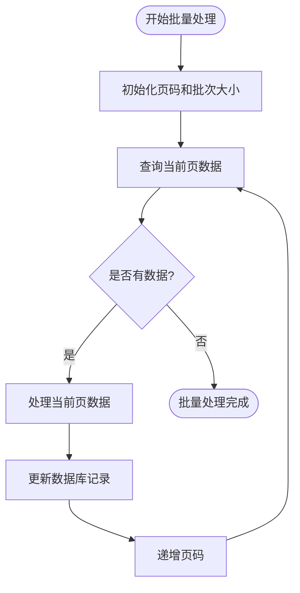
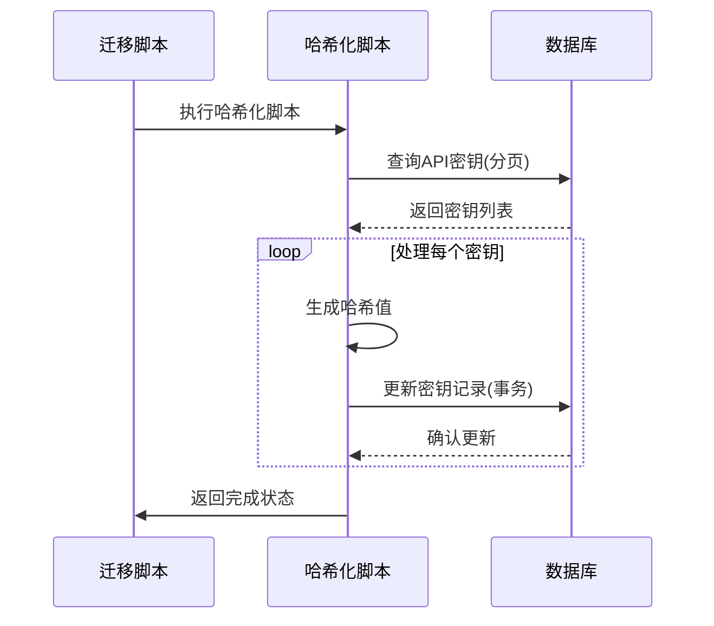
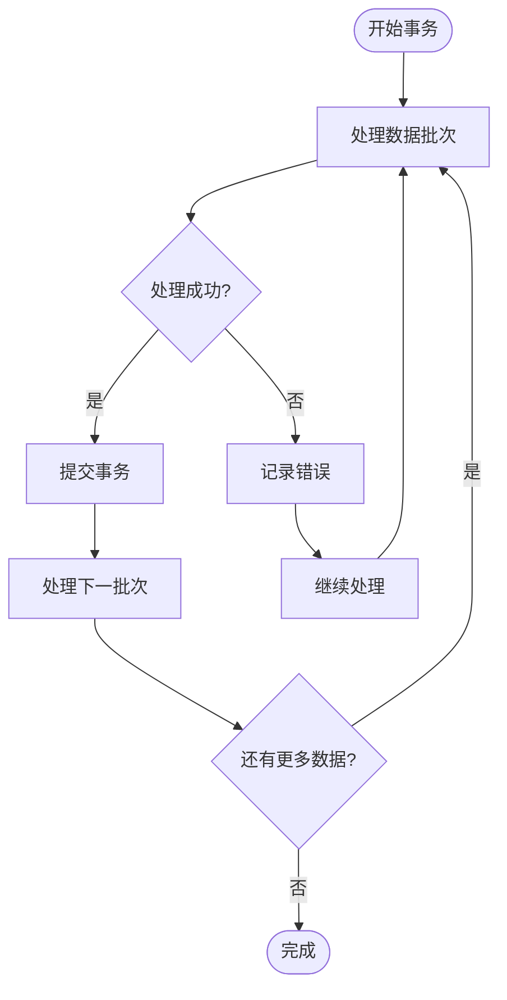

# 批量处理策略

<cite>
**本文档引用的文件**   
- [20240930113921-hash-api-keys.js](file://server/migrations/20240930113921-hash-api-keys.js)
- [20250327062414-resolve-collection-index-collisions.js](file://server/migrations/20250327062414-resolve-collection-index-collisions.js)
- [ApiKey.ts](file://server/models/ApiKey.ts)
- [Collection.ts](file://server/models/Collection.ts)
- [20240930113921-hash-api-keys.ts](file://server/scripts/20240930113921-hash-api-keys.ts)
- [20250327062414-resolve-collection-index-collisions.ts](file://server/scripts/20250327062414-resolve-collection-index-collisions.ts)
</cite>

## 目录
1. [简介](#简介)
2. [批量处理设计原则](#批量处理设计原则)
3. [分批策略与内存管理](#分批策略与内存管理)
4. [API密钥哈希化实现](#api密钥哈希化实现)
5. [集合索引冲突解决](#集合索引冲突解决)
6. [性能优化技术](#性能优化技术)
7. [事务管理与错误恢复](#事务管理与错误恢复)
8. [进度监控与资源限制](#进度监控与资源限制)
9. [并发控制](#并发控制)
10. [最佳实践](#最佳实践)

## 简介
本文档详细介绍了baozi项目中大规模数据处理的批量处理策略。重点阐述了API密钥哈希化和集合索引冲突解决两个关键迁移的实现方法。文档为初学者提供了概念性概述，同时为经验丰富的开发者深入讲解了事务管理、错误恢复、进度监控、资源限制和并发控制等技术细节。通过分析实际迁移文件，展示了如何实现高效稳定的大规模数据处理。

## 批量处理设计原则
baozi项目的批量处理策略遵循以下核心设计原则：首先，确保数据一致性，所有批量操作都在数据库事务中执行，保证操作的原子性；其次，采用分批处理机制，将大规模数据集分割成可管理的批次，避免内存溢出和系统超时；第三，实现幂等性，确保批量操作可以安全重试而不会产生副作用；第四，提供进度监控，通过日志和状态更新跟踪处理进度；最后，实施资源限制，控制并发任务数量和系统资源使用，确保系统稳定性。

**Section sources**
- [20240930113921-hash-api-keys.js](file://server/migrations/20240930113921-hash-api-keys.js#L1-L30)
- [20250327062414-resolve-collection-index-collisions.js](file://server/migrations/20250327062414-resolve-collection-index-collisions.js#L1-L30)

## 分批策略与内存管理
baozi项目采用基于页码的分批策略进行大规模数据处理。系统通过设置固定的批次大小（如100条记录），逐页处理数据。在内存管理方面，系统使用数据库连接的锁定机制（LOCK.UPDATE）确保数据一致性，同时在事务中处理每个批次，避免长时间持有数据库连接。处理完成后，系统会检查是否还有更多数据需要处理，如果有则递归处理下一页，否则结束批量操作。这种策略有效控制了内存使用，防止了大规模数据加载导致的内存溢出问题。



**Diagram sources **
- [20240930113921-hash-api-keys.ts](file://server/scripts/20240930113921-hash-api-keys.ts#L13-L38)
- [20250327062414-resolve-collection-index-collisions.ts](file://server/scripts/20250327062414-resolve-collection-index-collisions.ts#L25-L45)

## API密钥哈希化实现
API密钥哈希化迁移通过`20240930113921-hash-api-keys.js`迁移文件实现。该迁移在非测试和非托管部署环境中执行，通过调用`20240930113921-hash-api-keys.ts`脚本完成。脚本采用分页方式处理API密钥，对每个密钥生成哈希值并更新数据库记录。系统首先查询一批API密钥，然后在事务中遍历每个密钥，将明文密钥值哈希化并更新到`hash`字段，同时将`secret`字段置空。此过程确保了API密钥的安全性，即使数据库泄露，攻击者也无法获取原始密钥值。



**Diagram sources **
- [20240930113921-hash-api-keys.js](file://server/migrations/20240930113921-hash-api-keys.js#L1-L30)
- [20240930113921-hash-api-keys.ts](file://server/scripts/20240930113921-hash-api-keys.ts#L13-L38)
- [ApiKey.ts](file://server/models/ApiKey.ts#L26-L179)

## 集合索引冲突解决
集合索引冲突解决迁移通过`20250327062414-resolve-collection-index-collisions.js`迁移文件实现。该迁移针对团队中的集合进行索引冲突检测和解决。系统使用`fractional-index`库生成新的唯一索引值，确保集合排序的正确性。迁移过程首先按团队分批处理，对每个团队的集合按索引排序，然后检测连续的相同索引值。当发现索引冲突时，系统为冲突的集合生成新的分数索引，确保它们在排序中占据正确位置。此方法有效解决了因并发操作导致的索引冲突问题。

```mermaid
classDiagram
class CollectionIndexCollisionResolver {
+teamId : string
+currDuplicateIndex : string | null
+currDuplicateGroup : Collection[]
+resolvedCollisionsCount : number
+process() : Promise~void~
+processPage(page : number, transaction : Transaction) : Promise~void~
+resolveDuplicates(options : {nextCollection? : Collection, transaction : Transaction}) : Promise~void~
}
class Collection {
+id : string
+index : string
+teamId : string
}
CollectionIndexCollisionResolver --> Collection : "处理"
```

**Diagram sources **
- [20250327062414-resolve-collection-index-collisions.js](file://server/migrations/20250327062414-resolve-collection-index-collisions.js#L1-L30)
- [20250327062414-resolve-collection-index-collisions.ts](file://server/scripts/20250327062414-resolve-collection-index-collisions.ts#L13-L134)
- [Collection.ts](file://server/models/Collection.ts#L87-L1007)

## 性能优化技术
baozi项目采用多种性能优化技术来提高批量处理效率。首先，使用数据库索引优化查询性能，特别是在按创建时间排序的查询中。其次，实施连接锁定（LOCK.UPDATE）防止并发修改导致的数据竞争。第三，采用事务批处理，将多个数据库操作合并到单个事务中，减少事务开销。第四，使用分页查询避免一次性加载大量数据到内存。最后，通过异步处理和并行执行提高整体处理速度。这些技术共同作用，确保了大规模数据处理的高效性和稳定性。

**Section sources**
- [20240930113921-hash-api-keys.ts](file://server/scripts/20240930113921-hash-api-keys.ts#L13-L38)
- [20250327062414-resolve-collection-index-collisions.ts](file://server/scripts/20250327062414-resolve-collection-index-collisions.ts#L25-L45)

## 事务管理与错误恢复
baozi项目的批量处理采用严格的事务管理机制。每个批次的处理都在独立的数据库事务中执行，确保数据一致性。系统使用`sequelize.transaction`方法创建事务，并在事务中执行所有数据库操作。如果处理过程中发生错误，事务会自动回滚，保持数据完整性。对于错误恢复，系统采用继续处理策略，即在遇到单个记录处理失败时记录错误并继续处理后续记录，而不是中断整个批量操作。这种设计提高了系统的容错能力，确保大部分数据能够成功处理。



**Diagram sources **
- [20240930113921-hash-api-keys.ts](file://server/scripts/20240930113921-hash-api-keys.ts#L13-L38)
- [20250327062414-resolve-collection-index-collisions.ts](file://server/scripts/20250327062414-resolve-collection-index-collisions.ts#L25-L45)

## 进度监控与资源限制
baozi项目通过详细的日志记录实现进度监控。系统在处理每个批次前输出日志，显示当前处理的页码和团队信息。对于资源限制，系统通过设置批次大小（limit）和并发任务数来控制资源使用。在集合索引冲突解决迁移中，系统使用`batchLimit: 5`限制每个团队的处理批次，防止系统过载。此外，系统在非生产环境使用较小的延迟时间，加快测试速度，而在生产环境使用较长的延迟，确保系统稳定性。这些措施有效平衡了处理速度和系统资源消耗。

**Section sources**
- [20250327062414-resolve-collection-index-collisions.ts](file://server/scripts/20250327062414-resolve-collection-index-collisions.ts#L25-L45)

## 并发控制
baozi项目的批量处理采用多种并发控制机制。首先，使用数据库行级锁定（LOCK.UPDATE）防止多个进程同时修改同一条记录。其次，通过分批处理和页码机制实现任务的并行化，不同页码的处理可以并行执行。第三，系统在事务中处理每个批次，确保操作的原子性。对于长时间运行的任务，系统采用递归处理方式，避免单个请求超时。这些并发控制策略确保了批量处理的高效性和数据一致性，同时防止了系统资源的过度消耗。

**Section sources**
- [20240930113921-hash-api-keys.ts](file://server/scripts/20240930113921-hash-api-keys.ts#L13-L38)
- [20250327062414-resolve-collection-index-collisions.ts](file://server/scripts/20250327062414-resolve-collection-index-collisions.ts#L25-L45)

## 最佳实践
实施大规模数据处理的最佳实践包括：首先，始终在测试环境中验证批量处理脚本，确保其正确性和性能；其次，监控系统资源使用情况，根据实际情况调整批次大小；第三，实现详细的错误日志记录，便于问题排查；第四，定期备份数据，防止数据丢失；第五，采用渐进式处理策略，先处理小规模数据验证逻辑，再扩展到大规模数据；最后，提供进度报告和估计完成时间，增强用户体验。这些最佳实践确保了批量处理操作的安全性、可靠性和可维护性。

**Section sources**
- [20240930113921-hash-api-keys.ts](file://server/scripts/20240930113921-hash-api-keys.ts#L13-L38)
- [20250327062414-resolve-collection-index-collisions.ts](file://server/scripts/20250327062414-resolve-collection-index-collisions.ts#L25-L45)