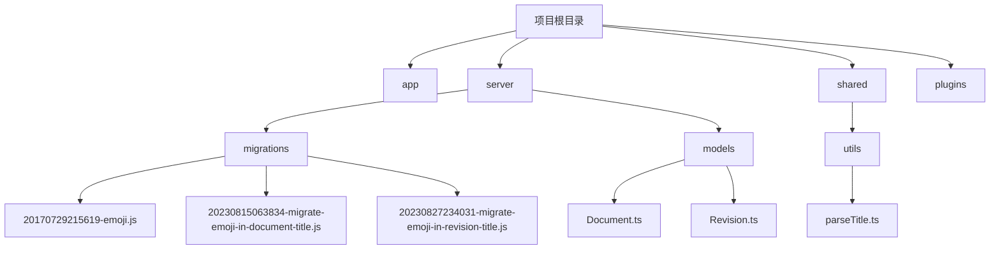
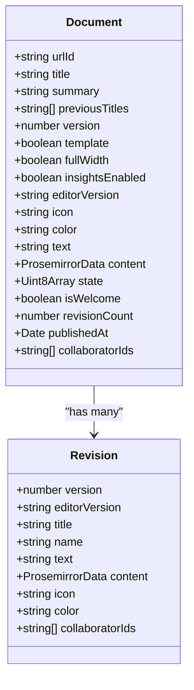
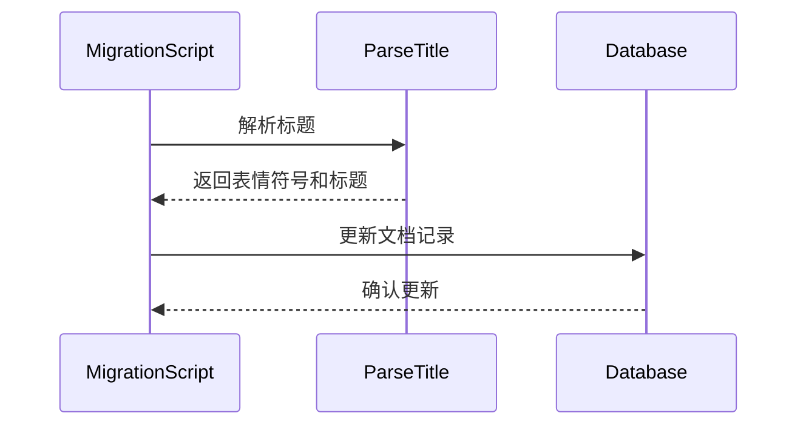
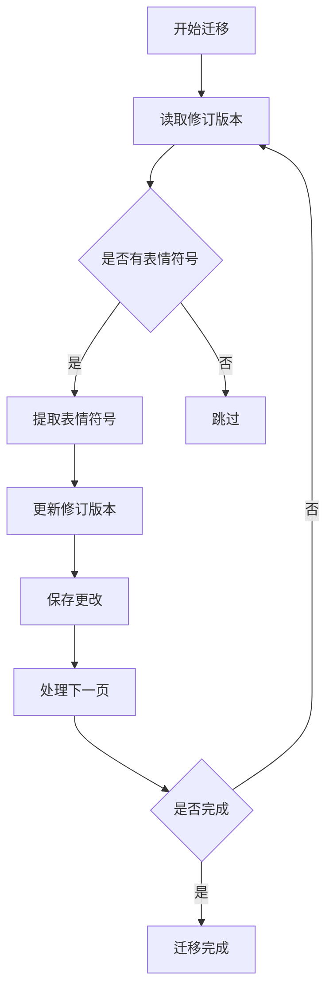
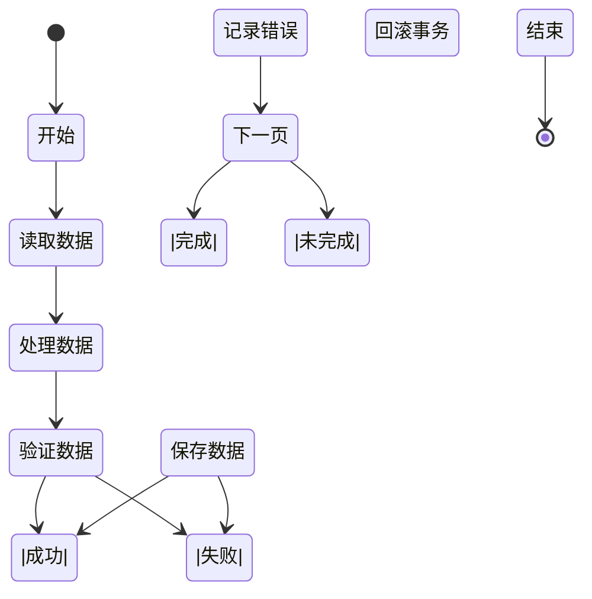
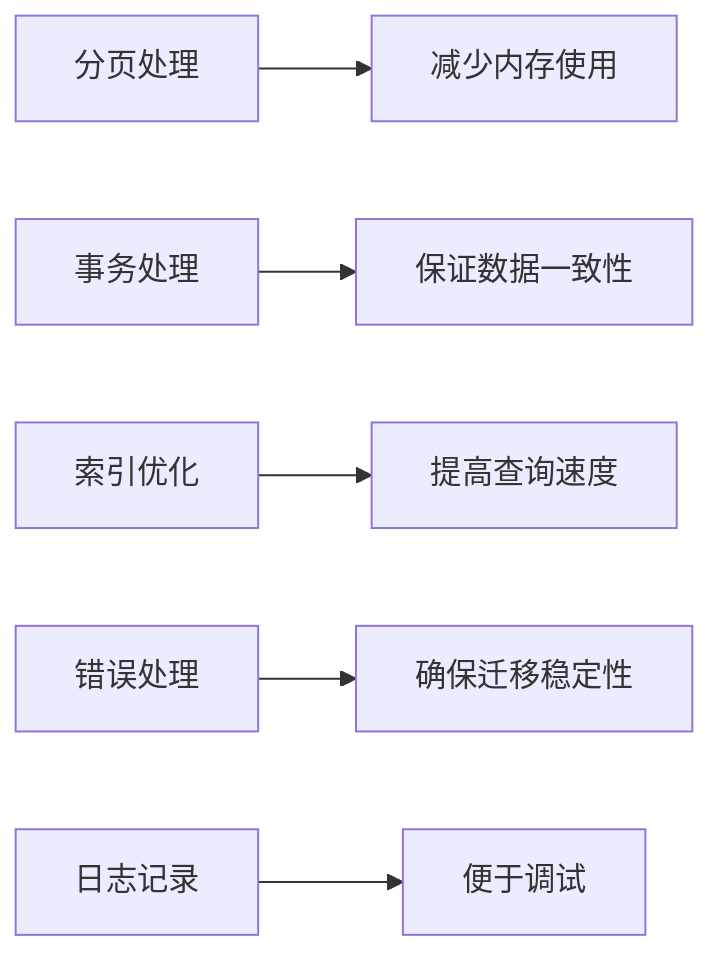

# 数据转换模式

<cite>
**本文档中引用的文件**  
- [20170729215619-emoji.js](file://server/migrations/20170729215619-emoji.js)
- [20230815063834-migrate-emoji-in-document-title.js](file://server/migrations/20230815063834-migrate-emoji-in-document-title.js)
- [20230827234031-migrate-emoji-in-revision-title.js](file://server/migrations/20230827234031-migrate-emoji-in-revision-title.js)
- [parseTitle.ts](file://shared/utils/parseTitle.ts)
- [Document.ts](file://server/models/Document.ts)
- [Revision.ts](file://server/models/Revision.ts)
</cite>

## 目录
1. [引言](#引言)
2. [项目结构分析](#项目结构分析)
3. [核心数据转换设计](#核心数据转换设计)
4. [表情符号迁移实现](#表情符号迁移实现)
5. [数据完整性与错误处理](#数据完整性与错误处理)
6. [性能优化策略](#性能优化策略)
7. [最佳实践与使用指南](#最佳实践与使用指南)
8. [结论](#结论)

## 引言

baozi项目的数据转换模式专注于复杂数据格式的迁移，特别是表情符号在文档和修订版本标题中的处理。该系统通过一系列迁移脚本和数据处理机制，实现了从旧有数据格式到新格式的安全、高效转换。文档将深入探讨表情符号支持的实现方式，包括20170729215619-emoji.js、20230815063834-migrate-emoji-in-document-title.js和20230827234031-migrate-emoji-in-revision-title.js三个关键迁移文件的实现细节。本指南旨在为初学者提供概念性概述，同时为经验丰富的开发者提供技术细节，涵盖字符编码处理、数据完整性验证、转换过程中的性能优化和错误处理策略。

## 项目结构分析

baozi项目的结构清晰地分为多个主要目录，包括app（前端应用）、server（后端服务）、shared（共享代码）、plugins（插件系统）等。数据转换相关的代码主要集中在server/migrations目录下，该目录包含了所有数据库迁移脚本。这些脚本按照时间戳命名，确保了迁移的有序执行。shared/utils目录包含了跨平台使用的工具函数，如parseTitle.ts用于解析标题中的表情符号。server/models目录定义了核心数据模型，如Document和Revision，这些模型在数据转换过程中起着关键作用。



**图示来源**
- [20170729215619-emoji.js](file://server/migrations/20170729215619-emoji.js)
- [20230815063834-migrate-emoji-in-document-title.js](file://server/migrations/20230815063834-migrate-emoji-in-document-title.js)
- [20230827234031-migrate-emoji-in-revision-title.js](file://server/migrations/20230827234031-migrate-emoji-in-revision-title.js)
- [parseTitle.ts](file://shared/utils/parseTitle.ts)
- [Document.ts](file://server/models/Document.ts)
- [Revision.ts](file://server/models/Revision.ts)

**本节来源**
- [server/migrations](file://server/migrations)
- [shared/utils](file://shared/utils)
- [server/models](file://server/models)

## 核心数据转换设计

baozi项目的数据转换设计遵循了清晰的分层架构，确保了数据迁移的安全性和可维护性。核心设计原则包括字段映射策略、数据类型转换和编码处理机制。系统通过Sequelize ORM管理数据库模式，利用迁移脚本逐步更新数据结构。例如，20170729215619-emoji.js脚本通过addColumn和removeColumn方法添加和移除emoji字段，实现了对documents表的结构变更。这种设计允许在不影响现有数据的情况下进行模式演进。

数据转换过程中，系统采用了渐进式迁移策略，避免了大规模数据操作带来的性能瓶颈。通过将迁移任务分解为小批量处理，系统能够在不影响用户体验的情况下完成数据转换。此外，系统还实现了数据完整性验证机制，确保迁移后的数据符合预期的格式和约束条件。



**图示来源**
- [Document.ts](file://server/models/Document.ts)
- [Revision.ts](file://server/models/Revision.ts)

**本节来源**
- [Document.ts](file://server/models/Document.ts)
- [Revision.ts](file://server/models/Revision.ts)

## 表情符号迁移实现

### 初始表情符号支持

20170729215619-emoji.js迁移脚本实现了对文档表情符号的初始支持。该脚本通过Sequelize的addColumn方法，在documents表中添加了一个名为emoji的字符串字段，允许存储文档级别的表情符号。这一设计为后续的表情符号功能奠定了基础，使得文档可以拥有独立的表情符号标识。

```javascript
module.exports = {
  up: async (queryInterface, Sequelize) => {
    await queryInterface.addColumn("documents", "emoji", {
      type: Sequelize.STRING,
      allowNull: true,
    });
  },
  down: async (queryInterface, _Sequelize) => {
    await queryInterface.removeColumn("documents", "emoji");
  },
};
```

**本节来源**
- [20170729215619-emoji.js](file://server/migrations/20170729215619-emoji.js)

### 文档标题表情符号迁移

20230815063834-migrate-emoji-in-document-title.js迁移脚本实现了从文档标题中提取表情符号的功能。该脚本通过调用parseTitle工具函数，解析文档标题并提取首字符作为表情符号。迁移过程采用分页处理机制，每次处理1000条记录，确保了大规模数据迁移的性能和稳定性。



**图示来源**
- [20230815063834-migrate-emoji-in-document-title.js](file://server/migrations/20230815063834-migrate-emoji-in-document-title.js)
- [parseTitle.ts](file://shared/utils/parseTitle.ts)

**本节来源**
- [20230815063834-migrate-emoji-in-document-title.js](file://server/migrations/20230815063834-migrate-emoji-in-document-title.js)
- [parseTitle.ts](file://shared/utils/parseTitle.ts)

### 修订版本标题表情符号迁移

20230827234031-migrate-emoji-in-revision-title.js迁移脚本与文档标题迁移类似，但针对修订版本表进行操作。该脚本通过相同的parseTitle函数解析修订版本标题，并将提取的表情符号存储在icon字段中。迁移过程同样采用分页处理，确保了数据一致性的同时避免了长时间锁定数据库。



**图示来源**
- [20230827234031-migrate-emoji-in-revision-title.js](file://server/migrations/20230827234031-migrate-emoji-in-revision-title.js)
- [parseTitle.ts](file://shared/utils/parseTitle.ts)

**本节来源**
- [20230827234031-migrate-emoji-in-revision-title.js](file://server/migrations/20230827234031-migrate-emoji-in-revision-title.js)
- [parseTitle.ts](file://shared/utils/parseTitle.ts)

## 数据完整性与错误处理

baozi项目的数据转换系统实现了 robust 的数据完整性验证和错误处理机制。在迁移过程中，系统通过事务处理确保了数据的一致性。每个迁移操作都在数据库事务中执行，如果任何步骤失败，整个事务将被回滚，防止数据处于不一致状态。

错误处理方面，系统采用了try-catch块捕获异常，并记录详细的错误信息。对于失败的记录，系统会继续处理后续数据，而不是中断整个迁移过程。这种设计确保了即使在部分数据存在问题的情况下，大部分数据仍能成功迁移。



**图示来源**
- [20230815063834-migrate-emoji-in-document-title.js](file://server/migrations/20230815063834-migrate-emoji-in-document-title.js)
- [20230827234031-migrate-emoji-in-revision-title.js](file://server/migrations/20230827234031-migrate-emoji-in-revision-title.js)

**本节来源**
- [20230815063834-migrate-emoji-in-document-title.js](file://server/migrations/20230815063834-migrate-emoji-in-document-title.js)
- [20230827234031-migrate-emoji-in-revision-title.js](file://server/migrations/20230827234031-migrate-emoji-in-revision-title.js)

## 性能优化策略

为了应对大规模数据迁移的性能挑战，baozi项目采用了多种优化策略。首先，系统实现了分页处理机制，将大规模数据操作分解为小批量处理，避免了内存溢出和数据库锁定问题。其次，迁移脚本在非测试和非托管环境中执行，确保了生产环境的稳定性。

此外，系统利用了数据库索引优化查询性能。在迁移过程中，相关字段的索引被充分利用，加快了数据检索速度。对于长时间运行的迁移任务，系统还实现了进度跟踪和日志记录，便于监控和调试。



**图示来源**
- [20230815063834-migrate-emoji-in-document-title.js](file://server/migrations/20230815063834-migrate-emoji-in-document-title.js)
- [20230827234031-migrate-emoji-in-revision-title.js](file://server/migrations/20230827234031-migrate-emoji-in-revision-title.js)

**本节来源**
- [20230815063834-migrate-emoji-in-document-title.js](file://server/migrations/20230815063834-migrate-emoji-in-document-title.js)
- [20230827234031-migrate-emoji-in-revision-title.js](file://server/migrations/20230827234031-migrate-emoji-in-revision-title.js)

## 最佳实践与使用指南

### 安全的数据转换实践

在进行数据格式转换时，应遵循以下最佳实践：
1. 始终在事务中执行数据修改操作
2. 实现完整的回滚机制
3. 在生产环境前充分测试迁移脚本
4. 监控迁移过程中的性能指标
5. 记录详细的迁移日志

### 开发者指南

对于希望实现类似数据转换功能的开发者，建议：
1. 使用ORM工具管理数据库模式变更
2. 采用分页处理大规模数据
3. 实现健壮的错误处理机制
4. 充分利用数据库索引优化性能
5. 在迁移前后进行数据完整性验证

## 结论

baozi项目的数据转换模式展示了如何安全、高效地处理复杂数据格式迁移。通过精心设计的迁移脚本、robust的数据完整性验证和性能优化策略，系统成功实现了表情符号在文档和修订版本标题中的支持。这些实践经验为类似项目提供了有价值的参考，特别是在处理大规模数据迁移时的性能和稳定性保障方面。