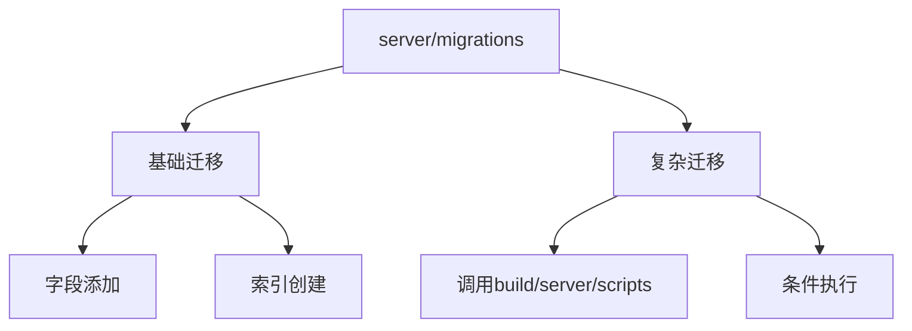
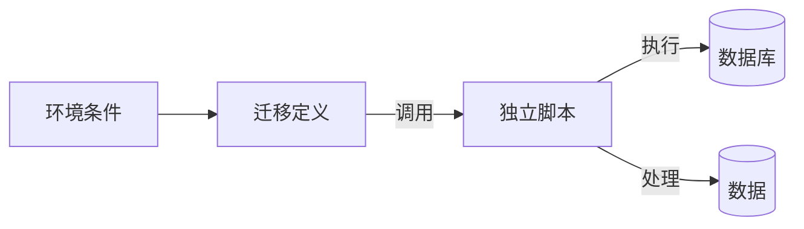
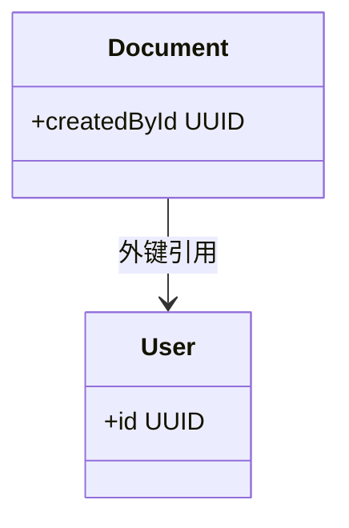
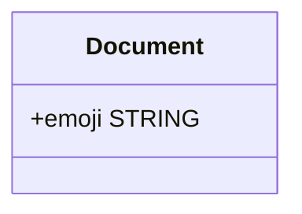
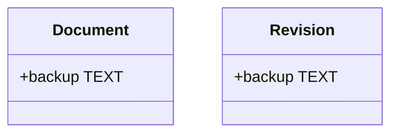
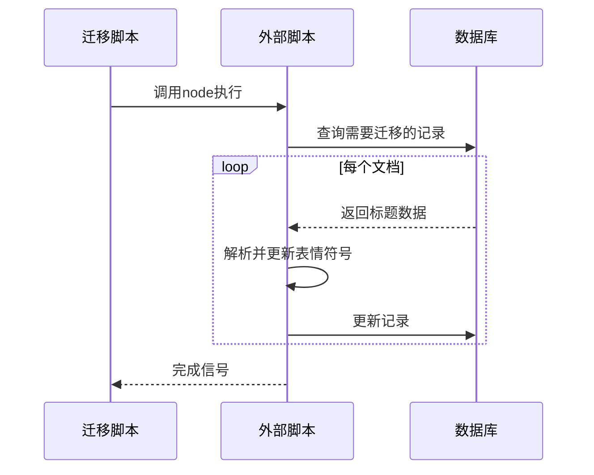
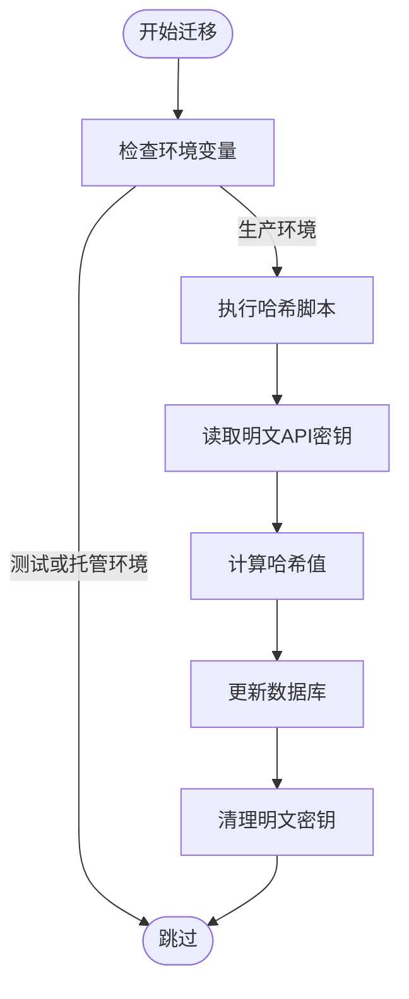
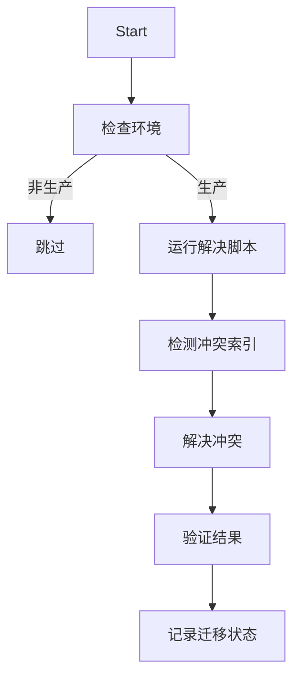
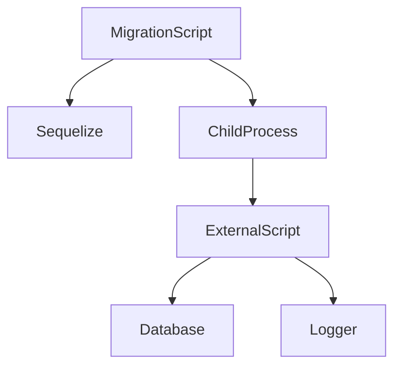

# 数据迁移模式

<cite>
**本文档中引用的文件**  
- [20160814095336-add-document-createdById.js](file://server/migrations/20160814095336-add-document-createdById.js)
- [20170729215619-emoji.js](file://server/migrations/20170729215619-emoji.js)
- [20200519032353-text-backup.js](file://server/migrations/20200519032353-text-backup.js)
- [20230815063834-migrate-emoji-in-document-title.js](file://server/migrations/20230815063834-migrate-emoji-in-document-title.js)
- [20230827234031-migrate-emoji-in-revision-title.js](file://server/migrations/20230827234031-migrate-emoji-in-revision-title.js)
- [20240930113921-hash-api-keys.js](file://server/migrations/20240930113921-hash-api-keys.js)
- [20250327062414-resolve-collection-index-collisions.js](file://server/migrations/20250327062414-resolve-collection-index-collisions.js)
- [20230815063834-migrate-emoji-in-document-title.js](file://build/server/scripts/20230815063834-migrate-emoji-in-document-title.js)
- [20230827234031-migrate-emoji-in-revision-title.js](file://build/server/scripts/20230827234031-migrate-emoji-in-revision-title.js)
- [20240930113921-hash-api-keys.js](file://build/server/scripts/20240930113921-hash-api-keys.js)
- [20250327062414-resolve-collection-index-collisions.js](file://build/server/scripts/20250327062414-resolve-collection-index-collisions.js)
</cite>

## 目录
1. [简介](#简介)
2. [项目结构](#项目结构)
3. [核心迁移模式](#核心迁移模式)
4. [架构概述](#架构概述)
5. [详细组件分析](#详细组件分析)
6. [依赖分析](#依赖分析)
7. [性能考虑](#性能考虑)
8. [故障排除指南](#故障排除指南)
9. [结论](#结论)

## 简介
本文档详细介绍了baozi项目中的数据迁移实现模式，重点分析了多个关键迁移脚本的设计原则、批量处理策略、数据验证机制和错误恢复方案。涵盖从基础字段添加到复杂数据转换的多种迁移类型，为开发者提供安全高效执行数据迁移的最佳实践。

## 项目结构
baozi项目的数据迁移脚本主要位于`server/migrations`目录中，每个迁移文件遵循时间戳命名规范，确保迁移按顺序执行。迁移脚本分为两类：直接数据库变更和调用外部脚本的复杂迁移。

**图示来源**  
- [server/migrations](file://server/migrations)

**本节来源**  
- [server/migrations](file://server/migrations)

## 核心迁移模式
baozi项目采用分层迁移策略，将简单模式与复杂逻辑分离。基础模式直接使用Sequelize的queryInterface进行数据库变更，而复杂迁移则通过调用独立脚本实现，确保迁移过程的可维护性和可测试性。

**本节来源**  
- [20160814095336-add-document-createdById.js](file://server/migrations/20160814095336-add-document-createdById.js)
- [20170729215619-emoji.js](file://server/migrations/20170729215619-emoji.js)
- [20200519032353-text-backup.js](file://server/migrations/20200519032353-text-backup.js)

## 架构概述
数据迁移系统采用双层架构：迁移定义层和执行层。迁移定义文件负责声明迁移操作，而实际的数据处理逻辑被封装在独立的脚本中，通过`child_process`调用执行，实现关注点分离。

**图示来源**  
- [20230815063834-migrate-emoji-in-document-title.js](file://server/migrations/20230815063834-migrate-emoji-in-document-title.js)
- [20240930113921-hash-api-keys.js](file://server/migrations/20240930113921-hash-api-keys.js)

## 详细组件分析

### 基础字段迁移分析
基础迁移模式用于添加新字段或修改表结构，直接使用Sequelize的API进行操作，具有原子性和可逆性。

#### 创建者ID添加迁移
该迁移为文档表添加`createdById`字段，建立与用户表的外键关系，支持数据溯源。

**图示来源**  
- [20160814095336-add-document-createdById.js](file://server/migrations/20160814095336-add-document-createdById.js)

#### 表情符号支持迁移
为文档添加`emoji`字段，支持富文本标题显示，字段类型为可空字符串。

**图示来源**  
- [20170729215619-emoji.js](file://server/migrations/20170729215619-emoji.js)

#### 文本备份机制迁移
同时为文档和修订版本表添加`backup`字段，用于存储文本内容的备份副本。

**图示来源**  
- [20200519032353-text-backup.js](file://server/migrations/20200519032353-text-backup.js)

**本节来源**  
- [20160814095336-add-document-createdById.js](file://server/migrations/20160814095336-add-document-createdById.js)
- [20170729215619-emoji.js](file://server/migrations/20170729215619-emoji.js)
- [20200519032353-text-backup.js](file://server/migrations/20200519032353-text-backup.js)

### 复杂数据迁移分析
复杂迁移通过调用外部脚本实现，支持更精细的控制和错误处理。

#### 表情符号迁移流程
表情符号迁移涉及文档和修订版本标题的处理，通过独立脚本执行批量更新。

**图示来源**  
- [20230815063834-migrate-emoji-in-document-title.js](file://server/migrations/20230815063834-migrate-emoji-in-document-title.js)
- [20230827234031-migrate-emoji-in-revision-title.js](file://server/migrations/20230827234031-migrate-emoji-in-revision-title.js)

#### API密钥哈希化迁移
对API密钥进行安全哈希处理，确保敏感信息的存储安全。

**图示来源**  
- [20240930113921-hash-api-keys.js](file://server/migrations/20240930113921-hash-api-keys.js)

#### 集合索引冲突解决
处理集合索引的唯一性约束冲突，确保数据完整性。

**图示来源**  
- [20250327062414-resolve-collection-index-collisions.js](file://server/migrations/20250327062414-resolve-collection-index-collisions.js)

**本节来源**  
- [20230815063834-migrate-emoji-in-document-title.js](file://server/migrations/20230815063834-migrate-emoji-in-document-title.js)
- [20230827234031-migrate-emoji-in-revision-title.js](file://server/migrations/20230827234031-migrate-emoji-in-revision-title.js)
- [20240930113921-hash-api-keys.js](file://server/migrations/20240930113921-hash-api-keys.js)
- [20250327062414-resolve-collection-index-collisions.js](file://server/migrations/20250327062414-resolve-collection-index-collisions.js)

## 依赖分析
数据迁移系统依赖Sequelize框架进行数据库操作，并通过Node.js的child_process模块调用外部脚本。迁移脚本之间通过文件名的时间戳保证执行顺序。

**图示来源**  
- [server/migrations](file://server/migrations)
- [build/server/scripts](file://build/server/scripts)

**本节来源**  
- [server/migrations](file://server/migrations)
- [build/server/scripts](file://build/server/scripts)

## 性能考虑
复杂迁移采用分批处理策略，避免长时间锁定数据库。通过环境变量控制，确保测试和托管环境中跳过耗时迁移，提高部署效率。

## 故障排除指南
当迁移失败时，应检查日志输出和数据库状态。对于调用外部脚本的迁移，需确保构建目录中存在对应的脚本文件，并具有执行权限。

**本节来源**  
- [server/migrations](file://server/migrations)
- [build/server/scripts](file://build/server/scripts)

## 结论
baozi项目的数据迁移模式体现了良好的工程实践：简单变更直接处理，复杂逻辑分离到独立脚本。通过环境条件控制和分层架构，确保了迁移的安全性、可维护性和可扩展性，为大规模数据变更提供了可靠的基础。