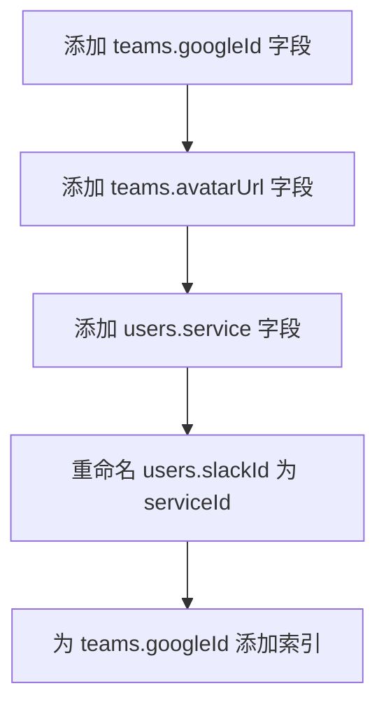
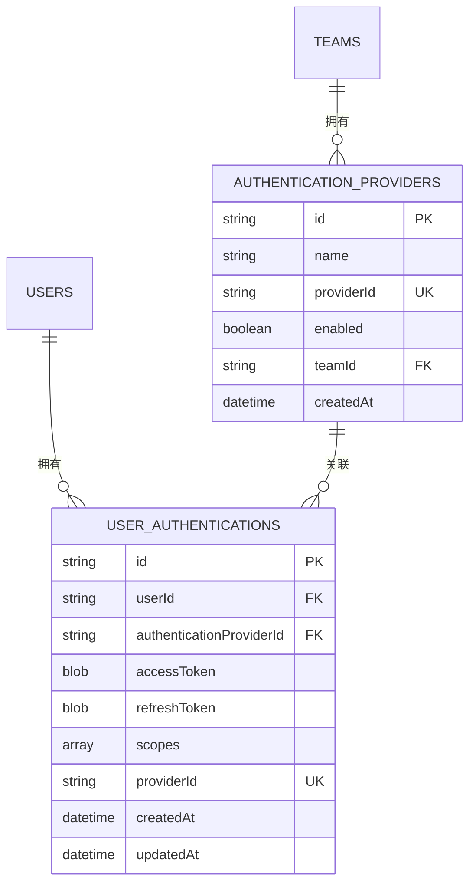
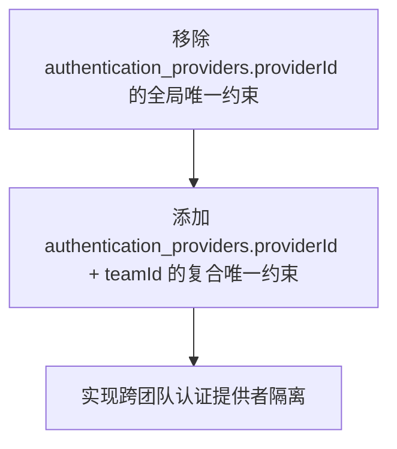
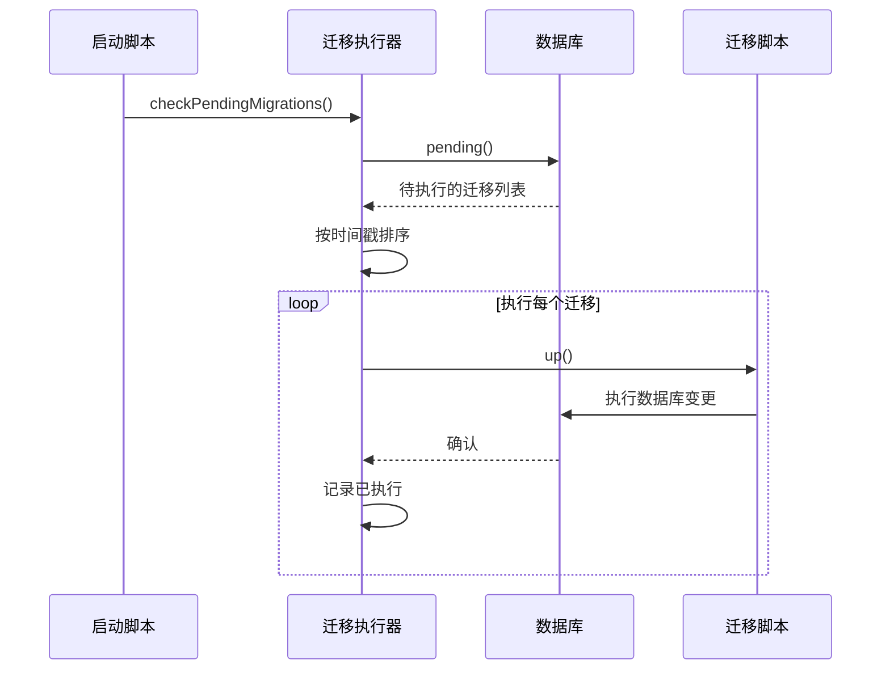
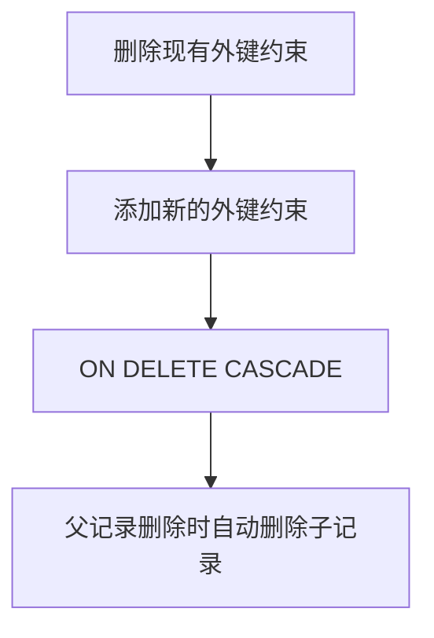
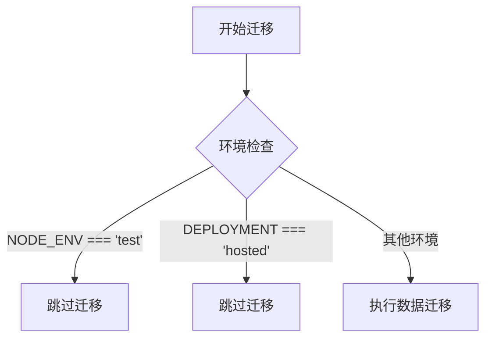

# 依赖管理

<cite>
**本文档中引用的文件**  
- [20180528233909-google-auth.js](file://server/migrations/20180528233909-google-auth.js)
- [20210226232041-authentication-providers.js](file://server/migrations/20210226232041-authentication-providers.js)
- [20220810185000-scope-provider-id-uniqueness-to-team.js](file://server/migrations/20220810185000-scope-provider-id-uniqueness-to-team.js)
- [database.ts](file://server/storage/database.ts)
- [startup.ts](file://server/utils/startup.ts)
- [cancan.ts](file://server/policies/cancan.ts)
</cite>

## 目录
1. [引言](#引言)
2. [认证系统演进中的迁移链](#认证系统演进中的迁移链)
3. [依赖管理机制](#依赖管理机制)
4. [外键约束与数据完整性](#外键约束与数据完整性)
5. [条件执行与迁移控制](#条件执行与迁移控制)
6. [跨团队协作的最佳实践](#跨团队协作的最佳实践)
7. [结论](#结论)

## 引言
本文档深入分析baozi项目中数据库迁移的依赖管理机制，重点聚焦于认证系统的演进过程。从基础认证到认证提供者抽象层，再到作用域精细化控制，系统通过一系列迁移脚本实现了架构的逐步演进。文档将解释这些迁移如何通过外键约束、数据完整性检查和条件执行来管理复杂的依赖关系，并为不同经验水平的开发者提供实用指导。

## 认证系统演进中的迁移链

baozi项目的认证系统经历了三个关键阶段的演进，每个阶段都通过数据库迁移脚本来实现，形成了清晰的迁移链。

### 第一阶段：基础认证（20180528233909-google-auth.js）
该迁移脚本引入了对Google认证的支持，是认证系统演进的起点。它通过修改现有表结构来支持新的认证方式。

**图示来源**  
- [20180528233909-google-auth.js](file://server/migrations/20180528233909-google-auth.js#L1-L27)

此阶段的迁移通过直接修改`teams`和`users`表，为系统增加了Google认证能力。`service`字段的引入允许系统区分不同的认证服务（如Slack、Google），而`serviceId`字段则存储用户在特定服务中的唯一标识。

**本节来源**  
- [20180528233909-google-auth.js](file://server/migrations/20180528233909-google-auth.js#L1-L27)

### 第二阶段：认证提供者抽象层（20210226232041-authentication-providers.js）
随着支持的认证方式增多，系统需要更灵活的架构。此迁移引入了`authentication_providers`和`user_authentications`两个新表，实现了认证逻辑的抽象化。

**图示来源**  
- [20210226232041-authentication-providers.js](file://server/migrations/20210226232041-authentication-providers.js#L1-L95)

该迁移的关键变化包括：
- 创建`authentication_providers`表，每个团队可以配置多个认证提供者
- 创建`user_authentications`表，存储用户与认证提供者之间的关联关系
- 移除`users`表中的`slackAccessToken`字段，将认证信息解耦

这种设计实现了认证逻辑的模块化，使得添加新的认证方式（如OIDC、Azure）变得更加容易。

**本节来源**  
- [20210226232041-authentication-providers.js](file://server/migrations/20210226232041-authentication-providers.js#L1-L95)

### 第三阶段：作用域精细化控制（20220810185000-scope-provider-id-uniqueness-to-team.js）
在第二阶段的基础上，系统发现`providerId`的全局唯一性限制了多团队使用相同认证提供者的场景。此迁移通过修改唯一约束，实现了更精细化的作用域控制。

**图示来源**  
- [20220810185000-scope-provider-id-uniqueness-to-team.js](file://server/migrations/20220810185000-scope-provider-id-uniqueness-to-team.js#L1-L27)

此迁移将`providerId`的唯一性从全局级别调整为团队级别，允许不同团队使用相同ID的认证提供者，解决了多租户环境下的命名冲突问题。

**本节来源**  
- [20220810185000-scope-provider-id-uniqueness-to-team.js](file://server/migrations/20220810185000-scope-provider-id-uniqueness-to-team.js#L1-L27)

## 依赖管理机制

baozi项目通过多种机制来管理复杂的迁移依赖关系，确保数据库演进过程的稳定性和可靠性。

### 迁移执行框架
系统使用`umzug`库作为迁移执行器，通过`createMigrationRunner`函数配置迁移流程。迁移脚本按文件名中的时间戳顺序执行，确保了依赖关系的正确性。

**图示来源**  
- [database.ts](file://server/storage/database.ts#L129-L183)
- [startup.ts](file://server/utils/startup.ts#L0-L46)

### 依赖图管理
系统通过文件命名约定（时间戳前缀）隐式管理迁移依赖。每个迁移脚本都依赖于之前的所有迁移，形成了一个线性的依赖链。对于复杂的依赖关系，系统通过条件执行来处理。

**本节来源**  
- [database.ts](file://server/storage/database.ts#L129-L183)
- [startup.ts](file://server/utils/startup.ts#L0-L46)

## 外键约束与数据完整性

baozi项目广泛使用外键约束和数据完整性检查来维护数据库的一致性。

### 外键级联删除
多个迁移脚本通过修改外键约束来实现级联删除行为，确保数据的一致性。例如，`cascade-delete`系列迁移将外键的删除行为从`NO ACTION`改为`CASCADE`。

这种模式在多个实体关系中被采用，如文档与修订、文档与附件、文档与分享等。

**本节来源**  
- [20191118023010-cascade-delete.js](file://server/migrations/20191118023010-cascade-delete.js)
- [20191119023010-cascade-backlinks.js](file://server/migrations/20191119023010-cascade-backlinks.js)

### 唯一性约束演进
认证系统的演进展示了唯一性约束的动态调整过程。从全局唯一到复合唯一，系统根据业务需求灵活调整约束条件，体现了数据库设计的演进性。

**本节来源**  
- [20220810185000-scope-provider-id-uniqueness-to-team.js](file://server/migrations/20220810185000-scope-provider-id-uniqueness-to-team.js#L1-L27)

## 条件执行与迁移控制

系统采用多种策略来控制迁移的执行，避免在不适当的环境中运行迁移。

### 环境条件检查
某些迁移脚本包含环境检查逻辑，避免在测试或托管环境中执行数据迁移。

这种模式在数据迁移脚本中很常见，如`hash-api-keys.js`和`resolve-collection-index-collisions.js`。

**本节来源**  
- [20240930113921-hash-api-keys.js](file://server/migrations/20240930113921-hash-api-keys.js)
- [20250327062414-resolve-collection-index-collisions.js](file://server/migrations/20250327062414-resolve-collection-index-collisions.js)

### 启动时迁移检查
应用启动时会自动检查并执行待处理的迁移，确保数据库状态与代码版本同步。

**本节来源**  
- [startup.ts](file://server/utils/startup.ts#L0-L46)

## 跨团队协作的最佳实践

在多人协作的开发环境中，有效的迁移依赖管理至关重要。

### 命名约定
使用时间戳作为迁移文件名前缀，确保迁移按正确顺序执行，避免合并冲突。

### 原子性迁移
每个迁移脚本应只包含一个逻辑变更，便于回滚和调试。

### 向下兼容
在修改表结构时，考虑现有代码的兼容性，必要时提供数据迁移脚本。

### 文档化
为复杂的迁移编写详细文档，说明其目的、影响和潜在风险。

### 测试
在测试环境中验证迁移脚本，确保其在不同数据库状态下的正确性。

## 结论
baozi项目的数据库迁移依赖管理体现了良好的工程实践。通过清晰的迁移链、严格的外键约束、灵活的条件执行和规范的协作流程，系统实现了复杂认证架构的平稳演进。这种渐进式的演进方法降低了系统风险，为未来的功能扩展奠定了坚实基础。