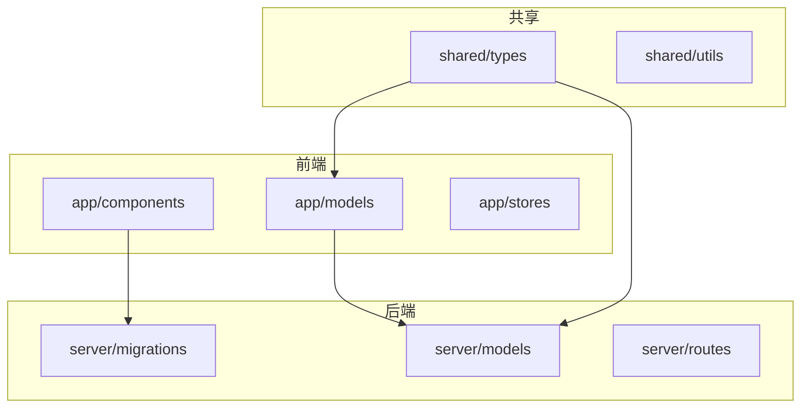
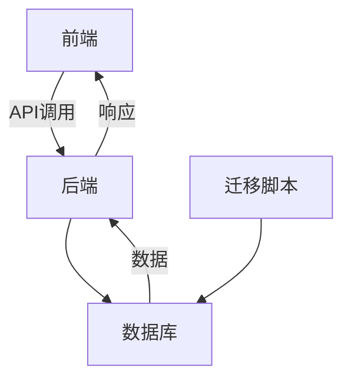
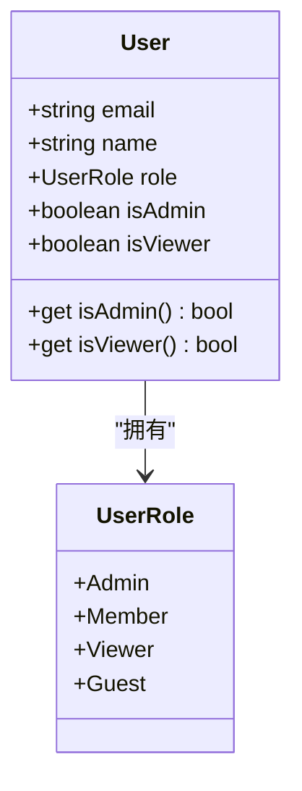
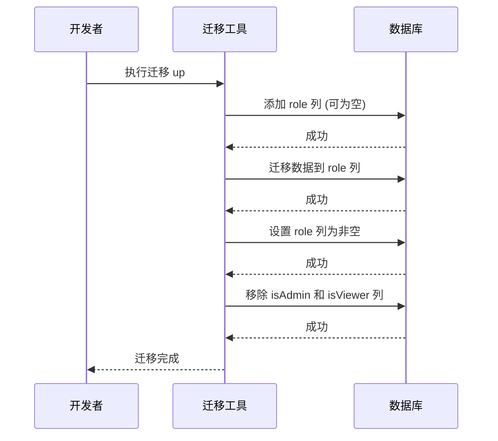
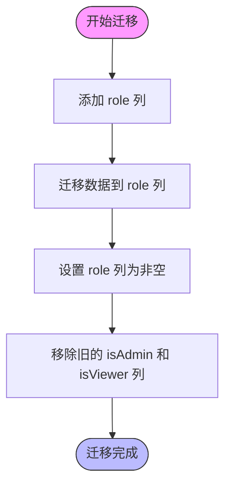
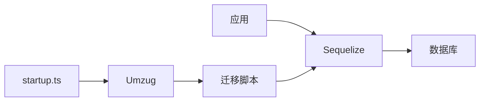

# 冲突解决

<cite>
**本文档引用的文件**
- [20160619080644-initial.js](file://server/migrations/20160619080644-initial.js)
- [20240327015248-add-user-role.js](file://server/migrations/20240327015248-add-user-role.js)
- [20240327235446-role-non-nullable.js](file://server/migrations/20240327235446-role-non-nullable.js)
- [20240329012958-remove-old-role-columns.js](file://server/migrations/20240329012958-remove-old-role-columns.js)
- [User.ts](file://app/models/User.ts)
- [types.ts](file://shared/types.ts)
- [startup.ts](file://server/utils/startup.ts)
</cite>

## 目录
1. [引言](#引言)
2. [项目结构](#项目结构)
3. [核心组件](#核心组件)
4. [架构概述](#架构概述)
5. [详细组件分析](#详细组件分析)
6. [依赖分析](#依赖分析)
7. [性能考虑](#性能考虑)
8. [故障排除指南](#故障排除指南)
9. [结论](#结论)
10. [附录](#附录)（如有必要）

## 引言
本文档详细阐述了baozi项目中数据库迁移冲突的解决策略，以用户角色系统的重构为例。文档分析了同时添加新角色字段（20240327015248-add-user-role.js）和移除旧角色列（20240329012958-remove-old-role-columns.js）的迁移冲突场景。通过分阶段执行、数据迁移脚本和回滚机制来解决冲突。结合初始版本（20160619080644-initial.js）的创建，说明了如何在项目早期建立冲突预防机制。为初学者提供冲突场景的直观理解，同时为经验丰富的开发者提供分布式团队中迁移同步、冲突检测工具和自动化解决策略的技术细节。包含生产环境冲突应急处理流程。

## 项目结构
baozi项目采用分层架构，前端代码位于`app/`目录，后端服务位于`server/`目录。数据库迁移脚本集中存放在`server/migrations/`目录下，按时间戳命名。核心数据模型定义在`app/models/`和`server/models/`目录中。共享类型和工具函数位于`shared/`目录。这种清晰的结构有助于团队协作和代码维护。

**图表来源**
- [20160619080644-initial.js](file://server/migrations/20160619080644-initial.js#L1-L177)
- [User.ts](file://app/models/User.ts#L1-L249)
- [types.ts](file://shared/types.ts#L1-L600)

**章节来源**
- [20160619080644-initial.js](file://server/migrations/20160619080644-initial.js#L1-L177)
- [project_structure](file://#L1-L200)

## 核心组件
核心组件包括用户模型（User）、角色枚举（UserRole）和数据库迁移脚本。用户模型定义了用户的各种属性，包括角色。角色枚举定义了系统中可用的用户角色。数据库迁移脚本负责在不同版本间安全地修改数据库结构。

**章节来源**
- [types.ts](file://shared/types.ts#L1-L6)
- [User.ts](file://app/models/User.ts#L22-L245)
- [20240327015248-add-user-role.js](file://server/migrations/20240327015248-add-user-role.js#L1-L42)

## 架构概述
系统采用前后端分离架构，前端使用React和MobX，后端使用Node.js和Sequelize ORM。数据库迁移是系统演进的关键部分，通过分阶段执行来确保数据一致性和系统稳定性。初始迁移脚本（20160619080644-initial.js）创建了基本的数据库表结构，后续迁移在此基础上进行增量修改。

**图表来源**
- [20160619080644-initial.js](file://server/migrations/20160619080644-initial.js#L1-L177)
- [server/index.ts](file://server/index.ts#L34-L82)

## 详细组件分析

### 用户角色系统重构分析
用户角色系统重构涉及三个关键迁移脚本：添加新角色字段、设置非空约束和移除旧角色列。这种分阶段的方法避免了在单次迁移中同时修改和删除列可能引发的冲突。

#### 对象导向组件：

**图表来源**
- [types.ts](file://shared/types.ts#L1-L6)
- [User.ts](file://app/models/User.ts#L22-L245)

#### API/服务组件：

**图表来源**
- [20240327015248-add-user-role.js](file://server/migrations/20240327015248-add-user-role.js#L1-L42)
- [20240327235446-role-non-nullable.js](file://server/migrations/20240327235446-role-non-nullable.js#L1-L15)
- [20240329012958-remove-old-role-columns.js](file://server/migrations/20240329012958-remove-old-role-columns.js#L1-L43)

#### 复杂逻辑组件：

**图表来源**
- [20240327015248-add-user-role.js](file://server/migrations/20240327015248-add-user-role.js#L1-L42)
- [20240329012958-remove-old-role-columns.js](file://server/migrations/20240329012958-remove-old-role-columns.js#L1-L43)

**章节来源**
- [20240327015248-add-user-role.js](file://server/migrations/20240327015248-add-user-role.js#L1-L42)
- [20240327235446-role-non-nullable.js](file://server/migrations/20240327235446-role-non-nullable.js#L1-L15)
- [20240329012958-remove-old-role-columns.js](file://server/migrations/20240329012958-remove-old-role-columns.js#L1-L43)

### 概念概述
数据库迁移冲突通常发生在多个开发者同时修改数据库结构时。通过分阶段执行迁移、使用事务和编写回滚脚本，可以有效预防和解决这些冲突。生产环境中，应先在测试环境验证迁移，再部署到生产环境。

## 依赖分析
系统依赖于Sequelize ORM进行数据库操作，迁移脚本依赖于Umzug库来管理迁移的执行。`server/utils/startup.ts`中的`checkPendingMigrations`函数确保在应用启动时自动运行待处理的迁移。

**图表来源**
- [server/utils/startup.ts](file://server/utils/startup.ts#L1-L83)
- [server/storage/database.ts](file://server/storage/database.ts#L129-L183)

**章节来源**
- [server/utils/startup.ts](file://server/utils/startup.ts#L1-L83)
- [server/storage/database.ts](file://server/storage/database.ts#L129-L183)

## 性能考虑
分阶段迁移虽然增加了迁移的步骤，但减少了单次迁移的复杂性和执行时间，降低了对生产环境的影响。使用事务确保了数据的一致性，避免了部分更新导致的数据不一致问题。

## 故障排除指南
当迁移冲突发生时，首先检查待处理的迁移列表。使用`yarn db:migrate:status`命令查看迁移状态。如果迁移失败，检查数据库日志以确定错误原因。对于生产环境，应立即执行回滚脚本，并通知团队成员。

**章节来源**
- [server/utils/startup.ts](file://server/utils/startup.ts#L1-L83)
- [20240329012958-remove-old-role-columns.js](file://server/migrations/20240329012958-remove-old-role-columns.js#L1-L43)

## 结论
通过分阶段执行、数据迁移脚本和回滚机制，baozi项目成功解决了用户角色系统重构中的数据库迁移冲突。这种策略不仅确保了数据的一致性和系统的稳定性，还为未来的数据库演进提供了可靠的框架。建议在项目早期建立严格的迁移审查流程，以预防潜在的冲突。