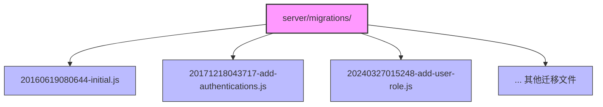
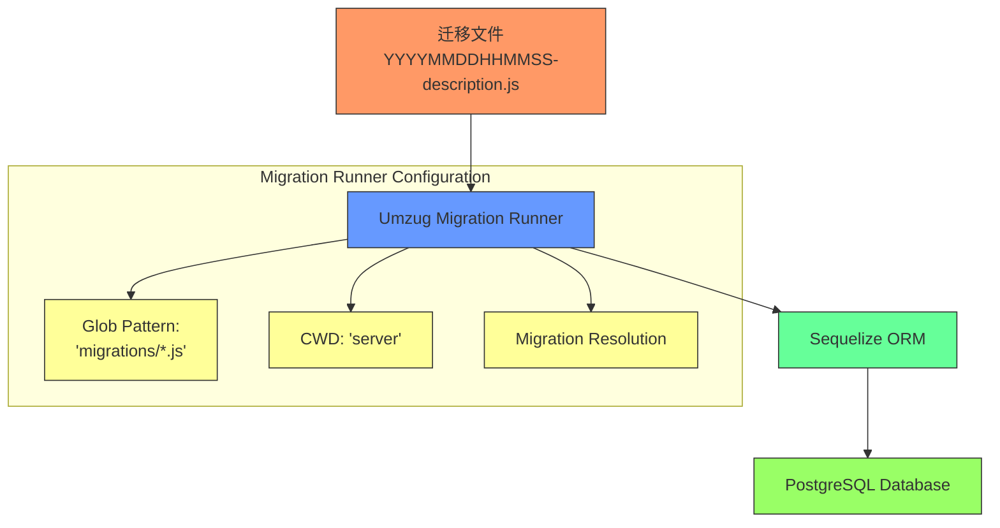
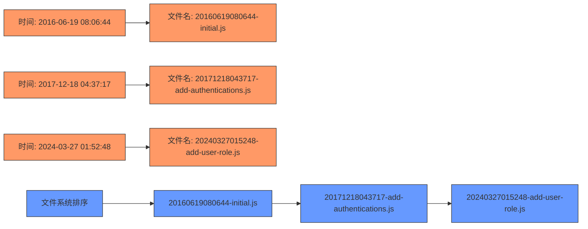
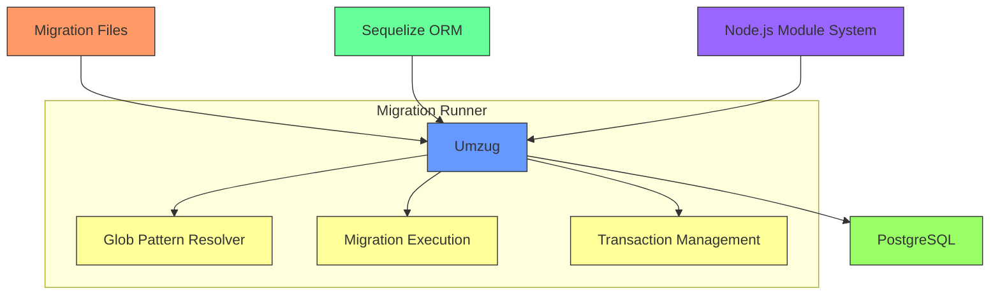

# 版本命名规范

<cite>
**Referenced Files in This Document**   
- [20160619080644-initial.js](file://server/migrations/20160619080644-initial.js)
- [20171218043717-add-authentications.js](file://server/migrations/20171218043717-add-authentications.js)
- [20240327015248-add-user-role.js](file://server/migrations/20240327015248-add-user-role.js)
- [database.ts](file://server/storage/database.ts)
</cite>

## 目录
1. [引言](#引言)
2. [项目结构](#项目结构)
3. [核心组件](#核心组件)
4. [架构概述](#架构概述)
5. [详细组件分析](#详细组件分析)
6. [依赖分析](#依赖分析)
7. [性能考虑](#性能考虑)
8. [故障排除指南](#故障排除指南)
9. [结论](#结论)
10. [附录](#附录)（如有必要）

## 引言
本文档详细阐述了baozi项目中数据库迁移文件的版本命名规范。重点介绍基于时间戳的命名规则（YYYYMMDDHHMMSS-description格式），通过分析初始版本（20160619080644-initial.js）、认证系统扩展（20171218043717-add-authentications.js）和用户角色重构（20240327015248-add-user-role.js）等实际案例，解释这种命名策略如何确保迁移文件的全局唯一性和执行顺序的确定性，避免团队协作中的版本冲突。为初学者提供命名规则的直观解释，同时为经验丰富的开发者提供时间戳精度、时区处理和命名冲突预防的最佳实践。

## 项目结构
baozi项目的数据库迁移文件集中存放在`server/migrations`目录下，采用基于时间戳的命名规则。每个迁移文件都以精确到秒的时间戳开头，后跟连字符分隔的描述性名称。这种结构化的组织方式确保了所有数据库变更都能被系统性地追踪和管理。

**Diagram sources**
- [20160619080644-initial.js](file://server/migrations/20160619080644-initial.js)
- [20171218043717-add-authentications.js](file://server/migrations/20171218043717-add-authentications.js)
- [20240327015248-add-user-role.js](file://server/migrations/20240327015248-add-user-role.js)

**Section sources**
- [20160619080644-initial.js](file://server/migrations/20160619080644-initial.js)
- [20171218043717-add-authentications.js](file://server/migrations/20171218043717-add-authentications.js)
- [20240327015248-add-user-role.js](file://server/migrations/20240327015248-add-user-role.js)

## 核心组件
数据库迁移系统的核心组件包括迁移文件本身和迁移运行器。迁移文件定义了数据库模式的变更（up方法）和回滚操作（down方法），而迁移运行器负责按正确顺序执行这些变更。`database.ts`文件中的`createMigrationRunner`函数配置了迁移系统的运行时环境，确保所有迁移文件能被正确加载和执行。

**Section sources**
- [database.ts](file://server/storage/database.ts#L129-L183)
- [20160619080644-initial.js](file://server/migrations/20160619080644-initial.js)
- [20171218043717-add-authentications.js](file://server/migrations/20171218043717-add-authentications.js)

## 架构概述
baozi项目的数据库迁移架构基于Umzug库实现，与Sequelize ORM集成。迁移文件通过glob模式`migrations/*.js`被发现和加载，确保所有以时间戳命名的JavaScript文件都能被系统识别。迁移运行器按文件名的字典序执行迁移，这正是基于时间戳命名的关键优势——保证了执行顺序与创建时间一致。

**Diagram sources**
- [database.ts](file://server/storage/database.ts#L129-L183)

## 详细组件分析
### 迁移文件命名规范分析
#### 命名规则详解
baozi项目的数据库迁移文件采用`YYYYMMDDHHMMSS-description`的命名格式，其中：
- `YYYY`：4位年份
- `MM`：2位月份
- `DD`：2位日期
- `HH`：2位小时（24小时制）
- `MM`：2位分钟
- `SS`：2位秒数
- `description`：连字符分隔的描述性名称，说明迁移的目的

这种命名策略确保了每个迁移文件名的全局唯一性，因为同一秒内不可能有两次独立的数据库变更需求。更重要的是，它保证了执行顺序的确定性——文件系统按字典序排序时，时间戳自然排序确保了迁移按时间顺序执行。

**Diagram sources**
- [20160619080644-initial.js](file://server/migrations/20160619080644-initial.js)
- [20171218043717-add-authentications.js](file://server/migrations/20171218043717-add-authentications.js)
- [20240327015248-add-user-role.js](file://server/migrations/20240327015248-add-user-role.js)

#### 实际案例分析
##### 初始版本迁移 (20160619080644-initial.js)
该文件是项目最早的数据库迁移，创建了核心表结构，包括teams、atlases、users和documents表。其时间戳`20160619080644`表明它是在2016年6月19日08:06:44创建的，作为系统的基础架构。

**Section sources**
- [20160619080644-initial.js](file://server/migrations/20160619080644-initial.js#L1-L176)

##### 认证系统扩展 (20171218043717-add-authentications.js)
此迁移在2017年12月18日04:37:17添加了`authentications`表，用于支持多服务认证。它展示了如何在项目发展过程中安全地扩展数据库模式。

**Section sources**
- [20171218043717-add-authentications.js](file://server/migrations/20171218043717-add-authentications.js#L1-L48)

##### 用户角色重构 (20240327015248-add-user-role.js)
这个较新的迁移在2024年3月27日01:52:48为users表添加了`role`列，并包含复杂的数据迁移逻辑，将旧的`isAdmin`和`isViewer`布尔值转换为新的枚举角色系统。

**Section sources**
- [20240327015248-add-user-role.js](file://server/migrations/20240327015248-add-user-role.js#L1-L41)

## 依赖分析
数据库迁移系统依赖于多个关键组件：Umzug库用于迁移管理，Sequelize ORM用于数据库操作，以及Node.js的模块系统用于动态加载迁移文件。`database.ts`文件中的`createMigrationRunner`函数是这些依赖的集成点，它配置了迁移的发现机制（通过glob模式）和执行环境。

**Diagram sources**
- [database.ts](file://server/storage/database.ts#L129-L183)

## 性能考虑
基于时间戳的命名策略对性能有积极影响。由于文件名本身就包含了排序信息，迁移系统无需额外的元数据查询或数据库调用来确定执行顺序。这减少了启动时间和I/O操作，特别是在拥有大量迁移文件的大型项目中。此外，精确到秒的时间戳避免了命名冲突，减少了因并发开发导致的合并冲突。

## 故障排除指南
当遇到迁移相关问题时，应首先检查迁移文件的命名是否符合`YYYYMMDDHHMMSS-description`格式。错误的命名可能导致迁移顺序混乱。其次，确认`database.ts`中的迁移配置是否正确指向`migrations/*.js`模式。最后，检查迁移文件中的`up`和`down`方法是否正确实现了数据库变更和回滚逻辑。

**Section sources**
- [database.ts](file://server/storage/database.ts#L129-L183)
- [20160619080644-initial.js](file://server/migrations/20160619080644-initial.js)
- [20171218043717-add-authentications.js](file://server/migrations/20171218043717-add-authentications.js)
- [20240327015248-add-user-role.js](file://server/migrations/20240327015248-add-user-role.js)

## 结论
baozi项目的数据库迁移文件命名规范是一种经过验证的最佳实践，通过基于时间戳的`YYYYMMDDHHMMSS-description`格式确保了迁移的全局唯一性和执行顺序的确定性。这种简单而有效的策略避免了团队协作中的版本冲突，为数据库模式的演进提供了可靠的基础设施。建议所有开发者在创建新迁移时严格遵守此命名规则。

## 附录
### 新迁移文件创建步骤指南
1. 确定当前UTC时间，精确到秒
2. 格式化时间为`YYYYMMDDHHMMSS`格式
3. 创建描述性名称，使用连字符分隔单词
4. 组合为完整文件名：`{timestamp}-{description}.js`
5. 在`server/migrations/`目录下创建文件
6. 实现`up`和`down`方法
7. 提交到版本控制系统

例如，若要在2025年12月1日14:30:25添加新功能，文件名应为`20251201143025-add-new-feature.js`。