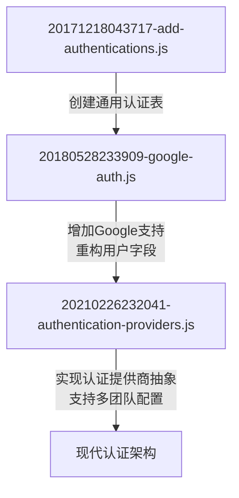
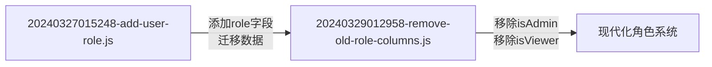

# 版本控制策略

<cite>
**本文档中引用的文件**  
- [20160619080644-initial.js](file://server/migrations/20160619080644-initial.js)
- [20171218043717-add-authentications.js](file://server/migrations/20171218043717-add-authentications.js)
- [20180528233909-google-auth.js](file://server/migrations/20180528233909-google-auth.js)
- [20210226232041-authentication-providers.js](file://server/migrations/20210226232041-authentication-providers.js)
- [20220810185000-scope-provider-id-uniqueness-to-team.js](file://server/migrations/20220810185000-scope-provider-id-uniqueness-to-team.js)
- [20240327015248-add-user-role.js](file://server/migrations/20240327015248-add-user-role.js)
- [20240329012958-remove-old-role-columns.js](file://server/migrations/20240329012958-remove-old-role-columns.js)
</cite>

## 目录
1. [引言](#引言)
2. [迁移版本命名规则](#迁移版本命名规则)
3. [核心迁移版本分析](#核心迁移版本分析)
4. [版本依赖与回滚机制](#版本依赖与回滚机制)
5. [迁移历史追踪](#迁移历史追踪)
6. [生产环境同步策略](#生产环境同步策略)
7. [最佳实践指南](#最佳实践指南)
8. [结论](#结论)

## 引言
本文档全面介绍baozi项目的数据库版本控制策略，重点阐述其迁移系统如何通过时间戳命名、版本依赖管理、历史追踪和回滚机制来确保数据结构演进的可靠性。文档结合实际迁移文件，为团队成员提供从概念理解到技术实现的完整指导。

## 迁移版本命名规则
baozi项目采用基于时间戳的迁移文件命名规则，格式为`YYYYMMDDHHMMSS-描述性名称.js`。该命名方式确保了迁移文件的全局唯一性和自然排序能力，避免了版本冲突。时间戳精确到秒，保证了高并发开发环境下的版本顺序一致性。描述性名称使用小写字母和连字符分隔，清晰表达迁移目的。

**Section sources**
- [20160619080644-initial.js](file://server/migrations/20160619080644-initial.js)
- [20171218043717-add-authentications.js](file://server/migrations/20171218043717-add-authentications.js)

## 核心迁移版本分析

### 初始版本创建
初始迁移文件`20160619080644-initial.js`定义了系统的基础数据模型，包括团队（teams）、用户（users）、文档（documents）和图集（atlases）等核心表结构。该迁移建立了系统运行所必需的实体关系，为后续功能扩展奠定了基础。

**Section sources**
- [20160619080644-initial.js](file://server/migrations/20160619080644-initial.js)

### 认证系统演进
认证系统的迁移历史展示了从单一Slack认证到多提供商支持的演进过程。`20171218043717-add-authentications.js`引入了通用认证表，`20180528233909-google-auth.js`增加了Google认证支持并重构了用户服务字段，最终`20210226232041-authentication-providers.js`实现了认证提供商的抽象化，支持多团队多提供商配置。

**Diagram sources**
- [20171218043717-add-authentications.js](file://server/migrations/20171218043717-add-authentications.js)
- [20180528233909-google-auth.js](file://server/migrations/20180528233909-google-auth.js)
- [20210226232041-authentication-providers.js](file://server/migrations/20210226232041-authentication-providers.js)

**Section sources**
- [20171218043717-add-authentications.js](file://server/migrations/20171218043717-add-authentications.js)
- [20180528233909-google-auth.js](file://server/migrations/20180528233909-google-auth.js)
- [20210226232041-authentication-providers.js](file://server/migrations/20210226232041-authentication-providers.js)

### 作用域调整
`20220810185000-scope-provider-id-uniqueness-to-team.js`迁移调整了认证提供商ID的唯一性约束，从全局唯一改为团队内唯一。这一变更支持了不同团队使用相同提供商ID的场景，增强了系统的多租户能力，体现了版本控制对业务需求变化的灵活响应。

**Section sources**
- [20220810185000-scope-provider-id-uniqueness-to-team.js](file://server/migrations/20220810185000-scope-provider-id-uniqueness-to-team.js)

### 用户角色重构
用户角色系统的重构通过两个连续迁移完成：`20240327015248-add-user-role.js`引入了枚举类型的`role`字段，并将旧的布尔字段`isAdmin`和`isViewer`的值迁移到新字段；随后`20240329012958-remove-old-role-columns.js`移除了已废弃的旧字段。这种分阶段重构策略确保了数据迁移的安全性和系统的平稳过渡。

**Diagram sources**
- [20240327015248-add-user-role.js](file://server/migrations/20240327015248-add-user-role.js)
- [20240329012958-remove-old-role-columns.js](file://server/migrations/20240329012958-remove-old-role-columns.js)

**Section sources**
- [20240327015248-add-user-role.js](file://server/migrations/20240327015248-add-user-role.js)
- [20240329012958-remove-old-role-columns.js](file://server/migrations/20240329012958-remove-old-role-columns.js)

## 版本依赖与回滚机制
baozi项目的迁移系统采用`up`和`down`函数对的形式实现版本控制。`up`函数定义正向迁移操作，`down`函数提供逆向回滚逻辑。这种双向设计确保了任何迁移都可以安全回滚，降低了生产环境变更的风险。迁移执行按时间戳顺序自动排序，系统维护迁移状态表以跟踪已应用的版本。

**Section sources**
- [20160619080644-initial.js](file://server/migrations/20160619080644-initial.js)
- [20171218043717-add-authentications.js](file://server/migrations/20171218043717-add-authentications.js)

## 迁移历史追踪
系统通过迁移文件的时间戳和描述性名称建立清晰的版本历史。每个迁移文件都是一个独立的变更单元，记录了特定时间点的数据结构变更。团队可以通过查看迁移目录的历史记录，追溯任何数据模型的演变过程，理解设计决策的背景。

**Section sources**
- [server/migrations](file://server/migrations)

## 生产环境同步策略
生产环境的数据库迁移遵循严格的流程：首先在预发布环境验证迁移脚本，然后在维护窗口期间执行。迁移过程使用事务确保原子性，任何失败都会触发自动回滚。系统监控迁移执行状态，并在完成后验证数据一致性，确保服务的连续性和数据的完整性。

## 最佳实践指南
1. **原子性迁移**：每个迁移文件应只包含一个逻辑变更
2. **可逆设计**：确保`down`函数能完全撤销`up`函数的操作
3. **数据安全**：敏感操作前备份数据，使用事务保护
4. **团队协作**：避免同时修改同一表结构，及时同步迁移计划
5. **测试验证**：在开发和预发布环境充分测试迁移脚本

## 结论
baozi项目的数据库版本控制策略通过标准化的命名规则、清晰的迁移历史和可靠的回滚机制，有效管理了数据结构的持续演进。该策略支持团队协作开发，降低了生产环境变更风险，为系统的长期维护和发展提供了坚实基础。