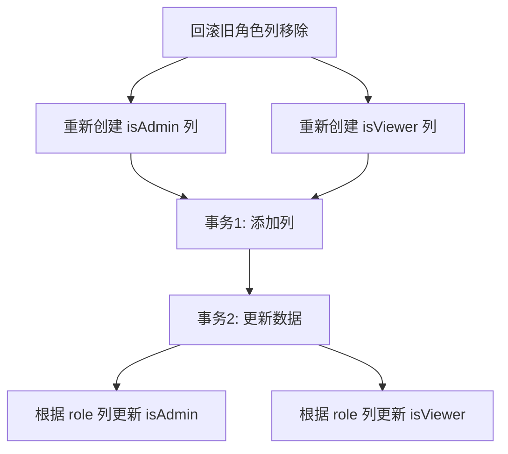
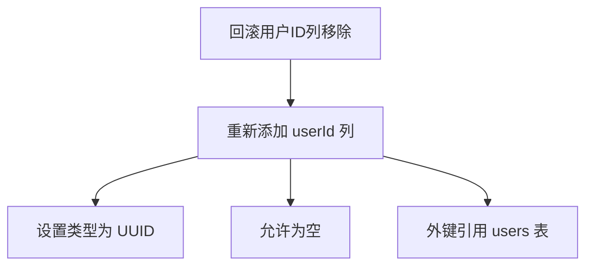
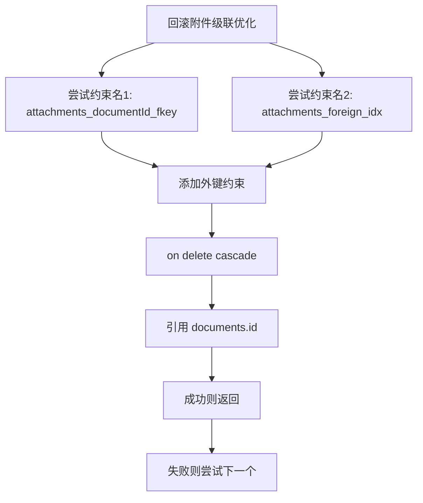

# 回滚机制

<cite>
**本文档引用的文件**
- [20240329012958-remove-old-role-columns.js](file://server/migrations/20240329012958-remove-old-role-columns.js)
- [20230330181038-remove-column-userId-from-documents.js](file://server/migrations/20230330181038-remove-column-userId-from-documents.js)
- [20201211080408-attachment-no-cascade.js](file://server/migrations/20201211080408-attachment-no-cascade.js)
- [database.ts](file://server/storage/database.ts)
</cite>

## 目录
1. [引言](#引言)
2. [回滚预案概述](#回滚预案概述)
3. [核心迁移回滚方案](#核心迁移回滚方案)
4. [数据恢复流程](#数据恢复流程)
5. [故障恢复策略](#故障恢复策略)
6. [回滚检查清单](#回滚检查清单)
7. [操作指南](#操作指南)
8. [结论](#结论)

## 引言
本文档详细阐述了baozi项目在生产环境中数据库迁移的回滚机制。重点介绍针对特定数据库迁移的回滚预案、数据恢复流程和故障恢复策略，确保系统在出现问题时能够快速恢复。文档以三个关键迁移文件为例：旧角色列移除（20240329012958-remove-old-role-columns.js）、用户ID列移除（20230330181038-remove-column-userId-from-documents.js）和附件级联优化（20201211080408-attachment-no-cascade.js），为初学者提供概念性概述，同时为经验丰富的开发者提供技术细节。

## 回滚预案概述
回滚预案是生产环境数据库变更管理的关键组成部分。在baozi项目中，所有数据库迁移均通过Sequelize的迁移框架实现，每个迁移文件都包含`up`和`down`两个方法。`up`方法用于执行正向迁移，而`down`方法则定义了回滚操作，确保在迁移失败或出现问题时能够将数据库恢复到变更前的状态。

回滚触发条件包括但不限于：
- 迁移执行过程中出现错误
- 应用在新数据库结构下出现严重故障
- 数据完整性检查失败
- 性能显著下降

**Section sources**
- [20240329012958-remove-old-role-columns.js](file://server/migrations/20240329012958-remove-old-role-columns.js#L1-L43)
- [20230330181038-remove-column-userId-from-documents.js](file://server/migrations/20230330181038-remove-column-userId-from-documents.js#L1-L18)
- [20201211080408-attachment-no-cascade.js](file://server/migrations/20201211080408-attachment-no-cascade.js#L1-L43)

## 核心迁移回滚方案
本节详细分析三个关键迁移文件的回滚方案。

### 旧角色列移除回滚方案
该迁移（20240329012958-remove-old-role-columns.js）移除了`users`表中的`isAdmin`和`isViewer`列，这些功能已被新的`role`列取代。

**回滚逻辑**：
1. 重新创建`isAdmin`和`isViewer`列，类型为BOOLEAN，不允许为空，默认值为false
2. 在独立的事务中，根据`role`列的值更新`isAdmin`和`isViewer`列：
   - 当`role = 'admin'`时，设置`isAdmin = true`
   - 当`role = 'viewer'`时，设置`isViewer = true`

此方案确保了数据的完整性和一致性，避免了直接依赖`role`列可能带来的兼容性问题。

**Diagram sources**
- [20240329012958-remove-old-role-columns.js](file://server/migrations/20240329012958-remove-old-role-columns.js#L15-L42)

**Section sources**
- [20240329012958-remove-old-role-columns.js](file://server/migrations/20240329012958-remove-old-role-columns.js#L1-L43)

### 用户ID列移除回滚方案
该迁移（20230330181038-remove-column-userId-from-documents.js）移除了`documents`表中的`userId`列。

**回滚逻辑**：
1. 重新添加`userId`列，类型为UUID，允许为空，外键引用`users`表
2. 由于该列在移除前可能包含数据，回滚后需要通过应用逻辑或数据修复脚本来恢复关联关系

此方案相对简单，但需要注意外键约束的重建和数据完整性的维护。

**Diagram sources**
- [20230330181038-remove-column-userId-from-documents.js](file://server/migrations/20230330181038-remove-column-userId-from-documents.js#L10-L17)

**Section sources**
- [20230330181038-remove-column-userId-from-documents.js](file://server/migrations/20230330181038-remove-column-userId-from-documents.js#L1-L18)

### 附件级联优化回滚方案
该迁移（20201211080408-attachment-no-cascade.js）移除了`attachments`表对`documents`表的级联删除约束。

**回滚逻辑**：
1. 由于Sequelize在不同环境下生成的外键约束名称可能不同，回滚方法尝试多个可能的约束名称
2. 对每个可能的约束名称，尝试添加外键约束，引用`documents`表的`id`列，并设置`on delete cascade`
3. 一旦成功添加约束，立即返回，避免重复操作
4. 如果所有尝试都失败，则抛出异常

此方案展示了处理数据库兼容性问题的健壮性设计，确保在不同环境下都能正确执行回滚。

**Diagram sources**
- [20201211080408-attachment-no-cascade.js](file://server/migrations/20201211080408-attachment-no-cascade.js#L15-L42)

**Section sources**
- [20201211080408-attachment-no-cascade.js](file://server/migrations/20201211080408-attachment-no-cascade.js#L1-L43)

## 数据恢复流程
数据恢复流程是回滚机制的核心，确保在回滚过程中数据的完整性和一致性。

### 事务管理
所有回滚操作都在数据库事务中执行，确保操作的原子性。如果回滚过程中的任何步骤失败，整个事务将回滚，数据库状态保持不变。

### 数据映射与转换
对于涉及数据转换的回滚（如旧角色列回滚），使用原生SQL查询在独立事务中执行数据更新，确保转换逻辑的准确性和性能。

### 外键约束处理
在处理外键约束时（如附件级联优化回滚），需要考虑不同数据库环境下的约束命名差异，采用多名称尝试策略确保兼容性。

**Section sources**
- [20240329012958-remove-old-role-columns.js](file://server/migrations/20240329012958-remove-old-role-columns.js#L15-L42)
- [20201211080408-attachment-no-cascade.js](file://server/migrations/20201211080408-attachment-no-cascade.js#L15-L42)

## 故障恢复策略
故障恢复策略确保在回滚过程中出现问题时能够有效应对。

### 服务降级策略
在执行关键数据库回滚时，建议将相关服务降级或置于维护模式，避免新数据写入导致状态不一致。

### 影响范围控制
通过精确的迁移版本控制和回滚脚本，将影响范围限制在特定的数据库表和列，避免对整个系统造成广泛影响。

### 监控与告警
在回滚过程中，密切监控数据库性能指标和应用日志，设置关键告警，及时发现并处理异常情况。

**Section sources**
- [20240329012958-remove-old-role-columns.js](file://server/migrations/20240329012958-remove-old-role-columns.js#L1-L43)
- [20230330181038-remove-column-userId-from-documents.js](file://server/migrations/20230330181038-remove-column-userId-from-documents.js#L1-L18)

## 回滚检查清单
在执行生产环境数据库回滚前，请务必完成以下检查：

- [ ] 确认回滚原因和必要性
- [ ] 备份当前数据库状态
- [ ] 通知相关团队和用户
- [ ] 准备好回滚脚本和验证方法
- [ ] 确保有足够的时间窗口执行回滚
- [ ] 准备好应急联系人列表
- [ ] 验证回滚脚本在测试环境中的正确性
- [ ] 检查数据库连接和权限

## 操作指南
1. **准备阶段**：完成回滚检查清单中的所有项目
2. **执行回滚**：使用项目提供的迁移工具执行`down`方法
3. **验证数据**：检查关键表的数据完整性和一致性
4. **重启服务**：重启相关应用服务以应用新的数据库结构
5. **监控系统**：密切监控系统性能和错误日志
6. **通知团队**：确认回滚成功后通知相关团队

## 结论
baozi项目的数据库迁移回滚机制设计严谨，通过`up`和`down`方法的配对实现，确保了生产环境变更的安全性。针对不同类型的迁移，采用了相应的回滚策略，包括数据转换、外键约束处理等。通过严格的事务管理、服务降级策略和影响范围控制，最大限度地降低了回滚风险。遵循本文档提供的检查清单和操作指南，可以确保在出现问题时快速、安全地恢复系统。